> Product documentation — How Jules connects a purchase operation to a sale operation through allocations, and how that single link propagates downstream into margin calculation, hedging coverage, and invoicing.

---

## Table of Contents

1. [Overview](#overview)

2. [The Allocation Model](#the-allocation-model)

3. [ContainerToOperationQuality — The Quality Bridge](#containertoooperationquality--the-quality-bridge)

4. [SellContainer — The Virtual Sell-Side Unit](#sellcontainer--the-virtual-sell-side-unit)

5. [Allocation Lifecycle & Statuses](#allocation-lifecycle--statuses)

6. [Creating an Allocation](#creating-an-allocation)

7. [Two Allocation Paths: Sell vs Warehouse](#two-allocation-paths-sell-vs-warehouse)

8. [Partial Allocations, Re-Allocation & Unallocation](#partial-allocations-re-allocation--unallocation)

9. [Quantity Merging Across Operations](#quantity-merging-across-operations)

10. [How Allocation Drives Margin](#how-allocation-drives-margin)

11. [How Allocation Drives Hedging](#how-allocation-drives-hedging)

12. [How Allocation Drives Invoicing](#how-allocation-drives-invoicing)

13. [Fulfilment Tracking & Operation Status Impact](#fulfilment-tracking--operation-status-impact)

14. [Documents Generated from Allocations](#documents-generated-from-allocations)

15. [Key Business Rules](#key-business-rules)

16. [Glossary](#glossary)

---

## Overview

An **allocation** is the central matching mechanism in Jules. It is the record that says: *these physical containers, purchased under operation A at price X, are being sold under operation B at price Y*.

Without an allocation, a container exists only on one side of the trade — it belongs to a purchase but has no destination. The allocation supplies the missing half: it connects the buy side to the sell side, making the complete trade visible, measurable, and actionable.

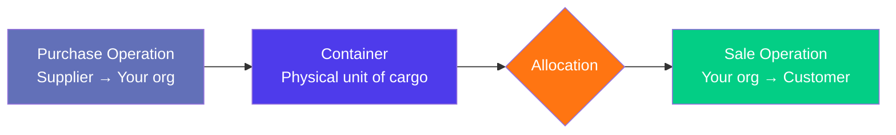

Once the allocation exists, Jules can calculate the margin for that trade, determine what hedging is required on each container, and track what invoices need to be issued or received.

### What the allocation controls downstream

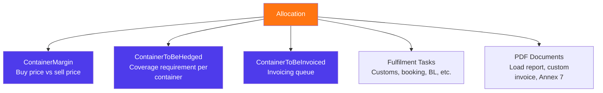

---

## The Allocation Model

An allocation record (`allocations` table, read via `allocations_view`) carries the following key data:

### Core identifiers

| Field                    | Description                                               |
| ------------------------ | --------------------------------------------------------- |
| `id`                     | Internal unique identifier                                |
| `harold_number`          | Human-readable reference auto-assigned by Jules           |
| `referenceNumber`        | Logistics reference number (RU number), manually assigned |
| `blNumber`               | Bill of Lading number — assigned after shipment           |
| `bookingReferenceNumber` | Freight booking reference                                 |
| `status`                 | `DRAFT` or `CONFIRMED`                                    |

### Trade linkage

| Field                    | Description                                               |
| ------------------------ | --------------------------------------------------------- |
| `buyOperationId`         | The purchase operation supplying the containers           |
| `sellOperationId`        | The sale operation receiving the containers               |
| `buyOperationQualities`  | The quality lines from the purchase operation             |
| `sellOperationQualities` | The quality lines from the sale operation                 |
| `containers`             | All physical containers included in this allocation       |
| `numberOfContainers`     | Count of containers                                       |
| `mqc`                    | Minimum Quality Commitment (minimum weight per container) |

### Logistics metadata

| Field                     | Description                                                  |
| ------------------------- | ------------------------------------------------------------ |
| `eta`                     | Estimated time of arrival at destination                     |
| `trackingStatus`          | Real-time tracking state (LOADED → SHIPPED → ARRIVED → etc.) |
| `warehouse`               | Warehouse site, for warehouse-routed allocations             |
| `shipments`               | Shipments this allocation's containers belong to             |
| `bookings`                | Freight bookings for the containers                          |
| `estimatedLogisticOption` | Estimated logistics selection                                |
| `usedLogisticOption`      | Actual logistics selection applied                           |

### Fulfilment steps

The `fulfilmentSteps` JSONB field tracks where the allocation stands in its compliance and documentation workflow:

| Step          | Values                                                                                           |
| ------------- | ------------------------------------------------------------------------------------------------ |
| `annex7`      | PENDING → PREPARED\_IN\_ERP → SENT\_TO\_COMPLIANCE → SENT\_TO\_SUPPLIER → SIGNED\_AND\_UPLOADED  |
| `booking`     | PENDING → PREPARED\_IN\_ERP → PRECARRIAGE\_BOOKING\_OK → FREIGHT\_BOOKING\_OK → ALL\_BOOKING\_OK |
| `customs`     | PENDING → SENT\_TO\_AGENT → SENT\_TO\_CARRIER                                                    |
| `loadReport`  | PENDING → PREPARED → SENT\_TO\_DOCS\_TEAM                                                        |
| `loadDetails` | Integer count of load details entered                                                            |
| `vgm`         | Boolean — VGM (verified gross mass) confirmed                                                    |

---

## ContainerToOperationQuality — The Quality Bridge

While the allocation links two operations, the **`ContainerToOperationQuality`** (`containers_to_operation_qualities` table) is the record that links a specific container to its buy and sell quality lines simultaneously.

This is a critical distinction: an allocation says "operation A meets operation B". The `ContainerToOperationQuality` record says "container C carries material from quality line X on the buy side, matched to quality line Y on the sell side, at these prices".

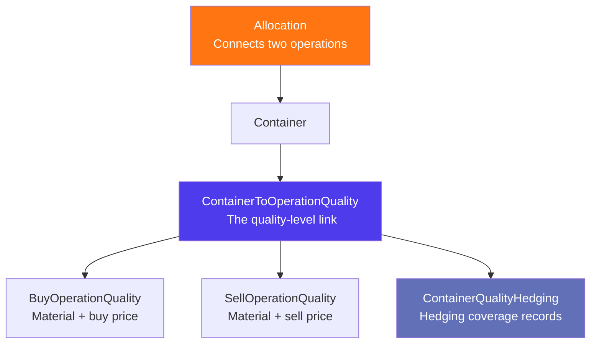

### What ContainerToOperationQuality holds

| Field                                 | Description                                                    |
| ------------------------------------- | -------------------------------------------------------------- |
| `containerId`                         | The physical container                                         |
| `buyOperationQualityId`               | The quality line from the buy operation                        |
| `sellOperationQualityId`              | The quality line from the sell operation                       |
| `operationType`                       | BUY or SELL — distinguishes which side this row describes      |
| `quantity`                            | The weight/volume assigned to this quality on this container   |
| `buyPrice`                            | The resolved buy price for this container-quality pair         |
| `sellPrice`                           | The resolved sell price for this container-quality pair        |
| `buyPriceFormula`                     | Formula used to compute the buy price (for index-priced deals) |
| `sellPriceFormula`                    | Formula used to compute the sell price                         |
| `buyIsTemporaryPrice`                 | Whether the buy price is provisional                           |
| `sellIsTemporaryPrice`                | Whether the sell price is provisional                          |
| `buyPriceFixationType`                | PERCENTAGE or ABSOLUTE — how price fixation is applied         |
| `sellPriceFixationType`               | PERCENTAGE or ABSOLUTE                                         |
| `buyPriceFixationValue`               | The fixation value on the buy side                             |
| `sellPriceFixationValue`              | The fixation value on the sell side                            |
| `parentContainerToOperationQualityId` | Reference to a parent row — used for split quantities          |
| `buyErpId` / `sellErpId`              | ERP identifiers for synchronization                            |
| `containerQualityHedgings`            | Hedging records attached to this container-quality pair        |

### Price resolution

The buy and sell prices on a `ContainerToOperationQuality` are not stored as simple values — they are resolved from a formula. For index-priced deals, the formula contains the index reference, differential, recovery percentage, quotational period, and contango. For spot deals, the formula reduces to a fixed value. This means the price on the container accurately reflects the commercial terms of each specific operation quality, even when the same container is split across two quality lines.

### Split quantities (parent-child pattern)

A single container can carry material belonging to more than one quality line — for example, a mixed load. In this case, the primary `ContainerToOperationQuality` row records the full quantity, and child rows (linked via `parentContainerToOperationQualityId`) record the split portions. The `reinsertMany` operation always preserves or deletes child rows transactionally to avoid orphaned splits.

---

## SellContainer — The Virtual Sell-Side Unit

When a sale operation is modelled in Jules before physical containers have been received from the supplier, Jules creates a **SellContainer** (`sell_containers` table) to represent the expected sell-side unit.

A SellContainer is a virtual placeholder. It has a `sellOperationId` and a `status`, but it does not correspond to a real physical container until an allocation links it to a buy-side container. At that point, the SellContainer receives the `allocationId` and its status progresses.

### What SellContainer enables

- Sale operations can be entered, approved, and managed commercially before the physical goods are confirmed on the buy side

- The sell-side follow-up (quantities allocated, booked, loaded) can be tracked even when buy-side containers are not yet identified

- When an allocation is **deleted**, `SellContainer.revertStatusByAllocationId` is called: all sell containers attached to that allocation have their `allocationId` cleared and their status reverted to `CONFIRMED` — ready to be re-matched to a new allocation

---

## Allocation Lifecycle & Statuses

### Allocation status

An allocation has two possible statuses:

| Status        | Meaning                                                   |
| ------------- | --------------------------------------------------------- |
| **DRAFT**     | The allocation has been prepared but not finalized        |
| **CONFIRMED** | The allocation is active and driving downstream workflows |

In practice, all allocations created via the API are set to `CONFIRMED` immediately. The `DRAFT` status exists to support a pre-allocation workflow where allocations are staged before being committed.

### Tracking status (container-level logistics progress)

Beyond the allocation status, each allocation tracks the logistics progress of its containers through a `trackingStatus`:

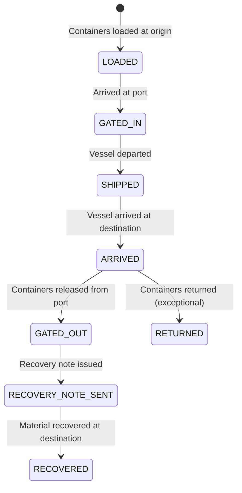

---

## Creating an Allocation

Creating an allocation triggers a coordinated sequence of writes across multiple tables. The `Allocation.create` model method orchestrates:

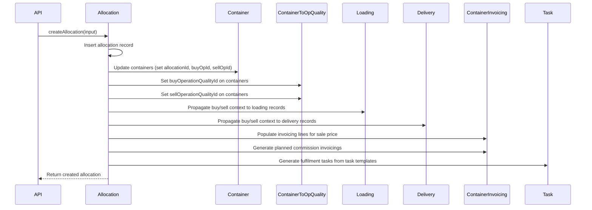

### What the input requires

| Input field              | Required?              | Description                                     |
| ------------------------ | ---------------------- | ----------------------------------------------- |
| `buyOperationId`         | Yes                    | The purchase operation                          |
| `sellOperationId`        | Yes (or `warehouseId`) | The sale operation                              |
| `containerIds`           | Yes                    | Containers to be included                       |
| `buyOperationQualityId`  | Recommended            | Maps containers to a specific buy quality line  |
| `sellOperationQualityId` | Recommended            | Maps containers to a specific sell quality line |
| `mqc`                    | Optional               | Minimum Quality Commitment override             |
| `referenceNumber`        | Optional               | Logistics reference (RU number)                 |
| `stockpileId`            | Warehouse path only    | The stockpile at the warehouse                  |
| `warehouseId`            | Warehouse path only    | The destination warehouse                       |
| `watcherIds`             | Optional               | Users to notify about this allocation           |

### Batch allocation

`createManyAllocations` allows multiple containers to be allocated simultaneously. The system groups them by buy/sell operation pair — all containers going to the same pair are grouped into a single allocation record, keeping the allocation count manageable.

---

## Two Allocation Paths: Sell vs Warehouse

Jules supports two distinct allocation flows depending on the destination of the goods.

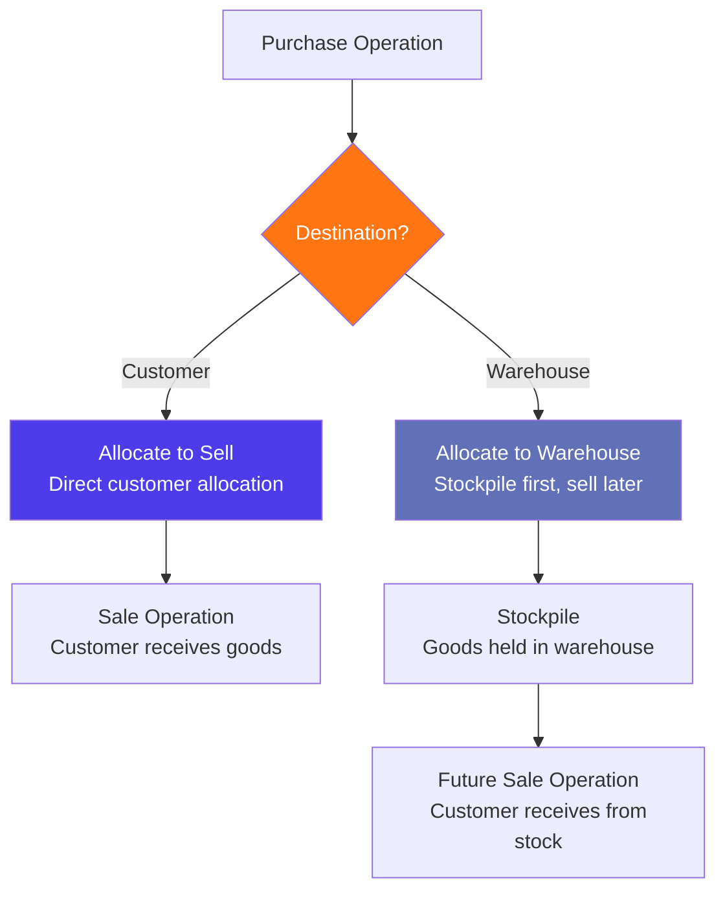

### Path 1: Allocate to Sell (direct)

The most common path. The buy operation and sell operation are identified at the same time, and the containers are matched directly between them:

1. Both `buyOperationId` and `sellOperationId` are provided

2. An allocation record is created linking the two operations

3. Containers are updated with both `buyOperationId` and `sellOperationId`

4. The `destinationType` on containers is set to `CUSTOMER`

5. Quality lines are linked via `ContainerToOperationQuality`

### Path 2: Allocate to Warehouse (stockpile routing)

Used when purchased goods go to a warehouse first, to be resold later from stock:

1. `buyOperationId` and `warehouseId` are provided (no direct `sellOperationId`)

2. Jules calls `getOrGenerateInboundQualityByInboundParentQuality` to find or create an **inbound quality** on the warehouse's receive operation

3. The inbound operation's ID becomes the `sellOperationId` for the allocation

4. Containers have `destinationType` set to `WAREHOUSE`

5. The allocation links the purchase to the warehouse inbound operation — a second allocation will later link the warehouse outbound to the final customer

This two-hop allocation chain underpins the **warehouse / stockpile** trading model and is what makes the weighted average cost (`mean_purchase_cost`) calculation meaningful.

---

## Partial Allocations, Re-Allocation & Unallocation

### Partial allocation

A single purchase operation can have its containers allocated across **multiple sale operations** or **multiple allocations**. There is no requirement that all containers from a buy operation go to the same sale. This supports:

- Splitting a large purchase across several customers

- Allocating only a subset of containers while others await a future sale

- Routing some containers to a warehouse and others directly to customers

At the operation quality level, Jules tracks the cumulative allocated quantity in the follow-up pipeline, so traders can see exactly how much of a contracted volume has been matched.

### Re-allocation

To move containers from one sale operation to another, the existing allocation must first be deleted (which unallocates the containers), then a new allocation must be created. Jules does not support a direct "move" mutation — the delete-then-create sequence is the intended workflow.

### Unallocation (delete)

When `deleteAllocation` is called, the following cleanup happens in a single coordinated sequence:

1. `ContainerModel.revertStatusByAllocationId` — clears `allocationId` from all containers and resets their status

2. `ReceptionModel.revertStatusByAllocationId` — resets any reception records linked to the allocation

3. Both the `buyOperation` and `sellOperation` are reset to `CONFIRMED` status — reverting them to a state where new allocations can be made

4. The allocation record is deleted, which triggers database CASCADE rules:

   - All fulfilment `Task` records linked to this allocation are deleted

   - All `UsedLogisticOption` records are deleted

   - `allocationId` on `Container` and `Reception` rows is set to NULL (SET NULL cascade)

A notification (`ON_ALLOCATION_DELETION`) is published to the message queue so downstream systems and notification recipients are informed.

---

## Quantity Merging Across Operations

The `mergeContainerQualities` mutation handles an advanced scenario: when the price formula from a sell operation quality needs to be copied onto existing `ContainerToOperationQuality` records that were originally created from a buy operation (or vice versa). This is used when a buy operation's containers are later re-priced based on a new sell deal.

The merge operation:

1. Identifies the `mainContainerQualityId` (the record to update) and the `otherContainerQualityId` (the record providing the price formula)

2. Copies the sell price fields (`sellOperationQualityId`, `sellPriceCurrency`, `sellPriceQuantity`, `sellPriceVolume`, and the full sell price formula) from the `other` record into the `main` record

3. Handles parent-child split quantities recursively — if both records have child rows, the children are merged in parallel; surplus children from the `other` record are re-parented onto the `main` record

This ensures that a container that was split across multiple quality lines maintains consistent pricing even after a re-matching to a different sale operation.

---

## How Allocation Drives Margin

The margin calculation in Jules is grounded entirely in the allocation: without a buy operation and a sell operation being linked, there is no buy price and no sell price to compare.

### The margin view

Margins are computed by the `containers_margin_view` SQL view, which reads the `buyPrice` and `sellPrice` from each `ContainerToOperationQuality` row and computes:

```
Estimated margin (per tonne) = Sale price/tonne − Purchase price/tonne − Logistics cost/tonne
```

The logistics cost is only required when:

- The sale incoterm is not EXW, AND

- The purchase incoterm is EXW

(meaning your organization is bearing transport costs between them)

### ContainerMargin grouping dimensions

The `ContainerMargin` entity aggregates margin data along five axes:

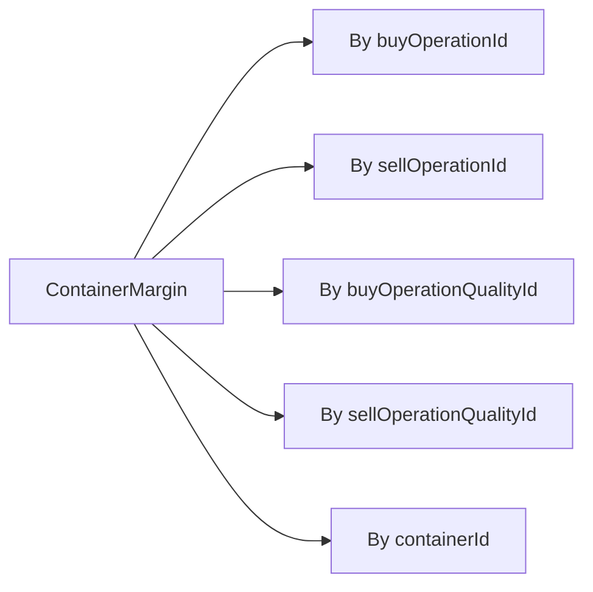

| Dimension                | Use                                    |
| ------------------------ | -------------------------------------- |
| `buyOperationId`         | Total margin view on the purchase side |
| `sellOperationId`        | Total margin view on the sale side     |
| `buyOperationQualityId`  | Margin per purchased quality line      |
| `sellOperationQualityId` | Margin per sold quality line           |
| `containerId`            | Margin per individual container        |

### Estimated vs final margin

| Variant              | When calculated                       | Based on                                                  |
| -------------------- | ------------------------------------- | --------------------------------------------------------- |
| **Estimated margin** | As soon as a buy and sell price exist | Contractual prices from `ContainerToOperationQuality`     |
| **Final margin**     | After invoicing is complete           | Actually invoiced prices from the loading/delivery modals |

The margin view flags completeness using boolean helpers:

- `hasAllPurchasePrice` — all containers in the group have a buy price

- `hasAllSalePrice` — all containers have a sell price

- `hasAllRequiredLogistics` — logistics cost present where required

- `hasFinalMargin` — final margin has been locked in

When currencies differ across containers in a group (e.g., some bought in USD, some in EUR), the aggregation flags this with `arePurchaseCurrenciesIdentical = false` and displays `null` for the aggregate price rather than a misleading average.

### Logistics selection support

The `ContainerMargin` type exposes a second set of price fields (`purchasePriceForLogisticsSelection`, `salePriceForLogisticsSelection`) that are computed from containers where both buy and sell prices exist, but regardless of whether logistics cost is present. This allows the logistics module to show the price context for choosing a freight rate even before the final logistics cost is locked in.

---

## How Allocation Drives Hedging

Commodity price risk is managed at the container-quality level. The allocation is the prerequisite: only once a container has a `buyOperationQualityId` and a `sellOperationQualityId` can hedging be assigned against it.

### The hedging chain

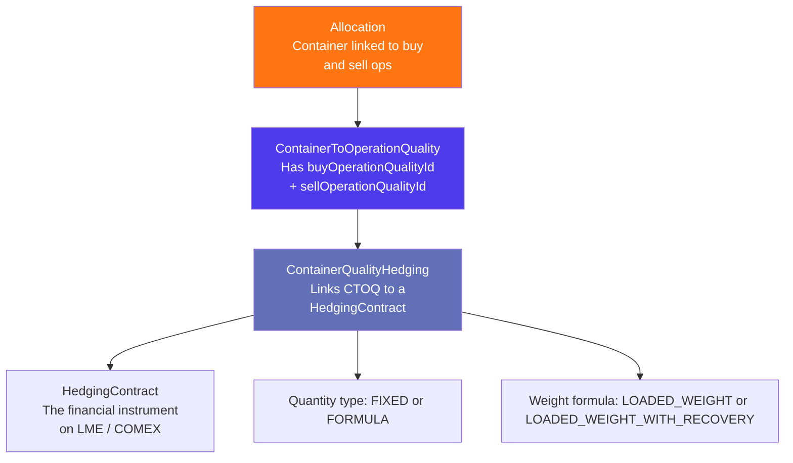

### ContainerQualityHedging

The `ContainerQualityHedging` entity (`container_quality_hedgings` table, read via `container_quality_hedgings_view`) records that a specific `ContainerToOperationQuality` row is covered by a specific `HedgingContract`.

| Field                         | Description                                       |
| ----------------------------- | ------------------------------------------------- |
| `containerOperationQualityId` | The CTOQ record being hedged                      |
| `hedgingContractId`           | The hedging contract covering the risk            |
| `quantityType`                | `FIXED_QUANTITY` or `LOADED_WEIGHT_BASED_FORMULA` |
| `weightFormula`               | `LOADED_WEIGHT` or `LOADED_WEIGHT_WITH_RECOVERY`  |
| `hedgedQuantity`              | The tonnage covered (for FIXED\_QUANTITY type)    |
| `loadedWeight`                | The actual loaded weight of the container         |
| `recoveryPercentage`          | Applied when using `LOADED_WEIGHT_WITH_RECOVERY`  |
| `isTemporaryWeight`           | Whether the loaded weight is provisional          |

### Quantity calculation modes

- **FIXED\_QUANTITY**: A specific tonnage is entered manually. Used when the traded lot size matches a standard exchange lot.

- **LOADED\_WEIGHT\_BASED\_FORMULA**: The hedged quantity is computed from the container's loaded weight, optionally multiplied by a `recoveryPercentage`. Used for materials that yield less recoverable metal than the gross weight (e.g., scrap with known recovery rates).

### Upsert pattern

`ContainerQualityHedging` records are managed via a full upsert: calling `upsertContainerQualityHedgings` deletes all existing hedging records for that `containerOperationQualityId` / `operationType` pair and re-inserts the new set in a single transaction. This ensures the hedging allocation is always consistent with the latest user input.

### ContainerToBeHedged — the hedging work queue

`ContainerToBeHedged` is a read-only view (`containers_to_be_hedged_view`) that surfaces all containers where `isHedgingRequired = true`. It is the hedging team's work queue.

Each row in this view has:

- A **status**: `PENDING` (not yet hedged), `ONGOING` (partially hedged), `CLOSED` (fully hedged)

- A **hedgingStatus**: derived from the `ContainerQualityHedging` records, showing the overall coverage level

The status `isHedgingClosed` can be manually set on a container to exclude it from the queue (for example, when a physical delivery cancels the need for hedging).

---

## How Allocation Drives Invoicing

Once an allocation has linked containers to both a buy and a sell operation, the invoicing system knows which containers need to be purchased from (BUY invoices) and which need to be billed to customers (SELL invoices).

### ContainerToBeInvoiced — the invoicing work queue

`ContainerToBeInvoiced` is a set of read-only SQL views that surface containers awaiting invoicing action. Jules maintains separate views for each invoicing context:

| View                                      | Used for                                         |
| ----------------------------------------- | ------------------------------------------------ |
| `containers_to_be_invoiced_view`          | Standard invoices, credit notes, debit notes     |
| `containers_to_be_purchase_reported_view` | Purchase reports (internal accounting documents) |
| `containers_to_be_provider_reported_view` | Provider reports (third-party service invoices)  |

Each container-operation pair in the view carries:

| Field                              | Description                                                                |
| ---------------------------------- | -------------------------------------------------------------------------- |
| `containerId` / `operationId`      | The specific container and operation                                       |
| `operationType`                    | BUY or SELL — which invoicing direction                                    |
| `status`                           | `PENDING`, `ONGOING`, or `CLOSED`                                          |
| `followUpStatus`                   | Physical progress of the container (PLANNED → LOADED → DELIVERED → CLOSED) |
| `isInvoicingClosed`                | Manual flag to close out invoicing for this container                      |
| `invoices`                         | Invoices already linked to this container                                  |
| `invoiceNumbers`                   | Reference numbers of those invoices                                        |
| `invoiceFollowUpStatus`            | Status of the invoicing follow-up                                          |
| `dateOfLoading` / `dateOfDelivery` | Key dates for timing invoice generation                                    |
| `loadedInTons` / `deliveredInTons` | Actual weights at loading and delivery                                     |
| `plannedInTons`                    | Contractual planned weight                                                 |

### Access control on the invoicing queue

The invoicing queue applies a manager-managee access control layer. When a user has managees defined (via `ManagerToManagee` records), the system filters the queue to show only containers belonging to operations created by those managees. This allows sales managers to see the invoicing status of their entire team without being flooded by the full organization's data.

### The invoicing lifecycle per container

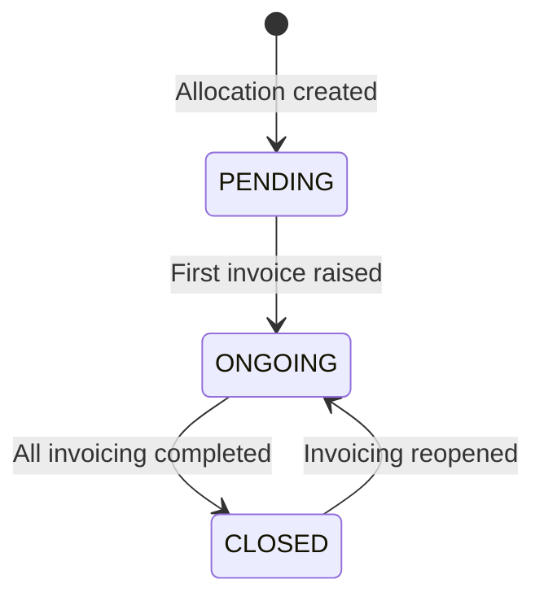

The `isInvoicingClosed` flag on the container (separate flags exist for purchase and sale invoicing: `isPurchaseInvoicingClosed` and `isSaleInvoicingClosed`) allows fine-grained control. A container can be closed on the sell invoicing side but still have open purchase invoicing, or vice versa.

### Invoicing prerequisite: operation must be approved

The invoicing views filter with `WHERE isOperationApproved = true`. This means a container does not appear in the invoicing work queue until its parent operation has been approved. The allocation creates the link, but invoice creation gates on operation approval.

---

## Fulfilment Tracking & Operation Status Impact

### Effect on operation status

When an allocation is created, both the buy and sell operations are moved to `IN_PROGRESS` status (if they were `CONFIRMED`). This reflects that execution has begun.

When an allocation is deleted, both operations are reset to `CONFIRMED` status — the allocation was the trigger for IN\_PROGRESS, so removing it reverts the operations to a state where new allocations can be made.

### Follow-up pipeline

The allocation is what advances containers from the "Planned" stage to the "Allocated" stage in the operation's follow-up pipeline:

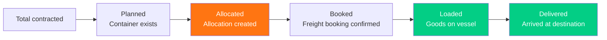

The `allocatedQuantity` on each operation quality is computed from the sum of `ContainerToOperationQuality.quantity` values for all containers linked to an active allocation for that quality.

### Fulfilment tasks

When an allocation is created, Jules automatically generates **fulfilment tasks** from the organization's task templates. These tasks represent the operational checklist for executing the allocation: preparing customs documentation, confirming bookings, uploading the load report, finalizing the BL number, and so on.

Tasks are due-dated relative to the loading date of the containers in the allocation (`daysFromReference` on the task template). If the containers have no `dateOfLoading` set, no tasks are generated and a warning is logged.

---

## Documents Generated from Allocations

An allocation is also the source for several PDF documents:

| Document           | Mutation                | Description                                                                               |
| ------------------ | ----------------------- | ----------------------------------------------------------------------------------------- |
| **Custom Invoice** | `generateCustomInvoice` | A formatted invoice PDF with allocation, BL number, and invoice number                    |
| **Load Report**    | `generateLoadReport`    | A report summarizing what was loaded, by container                                        |
| **Annex 7**        | `generateAnnex7`        | The regulatory Annex 7 document required for waste shipments across EU borders            |
| **Recovery Note**  | `generateRecoveryNote`  | A note confirming recovery of material at the destination, can cover multiple allocations |

These are generated on-demand (not automatically) and stored as PDF references (`annex7`, `customInvoice`, `loadReport`) on the allocation record.

---

## Key Business Rules

### Rule 1 — An allocation requires at least one operation on each side

Every allocation must have a `buyOperationId`. It must also have either a `sellOperationId` (direct customer allocation) or a `warehouseId` (warehouse allocation). An allocation with only a buy operation and no destination is not permitted.

### Rule 2 — Containers must belong to the buy operation

Containers passed in `containerIds` must already be associated with the buy operation. Attempting to allocate containers from a different purchase operation will produce an inconsistent state.

### Rule 3 — A container can only belong to one allocation at a time

A container's `allocationId` field is a single foreign key. To move a container to a different allocation, the existing allocation must be deleted first (which clears the `allocationId`), and a new allocation must be created.

### Rule 4 — Allocation creation immediately sets status to CONFIRMED

The API always creates allocations as `CONFIRMED`. The `DRAFT` status exists in the schema for pre-allocation workflows but is not assigned by the default create path.

### Rule 5 — Deleting an allocation has cascading effects

The deletion is not a soft delete. It removes the allocation record, which triggers:

- CASCADE deletion of all fulfilment tasks

- CASCADE deletion of all `UsedLogisticOption` records

- SET NULL on `allocationId` in containers and receptions

- Programmatic revert of container statuses, reception statuses, and both operation statuses to `CONFIRMED`

### Rule 6 — ContainerToOperationQuality cannot have all quality lines deleted

The `deleteMany` method in the `ContainerToOperationQuality` connector explicitly throws an error if the operation would remove all quality associations from a container (`Cannot delete all container qualities`). Every container must retain at least one quality line.

### Rule 7 — Hedging is operation-type-specific

The `ContainerQualityHedging` records are scoped to an `operationType` (BUY or SELL). Deleting or upserting hedging records only affects contracts whose `associatedOperationType` matches the specified type. This prevents accidental overwriting of buy-side hedging when updating sell-side hedging, or vice versa.

### Rule 8 — Invoicing queue requires operation approval

`ContainerToBeInvoiced` filters on `isOperationApproved = true`. A container will not appear in the invoicing work queue until its operation is approved, regardless of whether an allocation exists.

### Rule 9 — Warehouse allocations create inbound quality records

When allocating to a warehouse, Jules auto-generates an **inbound quality** on the warehouse's receive operation if one does not already exist. This inbound quality becomes the `sellOperationQuality` of the allocation, ensuring the warehouse operation has a complete buy/sell quality pair even when the original sell was not a standard customer operation.

### Rule 10 — Batch allocation groups by operation pair

`createManyAllocations` groups all containers sharing the same `(buyOperationId, sellOperationId)` pair into a single allocation record. Containers going to different sell operations are split into separate allocations. This keeps allocations meaningful as "one physical shipment" rather than one-allocation-per-container.

---

## Data Model Summary

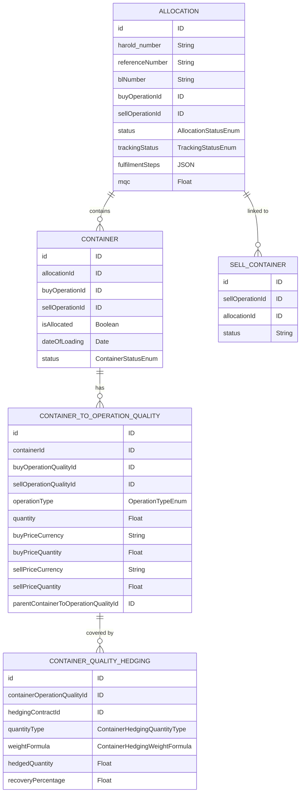

---

## Glossary

| Term                            | Definition                                                                                                                                        |
| ------------------------------- | ------------------------------------------------------------------------------------------------------------------------------------------------- |
| **Allocation**                  | The record linking a purchase operation's containers to a sale operation, forming a complete buy-sell pair                                        |
| **Annex 7**                     | EU regulatory document required for transboundary waste shipments under the Waste Shipment Regulation                                             |
| **BL Number**                   | Bill of Lading number — issued by the shipping line when the vessel departs                                                                       |
| **ContainerMargin**             | The aggregated margin entity computed from ContainerToOperationQuality prices                                                                     |
| **ContainerQualityHedging**     | The record linking a ContainerToOperationQuality to a HedgingContract                                                                             |
| **ContainerToBeHedged**         | Read-only view surfacing containers that require hedging coverage                                                                                 |
| **ContainerToBeInvoiced**       | Read-only view surfacing containers that require invoicing action                                                                                 |
| **ContainerToOperationQuality** | The join entity linking a container to its buy and sell quality lines, carrying prices and quantities                                             |
| **CTOPQ**                       | Abbreviation for ContainerToOperationQuality                                                                                                      |
| **Destination type**            | CUSTOMER or WAREHOUSE — controls whether the allocation routes goods directly to a buyer or via a stockpile                                       |
| **Final margin**                | Margin locked in after delivery, based on actually invoiced prices                                                                                |
| **Estimated margin**            | Margin computed before delivery, based on contractual prices                                                                                      |
| **Fulfilment steps**            | The operational checklist (customs, booking, load report, VGM, Annex 7) tracked on each allocation                                                |
| **Inbound quality**             | The auto-generated operation quality on a warehouse receive operation, created when allocating to a warehouse                                     |
| **MQC**                         | Minimum Quality Commitment — the minimum net weight required per container                                                                        |
| **Parent-child CTOQ**           | The split-quantity pattern where one CTOQ row is the "parent" and child rows record how the quantity is distributed across multiple quality lines |
| **RU number**                   | Reference number (short for "Référence unique") — the logistics reference assigned to an allocation                                               |
| **SellContainer**               | A virtual sell-side container placeholder used on sale operations before physical containers are received                                         |
| **Tracking status**             | The logistics progress state of an allocation's containers (LOADED → SHIPPED → ARRIVED → etc.)                                                    |
| **Unallocation**                | The process of deleting an allocation, which reverses the buy-sell link and resets all associated containers and operations                       |
| **Warehouse allocation**        | An allocation that routes containers to a stockpile rather than directly to a customer                                                            |

