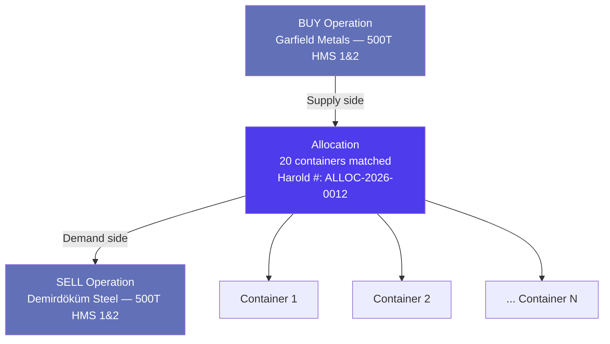
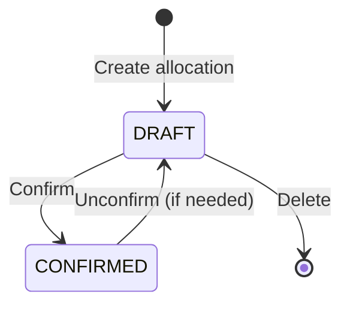
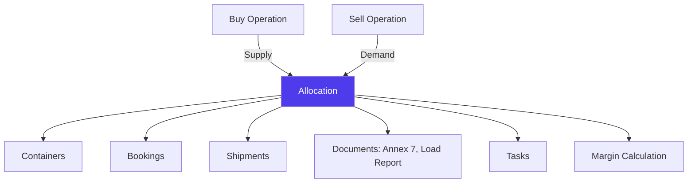

# Allocations in Jules

> Product documentation — Allocations are the bridge between buying and selling. They connect a purchase operation to a sale operation at the container level, enabling margin calculation, logistics coordination, and fulfilment tracking.

---

## Table of Contents

1. [Overview](#overview)
2. [Creating an Allocation](#creating-an-allocation)
3. [Allocation Lifecycle](#allocation-lifecycle)
4. [Fulfilment Steps](#fulfilment-steps)
5. [Documents Generated from Allocations](#documents-generated-from-allocations)
6. [Tracking](#tracking)
7. [Warehouse Allocations](#warehouse-allocations)
8. [Batch Operations](#batch-operations)
9. [Relationships with Other Modules](#relationships-with-other-modules)
10. [Key Business Rules](#key-business-rules)
11. [Glossary](#glossary)

---

## Overview

An **allocation** links a purchase operation (buy side) to a sale operation (sell side) at the container and quality level. It answers the fundamental question: **which purchased material is going to which customer?**

Once an allocation exists:
- Jules can calculate an **estimated margin** across the buy/sell pair
- Containers move from **Planned** to **Allocated** in the follow-up tracker
- Logistics coordination (bookings, shipments) can begin
- Documents (Annex 7, load reports) can be generated

---

## Creating an Allocation

### What you need

| Field | Description | Required |
|-------|-------------|----------|
| **Buy operation** | The purchase operation | Yes |
| **Buy operation quality** | Which material line on the buy side | Yes |
| **Sell operation** | The sale operation | Yes |
| **Sell operation quality** | Which material line on the sell side | Yes |
| **Containers** | Which containers to include | Yes |
| **MQC** | Minimum quality commitment per container | Optional |
| **Reference number** | External reference for this allocation | Optional |
| **Comment** | Notes about this allocation | Optional |
| **Status** | DRAFT or CONFIRMED | Yes |

### Blacklist validation

Before confirming an allocation, Jules checks whether the **buy site** (supplier location) is blacklisted by the **sell site** (customer location). If the customer has configured that site as blacklisted, Jules will warn or block the allocation.

See [Companies, Sites & Contacts](./companies-sites-contacts-en.mdx) for details on site blacklists and whitelists.

### Batch creation

Multiple allocations can be created at once using the batch creation action (`createManyAllocations`). This is common when allocating many containers from a single purchase to a single sale at once — one allocation record per container is created.

---

## Allocation Lifecycle

| Status | Meaning |
|--------|---------|
| **DRAFT** | Allocation is provisional — containers are linked but not committed |
| **CONFIRMED** | Allocation is finalized — logistics and invoicing can proceed |

### Watchers

Allocations support **watchers** — users who receive notifications about changes to the allocation. Watchers are added at creation or later via update.

---

## Fulfilment Steps

Each allocation tracks a **fulfilment checklist** — a set of logistics and documentation steps that must be completed before the cargo can ship.

### Annex 7 (Environmental Compliance)

| Status | Meaning |
|--------|---------|
| **PENDING** | Not yet started |
| **PREPARED_IN_ERP** | Document prepared in the ERP system |
| **SENT_TO_COMPLIANCE** | Sent to the compliance department |
| **SENT_TO_SUPPLIER** | Sent to the supplier for signature |
| **SIGNED_AND_UPLOADED** | Signed document uploaded to Jules |

### Booking

| Status | Meaning |
|--------|---------|
| **PENDING** | No booking yet |
| **PREPARED_IN_ERP** | Booking prepared in the ERP |
| **PRECARRIAGE_BOOKING_OK** | Pre-carriage transport confirmed |
| **FREIGHT_BOOKING_OK** | Maritime freight confirmed |
| **ALL_BOOKING_OK** | Both pre-carriage and freight confirmed |

### Customs

| Status | Meaning |
|--------|---------|
| **PENDING** | Customs clearance not started |
| **SENT_TO_AGENT** | Documents sent to customs agent |
| **SENT_TO_CARRIER** | Customs clearance sent to carrier |

### Load Report

| Status | Meaning |
|--------|---------|
| **PENDING** | Not yet prepared |
| **PREPARED** | Load report document ready |
| **SENT_TO_DOCS_TEAM** | Sent to the documentation team |

### VGM & Load Details

| Step | Tracking |
|------|----------|
| **VGM** | Boolean — submitted or not |
| **Load Details** | Count — number of detail records provided |

---

## Documents Generated from Allocations

Allocations can generate several critical trade documents:

| Document | Description | Mutation |
|----------|-------------|----------|
| **Annex 7** | Environmental compliance document for cross-border waste shipment | `generateAnnex7` |
| **Custom Invoice** | Commercial invoice for customs clearance | `generateCustomInvoice` |
| **Load Report** | Detailed loading report with container weights and contents | `generateLoadReport` |
| **Recovery Note** | Document confirming material recovery at destination | `generateRecoveryNote` |

Each generated document is stored as a PDF linked to the allocation.

### Photos

Allocations can store two types of photos:
- **Annex 7 photos** — photos of the signed environmental document
- **General photos** — photos of the cargo, loading process, or containers

---

## Tracking

Allocations support tracking at two levels:

### Allocation-level tracking status

| Status | Meaning |
|--------|---------|
| **LOADED** | Material has been loaded |
| **GATED_IN** | Container has entered the port terminal |
| **SHIPPED** | Container is on the vessel |
| **ARRIVED** | Vessel has arrived at destination |
| **GATED_OUT** | Container has left the destination port |
| **RETURNED** | Empty container returned to carrier |
| **RECOVERY_NOTE_SENT** | Recovery note sent to authorities |
| **RECOVERED** | Material officially recovered at destination |

### Searates integration

Jules integrates with **Searates** for real-time container tracking. Tracking data includes:
- Geographic coordinates (latitude/longitude)
- Location names and country codes
- Events with timestamps
- Vessel and voyage information

---

## Warehouse Allocations

For **warehouse operations** (local market), allocations can link to stockpiles instead of a standard sell operation:

| Field | Description |
|-------|-------------|
| **Stockpile** | The stockpile where material will be stored |
| **Warehouse** | The warehouse site |
| **Warehouse quality** | The quality grade in the stockpile |

This enables material to flow from a purchase operation into warehouse stock, and later be sold from the stockpile.

---

## Batch Operations

| Operation | Description |
|-----------|-------------|
| **Create many** | Create multiple allocations at once (one per container) |
| **Update by IDs** | Update multiple allocations with the same data (e.g., tracking status) |
| **Update BL by IDs** | Assign the same BL number to multiple allocations |
| **Update BL by reference numbers** | Assign BL numbers by matching on reference numbers |

---

## Relationships with Other Modules

| Module | Relationship |
|--------|-------------|
| **Buy Operation** | Source of the material — the purchase side |
| **Sell Operation** | Destination of the material — the sale side |
| **Containers** | Physical units linked to this allocation |
| **Bookings** | Freight bookings for the allocated containers |
| **Shipments** | Shipments grouping the allocated containers |
| **Tasks** | Action items tracked per allocation |
| **Margin** | Estimated margin calculated from the buy/sell pair |
| **Customs Agency** | Customs agent handling clearance for this allocation |
| **ERP** | Allocations can be synchronized to external ERP systems |

---

## Key Business Rules

### 1. One allocation per buy/sell quality pair

An allocation connects one buy operation quality to one sell operation quality. If a purchase operation has multiple qualities, each quality needs its own allocation(s).

### 2. Container-level granularity

Each container in an allocation is individually tracked through the fulfilment steps. A single allocation can have some containers fully shipped while others are still being loaded.

### 3. Harold numbering

Every allocation receives a unique **Harold number** from the system, used as the primary reference across logistics and documentation workflows.

### 4. BL number propagation

When a BL number is assigned to an allocation (via booking or shipment), it can be propagated to all containers in the allocation.

### 5. Margin per tonne

Each allocation carries an **estimated margin per tonne** (`marginPerTon`) and its currency unit, calculated from the spread between buy and sell prices minus logistics costs.

### 6. Stepper configuration

Allocations use a configurable **stepper** system (via `stepperConfigs` and `stepperValues`) that defines the workflow steps visible in the UI. Different organizations can customize which steps appear and in what order.

### 7. ERP synchronization

Allocations can be synchronized to external ERP systems via `synchronizeAllocationToErp`, pushing allocation data to third-party logistics or accounting systems.

---

## Glossary

| Term | Definition |
|------|------------|
| **Allocation** | The link connecting a purchase operation quality to a sale operation quality at the container level |
| **Annex 7** | Environmental compliance document required for cross-border shipment of recyclable materials (EU Basel regulation) |
| **BL number** | Bill of Lading number — the key transport document identifier |
| **Fulfilment steps** | The checklist of logistics and documentation steps per allocation |
| **Load report** | Document detailing the contents and weights of loaded containers |
| **Recovery note** | Document confirming material has been recovered at the destination facility |
| **Reference number** | External reference used to identify the allocation in communications |
| **Tracking status** | The physical progress of the allocation (Loaded → Shipped → Arrived → Recovered) |
| **VGM** | Verified Gross Mass — mandatory weight declaration for containers |
| **Watcher** | A user subscribed to notifications about changes to the allocation |
