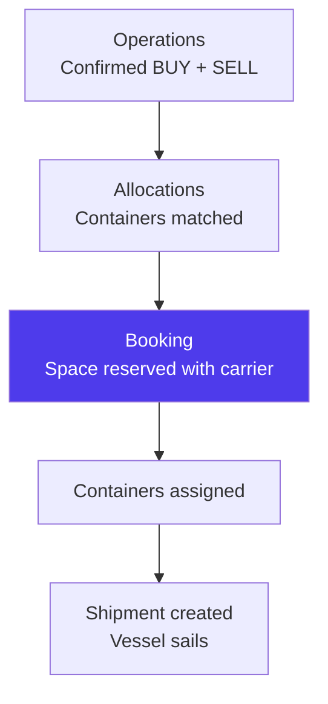
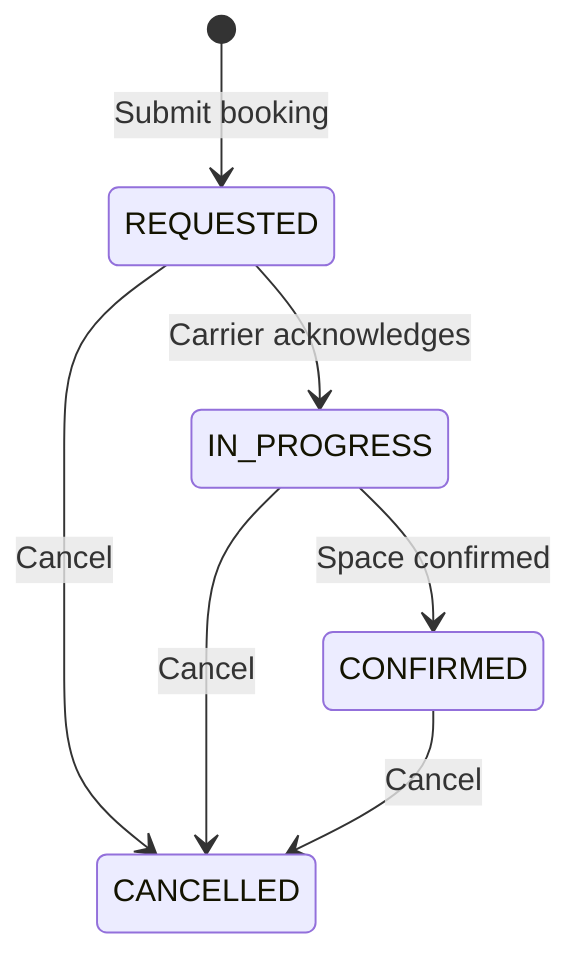
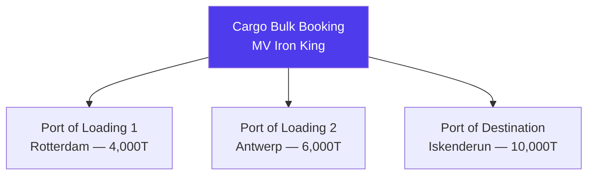
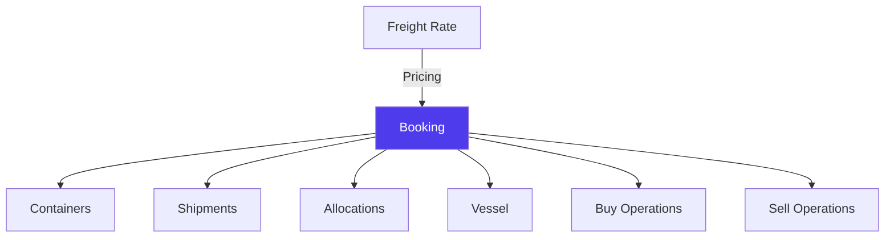

# Bookings in Jules

> Product documentation — A booking is a reservation of shipping space with a carrier. It bridges commercial operations and physical logistics.

---

## Table of Contents

1. [Overview](#overview)
2. [Booking Types](#booking-types)
3. [Booking Lifecycle](#booking-lifecycle)
4. [Container (Freight) Bookings](#container-freight-bookings)
5. [Cargo Bulk Bookings](#cargo-bulk-bookings)
6. [Booking-to-Container Assignment](#booking-to-container-assignment)
7. [Demurrage, Detention & Free Time](#demurrage-detention--free-time)
8. [Pickup Management](#pickup-management)
9. [Relationships with Other Modules](#relationships-with-other-modules)
10. [Key Business Rules](#key-business-rules)
11. [Glossary](#glossary)

---

## Overview

A **booking** in Jules represents a reservation of shipping space — either for **containerized freight** or for **bulk cargo** — with a shipping line or freight forwarder. Bookings are the operational bridge between confirmed operations and physical logistics execution.

Every booking is linked to a **vessel** (the physical ship), a **route** (port of loading → port of destination), and a set of **containers** that will travel on that vessel.

---

## Booking Types

Jules supports two booking types, reflecting the two main modes of international recyclable commodity transport:

| Type | Code | Description | Use case |
|------|------|-------------|----------|
| **Container freight** | `FREIGHT` | Standard containerized shipping (20', 40', 40' HC) | Most common for scrap metal, paper, plastics |
| **Cargo bulk** | `CARGO_BULK` | Non-containerized cargo loaded directly into a vessel's hold | Large volumes of ferrous scrap, minerals |

---

## Booking Lifecycle

| Status | Meaning | Typical trigger |
|--------|---------|-----------------|
| **REQUESTED** | Booking request submitted to carrier or forwarder | User creates booking |
| **IN_PROGRESS** | Carrier has acknowledged and is processing | Carrier responds |
| **CONFIRMED** | Space confirmed on the vessel | Booking confirmation received |
| **CANCELLED** | Booking cancelled | Vessel change, deal cancelled, etc. |

### Status timestamps

Jules records when each status transition occurred:

| Field | Description |
|-------|-------------|
| `requestedLastUpdateAt` | When the booking entered REQUESTED |
| `inProgressLastUpdateAt` | When the booking entered IN_PROGRESS |
| `confirmedLastUpdateAt` | When the booking was confirmed |
| `cancelledLastUpdateAt` | When the booking was cancelled |

### Loading status

Once confirmed, a booking also tracks its **loading status**:

| Status | Meaning |
|--------|---------|
| **PARTIALLY_LOADED** | Some containers have been loaded |
| **LOADED** | All booked containers are loaded |

---

## Container (Freight) Bookings

The standard booking type for containerized shipping. This is the most common booking in Jules.

### Key fields

| Field | Description | Example |
|-------|-------------|---------|
| **Reference number** | Carrier booking reference | MSC-BK-2026-001234 |
| **Shipping line** | The carrier | MSC |
| **Logistic forwarder** | Freight forwarder (if using one) | Geodis |
| **Vessel** | Ship name and voyage | MSC Valentina, Voyage 024W |
| **Port of loading** | Departure port | Port of New York |
| **Port of destination** | Arrival port | Port of Iskenderun |
| **Number of booked containers** | How many containers reserved | 20 |
| **Container type** | Equipment type | 40' HC |
| **Freight cost** | Cost per container (from freight rate) | 1,800 USD |
| **Freight rate** | Link to the freight rate used | FR-2026-0042 |
| **Status** | Booking lifecycle status | CONFIRMED |

### Vessel information

Every booking is linked to a **vessel** object containing:

| Field | Description |
|-------|-------------|
| **Vessel name** | Name of the ship |
| **Voyage number** | Specific sailing |
| **ETD** | Estimated time of departure |
| **ETA** | Estimated time of arrival |
| **Cut-off date** | Deadline for container gate-in |

### Contact management

| Contact | Role |
|---------|------|
| **Shipping line contact** | Carrier representative for this booking |
| **Forwarder contact** | Freight forwarder representative |

### Additional fields

| Field | Description |
|-------|-------------|
| **Customs by** | Who handles customs (agent or forwarder) |
| **Customs origin** | Origin customs point |
| **Place of receipt** | Inland location where carrier takes custody |
| **Place of delivery** | Final inland delivery point |
| **Final destination** | Ultimate destination (may differ from port of destination) |
| **SOC** | Shipper-Owned Container flag |
| **All-in booking** | Whether the rate includes all surcharges |
| **Billing entity** | Which legal entity is billed for the freight |
| **Requested ship-by date** | Latest acceptable sailing date |
| **Loading address** | Physical loading location |
| **Redelivery quay** | Where empty containers should be returned |
| **Redelivery reference** | Reference for empty container return |
| **Return date** | When empty containers should be returned |
| **Admin** | User responsible for managing this booking |

---

## Cargo Bulk Bookings

For non-containerized cargo shipped in bulk. This type is used for large-volume shipments loaded directly into a vessel's hold.

### Additional fields specific to cargo bulk

| Field | Description | Example |
|-------|-------------|---------|
| **Vessel name** | Named vessel for the charter | MV Iron King |
| **Voyage number** | Voyage identifier | V-2026-003 |
| **Substitute vessel** | Alternative vessel name | MV Steel Queen |
| **Charter party date** | Date of the charter agreement | 2026-01-15 |
| **Ship owner** | Owner of the vessel | Oceanic Shipping Ltd |
| **Cargo bulk cost** | Total freight cost for the bulk cargo | 250,000 USD |
| **Quantity** | Total tonnage being shipped | 10,000 T |
| **Quantity allowance type** | Tolerance type | MOLOO, CHOPT, or MOLCHOP |
| **Quantity allowance rate** | Tolerance percentage | 5% |
| **Request type** | Nature of the booking request | FIRM_OFFER or FREIGHT_INDICATION |

### Quantity allowance types

| Type | Full name | Meaning |
|------|-----------|---------|
| **MOLOO** | More or Less Owner's Option | Ship owner decides final quantity within tolerance |
| **CHOPT** | Charterer's Option | Charterer decides final quantity within tolerance |
| **MOLCHOP** | More or Less Charterer's Option | Charterer decides, similar to CHOPT |

### Multi-port bookings

Cargo bulk bookings support **multiple loading and destination ports** via `BookingToPort`:

Each port record can have:
- Quality specifications per port (`BookingToPortToQuality`)
- Additional costs per port (`BookingToPortToOtherCost`)

### Qualities on bulk bookings

Bulk bookings can specify which material qualities are included via `BookingToQuality`, allowing mixed-quality bulk shipments.

---

## Booking-to-Container Assignment

Containers are assigned to bookings at creation or via update. Once a container is assigned to a confirmed booking, its booking status changes:

| Container booking status | Meaning |
|--------------------------|---------|
| **BOOKING_REQUESTED** | Container linked to a REQUESTED booking |
| **FREIGHT_BOOKED** | Container linked to a CONFIRMED booking |
| **ALL_BOOKED** | Container has both freight and pre-carriage confirmed |

In the operation's follow-up tracker, containers move from **Planned/Allocated** to **Booked**.

---

## Demurrage, Detention & Free Time

Bookings track container rental terms that determine when charges begin:

| Field | Description | Level |
|-------|-------------|-------|
| **Free time** | Days containers can stay at port without charge (destination) | Booking |
| **Demurrage** | Daily charge when container stays at port beyond free time | Booking |
| **Detention** | Daily charge when container stays outside port beyond free time | Booking |
| **Origin free time** | Free time at the loading port | Booking |
| **Origin demurrage** | Demurrage at the loading port | Booking |
| **Origin detention** | Detention at the loading port | Booking |

These values flow into the shipment's `freeTimeLimit` calculation, which triggers alerts when charges begin.

---

## Pickup Management

For bookings where empty containers need to be collected, Jules manages **pickups**:

| Field | Description |
|-------|-------------|
| **Pickup quay** | Location where empty containers are collected |
| **Pickup date** | When the pickup is scheduled |

Multiple pickups can be configured per booking, supporting scenarios where containers are collected from different locations or on different dates.

---

## Relationships with Other Modules

| Module | Relationship |
|--------|-------------|
| **Freight Rate** | Provides the cost reference for the booking |
| **Containers** | Physical units assigned to this booking |
| **Shipments** | Bookings are grouped into shipments when the vessel sails |
| **Allocations** | Commercial pairings that drive booking creation |
| **Vessel** | The physical ship carrying the cargo |
| **Operations** | Buy and sell operations whose cargo is on this booking |
| **Billing Entity** | Legal entity billed for the freight |
| **ERP** | Bookings can be synchronized to external systems |

---

## Key Business Rules

### 1. Booking → Vessel coupling

Every freight booking is linked to exactly one **vessel** record. Creating a booking always creates or links to a vessel. Changing the vessel means updating the booking.

### 2. Harold numbering

Every booking receives a unique **Harold number** from the system.

### 3. Reference number uniqueness

The carrier's **booking reference number** is required and used as the primary external identifier.

### 4. Progress tracking

Bookings have a free-text **progress** field for tracking operational notes (e.g., "Waiting for CRO", "Containers gated in").

### 5. Multi-port support for bulk only

Only CARGO_BULK bookings support multiple loading and destination ports. FREIGHT bookings have a single port of loading and destination.

### 6. Booking copying

An existing booking's details can be copied to a new allocation using `copyBookingFromAllocation`, streamlining repeated shipments on the same route.

### 7. ERP synchronization

Bookings can be synchronized to external systems via `syncBookingToErp`.

---

## Glossary

| Term | Definition |
|------|------------|
| **All-in booking** | A booking where the freight rate includes all surcharges |
| **Booking** | A reservation of shipping space with a carrier |
| **Cargo bulk** | Non-containerized cargo shipped in a vessel's hold |
| **Charter party** | A contract between a ship owner and a charterer for the use of a vessel |
| **CRO** | Container Release Order — carrier's authorization to collect empty containers |
| **Cut-off date** | Deadline for gate-in at the port before vessel departure |
| **Demurrage** | Fee for keeping a container at port beyond free time |
| **Detention** | Fee for keeping a container outside port beyond free time |
| **Freight** | Standard containerized shipping |
| **Free time** | Days a container can stay at port without incurring charges |
| **MOLOO** | More or Less Owner's Option — quantity tolerance decided by ship owner |
| **Pickup** | Collection of empty containers from a depot |
| **SOC** | Shipper-Owned Container — container owned by the shipper rather than the carrier |
