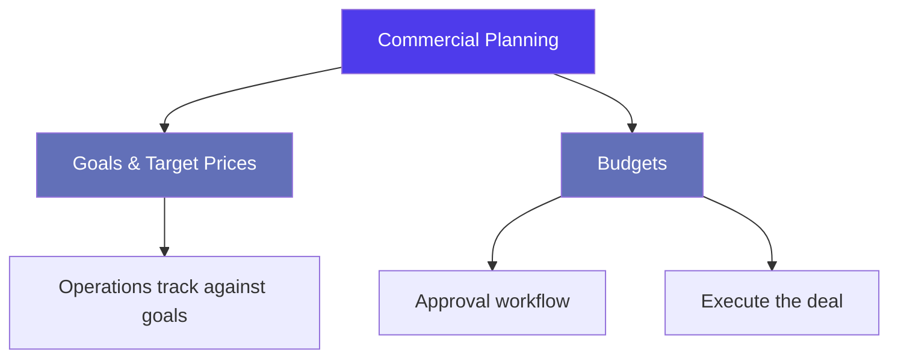
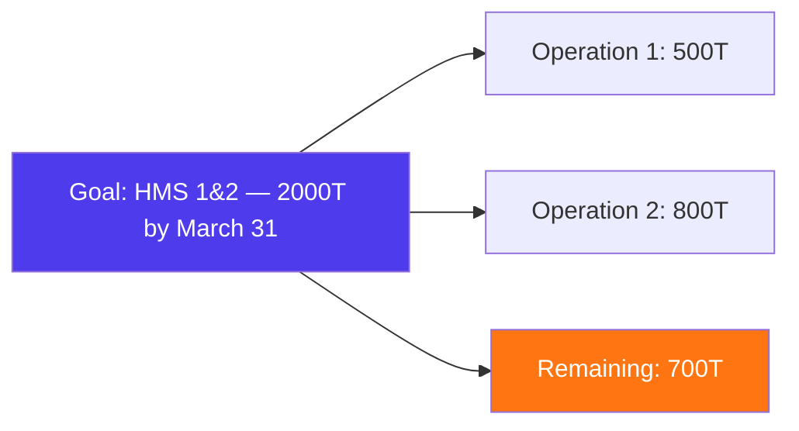
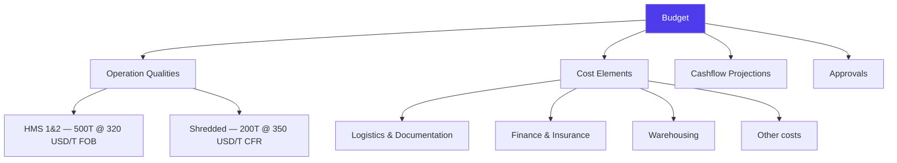
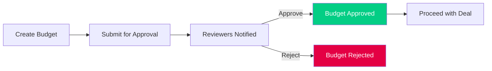

# Budgets & Goals in Jules

> Product documentation — How Jules supports commercial planning through purchase goals, target prices, and deal-level budgets with cost breakdowns and cashflow projections.

---

## Table of Contents

1. [Overview](#overview)
2. [Goals & Target Prices](#goals--target-prices)
3. [Budgets](#budgets)
4. [Budget Templates](#budget-templates)
5. [Cashflow Projections](#cashflow-projections)
6. [Approval Workflow](#approval-workflow)
7. [Key Business Rules](#key-business-rules)
8. [Glossary](#glossary)

---

## Overview

Jules provides two complementary planning tools:

| Tool | Purpose | Granularity |
|------|---------|-------------|
| **Goals** | Set volume and price targets for purchasing | Per quality, per destination, per period |
| **Budgets** | Model the full economics of a deal before executing | Per operation quality, with detailed cost breakdown |

---

## Goals & Target Prices

### Goals

A **goal** is a purchasing or selling target — a commitment to buy or sell a certain quantity of a specific material within a given timeframe.

### Goal Fields

| Field | Description |
|-------|-------------|
| **Quality** | The material grade targeted |
| **Quantity** | Volume to purchase or sell |
| **Target price** | The price the trader aims to achieve |
| **Price type** | Whether this is a BUY or SELL target |
| **Incoterm** | Delivery terms |
| **Market type** | Export or Local |
| **Start date / Due date** | Time window for achieving the goal |
| **Assigned to** | Traders responsible for the goal |
| **Destination** | Target destination site |
| **Port of loading / destination** | Logistics routing |
| **Region / Area** | Geographic targeting |
| **Pre-carriage area** | Inland transport zone |
| **Is margin included** | Whether the target price includes margin |

### Fulfillment Tracking

Goals track **fulfilled quantity** — how much has been achieved through actual operations. This allows real-time monitoring of progress vs target.

### Target Prices

A **target price** is a simpler variant of a goal — it sets a price target without a volume commitment. It includes:

| Field | Description |
|-------|-------------|
| **Quality** | Material grade |
| **Target price** | Price objective |
| **Price type** | BUY or SELL direction |
| **Due date** | Deadline |
| **Price variation** | Acceptable price fluctuation range |

### Grouping & Sorting

Goals can be:
- **Grouped by destination** — to see targets by delivery location
- **Sorted by creation date** — ascending or descending

---

## Budgets

A **budget** models the complete economics of a deal, breaking down all costs and revenues to project profitability before committing to the trade.

### Budget Structure

### Budget Fields

| Field | Description |
|-------|-------------|
| **Name** | Budget identifier |
| **Template** | The budget template defining available cost elements |
| **Operation qualities** | The deals being budgeted (with prices, quantities, incoterms) |
| **Elements** | Individual cost lines (see below) |
| **Cashflows** | Projected payment timing |
| **Overdraft period** | Days of negative cashflow the deal may generate |
| **Approvals** | Approval chain for the budget |
| **Created by** | User who created the budget |

### Budget Operation Qualities

Each budget links to one or more operation qualities, capturing:

| Field | Description |
|-------|-------------|
| **Operation quality** | The deal line being budgeted |
| **Price** | Budgeted price (may differ from the operation's actual price) |
| **Quantity** | Budgeted volume |
| **Incoterm** | Delivery terms for the budget scenario |
| **Payment terms** | Payment conditions |
| **Port of loading / destination** | Logistics routing |

### Budget Elements (Cost Lines)

Each cost line in a budget specifies:

| Field | Description |
|-------|-------------|
| **Element** | The cost item (e.g., freight, inspection, customs) |
| **Category** | Classification of the cost (see below) |
| **Cost type** | How the cost is calculated |
| **Price / Quantity** | The budgeted amount |
| **Cost percentage** | For percentage-based costs |
| **Percentage of** | What the percentage is applied to (Purchase, Sale, or Turnover) |

### Cost Types

| Type | Description |
|------|-------------|
| **FLAT** | Fixed amount per unit |
| **PERCENTAGE** | Percentage of another value |
| **LOGISTICS_RATE** | Uses the logistics rate card |

### Element Categories

| Category | Examples |
|----------|----------|
| **LOGISTICS_DOCUMENTATION** | Freight, pre-carriage, BL fees, customs |
| **FINANCE_INSURANCE_PAYMENT** | Interest, insurance, payment term fees |
| **WAREHOUSING** | Storage, handling |
| **OTHER** | Any other cost |

---

## Budget Templates

**Budget templates** define the structure of a budget — which cost elements are available and their default values. They are configured per organization.

### Template Fields

| Field | Description |
|-------|-------------|
| **Name** | Template name |
| **Shipment mode** | CONTAINER, BULK_CARGO, or TRUCK_RAIL_BARGE |
| **Default currency** | The currency for the template |
| **Default volume** | The unit of measure (e.g., T for tonne) |
| **Elements** | List of pre-configured cost elements with defaults |

Templates ensure consistency across budgets and reduce setup time for new deals.

---

## Cashflow Projections

Each budget can include **cashflow projections** that model when money flows in and out:

### Cashflow Types

| Type | Description |
|------|-------------|
| **BUY** | Cash outflow — when the supplier is paid |
| **SELL** | Cash inflow — when the customer pays |
| **INVENTORY** | Cash tied up in inventory |

### Cashflow Fields

| Field | Description |
|-------|-------------|
| **Cashflow type** | BUY, SELL, or INVENTORY |
| **Number of days** | Days from reference date to payment |
| **Value type** | PERCENTAGE or ABSOLUTE |
| **Absolute value** | Fixed amount (if absolute) |
| **Percentage value** | Percentage of the deal value (if percentage) |

### Overdraft Period

The **overdraft period** indicates how many days the deal may require financing (negative cash position). This is critical for assessing working capital needs.

---

## Approval Workflow

Budgets are subject to an **approval workflow** before a deal can proceed:

The approval system uses the generic `Approval` entity with:
- **Multiple reviewers** — Several users can be assigned as approvers
- **Review status** — PENDING, APPROVED, or REJECTED per reviewer
- **Request comment** — Context provided by the budget creator
- **Reject comment** — Reason for rejection

---

## Key Business Rules

### 1. Goals drive purchasing behavior

Goals create visibility on what the organization needs to buy or sell. When creating operations, traders can link them to goals, and the fulfilled quantity is automatically tracked.

### 2. Budgets precede execution

In organizations that require approval workflows, a budget must be approved before operations are created. The budget proves the deal is profitable after accounting for all costs.

### 3. Templates standardize budgeting

Budget templates ensure all teams use the same cost structure, making budgets comparable across deals and time periods.

### 4. Cashflow projections inform treasury

By modeling payment timing, cashflow projections help the finance team anticipate working capital needs and arrange financing if needed.

### 5. Cost percentage flexibility

Budget elements can be calculated as a percentage of the purchase price, sale price, or total turnover — providing flexibility for different cost types (e.g., agent commission as % of sale, insurance as % of turnover).

### 6. Multi-quality budgets

A single budget can cover multiple operation qualities, modeling the economics of a complex deal involving several material grades.

---

## Glossary

| Term | Definition |
|------|------------|
| **Budget** | A detailed financial model of a deal's costs and revenues |
| **Budget element** | A single cost line in a budget (e.g., freight, customs) |
| **Budget template** | Pre-configured cost structure used to create consistent budgets |
| **Cashflow projection** | Model of when money flows in and out of a deal |
| **Fulfilled quantity** | Volume achieved against a goal through actual operations |
| **Goal** | A volume and price target for purchasing or selling a material |
| **Overdraft period** | Days of negative cash position during deal execution |
| **Target price** | A price objective without a volume commitment |
