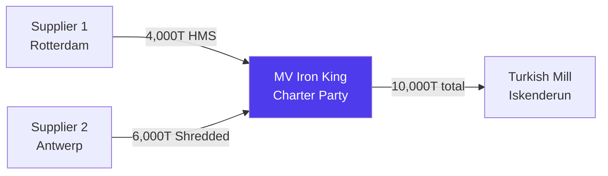
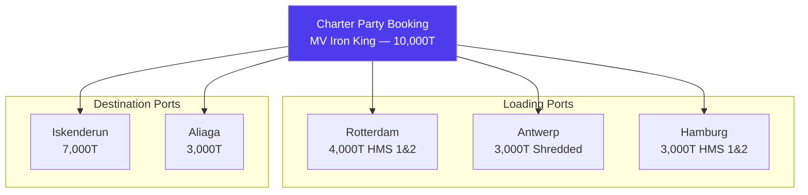
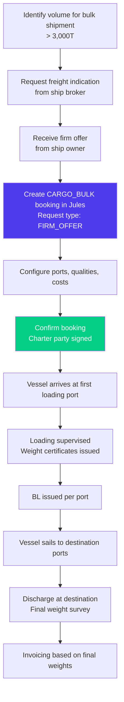

# Charter Party & Cargo Bulk in Jules

> Product documentation — Charter party bookings are used for non-containerized bulk cargo shipments, where an entire vessel or a portion of its hold is chartered for large-volume trades.

---

## Table of Contents

1. [Overview](#overview)
2. [When to Use Cargo Bulk](#when-to-use-cargo-bulk)
3. [Charter Party Booking Structure](#charter-party-booking-structure)
4. [Multi-Port Configuration](#multi-port-configuration)
5. [Quantity Tolerances](#quantity-tolerances)
6. [Request Types](#request-types)
7. [Cargo Bulk vs Container Freight](#cargo-bulk-vs-container-freight)
8. [Cargo Bulk Workflow](#cargo-bulk-workflow)
9. [Invoicing for Bulk Cargo](#invoicing-for-bulk-cargo)
10. [Key Business Rules](#key-business-rules)
11. [Glossary](#glossary)

---

## Overview

When recyclable commodities are traded in large volumes, containerized shipping becomes impractical or uneconomical. Instead, traders charter a vessel (or part of it) and load cargo directly into the ship's hold. This is **cargo bulk** shipping, governed by a **charter party** agreement.

In Jules, cargo bulk is a **booking type** — the same entity as a container freight booking, but with additional fields specific to bulk shipping: charter party date, ship owner, vessel details, quantity tolerances, and multi-port configuration.

---

## When to Use Cargo Bulk

| Use cargo bulk when... | Use container freight when... |
|------------------------|------------------------------|
| Shipping > 3,000 T on a single voyage | Shipping < 3,000 T or mixed small lots |
| Material is homogeneous (e.g., all HMS) | Material is mixed or in small quantities |
| A vessel is being chartered (full or part) | Using liner services (regular schedules) |
| Loading at multiple ports on the same voyage | Single loading port per booking |
| Quantity needs tolerance (MOLOO/CHOPT) | Fixed container count |

Common bulk commodities in Jules: ferrous scrap (HMS 1&2, shredded), manganese, pig iron, DRI/HBI.

---

## Charter Party Booking Structure

A cargo bulk booking in Jules captures the full commercial and operational terms of the charter:

### Core fields

| Field | Description | Example |
|-------|-------------|---------|
| **Reference number** | Booking reference | CP-2026-0015 |
| **Type** | Always `CARGO_BULK` | CARGO_BULK |
| **Status** | REQUESTED → IN_PROGRESS → CONFIRMED → CANCELLED | CONFIRMED |
| **Vessel name** | Named vessel | MV Iron King |
| **Voyage number** | Voyage identifier | V-2026-003 |
| **Substitute vessel** | Alternative vessel if the named one is unavailable | MV Steel Queen |
| **Charter party date** | Date the charter agreement was signed | 2026-01-15 |
| **Ship owner** | Owner/operator of the vessel | Oceanic Shipping Ltd |
| **Cargo bulk cost** | Total freight cost for the voyage | 250,000 USD |
| **Admin** | User managing this booking | John Smith |

### Quantity fields

| Field | Description | Example |
|-------|-------------|---------|
| **Quantity** | Total tonnage to be shipped | 10,000 T |
| **Quantity allowance type** | Who decides the final quantity | MOLOO |
| **Quantity allowance rate** | Tolerance percentage | 5% |

---

## Multi-Port Configuration

Cargo bulk bookings support **multiple loading and destination ports** — a critical feature for consolidation voyages where the vessel calls at several ports.

### BookingToPort structure

Each port on the voyage is recorded as a `BookingToPort` record:

| Field | Description |
|-------|-------------|
| **Port name** | The port (loading or destination) |
| **Direction** | Loading or discharge |
| **Sequence** | Order of port calls |
| **Qualities** | Material grades loaded/discharged at this port |
| **Other costs** | Port-specific costs (THC, customs, etc.) |

### Per-port quality specifications

Each port can have quality-specific details via `BookingToPortToQuality`:
- Which quality grades are loaded at this port
- Quantity per quality
- Quality inspection requirements

### Per-port additional costs

Each port can have its own cost structure via `BookingToPortToOtherCost`:
- Terminal handling charges
- Port dues
- Customs fees
- Other local charges

---

## Quantity Tolerances

Bulk cargo rarely ships at the exact contracted quantity. Jules supports three standard tolerance types:

| Type | Full Name | Who decides | Example |
|------|-----------|-------------|---------|
| **MOLOO** | More or Less Owner's Option | Ship owner decides the final loaded quantity within the tolerance range | 10,000T ± 5% MOLOO = 9,500–10,500T at owner's discretion |
| **CHOPT** | Charterer's Option | Charterer (trader) decides | 10,000T ± 5% CHOPT = trader decides how much to load |
| **MOLCHOP** | More or Less Charterer's Option | Charterer decides (variant) | Same as CHOPT in practice |

The tolerance is expressed as a **percentage** (`quantityAllowanceRate`). Jules tracks the actual loaded quantity against the contractual quantity to measure execution within tolerance.

---

## Request Types

When initiating a cargo bulk booking, Jules distinguishes between two request types:

| Type | Description | Use case |
|------|-------------|----------|
| **FIRM_OFFER** | A binding offer for the vessel charter | Deal is being negotiated seriously |
| **FREIGHT_INDICATION** | A non-binding freight price indication | Early-stage exploration of rates |

A FREIGHT_INDICATION may be upgraded to a FIRM_OFFER as negotiations progress.

---

## Cargo Bulk vs Container Freight

| Dimension | Cargo Bulk | Container Freight |
|-----------|------------|-------------------|
| **Booking type** | `CARGO_BULK` | `FREIGHT` |
| **Vessel** | Named/chartered vessel | Liner service vessel |
| **Loading** | Direct into ship's hold | Into standard containers |
| **Multi-port** | Yes — multiple loading and destination ports | No — single POL and POD |
| **Quantity** | Total tonnage with tolerance | Fixed number of containers |
| **Cost** | Lump sum for the voyage | Per container rate |
| **Charter party date** | Yes | No |
| **Ship owner** | Yes | No (carrier) |
| **Substitute vessel** | Yes | No |
| **Quality per port** | Yes | No |
| **D&D management** | Via port-specific costs | Via booking-level fields |

---

## Cargo Bulk Workflow

### Key steps

1. **Rate negotiation** — Get freight indications from brokers, then lock a firm offer
2. **Booking creation** — Create a CARGO_BULK booking with all ports and quality specs
3. **Charter party signing** — Record the charter party date
4. **Loading supervision** — At each loading port, record weights and issue draft BLs
5. **BL issuance** — One BL per loading port or one combined BL
6. **Transit tracking** — Track the vessel via shipment tracking
7. **Discharge** — Final weight survey at each destination port
8. **Invoicing** — Invoice based on loaded or delivered weights per the charter terms

---

## Invoicing for Bulk Cargo

Bulk cargo invoicing uses the `CARGO_BULK_COST` element in the container invoicing matrix. Key differences from container invoicing:

| Aspect | Container | Bulk |
|--------|-----------|------|
| **Cost basis** | Per container rate | Lump sum or per-tonne rate |
| **Weight reference** | Container net weight | Draft survey or weight certificate |
| **Invoicing line** | `FREIGHT_COST` per container | `CARGO_BULK_COST` per booking |
| **Bill of Lading** | Per container/group | Per port of loading |

---

## Key Business Rules

### 1. One vessel per booking

Each cargo bulk booking is linked to one named vessel (and optionally one substitute). The charter party agreement covers this specific vessel.

### 2. Multi-quality support

A single bulk booking can carry multiple material qualities. Quality specifications can vary by port (e.g., HMS at Rotterdam, Shredded at Antwerp).

### 3. Tolerance impacts invoicing

The actual loaded quantity may differ from the contracted quantity within the tolerance range. Invoicing is based on the actual quantity, not the contractual quantity.

### 4. PDF generation

Cargo bulk bookings have their own PDF template (`CARGO_BULK_BOOKING`), separate from container booking PDFs.

### 5. Booking qualities

Unlike container bookings (where qualities come from the operations), bulk bookings explicitly define their quality composition via `BookingToQuality`.

---

## Glossary

| Term | Definition |
|------|------------|
| **Cargo bulk** | Non-containerized cargo loaded directly into a vessel's hold |
| **Charter party** | A contract between a ship owner and a charterer for the use of a vessel |
| **CHOPT** | Charterer's Option — the charterer decides the final loaded quantity |
| **Draft survey** | Weight measurement of cargo by measuring the vessel's draft before and after loading |
| **Firm offer** | A binding price offer for chartering a vessel |
| **Freight indication** | A non-binding preliminary freight price for planning purposes |
| **MOLOO** | More or Less Owner's Option — the ship owner decides the final quantity |
| **MOLCHOP** | More or Less Charterer's Option — same as CHOPT |
| **Ship owner** | The company that owns and operates the vessel |
| **Substitute vessel** | An alternative vessel that may replace the named vessel |
| **Tolerance** | The allowed deviation (in %) from the contracted quantity |
| **Weight certificate** | Official document certifying the weight of cargo loaded or discharged |
