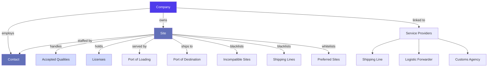
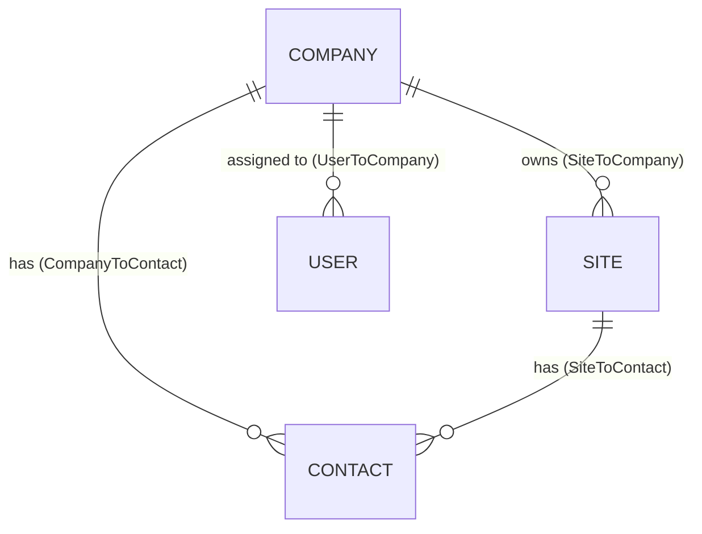
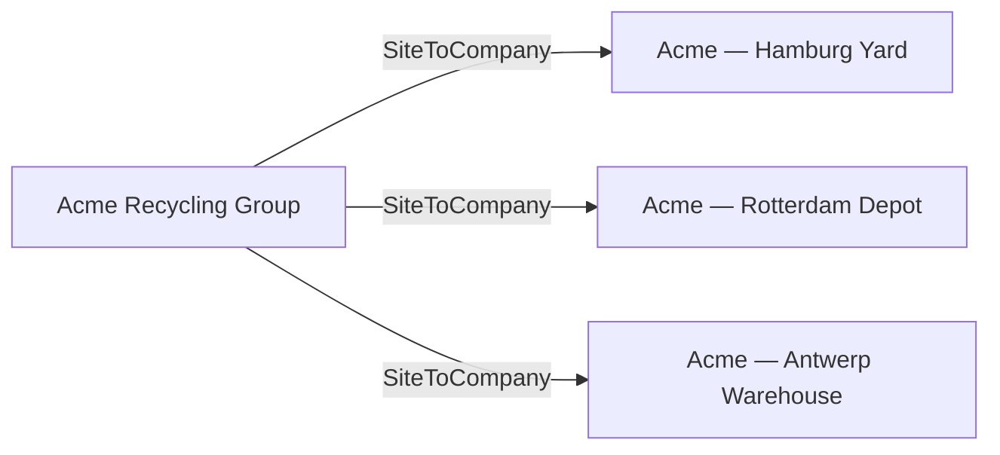
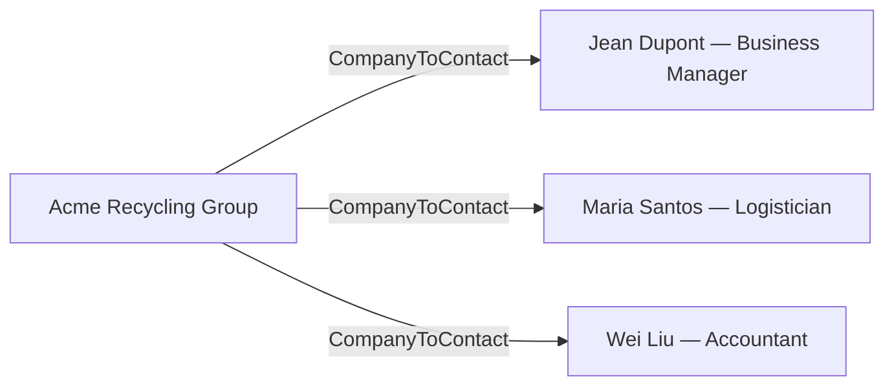
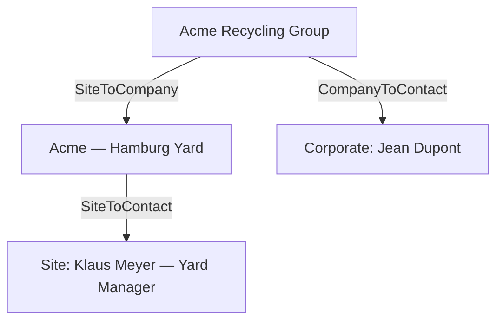
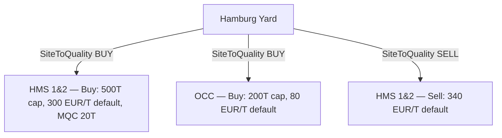
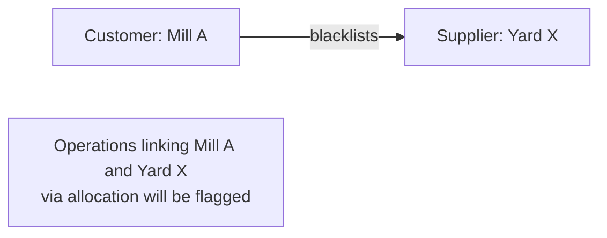
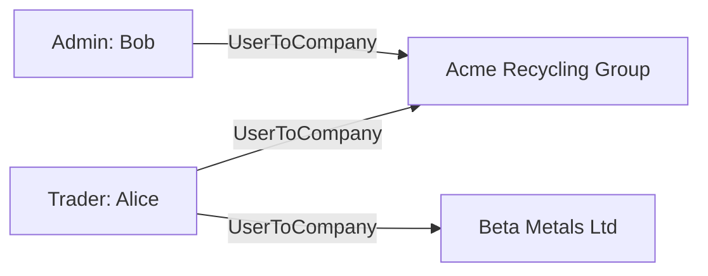
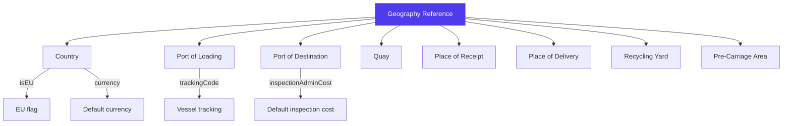

> Product documentation — The relationship model between trading counterparties, physical locations, and people. Every operation, contract, invoice, and shipment in Jules is anchored to this foundation.

---

## Table of Contents

1. [Overview](#overview)

2. [The Core Triangle: Company, Site, Contact](#the-core-triangle-company-site-contact)

3. [Company](#company)

4. [Site](#site)

5. [Contact](#contact)

6. [Company ↔ Site Relationship](#company--site-relationship)

7. [Company ↔ Contact Relationship](#company--contact-relationship)

8. [Site ↔ Contact Relationship](#site--contact-relationship)

9. [Site Qualities & Licenses](#site-qualities--licenses)

10. [Site Blacklists & Whitelists](#site-blacklists--whitelists)

11. [Service Providers: Shipping Lines, Forwarders, Customs Agencies](#service-providers-shipping-lines-forwarders-customs-agencies)

12. [Internal Users & Companies](#internal-users--companies)

13. [Geography: Locations, Ports & Logistics Points](#geography-locations-ports--logistics-points)

14. [Site PDF & Contract Prefill Defaults](#site-pdf--contract-prefill-defaults)

15. [Key Business Rules](#key-business-rules)

16. [Glossary](#glossary)

---

## Overview

Before a single trade can happen in Jules, three master data objects must exist: a **Company** (the legal trading counterparty), a **Site** (the physical location where goods are produced, stored, or delivered), and a **Contact** (the person who manages the relationship). These three objects form the backbone of every operation, contract, invoice, and logistics flow in the platform.

Every other module in Jules — operations, contracts, bookings, invoices, bills, goals, and margins — references one or more of these master data entities. Getting this foundation right is critical: it drives document generation, logistics prefill, credit management, and counterparty access controls.

---

## The Core Triangle: Company, Site, Contact

Jules separates three concerns that are often conflated in simpler systems:

| Entity      | What it represents                                       | Key question it answers                       |
| ----------- | -------------------------------------------------------- | --------------------------------------------- |
| **Company** | The legal entity you trade with (the organization)       | Who is the legal counterparty on the invoice? |
| **Site**    | The physical location (a yard, warehouse, port facility) | Where do goods come from or go to?            |
| **Contact** | The individual person managing the relationship          | Who do I call or email?                       |

These three entities are independent but linked through explicit relationship tables. A single company can have multiple sites (e.g., a recycler with yards in three cities), multiple contacts, and a site can itself have its own set of contacts distinct from the parent company's.

---

## Company

A **Company** is the top-level legal entity in Jules. It represents any organization your business trades with — a supplier, a customer, a service provider parent entity, or an internal business unit.

### Company Types (`SiteTypeEnum`)

Despite the enum name referencing "Site", the type field is shared between Company and Site objects in Jules:

| Type                | Description                                              | Typical use                              |
| ------------------- | -------------------------------------------------------- | ---------------------------------------- |
| **SUPPLIER**        | Sells recyclable materials to your organization          | Scrap dealers, generators, collectors    |
| **CUSTOMER**        | Buys recyclable materials from your organization         | Mills, smelters, end-users               |
| **RECYCLING\_YARD** | Operates a physical recycling or sorting yard            | Intermediate processors                  |
| **WAREHOUSE**       | Operates a warehouse or storage facility                 | Third-party logistics, bonded warehouses |
| **SERVICE**         | Provides services (logistics, customs, inspection, etc.) | Agents, forwarders, brokers              |

### Company Fields

| Field                  | Description                                            |
| ---------------------- | ------------------------------------------------------ |
| **value**              | The display name / trade name of the company           |
| **legalName**          | The official registered legal name                     |
| **legalForm**          | Corporate form (SA, SRL, GmbH, LLC, etc.)              |
| **identificationCode** | Primary business registration number                   |
| **registrationCode**   | Secondary registration (e.g., chamber of commerce)     |
| **licenseNumber**      | Any trading or operating license number                |
| **taxCode / taxRate**  | VAT/tax identification and rate                        |
| **otherCode1/2/3**     | Flexible fields for local regulatory codes             |
| **marketType**         | Default market (EXPORT or LOCAL) for this counterparty |
| **sector**             | Business sector classification                         |
| **region / subregion** | Geographic classification for reporting                |
| **billingEntity**      | Internal billing entity that invoices this company     |
| **paymentTerms**       | Default payment terms (e.g., "30 days net")            |
| **currency**           | Default currency for transactions                      |
| **unitSystem**         | Metric or imperial preference for documents            |
| **isBlocked**          | Prevents new operations with this company when `true`  |
| **isEU**               | Whether the company is in the European Union           |
| **erpId / erpValue**   | External ERP system reference for synchronization      |

### Credit & Coverage Fields

Jules tracks credit exposure directly on the company record:

| Field                              | Description                                           |
| ---------------------------------- | ----------------------------------------------------- |
| **creditCoverage**                 | Maximum credit covered (e.g., by a credit insurer)    |
| **creditCoverageProvider**         | Name of the credit insurance provider                 |
| **creditCoverageLastValidityDate** | Expiration date of the credit coverage                |
| **altCreditCoverage**              | Alternative/secondary credit coverage amount          |
| **totalCreditCoverage**            | Combined total credit coverage                        |
| **coverageCostPercentage**         | Cost of credit insurance as a percentage              |
| **coveragePeriod**                 | Coverage window (ANY, LAST\_60\_DAYS, LAST\_90\_DAYS) |
| **creditLimit**                    | Maximum credit limit allowed with this company        |
| **creditOutstanding**              | Current outstanding credit exposure                   |
| **totalUnpaidAllocatedPrice**      | Total value of confirmed but unpaid trades            |

### Document Defaults

Companies carry default document settings used when generating POs, SOs, and other commercial documents:

| Field                                      | Description                                   |
| ------------------------------------------ | --------------------------------------------- |
| **defaultConsigneeDetails**                | Default consignee text for shipping documents |
| **defaultNotifyDetails**                   | Default notify party text for Bills of Lading |
| **consigneeCompanies**                     | Companies to pre-populate as consignees       |
| **consigneeSites**                         | Sites to pre-populate as consignee locations  |
| **notifyParties**                          | Companies pre-populated as notify parties     |
| **defaultDocs**                            | Document template defaults (type, quantity)   |
| **defaultIndexFirstReferenceDateOrPeriod** | Default index pricing period start            |
| **defaultIndexLastReferenceDateOrPeriod**  | Default index pricing period end              |
| **logoUrl / signatureUrl**                 | Branding assets for document generation       |
| **logisticsEmail / accountingEmail**       | Dedicated email addresses by department       |

### Default User Assignments

| Field                   | Description                                             |
| ----------------------- | ------------------------------------------------------- |
| **defaultUserId**       | Default trader assigned to operations with this company |
| **defaultAdminId**      | Default administrator                                   |
| **defaultAccountRepId** | Default account representative                          |
| **businessManager**     | The contact person acting as business manager           |

---

## Site

A **Site** is a physical location — a yard, warehouse, processing facility, or delivery point. While a company is the legal counterparty, the site is the operational counterparty: it's where trucks pull up, containers are loaded, and stock is kept.

Sites are the primary reference on operations: when you create a purchase or sale, you pick the **site**, not the company. The company is derived from the site's company link.

### Site Types

| Type                | Description                       | Typical use                           |
| ------------------- | --------------------------------- | ------------------------------------- |
| **SUPPLIER**        | A location that supplies material | Scrap yard, generator, collector yard |
| **CUSTOMER**        | A location that receives material | Mill, smelter, recycling facility     |
| **RECYCLING\_YARD** | A processing or sorting facility  | Shredder, MRF, baling plant           |
| **WAREHOUSE**       | A storage location                | Third-party warehouse, bonded store   |
| **SERVICE**         | A service facility                | Inspection site, customs depot        |

### Site Status

Sites have a lifecycle status that indicates the commercial relationship stage:

| Status       | Description                                 |
| ------------ | ------------------------------------------- |
| **LEAD**     | Early prospect — very early awareness stage |
| **PROSPECT** | Actively pursuing but no trades yet         |
| **ACTIVE**   | Regular trading counterparty                |
| **SLEEPING** | Previously active, currently dormant        |

### Core Site Fields

| Field                      | Description                                                   |
| -------------------------- | ------------------------------------------------------------- |
| **name**                   | Site display name                                             |
| **type**                   | Site type (SUPPLIER, CUSTOMER, etc.)                          |
| **status**                 | Commercial lifecycle stage                                    |
| **market**                 | Default market (EXPORT or LOCAL)                              |
| **incoterm**               | Default incoterm for operations at this site                  |
| **paymentTerms**           | Default payment terms                                         |
| **currency**               | Default transaction currency                                  |
| **volume**                 | Default volume unit (T, KG, LB, etc.)                         |
| **region / subregion**     | Geographic classification                                     |
| **billingEntity**          | Internal billing entity for this site                         |
| **rating**                 | Internal score (1–5) for supplier/customer quality            |
| **lat / lng**              | GPS coordinates for mapping                                   |
| **loadingAddress**         | Physical loading address (may differ from registered address) |
| **preCarriageArea**        | Default pre-carriage zone (for local transport routing)       |
| **preCarriageAreaComment** | Notes about local transport requirements                      |
| **portsOfLoading**         | Default ports of loading associated with this site            |
| **portsOfDestination**     | Default destination ports                                     |
| **defaultPlaceOfReceipt**  | Default place of receipt on shipping documents                |
| **defaultPlaceOfDelivery** | Default place of delivery on shipping documents               |
| **isBlocked**              | Prevents new operations when `true`                           |
| **isEU**                   | Whether the site is within the European Union                 |
| **erpId / erpCompanyId**   | External ERP references                                       |

### Warehouse-Specific Fields

Sites of type WAREHOUSE carry additional stock management configuration:

| Field                       | Description                                             |
| --------------------------- | ------------------------------------------------------- |
| **warehouseType**           | Classification of the warehouse                         |
| **allowNegativeStock**      | Whether stock can go negative (for trading flexibility) |
| **defaultStockPickingRule** | FIFO, FEFO, or manual picking rule                      |
| **isRestrictedQualities**   | Whether only whitelisted qualities are accepted         |
| **isStockpileOptional**     | Whether stockpile assignment is mandatory on operations |
| **stockpiles**              | List of physical piles managed at this warehouse        |

### Site Activity Fields

| Field                   | Description                                          |
| ----------------------- | ---------------------------------------------------- |
| **dateOfLastActivity**  | When the last CRM activity was recorded              |
| **dateOfLastOperation** | When the last trade operation was executed           |
| **activitySummary**     | Count of contracts, notes, offers, operations, tasks |
| **nextTasks**           | Upcoming tasks assigned to this site                 |
| **siteAdminCost**       | Default administrative cost per trade at this site   |

---

## Contact

A **Contact** is an individual person — the human being you communicate with at a company or site. Contacts in Jules are not user accounts: they represent external counterparty personnel, not internal Jules platform users.

### Contact Fields

| Field                    | Description                                                 |
| ------------------------ | ----------------------------------------------------------- |
| **firstName / lastName** | Person's name                                               |
| **gender**               | MALE or FEMALE (used for salutation in documents)           |
| **email**                | Primary email address                                       |
| **phoneNumber**          | Primary phone number                                        |
| **fax**                  | Fax number                                                  |
| **role**                 | Functional role: BUSINESS\_MANAGER, LOGISTICIAN, ACCOUNTANT |
| **signatureUrl**         | Signature image for document generation                     |
| **receivables**          | Which document types this contact receives (see below)      |
| **lastActivityDate**     | Most recent activity log date                               |
| **numberOfActivities**   | Count of logged activities with this contact                |
| **erpId**                | External ERP reference                                      |

### Contact Roles

| Role                  | Description                                                               |
| --------------------- | ------------------------------------------------------------------------- |
| **BUSINESS\_MANAGER** | Commercial decision-maker; typically on operations, offers, and contracts |
| **LOGISTICIAN**       | Logistics coordinator; receives shipment and booking notifications        |
| **ACCOUNTANT**        | Finance contact; receives invoices and payment-related documents          |

### Contact Receivables

The `receivables` field controls which documents are automatically sent to a contact:

| Receivable    | Document type                            |
| ------------- | ---------------------------------------- |
| **OPERATION** | Purchase Orders and Sales Orders         |
| **CONTAINER** | Container-level documents                |
| **SHIPMENT**  | Shipment notifications and B/L documents |
| **OFFER**     | Commercial offers and quotes             |
| **INVOICE**   | Invoice documents                        |

### Contact Linking (`linkedTos`)

A contact is linked to one or more entities through the `linkedTos` field. This replaces the old single-link model and allows a contact to be simultaneously linked to a company, a site, a shipping line, a forwarder, and so on:

| Link type           | What it connects to        |
| ------------------- | -------------------------- |
| **COMPANY**         | A trading company          |
| **SITE**            | A physical site            |
| **AGENT**           | An agent / intermediary    |
| **SHIPPING\_LINE**  | A carrier (shipping line)  |
| **FORWARDER**       | A logistics forwarder      |
| **CUSTOMS\_AGENCY** | A customs broker           |
| **CARRIER**         | A carrier entity           |
| **INSPECTOR**       | An inspection company      |
| **SHIP\_OWNER**     | A vessel owner             |
| **BROKER**          | A trade broker             |
| **FINANCIER**       | A financing entity         |
| **BILLING\_ENTITY** | An internal billing entity |

---

## Company ↔ Site Relationship

The `SiteToCompany` join captures which company owns or operates a given site. This relationship is fundamental: it determines which company appears on documents when you trade with a site.

**Key rules:**

- A site belongs to exactly one company at a time (the `companyId` on a site)

- The company can have many sites

- Sites can exist without a company link (independent sites, e.g., ports or customs depots)

**On operations**: when a trader selects a site, Jules automatically resolves the parent company to populate the counterparty on the PO/SO, invoice, and contract.

---

## Company ↔ Contact Relationship

The `CompanyToContact` join links contacts to trading companies. Multiple contacts can be assigned to one company (e.g., the business manager, the logistics coordinator, and the accountant at the same supplier).

When assigning contacts to a company, you pass `contactIds` on the create or update mutation. Jules also tracks:

- **businessManager** — a single designated business manager contact surfaced directly on the company record

- **defaultUserId / defaultAdminId / defaultAccountRepId** — internal Jules user defaults (not contacts) for the company

---

## Site ↔ Contact Relationship

The `SiteToContact` join links contacts to specific sites. A contact linked to a site will appear on documents generated for that site (POs, SOs, shipment notifications) and will receive documents according to their `receivables` configuration.

This is distinct from the company-level contacts: a large supplier may have corporate contacts at the company level (e.g., a CFO for invoice discussions), and site-level contacts (e.g., the yard manager who handles daily logistics at a specific location).

**The&#x20;****`contact`****&#x20;field on Site**: each site has a single designated primary contact surfaced as `contact` (singular), used as the default signatory or addressee on generated documents. The `contacts` (plural) field returns all associated contacts.

---

## Site Qualities & Licenses

### Site Qualities (`SiteToQuality`)

A site's accepted material types and trade parameters are configured through `SiteToQuality` records. This is a crucial configuration: it tells Jules which qualities can be traded at a given site, and under what commercial conditions.

Each `SiteToQuality` record represents a directional relationship (BUY or SELL) between a site and a quality:

| Field                       | Description                                                               |
| --------------------------- | ------------------------------------------------------------------------- |
| **quality**                 | The material grade (HMS 1&2, OCC, LDPE Film, etc.)                        |
| **type**                    | Direction: BUY (purchasing from this site) or SELL (selling to this site) |
| **capacity**                | Maximum quantity this site can handle per period                          |
| **fulfilledCapacity**       | How much of the capacity has been consumed by confirmed operations        |
| **availableQuantity**       | Remaining available capacity                                              |
| **receivedQuantity**        | Total received to date                                                    |
| **defaultCurrency**         | Preferred invoice currency for this quality at this site                  |
| **defaultQuantityUnitCode** | Default unit of measure (T, KG, etc.)                                     |
| **defaultMargin**           | Default target margin for this quality at this site                       |
| **mqc**                     | Minimum Quality Commitment — minimum weight per container                 |
| **rating**                  | Quality-specific rating for this site (1–5)                               |
| **score**                   | Composite commercial score                                                |
| **logisticOptions**         | Available logistic configurations (routes, forwarders, rates)             |
| **photos**                  | Site quality photos (e.g., stockpile images)                              |
| **comment**                 | Internal notes on this quality at this site                               |

**Why this matters**: when creating an operation for a given site, Jules can suggest the correct qualities, pre-populate prices and MQCs, and flag when a requested quality is not configured for that site.

### Site Licenses (`SiteToLicense`)

Many recyclable materials require regulatory permits to be traded or transported. Jules tracks these directly on the site through `SiteToLicense` records.

| Field                | Description                                                            |
| -------------------- | ---------------------------------------------------------------------- |
| **name**             | License name or reference (e.g., "Basel permit", "ICPE authorization") |
| **dateOfStart**      | When the license becomes valid                                         |
| **dateOfExpiration** | When the license expires                                               |
| **quota**            | Maximum quantity authorized under this license                         |
| **quotaUnit**        | Unit for the quota (T, KG, etc.)                                       |
| **quotaFrequency**   | How the quota resets: WEEKLY, MONTHLY, QUARTERLY, ANNUALLY             |
| **qualities**        | Which material qualities this license covers                           |
| **country**          | The country that issued the license                                    |
| **pdf**              | Scanned copy of the license document                                   |
| **comment**          | Internal notes                                                         |

**Key use case**: before booking a shipment involving hazardous or regulated materials (e.g., Basel Convention-regulated waste), Jules operators verify that the destination site has a valid license for the relevant quality, with sufficient remaining quota. License expiration alerts prevent non-compliant trades.

---

## Site Blacklists & Whitelists

### Blacklisted Sites (`SiteToBlacklistedSite`)

A site can designate other sites as incompatible — meaning goods from a blacklisted site cannot be sold to, or purchased through, the blacklisting site. This is used to enforce trade compliance (e.g., a customer who refuses material from certain origins) or commercial agreements (e.g., exclusivity clauses).

The blacklist is maintained as a list of `blacklistedSites` on the site record and managed through the `SiteToBlacklistedSite` join. Jules warns traders when an allocation would pair a site with one of its blacklisted counterparts.

### Whitelisted Sites (`SiteToWhitelistedSite`)

Conversely, a site can maintain a **whitelist** of approved counterpart sites — only material from whitelisted origins will be accepted. This is common with mills that have strict origin requirements (e.g., "only certified EU-origin scrap").

| Field                     | Description                                                      |
| ------------------------- | ---------------------------------------------------------------- |
| **whitelistedSiteIds**    | The list of approved origin/destination sites                    |
| **isRestrictedQualities** | When `true` on the site, only whitelisted qualities are accepted |

### Blacklisted Shipping Lines (`SiteToBlacklistedShippingLine`)

Beyond site-to-site restrictions, a site can also blacklist specific **shipping lines** (carriers). This appears on the site as `blacklistedShippingLines`. Traders will be warned or blocked from booking a blacklisted carrier for shipments involving that site.

**Typical use case**: a customer specifies "no shipments on \[Carrier X]" due to past service failures or contractual commitments with other carriers.

---

## Service Providers: Shipping Lines, Forwarders, Customs Agencies

Beyond trading counterparties (companies and sites), Jules tracks several types of **service providers** — organizations that provide logistics, customs, and financial services. These implement the same `LegalEntity` interface as Company, meaning they share the same address, legal, and financial field structure.

### Shipping Line (`ShippingLine`)

A carrier that operates vessels and provides maritime transport. Shipping lines in Jules are:

- Selected during freight booking to route containers

- Blacklisted at the site level when a customer refuses a specific carrier

- Linked to contacts (via `ShippingLineToContact`) for logistics communication

Key fields: `value` (carrier name), `uid` (SCAC or carrier code), `logisticsEmail`, `accountingEmail`, full `LegalEntity` address and legal fields.

### Logistic Forwarder (`LogisticForwarder`)

A freight forwarder who manages booking, documentation, and customs on behalf of the trader. In Jules:

- Forwarders are assigned to freight bookings

- They have dedicated contacts (via `LogisticForwarderToContact`)

- They carry the same legal entity fields as companies (address, tax codes, bank accounts)

### Customs Agency (`CustomsAgency`)

A customs broker who handles import/export declarations. In Jules:

- Customs agencies are linked to operations and sites

- They carry contacts (via `CustomsAgencyToContact`) for document exchange

- They implement the full `LegalEntity` interface with address, legal, and finance fields

### Agent (`AgentToContact`)

Agents are intermediaries — brokers or commercial agents — who facilitate trades between buyers and sellers. They:

- Earn commissions on operations (fixed per unit or percentage)

- Have dedicated contacts linked via `AgentToContact`

- Can be the source of `AGENT` type links on a contact's `linkedTos`

### Provider Contacts Summary

| Provider type      | Contact join                 | Typical contact role                       |
| ------------------ | ---------------------------- | ------------------------------------------ |
| Shipping Line      | `ShippingLineToContact`      | Booking coordinator, documentation manager |
| Logistic Forwarder | `LogisticForwarderToContact` | Freight handler, customs coordinator       |
| Customs Agency     | `CustomsAgencyToContact`     | Customs declarant, document processor      |
| Agent              | `AgentToContact`             | Commercial representative                  |
| Provider (generic) | `ProviderToContact`          | Varies by provider type                    |

---

## Internal Users & Companies

### `UserToCompany`

The `UserToCompany` join links your internal Jules **users** (traders, admins, account managers) to trading companies. This is different from contacts: users are internal platform accounts, while contacts are external counterparty people.

This assignment controls:

- Which users are responsible for a given company's account

- Default user assignments on operations (`defaultUserId`, `defaultAdminId`, `defaultAccountRepId` on the company)

- The `society` field allows scoping user-company assignments to a specific internal business unit

---

## Geography: Locations, Ports & Logistics Points

Jules maintains a rich geographic reference system that underpins site configuration, operation routing, and document generation.

### Location (`Location`)

A `Location` is a structured geographic reference associated with a site. It stores country, city, region, and zip code in a normalized, searchable format — distinct from the free-text address fields on a site.

### Address (`Address`)

The `Address` entity supports geocoded address lookup and autocomplete via an external geocoding service. It returns lat/lng coordinates and structured address components (street, city, country, zip code, state). Sites use this to set their GPS coordinates and formatted addresses.

### Country (`Country`)

The country reference table. Each country carries:

| Field        | Description                               |
| ------------ | ----------------------------------------- |
| **value**    | Country name                              |
| **code**     | ISO country code                          |
| **currency** | Default currency for this country         |
| **isEU**     | Whether the country is an EU member state |

### Port of Loading (`PortOfLoading`)

A port from which goods are exported. Sites list their preferred `portsOfLoading`. Each port has:

- `value`: port name (e.g., "Hamburg", "Antwerp")

- `country`: the country where the port is located

- `isEU`: EU port flag

- `trackingCode`: used for vessel tracking integrations

### Port of Destination (`PortOfDestination`)

A port where goods arrive. Sites list their acceptable `portsOfDestination`. Additional fields beyond the loading port:

- `currency`: local currency at the destination

- `inspectionAdminCost`: default inspection administrative cost at this port

- `trackingCode`: tracking integration code

### Site to Port Relationships

Sites link to their routing preferences through two join entities:

| Join                        | Direction | Description                             |
| --------------------------- | --------- | --------------------------------------- |
| **SiteToPortOfLoading**     | Outbound  | Ports from which this site ships        |
| **SiteToPortOfDestination** | Inbound   | Ports to which this site receives goods |

These defaults pre-populate on operation qualities, reducing manual entry.

### Quay (`Quay`)

A quay is a specific berth or terminal within a port — a more granular reference than the port itself. Used on bookings and containers to specify the exact loading or unloading point. Quays carry a full address (city, country, zip code).

### Place of Receipt (`PlaceOfReceipt`)

The inland point where goods are handed over to the carrier before the main maritime leg. Typically a container depot, dry port, or rail terminal. Sites carry a `defaultPlaceOfReceipt`.

### Place of Delivery (`PlaceOfDelivery`)

The inland point where goods are delivered to the buyer after the main maritime leg. Sites carry a `defaultPlaceOfDelivery`.

### Recycling Yard (`RecyclingYard`)

A named reference for recycling or processing facilities used as intermediate handling points. Sites can designate a `defaultRecyclingYard` — a facility where material is processed before or after primary transport.

### Pre-Carriage Area (`PreCarriageArea`)

A geographic zone designation for the local transport leg before the main maritime freight. Sites carry a `preCarriageArea` reference and a `preCarriageAreaComment`. This feeds into pre-carriage rate lookup when building a full logistics cost model.

### Geography Hierarchy

---

## Site PDF & Contract Prefill Defaults

### `SiteToPdfParameters` / `PoSoParams`

Each site carries a set of document generation defaults that pre-populate PO and SO fields when a document is created. These are retrieved via `getPoSoParams(siteId, qualityId)`:

| Field                 | Description                              |
| --------------------- | ---------------------------------------- |
| **paymentTerms**      | Pre-populated payment terms on PO/SO     |
| **portOfDestination** | Default destination port on documents    |
| **origin**            | Default origin declaration               |
| **conditionning**     | Packaging or conditioning description    |
| **loadingSchedule**   | Default loading schedule text            |
| **logisticMaterial**  | Default packaging material type          |
| **docGeneralComment** | Boilerplate general comment on documents |
| **blComment**         | Default Bill of Lading comment           |

### `SiteToContractPrefill`

When creating a new contract, Jules can pre-fill consignee and notify party details based on the site. The `SiteToContractPrefill` entity stores:

| Field                  | Description                                             |
| ---------------------- | ------------------------------------------------------- |
| **consigneeCompanies** | Companies to pre-populate as consignees on the contract |
| **consigneeSites**     | Sites to pre-populate as consignee locations            |

This accelerates contract creation for repeat counterparties, ensuring document defaults are consistent and reducing data entry errors.

---

## Key Business Rules

### 1. Site is the operational counterparty, Company is the legal counterparty

In Jules, operations are always created **against a site**, not directly against a company. The company is resolved from the site's `SiteToCompany` relationship. This matters because:

- A multi-site supplier will appear on invoices as the parent company, even when the specific site differs

- Blocking a company (`isBlocked = true`) does not automatically block its sites — and vice versa

- Credit exposure is tracked at the **company** level, aggregating across all sites

### 2. Contacts are linked to multiple entity types simultaneously

A contact can be linked to a company, a site, a shipping line, and a forwarder all at once through the `linkedTos` field. This reflects real-world relationships where a logistics coordinator works for a parent company but also handles specific site operations and carrier bookings. When Jules surfaces "suggested contacts" for an operation, it considers all relevant `linkedTos` associations.

### 3. Site quality configuration drives operation defaults

Before a site can be used in a trade for a specific material, a `SiteToQuality` record must exist for the site + quality + direction (BUY or SELL). This configuration record carries:

- Pricing defaults (margin, currency, unit)

- Physical constraints (MQC, capacity)

- Commercial intelligence (rating, score)

If this configuration is missing, traders will not see the quality as an option when creating operations for that site.

### 4. License quota is consumed by confirmed operations

`SiteToLicense` records track quota consumption against the license's frequency period (weekly, monthly, quarterly, annual). When an operation involving a licensed material is confirmed at a site, Jules deducts from the available quota. Operators are warned when a trade would exceed the available license quota.

### 5. Blacklists operate at the allocation level

Site blacklists and shipping line blacklists are enforced when **allocating** purchase and sale operations. Jules checks whether the buy-side site and sell-side site are incompatible before allowing the allocation. The blacklist does not prevent the operation from being created — it prevents the two sides from being matched.

### 6. Whitelists restrict acceptable origins at restricted sites

When a site has `isRestrictedQualities = true`, only qualities explicitly configured in `SiteToQuality` are accepted. Combined with the whitelist (`whitelistedSites`), this gives customers with strict origin requirements full control over what material enters their facility.

### 7. ERP synchronization is contact- and company-aware

Jules supports bulk import and synchronization of companies, sites, and contacts from an external ERP (`*Erp` mutations). The `erpId` field on company and site is the ERP's foreign key. User-to-company assignments can also be synchronized via `createManyUsersToCompaniesErp` and `deleteManyUsersToCompaniesErp`.

### 8. The `uid` field on legal entities is the unique internal identifier for document stamping

The `uid` field on Company, ShippingLine, LogisticForwarder, and CustomsAgency is the short identifier stamped on generated documents and shared externally. It differs from the database `id` (UUID) in that it is human-readable and stable across environments.

---

## Glossary

| Term                          | Definition                                                                                                                                           |
| ----------------------------- | ---------------------------------------------------------------------------------------------------------------------------------------------------- |
| **Agent**                     | An intermediary who facilitates trades between buyers and sellers, earning a commission                                                              |
| **Blacklist (site)**          | A list of sites whose material cannot be mixed with a given site's operations                                                                        |
| **Blacklist (shipping line)** | A list of carriers excluded from bookings for a given site                                                                                           |
| **Business Manager**          | The designated primary commercial contact at a company or site                                                                                       |
| **Company**                   | The legal trading counterparty — the organization that appears on invoices and contracts                                                             |
| **CompanyToContact**          | The join entity linking a contact to a trading company                                                                                               |
| **Contact**                   | An individual person at an external counterparty or service provider                                                                                 |
| **Country**                   | A geographic reference with ISO code, currency, and EU flag                                                                                          |
| **Credit Coverage**           | Insurance or guarantee covering a counterparty's credit exposure                                                                                     |
| **Credit Limit**              | The maximum credit exposure allowed with a given company                                                                                             |
| **CustomsAgency**             | A customs broker who handles import/export declarations                                                                                              |
| **ERP ID**                    | The foreign key that links a Jules entity to the corresponding record in an external ERP                                                             |
| **isBlocked**                 | A flag preventing new operations with a company or site                                                                                              |
| **isEU**                      | A flag indicating EU membership, relevant for VAT and regulatory purposes                                                                            |
| **Legal Entity**              | The shared interface implemented by Company, ShippingLine, LogisticForwarder, and CustomsAgency — carrying common address, legal, and finance fields |
| **License (SiteToLicense)**   | A regulatory permit enabling a site to receive, process, or export specific materials                                                                |
| **linkedTos**                 | The multi-link field on a contact, connecting them to multiple entity types simultaneously                                                           |
| **Location**                  | A normalized geographic reference (country, city, region, zip) linked to a site                                                                      |
| **LogisticForwarder**         | A freight forwarder who manages booking, documentation, and customs                                                                                  |
| **MQC**                       | Minimum Quality Commitment — the minimum weight per container for a given quality at a site                                                          |
| **Place of Delivery**         | The inland delivery point after the main maritime leg                                                                                                |
| **Place of Receipt**          | The inland pickup point before the main maritime leg                                                                                                 |
| **Port of Destination**       | The maritime port where goods arrive                                                                                                                 |
| **Port of Loading**           | The maritime port from which goods depart                                                                                                            |
| **Pre-Carriage Area**         | A geographic zone designation for local transport before main freight                                                                                |
| **Quay**                      | A specific berth or terminal within a port                                                                                                           |
| **Quota**                     | A volume limit on a license, resetting at a defined frequency                                                                                        |
| **Receivables**               | Document types a contact is configured to receive automatically                                                                                      |
| **RecyclingYard**             | A named intermediate processing or sorting facility                                                                                                  |
| **Region / Subregion**        | Hierarchical geographic classifications used for filtering and reporting                                                                             |
| **ShippingLine**              | A maritime carrier operating vessels; selected for freight bookings                                                                                  |
| **Site**                      | A physical location where materials are produced, stored, processed, or delivered                                                                    |
| **SiteToCompany**             | The relationship linking a site to its parent company                                                                                                |
| **SiteToContact**             | The relationship linking a contact to a site                                                                                                         |
| **SiteToLicense**             | A regulatory license record attached to a site                                                                                                       |
| **SiteToQuality**             | The configuration of which materials can be traded at a site, and under what terms                                                                   |
| **SiteToWhitelistedSite**     | An approved origin/destination site pairing                                                                                                          |
| **UID**                       | A human-readable unique identifier stamped on generated documents                                                                                    |
| **UserToCompany**             | The relationship linking an internal Jules user to a trading company account                                                                         |
| **Whitelist**                 | A list of approved origin or destination sites for a given site                                                                                      |

