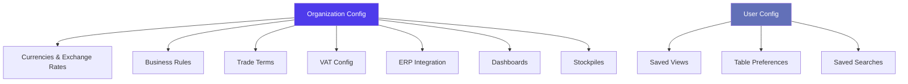
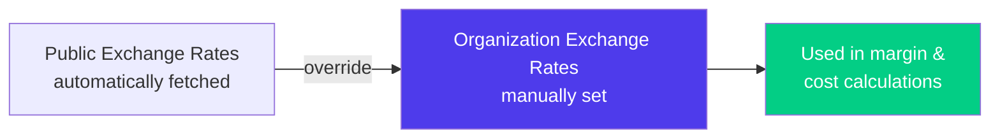
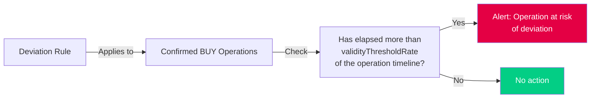
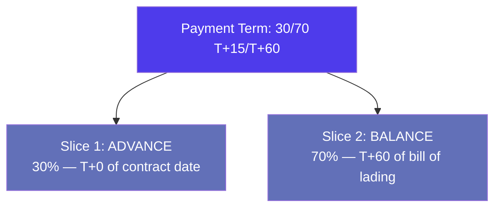
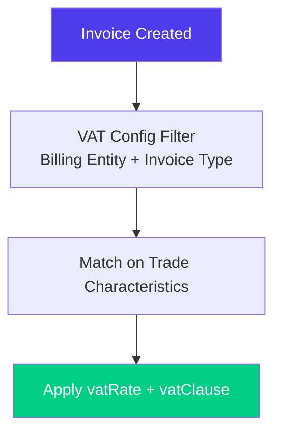
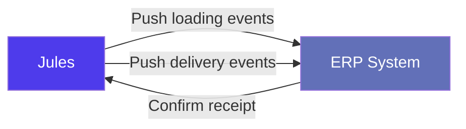
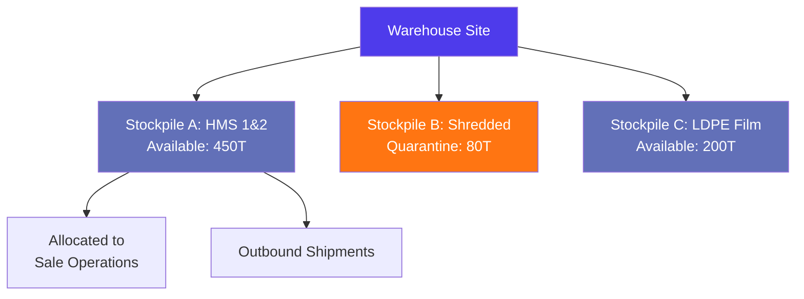
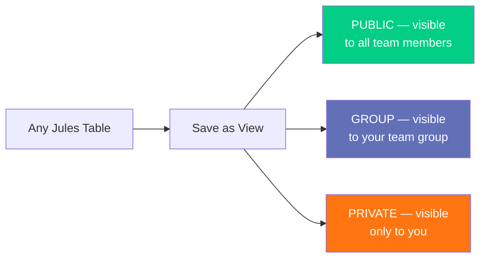

> Product documentation — How Jules is set up per organization to reflect your trading rules, currencies, trade terms, integration endpoints, and dashboard preferences.

---

## Table of Contents

1. [Overview](#overview)

2. [Organization Configuration](#organization-configuration)

3. [Currencies & Exchange Rates](#currencies--exchange-rates)

4. [Business Rules](#business-rules)

5. [Trade Terms Reference Data](#trade-terms-reference-data)

6. [VAT Configuration](#vat-configuration)

7. [ERP Integration](#erp-integration)

8. [Flags & Alerts](#flags--alerts)

9. [Stockpiles (Warehouse Configuration)](#stockpiles-warehouse-configuration)

10. [Dashboards](#dashboards)

11. [Views & Saved Filters](#views--saved-filters)

12. [Accounts Payable / Receivable (APAR)](#accounts-payable--receivable-apar)

13. [Default Form Parameters](#default-form-parameters)

14. [User Configuration](#user-configuration)

15. [Relationships with Other Modules](#relationships-with-other-modules)

16. [Key Business Rules](#key-business-rules)

17. [Glossary](#glossary)

---

## Overview

Configuration in Jules operates at two levels: **organization-wide settings** that apply to all users in a tenant, and **user-level preferences** that each person customizes individually. Everything described in this article lives in the **Settings** area of the application and is managed by administrators.

Jules is a **multi-tenant** platform — each organization has its own isolated configuration. No settings bleed across tenants.

---

## Organization Configuration

The **organization config** (`organizationConfig` query) is the top-level settings object for an entire Jules tenant. It controls platform-wide behaviors for operations, invoicing, logistics, and display.

### Core Settings

| Setting               | Type                  | Description                                                                       |
| --------------------- | --------------------- | --------------------------------------------------------------------------------- |
| `organizationName`    | String                | The display name for the organization                                             |
| `unitSystem`          | `METRIC` / `IMPERIAL` | Whether quantities are displayed in metric (tonnes, kg) or imperial (lbs) units   |
| `defaultShipmentMode` | Enum                  | Default mode for new operations: `CONTAINER`, `BULK_CARGO`, or `TRUCK_RAIL_BARGE` |
| `bulkCargoEnabled`    | Boolean               | Whether bulk cargo shipment mode is available to this organization                |
| `csvDelimiter`        | String                | Character used when exporting data to CSV (e.g., comma or semicolon)              |
| `shouldUseAwsServer`  | Boolean               | Whether to use AWS storage for document uploads                                   |

### Operations Settings

| Setting                                     | Type    | Description                                                                     |
| ------------------------------------------- | ------- | ------------------------------------------------------------------------------- |
| `shouldDisableEditApprovedOperation`        | Boolean | When `true`, approved operations cannot be edited by regular users              |
| `isDefaultListViewOperationQuality`         | Boolean | Whether the operations list defaults to the "by quality" view                   |
| `isDefaultPriceFixationAbsolute`            | Boolean | Whether price fixation defaults to absolute (vs percentage) mode                |
| `operationQualityChoiceForAllocationSortBy` | Enum    | Default sort order when selecting operation qualities during allocation         |
| `shouldAutoAllocate`                        | Boolean | Whether Jules automatically proposes allocations when both a buy and sell match |
| `shouldDeductDeviationWeight`               | Boolean | Whether deviation-adjusted weights are deducted from the operation totals       |

### Operation End Date Offsets

Jules can automatically pre-populate the end date on new operations based on configurable offsets (in days) per operation direction and market type:

| Configuration Key | Description                                |
| ----------------- | ------------------------------------------ |
| `EXPORT_BUY`      | Days offset for export purchase operations |
| `EXPORT_SELL`     | Days offset for export sale operations     |
| `LOCAL_BUY`       | Days offset for local purchase operations  |
| `LOCAL_SELL`      | Days offset for local sale operations      |

### Invoicing Settings

| Setting                                  | Type               | Description                                                                                            |
| ---------------------------------------- | ------------------ | ------------------------------------------------------------------------------------------------------ |
| `shouldInvoiceLoadings`                  | Boolean            | Whether loading events trigger invoice creation                                                        |
| `enableMarkAsCompletedForProforma`       | Boolean            | Whether proforma invoices can be marked as completed                                                   |
| `shouldUseInvoiceOtherRefForDocFilename` | Boolean            | Use the "other reference" field on the invoice as the document filename                                |
| `prefillConsigneeFrom`                   | `SITE` / `COMPANY` | Whether the consignee field on documents is pre-filled from the site or the company                    |
| `shouldHideDestinationInDoc`             | Boolean            | Hide destination information on generated documents                                                    |
| `openInvoiceSettingsOn`                  | Object             | Per-invoice-type rule controlling when invoice settings panel opens (`ON_OPEN`, `ON_SAVE`, or `NEVER`) |
| `defaultInvoiceDateOfCreation`           | Object             | Per-invoice-type default date filter applied at invoice creation                                       |

**Invoice types covered** by `openInvoiceSettingsOn` and `defaultInvoiceDateOfCreation`:

| Type              | Description                              |
| ----------------- | ---------------------------------------- |
| `INVOICE`         | Standard purchase or sale invoice        |
| `CREDIT_NOTE`     | Credit note adjusting a previous invoice |
| `DEBIT_NOTE`      | Debit note charging additional amounts   |
| `PROVIDER_REPORT` | Third-party provider cost report         |
| `PURCHASE_REPORT` | Consolidated purchase report             |

### Display Settings

Jules allows each organization to choose which currency and volume unit is displayed in each major list view. This does not affect the stored currency — it only controls how amounts are presented.

| Setting                         | Description                                                |
| ------------------------------- | ---------------------------------------------------------- |
| `purchasesListDisplayCurrency`  | Currency shown in the purchases list                       |
| `salesListDisplayCurrency`      | Currency shown in the sales list                           |
| `loadsListDisplayCurrency`      | Currency shown in the loads list                           |
| `containersListDisplayCurrency` | Currency shown in the containers list                      |
| `stocksListDisplayCurrency`     | Currency shown in the stocks list                          |
| `purchasesListDisplayVolume`    | Volume unit in the purchases list                          |
| `salesListDisplayVolume`        | Volume unit in the sales list                              |
| `loadsListDisplayVolume`        | Volume unit in the loads list                              |
| `containersListDisplayVolume`   | Volume unit in the containers list                         |
| `stocksListDisplayVolume`       | Volume unit in the stocks list                             |
| `operationMarginDisplayVolume`  | Volume unit for margin calculations at the operation level |

### Page-Level Configuration

The `pageConfig` object allows hiding or showing specific UI elements per page:

| Setting                             | Description                                                                                        |
| ----------------------------------- | -------------------------------------------------------------------------------------------------- |
| `followUp.hideTabsForExport`        | On the follow-up page, hide the tabbed view for export operations and only show the container view |
| `showSearchButtonInInboundsPage`    | Show explicit search trigger button on the inbounds page                                           |
| `showSearchButtonInShipmentsPage`   | Show explicit search trigger button on the shipments page                                          |
| `shouldShowShipmentTrackingButtons` | Display shipment tracking action buttons                                                           |

### Commercial Targets

| Setting                | Description                                                       |
| ---------------------- | ----------------------------------------------------------------- |
| `targetsIncludeMargin` | Whether goals/targets include margin amounts in their calculation |

### Posting Period

The `postingPeriod` defines the open accounting window during which operations and invoices can be posted. It is a date range (`minDate` / `maxDate`) configured by the administrator.

---

## Currencies & Exchange Rates

Jules is a multi-currency platform. Currency configuration spans three related modules: **Currency**, **BaseCurrency**, and **ExchangeRate**.

### Currencies

The `currencies` query returns the full list of currencies available to an organization. Each currency has:

| Field       | Description                                                                                              |
| ----------- | -------------------------------------------------------------------------------------------------------- |
| `id`        | Unique identifier                                                                                        |
| `value`     | The ISO currency code (e.g., `USD`, `EUR`, `GBP`) — referenced as `CurrencyEnum` throughout the platform |
| `shorthand` | Optional short display label                                                                             |

### Base Currencies

The **base currency** concept in Jules allows defining separate reference currencies for different cost types. This enables organizations trading across multiple currency zones to normalize calculations correctly.

| Base Currency Type | Description                                        |
| ------------------ | -------------------------------------------------- |
| `BUY`              | Reference currency for purchase operations         |
| `SELL`             | Reference currency for sale operations             |
| `LOGISTIC_COST`    | Reference currency for logistics and freight costs |

An organization can have multiple base currencies — one per type — allowing separate purchase and sales reporting currencies.

### Exchange Rates

Jules maintains two layers of exchange rates:

| Layer                                                               | Description                                                                      |
| ------------------------------------------------------------------- | -------------------------------------------------------------------------------- |
| **Public exchange rates** (`latestPublicExchangeRates`)             | Automatically fetched rates from external data sources; available to all tenants |
| **Organization exchange rates** (`latestOrganizationExchangeRates`) | Manually entered rates that override the public rates for that organization      |

#### ExchangeRate fields

| Field            | Description                                                                  |
| ---------------- | ---------------------------------------------------------------------------- |
| `sourceCurrency` | The currency being converted from                                            |
| `targetCurrency` | The currency being converted to                                              |
| `rate`           | The conversion factor (e.g., `1.08` means 1 source unit = 1.08 target units) |
| `date`           | The date the rate is effective                                               |
| `isPublic`       | Whether this is a public or organization-specific rate                       |
| `updatedBy`      | The user who last updated the rate (for organization rates)                  |

#### Upserting rates

Administrators can manually override any rate using `upsertOrganizationExchangeRates`. Once an organization rate is set, it takes precedence over the public rate for that currency pair. Rates are stored with a timestamp so historical conversion accuracy is preserved.

---

## Business Rules

Business rules control how Jules validates and enforces commercial thresholds. They are configured per organization and applied automatically during operation management.

### Closing Rules

**Closing rules** (`closing_rules` table) define conditions that must be satisfied before an operation can be marked as closed. They act as a checklist that Jules verifies when a trader attempts to move an operation to the `CLOSED` status.

Closing rules are configured by administrators and evaluated against operations at the time of closure. If a rule is not met, Jules will block or warn the user depending on the configuration.

### Deviation Rules

**Deviation rules** trigger alerts when a purchase operation is approaching its end date without sufficient execution progress. The system evaluates each confirmed buy operation against the deviation rules for its quality and market type.

#### Deviation Rule fields

| Field                        | Description                                                                                                                                   |
| ---------------------------- | --------------------------------------------------------------------------------------------------------------------------------------------- |
| `qualityId`                  | The material grade this rule applies to                                                                                                       |
| `marketType`                 | `EXPORT` or `LOCAL` — scopes the rule to a market segment                                                                                     |
| `validityThresholdRate`      | The timeline completion percentage (0–1) at which the rule activates. E.g., `0.8` means "when 80% of the operation's time window has elapsed" |
| `quantityLowerThresholdRate` | Minimum quantity completion ratio expected by the threshold date                                                                              |
| `quantityUpperThresholdRate` | Maximum quantity completion ratio (upper bound, for over-delivery risk)                                                                       |

The deviation check computes how far through the operation's lifespan you are (based on `dateOfCreation` to `endDate`) and flags it if the `validityThresholdRate` is breached while the operation is still `CONFIRMED` and not sufficiently executed.

### Cut-Off Day

The **cut-off day** setting defines the calendar day within a period (month or week) after which new operations or invoices cannot be posted into that period. This is a key accounting control used to enforce period-end discipline.

---

## Trade Terms Reference Data

These modules define the reference lists that populate dropdowns throughout Jules. They are maintained by administrators and shared across the organization.

### Incoterms

**Incoterms** (International Commercial Terms) define the division of transport, cost, and risk responsibilities between buyer and seller. Jules maintains a curated list of incoterms scoped by market type and operation direction.

| Field                            | Description                                                                        |
| -------------------------------- | ---------------------------------------------------------------------------------- |
| `code`                           | The standard incoterm code (e.g., `FOB`, `CFR`, `CIF`, `EXW`, `FCA`, `FAS`, `DDP`) |
| `value`                          | Human-readable label shown in the UI                                               |
| `marketType`                     | `EXPORT` or `LOCAL` — determines which market the incoterm is available for        |
| `type`                           | `BUY` or `SELL` — scopes the incoterm to operation direction                       |
| `isLogisticBilledBackToSupplier` | When `true`, logistics costs under this incoterm are billed back to the supplier   |

Jules filters available incoterms dynamically based on the operation type and market type using `incotermsChoices(input: { marketType, type })`, ensuring traders only see relevant options.

### Payment Terms

**Payment terms** define when and how payment is due on an operation. They are one of the most customizable reference entities in Jules — each payment term can include multiple **slices** representing partial payments.

#### PaymentTerm fields

| Field        | Description                                                   |
| ------------ | ------------------------------------------------------------- |
| `value`      | Display name of the payment term (e.g., "30 days after BL")   |
| `marketType` | `EXPORT` or `LOCAL` — scopes the payment term                 |
| `flatFee`    | Optional fixed fee applied on top of the standard price       |
| `percentFee` | Optional percentage fee applied on top of the standard price  |
| `erpId`      | External ERP identifier for synchronization                   |
| `companyIds` | Optional list of companies this payment term is restricted to |

#### PaymentTermsSlice fields

Each payment term can have multiple slices representing installments:

| Field              | Description                                                                                          |
| ------------------ | ---------------------------------------------------------------------------------------------------- |
| `type`             | Slice type: `ADVANCE` (upfront), `BALANCE` (remainder), or `HOLD_BACK` (withheld pending conditions) |
| `amountPercentage` | Percentage of the total invoice this slice covers                                                    |
| `referenceDate`    | The date event this slice is anchored to (e.g., "Bill of Lading date", "Contract date")              |
| `daysDelta`        | Number of days after the `referenceDate` when this slice is due                                      |

### Modalities

**Modalities** define the transport or loading modalities available for containers and freight bookings (e.g., "20' standard container", "40' High Cube", "Flat rack"). They are a simple reference list (`id`, `value`) maintained by administrators.

### Release Conditions

**Release conditions** define the contractual conditions under which goods or payment are released (e.g., "Original BL received", "Inspection certificate approved"). They appear as selectable options on operations and invoices.

### Sectors

**Sectors** categorize companies and operations by industry segment (e.g., "Scrap Metal", "Plastics", "Paper & Cardboard"). They are a simple reference list used for filtering and reporting.

---

## VAT Configuration

The **VAT configuration** (`VatConfig`) module allows Jules to automatically determine the correct VAT rate and clause to apply on an invoice, based on the transaction's characteristics. This eliminates manual VAT selection errors and ensures compliance.

### How VAT Config works

Jules evaluates multiple boolean flags about the trade transaction and matches them to a VAT config record that returns the correct rate and clause. The matching logic uses the following conditions:

| Condition                                     | Description                                                             |
| --------------------------------------------- | ----------------------------------------------------------------------- |
| `billingEntityCountry`                        | Country of the billing entity issuing the invoice                       |
| `customerSiteCountry`                         | Country of the customer delivery site                                   |
| `supplierSiteCountry`                         | Country of the supplier's site                                          |
| `portOfDestinationCountry`                    | Country of the port of destination                                      |
| `qualityGroup`                                | The material group (e.g., "Ferrous", "Non-Ferrous", "Plastic")          |
| `type`                                        | Invoice type (`INVOICE`, `CREDIT_NOTE`, etc.)                           |
| `isBillingEntityEU`                           | Whether the billing entity is in an EU member state                     |
| `isCustomerSiteEU`                            | Whether the customer site is in an EU member state                      |
| `isSupplierSiteEU`                            | Whether the supplier site is in an EU member state                      |
| `isPortOfLoadingEU`                           | Whether the port of loading is in an EU member state                    |
| `isPortOfDestinationEU`                       | Whether the port of destination is in an EU member state                |
| `isScrap`                                     | Whether the goods are classified as scrap material                      |
| `isBuyIncotermEXWorFASorFCA`                  | Whether the purchase incoterm is EXW, FAS, or FCA                       |
| `isSellIncotermEXWorFASorFCA`                 | Whether the sale incoterm is EXW, FAS, or FCA                           |
| `isPortOfLoadingCountrySupplierSiteCountry`   | Whether the port of loading is in the same country as the supplier site |
| `isCustomerCompanyCountrySupplierSiteCountry` | Whether the customer's country matches the supplier site country        |
| `isProofOfDocumentRequired`                   | Whether proof of export document is required for VAT exemption          |

### VAT Config output

| Field       | Description                                                                     |
| ----------- | ------------------------------------------------------------------------------- |
| `vatRate`   | The applicable VAT rate as a decimal (e.g., `0.20` for 20%)                     |
| `vatClause` | The legal VAT clause text to print on the invoice (e.g., "VAT exempt — export") |
| `vatType`   | Internal VAT classification type                                                |

The `filteredVatConfig` query takes a billing entity and invoice type as required inputs, returning only the VAT configs applicable to that billing entity context.

---

## ERP Integration

Jules supports bi-directional synchronization with external ERP systems (such as SAP, Navision, or Sage). The integration layer allows Jules to push and receive trade events.

### ERP Loadings

When a container is loaded, Jules can push a **loading record** to the ERP:

| Field                     | Description                                          |
| ------------------------- | ---------------------------------------------------- |
| `erpContainerId`          | The container's ERP reference identifier             |
| `referenceNumber`         | The ERP transaction reference number                 |
| `purchaseReferenceNumber` | The ERP purchase order reference                     |
| `qualityErpId`            | The ERP identifier for the material quality          |
| `companyErpId`            | The ERP identifier for the company (counterparty)    |
| `siteErpId`               | The ERP identifier for the supplier or customer site |
| `destinationErpId`        | The ERP identifier for the destination               |
| `dateOfLoading`           | The date the cargo was physically loaded             |
| `quantityInTons`          | Net weight in tonnes                                 |
| `costQuantity`            | Cost-adjusted quantity                               |
| `status`                  | ERP-side processing status                           |

### ERP Deliveries

When a delivery is confirmed, Jules pushes a **delivery record** to the ERP:

| Field                     | Description                         |
| ------------------------- | ----------------------------------- |
| `erpContainerId`          | The container's ERP reference       |
| `referenceNumber`         | The ERP transaction reference       |
| `purchaseReferenceNumber` | The ERP purchase order reference    |
| `sellReferenceNumber`     | The ERP sales order reference       |
| `qualityErpId`            | The ERP material quality identifier |
| `companyErpId`            | The ERP company identifier          |
| `siteErpId`               | The ERP site identifier             |
| `destinationErpId`        | The ERP destination identifier      |
| `dateOfDelivery`          | The date the cargo was delivered    |
| `quantityInTons`          | Net weight in tonnes                |
| `costQuantity`            | Cost-adjusted quantity              |
| `status`                  | ERP-side processing status          |

### Integration URLs

The **IntegrationUrls** module stores the endpoint URLs for each external system integration. These are configured per organization by the technical team and define where Jules sends its outbound webhooks and API calls.

### ERP IDs on Reference Data

Many reference entities in Jules carry an `erpId` field (e.g., payment terms, sites, companies, qualities). This is the external ERP system's identifier for the same record, used to map Jules entities to their ERP counterparts during synchronization.

---

## Flags & Alerts

**Flags** are annotation markers that users can attach to operations, containers, allocations, and shipments to signal that something requires attention. They are not automated — they are created manually by traders.

### Flag types

| Type         | Where it applies                    |
| ------------ | ----------------------------------- |
| `PURCHASE`   | Flagging a purchase operation       |
| `SALE`       | Flagging a sale operation           |
| `ALLOCATION` | Flagging a buy-sell allocation pair |
| `CONTAINER`  | Flagging an individual container    |
| `SHIPMENT`   | Flagging a shipment                 |

### Flag structure

| Field       | Description                                            |
| ----------- | ------------------------------------------------------ |
| `reason`    | A short reason code explaining why the flag was raised |
| `comment`   | Optional free-text comment with additional detail      |
| `createdBy` | The user who created the flag                          |
| `isDeleted` | Soft-delete indicator                                  |

### Pre-defined reason codes

Jules provides a set of standard flag reasons:

| Reason                         | Applies to                                        |
| ------------------------------ | ------------------------------------------------- |
| `CANCELLATION`                 | Operations — flagged for potential cancellation   |
| `LOADING_SCHEDULE_UPDATED`     | Operations or shipments — schedule has changed    |
| `NUMBER_OF_CONTAINERS_UPDATED` | Operations — container count revised              |
| `TO_BE_CANCELED`               | Containers — container is marked for cancellation |
| `TO_BE_RESCHEDULED`            | Containers — container needs rescheduling         |
| `OTHERS`                       | Any entity — custom reason (free text)            |

For "Others" flags, `getOtherFlagReasonChoices` returns the organization's custom reason library.

---

## Stockpiles (Warehouse Configuration)

A **stockpile** is a named pile of material physically stored at a warehouse site. Stockpiles are the core of Jules' warehouse and stock management module — they track what is available, what is under quarantine, and what has been lost.

### Stockpile fields

| Field                     | Description                                                                       |
| ------------------------- | --------------------------------------------------------------------------------- |
| `name`                    | Unique name for this stockpile at the warehouse                                   |
| `warehouse`               | The site (warehouse) where the stockpile is physically located                    |
| `type`                    | Loading type: how the material is handled (bulk, container, etc.)                 |
| `status`                  | Current status: `RECEIVED` (available), `QUARANTINE` (held), or `LOST`            |
| `quality`                 | Primary material grade stored in this stockpile                                   |
| `qualities`               | Multiple material grades (for mixed stockpiles)                                   |
| `received`                | Total quantity received into the stockpile                                        |
| `outbound`                | Total quantity shipped out                                                        |
| `allocated`               | Quantity committed to sale operations but not yet shipped                         |
| `warehouseType`           | `INTERNAL` (owned by your organization) or `EXTERNAL` (third-party warehouse)     |
| `defaultStockPickingRule` | Default rule for how stock is selected for outbound operations (e.g., FIFO, LIFO) |
| `incoterms`               | List of incoterms applicable to outbound movements from this stockpile            |
| `targetPurchaseCost`      | Target unit purchase cost for this stockpile (used in KPI calculations)           |
| `targetQuantity`          | Target inventory quantity                                                         |
| `conditionning`           | Packaging or conditioning type (e.g., "baled", "loose")                           |
| `conditionningQuantity`   | Quantity per conditioning unit                                                    |
| `averageAge`              | Average age of stock in days                                                      |

### Stockpile statuses

| Status       | Description                                                                      |
| ------------ | -------------------------------------------------------------------------------- |
| `RECEIVED`   | Material is available for sale and shipment (also labeled "Available" in the UI) |
| `QUARANTINE` | Material is held back pending quality inspection or dispute resolution           |
| `LOST`       | Material recorded as lost — excluded from available inventory                    |

### Stockpile KPIs

The `filteredStockpileKPIs` query returns aggregate KPIs across filtered stockpiles:

| KPI          | Description                             |
| ------------ | --------------------------------------- |
| `available`  | Total quantity with `RECEIVED` status   |
| `quarantine` | Total quantity with `QUARANTINE` status |
| `lost`       | Total quantity with `LOST` status       |
| `total`      | Combined total across all statuses      |

Each KPI is expressed in both weight (tonnes or configured volume unit) and number of containers.

---

## Dashboards

Jules supports embedded **analytical dashboards** that provide visual KPIs and data visualizations beyond the standard operational tables. Dashboards are configured by administrators and surfaced to users within the application.

### Dashboard configuration

| Field         | Description                                                                     |
| ------------- | ------------------------------------------------------------------------------- |
| `name`        | Display name of the dashboard                                                   |
| `description` | Short description of what the dashboard shows                                   |
| `url`         | The embedded URL (typically a BI tool embed, e.g., Metabase, Tableau, or Sigma) |

Dashboards are fetched via a **token-based authentication** mechanism:

- `getDashboardToken` — returns a session token valid for all dashboards

- `getDashboardTokenById(id)` — returns a token scoped to a specific dashboard

This ensures that the embedded BI tool can authenticate the user without requiring a separate login.

### Built-in Dashboard Queries

Jules also exposes native analytical queries used within the built-in dashboard pages:

#### Product Balance

The **product balance** query (`getProductBalance`) provides a real-time view of material positions across operations, broken down by quality, market, and port:

| Filter               | Description                        |
| -------------------- | ---------------------------------- |
| `marketType`         | Filter by `EXPORT` or `LOCAL`      |
| `qualityIds`         | Filter to specific material grades |
| `portOfDestinations` | Filter by destination ports        |
| `groupBy`            | Group results by quality or origin |

Each product balance record shows the operation's contracted quantity against allocated, booked, loaded, and delivered quantities.

#### Average Purchase Cost

The `getAveragePurchaseCost` query calculates the weighted average purchase cost per quality, filterable by region and subregion. This is used to benchmark sourcing costs across geographies.

---

## Views & Saved Filters

**Views** are named, saved configurations of a table page — including column visibility, sort order, active filters, search text, and row grouping. They allow teams to create shared workspaces tailored to specific workflows.

### View fields

| Field            | Description                                                                         |
| ---------------- | ----------------------------------------------------------------------------------- |
| `name`           | Display name for the view (e.g., "My Open Purchases", "This Month's Exports")       |
| `pageName`       | The application page this view belongs to (e.g., `operations`, `containers`)        |
| `formId`         | The specific table form within the page                                             |
| `visibility`     | `PRIVATE`, `GROUP`, or `PUBLIC`                                                     |
| `isDefault`      | Whether this view loads automatically when opening the page                         |
| `group`          | Optional team group scope for `GROUP` visibility                                    |
| `filterBy`       | JSON object containing the active filter state                                      |
| `sortBy`         | The active sort field                                                               |
| `groupBy`        | The active row grouping                                                             |
| `columnConfigs`  | JSON object with column visibility and ordering                                     |
| `searchText`     | Pre-filled search text                                                              |
| `isAllExpanded`  | Whether grouped rows are expanded by default                                        |
| `order`          | Display order relative to other views on the same page                              |
| `autoSaveConfig` | Controls whether unsaved changes trigger an auto-save prompt: `YES`, `NO`, or `ASK` |

### View visibility levels

| Level     | Who sees it                        |
| --------- | ---------------------------------- |
| `PRIVATE` | Only the user who created it       |
| `GROUP`   | All members of the same team group |
| `PUBLIC`  | All users in the organization      |

Views can be reordered using `upsertViewOrders`, allowing administrators to control which views appear first for all users.

---

## Accounts Payable / Receivable (APAR)

The **APAR module** (`filteredApar`) provides a consolidated view of accounts payable and receivable positions across the organization. It aggregates invoice and bill data for a company-level financial overview.

The query accepts optional `companyId` filtering to drill down to a specific counterparty's balance. Results are paginated and returned as structured JSON objects containing the consolidated payable/receivable balances.

This module is primarily used to give finance teams a summary of outstanding amounts before month-end closing.

---

## Default Form Parameters

**Default form parameters** (`defaultFormParameters`) pre-fill certain form fields when users open specific creation dialogs. This reduces repetitive data entry for teams that predominantly work with one type of contract or logistics configuration.

| Parameter                      | Where it applies         | Description                                       |
| ------------------------------ | ------------------------ | ------------------------------------------------- |
| `contractFormBillingEntity`    | Contract creation form   | Pre-selects the billing entity                    |
| `contractFormOfferType`        | Contract creation form   | Pre-selects the offer type (`PURCHASE` or `SALE`) |
| `logisticFormLogisticMaterial` | Logistics form           | Pre-selects the logistic material                 |
| `logisticFormQualityGroup`     | Logistics form           | Pre-selects the quality group                     |
| `logisticFormIncoterm`         | Logistics form           | Pre-selects the freight incoterm                  |
| `equipmentFormModalities`      | Equipment/container form | Pre-selects the container modality                |

These parameters are scoped to the organization and are managed by administrators in Settings.

---

## User Configuration

**User config** (`userConfig`) is the per-user layer of configuration. Each user has their own preferences that do not affect other team members.

### Saved Searches

Users can save and name frequently used filter combinations ("favorite searches") in:

| Area                           | Description                                                   |
| ------------------------------ | ------------------------------------------------------------- |
| `operations.favoriteSearches`  | Saved filter sets for the operations list                     |
| `sourcingHub.favoriteSearches` | Saved filter sets for the sourcing hub                        |
| `sourcingHub.recentSearches`   | Automatically maintained list of recent sourcing hub searches |

### Table Preferences

| Preference     | Description                                                 |
| -------------- | ----------------------------------------------------------- |
| `tableColumns` | Per-table JSON configuration of column visibility and order |
| `groupBys`     | Per-table saved grouping preference                         |
| `sortBys`      | Per-table saved sort preference                             |

### Default Market Type

Users can configure their default market type filter for the operations list:

| Setting                     | Description                                                 |
| --------------------------- | ----------------------------------------------------------- |
| `operations.buyMarketType`  | Default market type filter when viewing purchase operations |
| `operations.sellMarketType` | Default market type filter when viewing sale operations     |

---

## Relationships with Other Modules

Configuration entities are consumed throughout the entire Jules application:

```mermaid
flowchart TD
    CONFIG[Organization Config] -->|Controls| OPS[Operations]
    CONFIG -->|Controls| INV[Invoices]
    INCOTERM[Incoterms] -->|Applied to| OQ[Operation Qualities]
    PAYTERM[Payment Terms] -->|Applied to| OPS
    PAYTERM -->|Applied to| CONTRACT[Contracts]
    VATCONFIG[VAT Config] -->|Determines VAT on| INV
    EXCHR[Exchange Rates] -->|Converts amounts in| MARGIN[Margin Calculations]
    EXCHR -->|Used in| INV
    BASECURR[Base Currencies] -->|Sets reference for| MARGIN
    STOCK[Stockpiles] -->|Stores inventory for| WAREHOUSE_OPS[Warehouse Operations]
    ERP[ERP Integration] -->|Syncs| OPS
    ERP -->|Syncs| INV
    VIEWS[Views] -->|Configures display of| OPS
    VIEWS -->|Configures display of| CTN[Containers]
    DASH[Dashboards] -->|Visualizes| KPIS[KPIs & Analytics]
    FLAGS[Flags] -->|Annotates| OPS
    FLAGS -->|Annotates| CTN
    FLAGS -->|Annotates| ALLOC[Allocations]

    style CONFIG fill:#4E3BEB,color:white
    style MARGIN fill:#03CE85,color:white
```

| Module                  | Consumes configuration from                                              |
| ----------------------- | ------------------------------------------------------------------------ |
| **Operations**          | Org config (defaults), incoterms, payment terms, modalities              |
| **Contracts**           | Payment terms, incoterms, release conditions, sectors                    |
| **Invoices**            | VAT config, payment terms, org config (invoice settings), exchange rates |
| **Margin calculations** | Base currencies, exchange rates, org config (targets)                    |
| **Logistics**           | Default form parameters, modalities, incoterms                           |
| **Stockpiles**          | Warehouse sites, qualities, incoterms                                    |
| **ERP sync**            | ERP IDs from payment terms, sites, companies, qualities                  |
| **Dashboards**          | Exchange rates, base currencies, qualities                               |

---

## Key Business Rules

### 1. Organization-scoped isolation

Every configuration entity in Jules is scoped to a single organization (tenant). Exchange rates, payment terms, VAT configs, and views set by one organization are invisible to other organizations on the platform.

### 2. Exchange rate precedence

When Jules needs to convert a value between currencies, it first looks for an **organization-specific rate** for that currency pair. If none exists, it falls back to the **latest public rate**. This allows organizations to use their own negotiated or internally validated rates.

### 3. Incoterm filtering by direction and market

The list of available incoterms shown to a user is dynamically filtered. On a `SELL`/`EXPORT` operation, only incoterms configured for `type: SELL` and `marketType: EXPORT` are shown. This prevents traders from accidentally selecting terms incompatible with their deal structure.

### 4. Payment term slices must sum to 100%

When defining a payment term with multiple slices, the `amountPercentage` values across all slices must total 100%. Jules enforces this constraint to ensure no portion of an invoice payment is left unaccounted for.

### 5. VAT config is auto-matched — not manually selected

Users do not choose a VAT rate directly. Jules evaluates the trade characteristics at invoice creation time and automatically applies the matching VAT config. The matching is deterministic given the billing entity, invoice type, and trade geography conditions.

### 6. Deviation rules are proactive alerts

Deviation rules do not block operations — they surface warnings to help traders identify at-risk purchase operations before they miss their execution window. The alert fires when an operation has consumed more than `validityThresholdRate` of its available time but has not reached the expected execution progress.

### 7. Closing rules are enforced at closure

Unlike deviation rules, **closing rules** are evaluated as hard checks when a user attempts to mark an operation as `CLOSED`. If a closing rule condition is not met, the closure is blocked or the user is prompted to confirm they are overriding the rule.

### 8. Stockpile stock is tracked as received minus outbound

The "available" quantity in a stockpile is not a stored field — it is derived: `available = received - outbound`. The `allocated` field tracks committed stock that has not yet shipped. Stock that is quarantined or lost is excluded from the available pool.

### 9. Dashboard tokens are session-scoped

Embedded dashboard URLs are not directly accessible. Jules generates a short-lived authentication token for each session (via `getDashboardToken`) that is passed to the embedded BI tool. This ensures dashboards respect Jules' access control without exposing raw BI tool credentials to users.

### 10. Views with PUBLIC visibility are managed by admins

Any team member can save a `PRIVATE` view. Creating or modifying `PUBLIC` views (visible to all users) is a permission-controlled action, typically restricted to administrators or team leads to prevent noise in shared workspaces.

---

## Glossary

| Term                    | Definition                                                                                                                                      |
| ----------------------- | ----------------------------------------------------------------------------------------------------------------------------------------------- |
| **Base Currency**       | The reference currency for a class of transactions (BUY, SELL, or LOGISTIC\_COST) used to normalize multi-currency calculations                 |
| **Closing Rule**        | A configurable condition that must be satisfied before an operation can be moved to `CLOSED` status                                             |
| **Cut-Off Day**         | The calendar day within a period after which new transactions cannot be posted into that period                                                 |
| **Deviation Rule**      | A threshold-based rule that alerts traders when a confirmed purchase operation is falling behind its expected execution pace                    |
| **ERP**                 | External Resource Planning system (e.g., SAP, Navision) — Jules can synchronize loading and delivery events to external ERP systems             |
| **Exchange Rate**       | A conversion factor between two currencies; can be public (automatically fetched) or organization-specific (manually entered)                   |
| **Flag**                | A manual annotation attached to an operation, container, allocation, or shipment to signal an issue requiring attention                         |
| **Incoterm**            | International Commercial Term defining the split of transport cost, insurance, and risk between buyer and seller                                |
| **Modality**            | A transport or container modality defining the equipment type used for shipping (e.g., 40' High Cube)                                           |
| **Organization Config** | The top-level settings object for a Jules tenant controlling platform-wide behaviors                                                            |
| **Payment Term**        | A commercial agreement defining when and how payment is due, composed of one or more timed slices                                               |
| **Payment Term Slice**  | A partial payment installment within a payment term, defined by type (ADVANCE, BALANCE, HOLD\_BACK), percentage, reference date, and days delta |
| **Posting Period**      | The open accounting window during which operations and invoices can be posted                                                                   |
| **Release Condition**   | A contractual condition that must be met before goods or payment are released                                                                   |
| **Sector**              | An industry segment classification applied to companies and operations for reporting purposes                                                   |
| **Stockpile**           | A named pile of material physically stored at a warehouse site, tracking received, outbound, and allocated quantities                           |
| **Unit System**         | Platform-wide setting for metric (tonnes, kg) or imperial (lbs) quantity display                                                                |
| **User Config**         | Per-user settings including saved searches, table column preferences, and default market type filters                                           |
| **VAT Config**          | A rule set that automatically determines the correct VAT rate and clause for an invoice based on trade geography and material type              |
| **View**                | A saved, named configuration of a table page including filters, columns, sort, and grouping; shareable at private, group, or public level       |
| **APAR**                | Accounts Payable / Receivable — consolidated view of outstanding financial positions by counterparty                                            |

