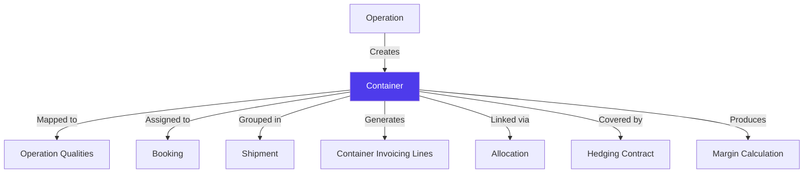
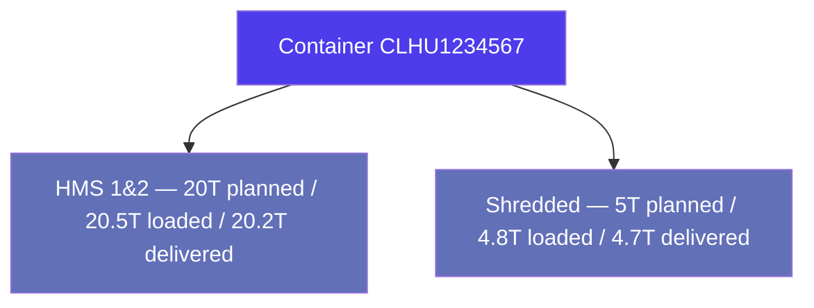
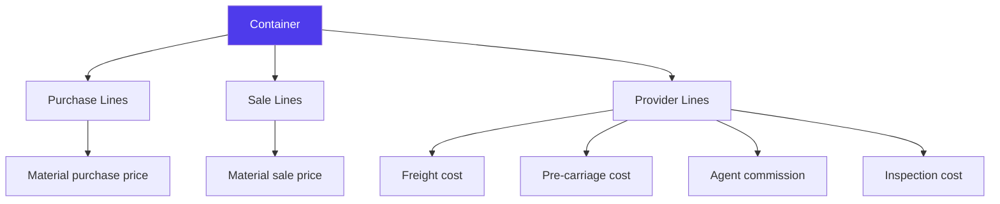
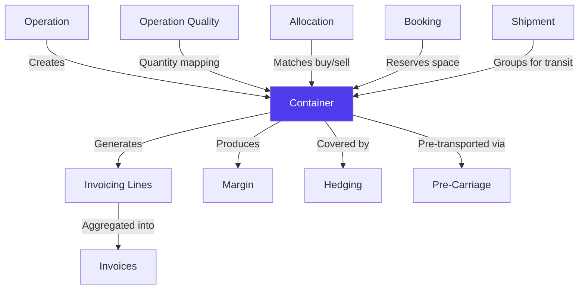

# Containers in Jules

> Product documentation — The container is the physical unit of execution in Jules. Everything flows through it: logistics, invoicing, margin, and tracking.

---

## Table of Contents

1. [Overview](#overview)
2. [Container Lifecycle](#container-lifecycle)
3. [Container Identity & Weights](#container-identity--weights)
4. [Container-to-Quality Mapping](#container-to-quality-mapping)
5. [Booking Status](#booking-status)
6. [Container Invoicing](#container-invoicing)
7. [Container Margin](#container-margin)
8. [Hedging Allocation](#hedging-allocation)
9. [Tracking & Location](#tracking--location)
10. [Container Follow-Up Grouping](#container-follow-up-grouping)
11. [Invoicing Close](#invoicing-close)
12. [Relationships with Other Modules](#relationships-with-other-modules)
13. [Key Business Rules](#key-business-rules)
14. [Glossary](#glossary)

---

## Overview

A **container** in Jules represents a physical shipping unit — typically a 20' or 40' HC steel container — that carries recyclable commodities from a supplier to a customer. Containers sit at the intersection of almost every Jules module: they are created under operations, linked through allocations, grouped into bookings and shipments, invoiced individually, and tracked in real time.



The container is Jules' **unit of execution**. While operations define the commercial terms and allocations connect buy and sell sides, it is the container that physically moves, gets weighed, gets invoiced, and produces a margin.

---

## Container Lifecycle

Every container progresses through a defined follow-up status:


| Status | Meaning | Trigger |
|--------|---------|---------|
| **UNPLANNED** | Container exists but has no loading date | Container created without a date |
| **PLANNED** | Loading date has been set | Loading date assigned |
| **LOADED** | Container has been physically loaded onto a vessel | Weight and BL data recorded |
| **DELIVERED** | Container has arrived at destination | Delivery date and weight confirmed |
| **CLOSED** | All invoicing and documentation complete | Purchase and sale invoicing closed |

### Status transitions

- Statuses progress forward in sequence — you cannot skip from UNPLANNED to LOADED
- A container can be moved backward (e.g., from DELIVERED to LOADED) if corrections are needed
- CLOSED is the terminal state, but containers can be reopened if invoicing needs adjustment

---

## Container Identity & Weights

### Identity fields

| Field | Description |
|-------|-------------|
| **Harold number** | Unique system-generated identifier (e.g., `CTN-2026-001234`) |
| **Reference number** | External container number (e.g., `CLHU1234567`) |
| **Sealed number** | Security seal number applied to the container |
| **BL number** | Bill of Lading number assigned at loading |

### Weight fields

| Field | Description |
|-------|-------------|
| **Gross weight** | Total weight including container tare |
| **Net weight** | Weight of the commodity only |
| **Tare weight** | Weight of the empty container |
| **Weight slip** | Weight recorded at destination (from customer's scale) |
| **Maximum gross weight** | Legal/shipping limit for the container |

Weight is tracked in the operation's volume unit (typically metric tonnes). The difference between **net weight** (loaded) and **weight slip** (delivered) is a key input for credit/debit note calculations.

### Key dates

| Field | Description |
|-------|-------------|
| **Date of loading** | When the container was loaded |
| **Date of delivery** | When the container arrived at destination |
| **ETA** | Estimated time of arrival |
| **Gated-in date** | When the container entered the port terminal |

---

## Container-to-Quality Mapping

A single container can carry **multiple qualities** from the same operation. The `ContainerToOperationQuality` mapping tracks the quantity of each material in the container at different stages:



| Quantity stage | When it is set |
|----------------|----------------|
| **Planned** | At container creation — the intended quantity |
| **Loaded** | At loading — the actual weight measured |
| **Delivered** | At delivery — the weight at destination |

The difference between loaded and delivered quantities drives credit/debit note generation.

---

## Booking Status

Each container tracks its logistics booking progression independently:

| Status | Meaning |
|--------|---------|
| **BOOKING_REQUESTED** | A freight booking has been requested for this container |
| **PC_BOOKED** | Pre-carriage (inland transport) has been confirmed |
| **FREIGHT_BOOKED** | Maritime freight booking has been confirmed |
| **ALL_BOOKED** | Both pre-carriage and freight are confirmed |

A container can only be loaded once it has at least a confirmed freight booking.

---

## Container Invoicing

Every container generates **invoicing lines** — granular cost and revenue entries that feed into invoices. This is the **container invoicing matrix**.



### Invoicing line types

| Type | Description |
|------|-------------|
| **BUY** | Cost of purchasing the material from the supplier |
| **SELL** | Revenue from selling to the customer |
| **PROVIDER** | Third-party costs (freight, pre-carriage, inspection, customs) |

### Cost elements tracked per container

| Category | Elements |
|----------|----------|
| **Logistics** | Freight cost, Cargo bulk cost, Pre-carriage cost, Logistic cost, Transport |
| **Agents** | Agent commission, Buy agent, Sell agent |
| **Quality** | Inspector, Sterile, Declassification |
| **Finance** | Interest, Principal, Advance payment |
| **Adjustments** | Credit note, Debit note, Logistic bill-back |
| **Penalties** | Penalty, Transport empty, Transport quality refused/unvalued |
| **Discounts** | Global discount, Element discount |
| **Other** | Unexpected costs |

### Line status progression

| Status | When |
|--------|------|
| **PLANNED** | At planning stage |
| **LOADED** | When the container is loaded |
| **DELIVERED** | When the container is delivered |
| **CLOSED** | When invoicing is finalized |

Each line also tracks its **invoicing status**: PENDING (not yet on an invoice) or INVOICED (included in a finalized invoice).

---

## Container Margin

Jules calculates margin at the container level:

```
Margin (per tonne) = Sale price/T − Purchase price/T − Logistics cost/T
```

Two margin values are maintained:

| Margin type | Data source | When available |
|-------------|-------------|----------------|
| **Estimated margin** | Contractual prices + estimated logistics costs | From allocation |
| **Final margin** | Actual invoiced amounts | After invoicing close |

The margin is also expressed as a **total** (margin/T × net weight) for each container.

See [Margin Calculations](./margin-calculations-en.mdx) for the full calculation methodology.

---

## Hedging Allocation

Containers can be individually linked to **hedging contracts** via the `ContainerQualityHedging` entity. This tracks which portion of a commodity exchange hedge covers which physical container.

| Field | Description |
|-------|-------------|
| **Hedging contract** | The financial hedge covering this container |
| **Hedged quantity** | How many tonnes of this container are hedged |
| **Quality** | The material grade being hedged |

See [Hedging & Risk Management](./hedging-risk-management-en.mdx) for details on hedging contracts.

---

## Tracking & Location

When a container is part of a shipment, it inherits the shipment's real-time tracking data:

### Location status

| Status | Meaning |
|--------|---------|
| **AT_ORIGIN** | Container is at the loading port |
| **LOADED** | On board the vessel |
| **IN_TRANSIT** | Vessel is sailing |
| **TRANSSHIPMENT** | Container is being transferred between vessels |
| **REACHED_POD** | Arrived at the port of destination |
| **COMPLETED** | Delivery complete |

### Timing status

| Status | Meaning |
|--------|---------|
| **ON_TIME** | Shipment is on schedule |
| **DELAYED** | Shipment is behind schedule |
| **EARLY_ARRIVAL** | Shipment arrived ahead of schedule |

### Key tracking fields

| Field | Description |
|-------|-------------|
| **Current ETA** | Latest estimated time of arrival |
| **Original ETA** | Initial ETA at time of sailing |
| **Days to ETA** | Countdown to arrival |
| **Actual sailing date** | When the vessel departed |
| **Actual arrival at POD** | When the vessel arrived |

See [Logistics & Freight](./logistics-freight-en.mdx) for shipment tracking details.

---

## Container Follow-Up Grouping

Container follow-ups can be grouped by multiple dimensions for dashboard and reporting views:

| Grouping dimension | Use case |
|--------------------|----------|
| **Carrier / Shipping line** | Track volume per carrier |
| **Forwarder** | Monitor forwarder performance |
| **Loading date** | Daily/weekly loading schedule |
| **Delivery date** | Arrival planning |
| **Customer site** | Volume per destination |
| **Supplier site** | Volume per origin |
| **Status** | Pipeline overview |
| **Shipment** | Containers on the same vessel/BL |
| **Material** | Volume by quality grade |

### Month-to-date KPIs

Jules provides real-time container KPIs:

| KPI | Description |
|-----|-------------|
| **Planned** | Containers with a loading date this month |
| **To-plan** | Containers allocated but not yet planned |
| **Total** | All containers for the period |
| **Loaded today** | Containers loaded on the current day |

---

## Invoicing Close

Each container has independent invoicing close controls:

| Flag | Description |
|------|-------------|
| **isPurchaseInvoicingClosed** | Purchase invoicing is finalized — no more buy-side changes |
| **isSaleInvoicingClosed** | Sale invoicing is finalized — no more sell-side changes |
| **isPurchaseInvoicingReopened** | Purchase invoicing was reopened after closing |
| **isSaleInvoicingReopened** | Sale invoicing was reopened after closing |

This allows fine-grained control: a container's purchase invoicing can be closed while its sale invoicing remains open (e.g., waiting for final delivery weight).

---

## Relationships with Other Modules



| Module | Relationship |
|--------|-------------|
| **Operation** | Parent entity — every container belongs to an operation |
| **Operation Quality** | Quantity mapping per material grade (planned/loaded/delivered) |
| **Allocation** | Links buy-side containers to sell-side operations |
| **Booking** | Freight booking that reserves space for the container |
| **Shipment** | Groups containers traveling under the same BL |
| **Invoicing** | Container generates per-line cost/revenue entries |
| **Margin** | Profit calculated per container from invoicing data |
| **Hedging** | Financial hedge coverage per container |
| **Pre-Carriage** | Inland transport from supplier to port |

---

## Key Business Rules

### 1. One operation, multiple containers

An operation can have any number of containers. A 500 T purchase with 40' HC containers (roughly 25 T each) will have approximately 20 containers.

### 2. Weight reconciliation

The weight at loading (net weight) and at delivery (weight slip) often differ due to moisture loss, scale differences, or handling losses. This difference drives credit/debit note adjustments.

### 3. Container numbering

Every container receives a unique **Harold number** from the system. The external **reference number** (the physical container ID like `CLHU1234567`) is tracked separately and is not required at creation.

### 4. Estimated logistics costs

At creation, each container carries **estimated** freight, pre-carriage, and logistic costs derived from the booking's freight rate. These estimates are replaced by actual invoiced amounts as bills are recorded.

### 5. VGM requirement

Before a container can sail, the **Verified Gross Mass (VGM)** must be submitted to the carrier. This is a SOLAS regulation requirement tracked at the container level.

### 6. Container-level ERP sync

Each container's invoicing lines maintain their own ERP synchronization status, independent of the parent invoice's sync status.

### 7. Multi-quality containers

A single container can carry multiple material grades (e.g., 20 T of HMS 1&2 + 5 T of Shredded). Each quality is tracked independently through the container-to-quality mapping.

---

## Glossary

| Term | Definition |
|------|------------|
| **BL (Bill of Lading)** | Transport document identifying the container and its contents |
| **Container invoicing line** | A single cost or revenue entry at the container level |
| **Container invoicing matrix** | The full set of invoicing lines across all containers in an operation |
| **Follow-up status** | The container's lifecycle stage (Unplanned → Planned → Loaded → Delivered → Closed) |
| **Gated-in** | When the container enters the port terminal area |
| **Harold number** | Unique identifier automatically assigned to each container |
| **Invoicing close** | The act of finalizing all invoicing for a container (purchase and/or sale side) |
| **Net weight** | Weight of the commodity only (excluding container tare) |
| **Tare weight** | Weight of the empty container |
| **VGM** | Verified Gross Mass — mandatory weight declaration submitted to the carrier |
| **Weight slip** | Weight recorded at the destination, typically from the customer's scale |
