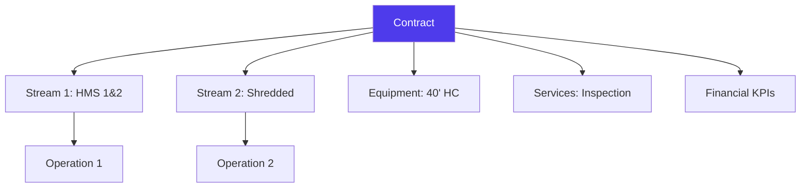
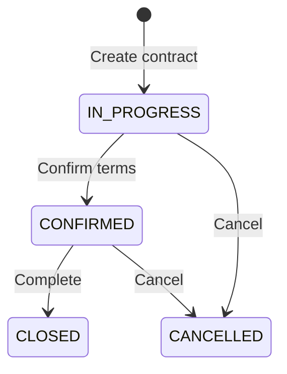
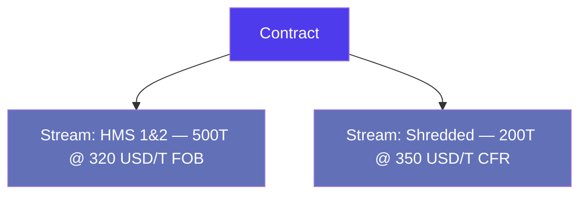
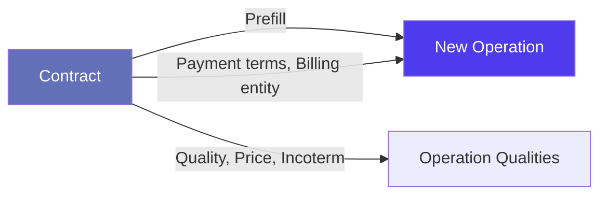

# Contracts & Pricing in Jules

> Product documentation — How Jules structures commercial contracts, quality streams, and pricing models that feed into operations.

---

## Table of Contents

1. [Overview](#overview)
2. [Contract Types](#contract-types)
3. [Contract Lifecycle](#contract-lifecycle)
4. [Quality Streams](#quality-streams)
5. [Pricing Models](#pricing-models)
6. [Equipment & Services](#equipment--services)
7. [Financial KPIs](#financial-kpis)
8. [From Contract to Operation](#from-contract-to-operation)
9. [Key Business Rules](#key-business-rules)
10. [Glossary](#glossary)

---

## Overview

A **contract** in Jules represents a commercial agreement with a counterparty (supplier or customer). It defines the terms under which trading will occur: what materials, at what price, for what period, and under which logistics conditions.

Contracts serve two purposes:
1. **Record keeping** — documenting the agreed terms with a counterparty
2. **Prefilling** — when creating operations, contract terms are automatically applied to save time and ensure consistency



### What makes a contract?

| Dimension | Description |
|-----------|-------------|
| **Direction** | Purchase (BUY) or Sale (SELL) |
| **Company** | The counterparty (supplier or customer) |
| **Site** | The physical location involved |
| **Market type** | Export or Local |
| **Contract type** | Trading, WM Spot, or WM Recurring |
| **Period** | Start date and end date |
| **Streams** | One or more quality lines with pricing |

---

## Contract Types

| Type | Code | Description |
|------|------|-------------|
| **Trading** | `TRADING` | Standard commodity trading contract |
| **WM Spot** | `WM_SPOT` | Waste Management — one-off spot deal |
| **WM Recurring** | `WM_RECURRING` | Waste Management — recurring arrangement |

### Offer Type

Contracts can also be classified by offer type:

| Offer Type | Description |
|------------|-------------|
| **Spot** | One-time deal at current market conditions |
| **Recurring** | Ongoing arrangement with regular shipments |

---

## Contract Lifecycle

Contracts follow a four-status lifecycle similar to operations:



| Status | Meaning |
|--------|---------|
| **IN_PROGRESS** | Contract is being negotiated or drafted |
| **CONFIRMED** | Terms are agreed and locked |
| **CLOSED** | Contract has been fully executed |
| **CANCELLED** | Contract was abandoned |

### Key actions

- **Duplicate** — Create a copy of an existing contract (useful for renewals with minor changes)
- **Share** — Send the contract to the counterparty via email or portal
- **Generate Offer PDF** — Produce a formatted PDF of the contract terms

---

## Quality Streams

A contract contains one or more **streams** (quality lines), each defining the commercial terms for a specific material grade.



### What's in a stream?

| Field | Description |
|-------|-------------|
| **Quality** | The material grade (e.g., HMS 1&2, OCC, LDPE Film) |
| **Quantity** | Contracted volume (in tonnes or other units) |
| **Cost / Price** | The agreed price per unit |
| **Price type** | SPOT (fixed), INDEX (formula-based), or TREATMENT |
| **Incoterm** | Commercial delivery terms (FOB, CFR, CIF, EXW, etc.) |
| **MQC** | Minimum Quality Commitment per container |
| **Equipment** | Container type (e.g., 40' HC) |
| **Payment terms** | Payment conditions |
| **Tolerance rate** | Allowed quantity deviation (e.g., +/- 5%) |
| **Estimated logistic cost** | Expected transportation cost |
| **Temporary price** | Flag indicating the price may change |

---

## Pricing Models

Jules contracts support three pricing models at the stream level:

### 1. Spot Price (Fixed)

A fixed price agreed upfront.

```
Price = 320 USD / T
```

### 2. Index Price (Formula-based)

Price derived from a market reference index.

```
Price = Index Value + adjustments
```

The index reference and formula details are specified on the stream, then carried forward to operations when they are created from the contract.

### 3. Treatment Price

Used in waste management contracts where the pricing reflects a treatment fee rather than a commodity price.

```
Treatment fee = X EUR / T for processing material Y
```

---

## Equipment & Services

Beyond quality streams, contracts can include:

### Equipment

Defined via `ContractToEquipment`, specifying:
- Equipment type (e.g., container type)
- Equipment position
- Equipment price
- Quantity and modalities

### Services

Defined via `ContractToService`, covering additional services like:
- Inspection
- Sorting
- Custom processing

Each has its own pricing, modalities, and terms.

---

## Financial KPIs

For WM (Waste Management) contracts, Jules calculates **financial KPIs** that summarize the contract's performance over a given period:

| KPI | Description |
|-----|-------------|
| **Turnover** | Total revenue generated |
| **Operation Margin** | Margin on core operations |
| **Transport Margin** | Margin on transport services |
| **Equipment Margin** | Margin on equipment services |
| **Service Margin** | Margin on additional services |
| **Recycling Margin** | Margin on recycling activities |
| **Treatment Margin** | Margin on treatment activities |
| **Recycled Tons** | Volume of recycled material |
| **Tons Treated** | Volume of material treated |
| **Truck Turns** | Number of truck rotations |

These KPIs can be filtered by date range for period-specific analysis.

---

## From Contract to Operation

When creating an operation, Jules can **prefill** fields from a contract:



The prefill mechanism copies:
- Company and site
- Quality streams (become operation qualities)
- Pricing (spot, index, or treatment)
- Incoterm and payment terms
- Equipment and logistic material
- MQC and tolerance rates

> **Note**: Contract prefill also works at the company and site level (`CompanyToContractPrefill`, `SiteToContractPrefill`), allowing default contract terms to be configured per trading partner or location.

---

## Key Business Rules

### 1. Contract numbering

Contracts do not have an auto-generated Harold number. They use a **reference number** that can be manually set by the user.

### 2. Multi-stream contracts

A single contract can contain multiple quality streams, each with its own pricing and terms. This is common when a counterparty supplies or buys several material grades.

### 3. Bills (WM contracts)

For Waste Management contracts, **bills** track the actual costs incurred against each stream. A bill records:
- The billed amount vs. the cost amount
- The quantity processed
- Which stream element it relates to (quality, equipment, service, treatment)

Bills can be created individually or in bulk, and cancelled when needed.

### 4. ERP synchronization

Contracts support **push sync** with external ERP systems, allowing contract data to be synchronized bidirectionally.

### 5. Sharing

Contracts can be shared with counterparties via email templates, with the last shared date tracked on the contract.

---

## Glossary

| Term | Definition |
|------|------------|
| **Bill** | A cost record tracking actual amounts billed against a WM contract stream |
| **Contract** | A commercial agreement defining trading terms with a counterparty |
| **Equipment** | Container type and configuration associated with a contract |
| **Financial KPIs** | Performance metrics calculated for WM contracts (margins, volumes) |
| **Index price** | A price derived from a market reference (LME, Platts, etc.) |
| **MQC** | Minimum Quality Commitment — the minimum weight per container |
| **Prefill** | Automatic population of operation fields from contract terms |
| **Service** | An additional service (inspection, sorting) included in a contract |
| **Spot price** | A fixed price agreed at the time of the deal |
| **Stream** | A quality line within a contract, carrying its own commercial terms |
| **Treatment price** | A fee for processing/treating material (common in waste management) |
| **Tolerance rate** | Allowed percentage deviation from contracted quantity |
