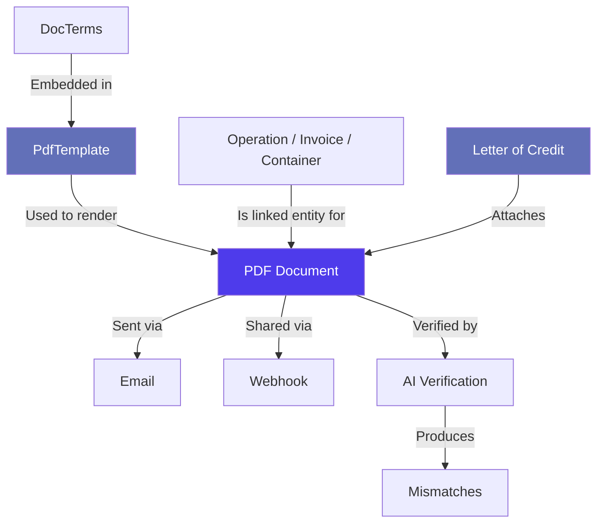
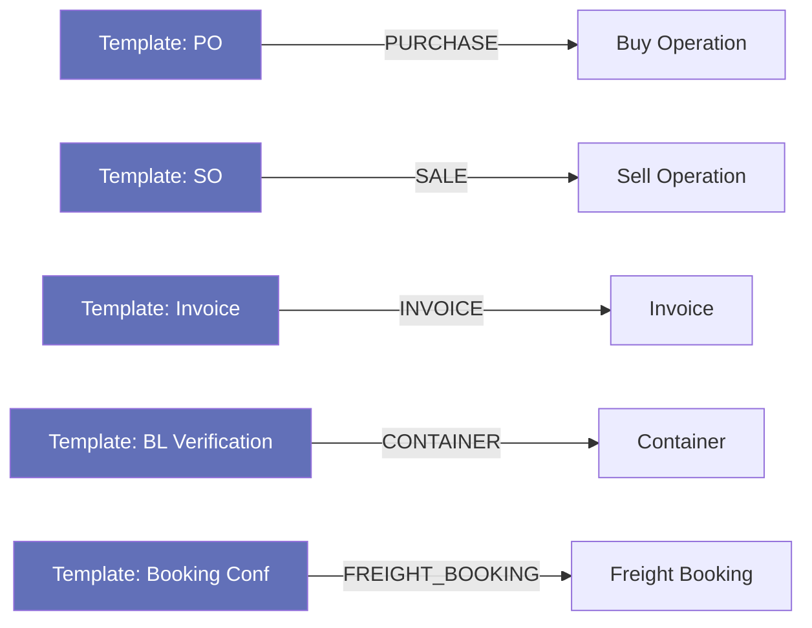
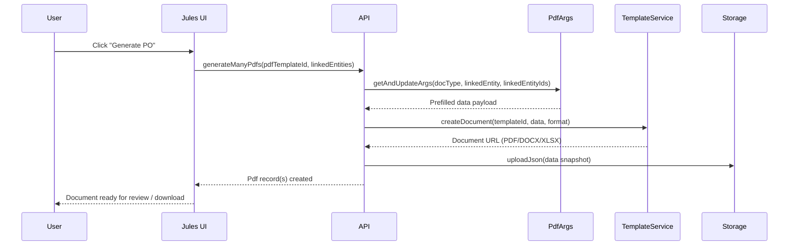
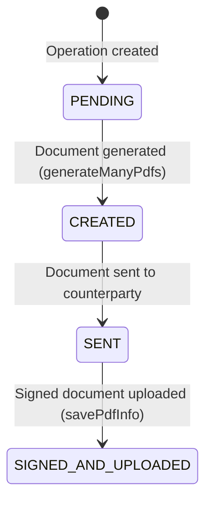
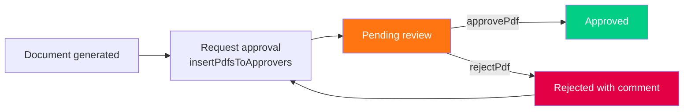
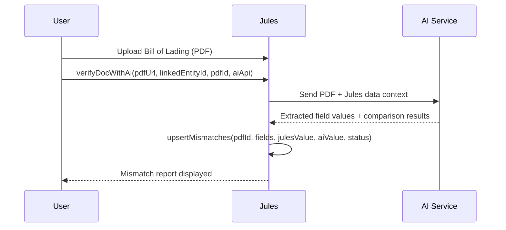
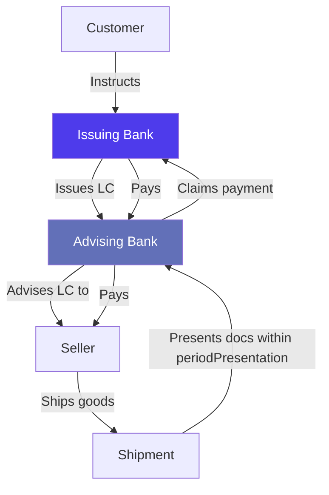
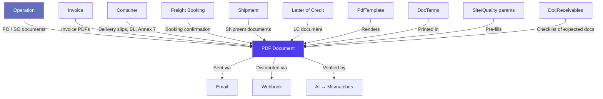

> Product documentation — How Jules generates, stores, and distributes commercial documents (POs, SOs, invoices, and more), manages document templates and legal terms, handles Letter of Credit workflows, and connects with external systems through email and webhooks.

---

## Table of Contents

1. [Overview](#overview)

2. [Document Types (DocType)](#document-types-doctype)

3. [PDF Templates](#pdf-templates)

4. [Document Terms (DocTerm)](#document-terms-docterm)

5. [Site-Level PDF Parameters](#site-level-pdf-parameters)

6. [PDF Generation Workflow](#pdf-generation-workflow)

7. [Uploaded Documents & Manual Upload](#uploaded-documents--manual-upload)

8. [Document Approval Workflow](#document-approval-workflow)

9. [AI Document Verification & Mismatch Detection](#ai-document-verification--mismatch-detection)

10. [Document Receivables (DocReceivables)](#document-receivables-docreceivables)

11. [Letter of Credit](#letter-of-credit)

12. [Email Integration](#email-integration)

13. [Webhook System](#webhook-system)

14. [Relationships with Other Modules](#relationships-with-other-modules)

15. [Key Business Rules](#key-business-rules)

16. [Glossary](#glossary)

---

## Overview

Jules has a complete document management layer that covers the full lifecycle of commercial paperwork — from **generating** a Purchase Order the moment a deal is confirmed, to **distributing** it to a counterparty by email, to **verifying** a Bill of Lading uploaded by the supplier against Jules data using AI.

The document system is built on four interconnected concepts:

| Concept          | Description                                                                        |
| ---------------- | ---------------------------------------------------------------------------------- |
| **PDF**          | An individual document record — either generated by Jules or uploaded manually     |
| **PdfTemplate**  | A reusable configuration that defines how a document is rendered                   |
| **DocType**      | The category of a document (Purchase Order, Invoice, Bill of Lading, etc.)         |
| **LinkedEntity** | The Jules object the document is attached to (operation, invoice, container, etc.) |



---

## Document Types (DocType)

Every document in Jules belongs to a **DocType** — a fixed category that determines its purpose, how it is rendered, and which entities it can be attached to.

| DocType                        | Description                                          | Typical linked entity |
| ------------------------------ | ---------------------------------------------------- | --------------------- |
| `PURCHASE_ORDER`               | Sent to a supplier to confirm a purchase             | Operation (BUY)       |
| `SALES_ORDER`                  | Sent to a customer to confirm a sale                 | Operation (SELL)      |
| `CUSTOMER_INVOICE`             | Invoice issued to a customer                         | Invoice               |
| `SUPPLIER_INVOICE`             | Invoice received from a supplier                     | Invoice               |
| `CUSTOM_INVOICE`               | Custom invoice format                                | Invoice               |
| `INVOICE_PROFORMA`             | Pro-forma invoice before final pricing               | Invoice               |
| `BOOKING_CONFIRMATION`         | Freight booking confirmation sent to shipper         | Freight Booking       |
| `FREIGHT_BOOKING_REQUEST`      | Request for freight booking sent to a forwarder      | Freight Booking       |
| `PRE_CARRIAGE_BOOKING_REQUEST` | Booking request for pre-carriage transport           | Pre-Carriage Booking  |
| `DELIVERY_ORDER`               | Authorization to release cargo at destination        | Container             |
| `DELIVERY_SLIP`                | Proof of delivery at destination                     | Container             |
| `DELIVERY_REPORT`              | Condition report at delivery                         | Container             |
| `LOAD_REPORT`                  | Loading condition and weight report                  | Container             |
| `LOADING_SLIP`                 | Document confirming goods loaded                     | Container             |
| `ANNEX_7`                      | EU cross-border waste transfer document              | Container             |
| `CTN_ANNEX_7`                  | Container-level Annex 7                              | Container             |
| `ISO_REPORT`                   | ISO quality report                                   | Container             |
| `RECOVERY_CERTIFICATE`         | Certificate confirming material recovery             | Container             |
| `RECOVERY_NOTE`                | Recovery note for waste materials                    | Container             |
| `CONTRACT_OFFER`               | Document version of an offer sent to a counterparty  | Offer                 |
| `SHARED_OFFER`                 | Offer document shared with a counterparty via portal | Offer                 |
| `SUPPLIER_INVOICE`             | Bill received from a provider                        | Invoice               |
| `OTHER`                        | Catch-all for miscellaneous attachments              | Any                   |

> **Note**: `RECOVERY_CERTIFICATE_EXCEL` is generated client-side in the front-end and is not processed through the backend generation pipeline.

---

## PDF Templates

A **PdfTemplate** is the configuration record that tells Jules *how* to render a document. Templates decouple the rendering logic from individual documents, so the same template can be reused across hundreds of operations.

### Template fields

| Field                              | Description                                                                           |
| ---------------------------------- | ------------------------------------------------------------------------------------- |
| `templateId`                       | The ID of the underlying rendering template (used by the document generation service) |
| `docType`                          | The document type this template produces                                              |
| `docTypeName`                      | A human-readable label for the document type                                          |
| `linkedEntity`                     | Which entity type this template applies to (e.g., `PURCHASE`, `SALE`, `INVOICE`)      |
| `defaultFormat`                    | The default output format: `PDF`, `DOCX`, or `XLSX`                                   |
| `isDefault`                        | Whether this is the default template for its DocType + LinkedEntity combination       |
| `isPublic`                         | Whether this template is available to external/portal users                           |
| `statuses`                         | A list of document statuses that get assigned when the document is created            |
| `priorityConfig`                   | JSON configuration for template selection priority logic                              |
| `shouldCheckInvoiceBeforeGenerate` | When true, validates invoice data before generating the document                      |
| `aiApi`                            | Which AI verification pipeline to use (`BL_VERIFICATION` or `LC_VERIFICATION`)        |
| `receivables`                      | Which portal entity types can receive this document                                   |
| `description`                      | Optional human-readable description                                                   |

### Supported output formats

| Format | Use case                                                          |
| ------ | ----------------------------------------------------------------- |
| `PDF`  | Standard commercial documents, delivery slips, invoices           |
| `DOCX` | Editable Word documents for counterparties who need to redline    |
| `XLSX` | Spreadsheet-based reports (recovery certificates, weight reports) |

### Template scope by entity

Templates are scoped to a `LinkedEntityEnum` value, which controls which object type can use them:



All templates are fetched via `filteredPdfTemplates` with filters for `linkedEntity`, `docType`, and `isDefault`. The `pdfTemplatesChoices` query returns a dropdown-friendly list for the UI.

---

## Document Terms (DocTerm)

**DocTerms** are the legal boilerplate paragraphs embedded in commercial documents — the standard terms and conditions, payment clauses, and legal notices printed at the bottom of POs, SOs, and invoices.

| Field      | Description                                               |
| ---------- | --------------------------------------------------------- |
| `value`    | Short identifier or key for the term                      |
| `title`    | Display title of the clause                               |
| `content`  | Full text of the legal clause                             |
| `type`     | Category of the term (e.g., payment, delivery, liability) |
| `order`    | Display order within the document                         |
| `tag`      | Optional grouping tag                                     |
| `docTypes` | Which document types include this term                    |

DocTerms can be filtered by `docType` and `billingEntity`, allowing organizations that operate under multiple billing entities to maintain distinct sets of legal terms per entity. Terms are updated via `updateDocTerm`.

---

## Site-Level PDF Parameters

When a user opens the document generation dialog for a purchase or sale operation, Jules pre-fills several fields from site-level configuration — the **PoSoParams**. These defaults are stored per site and per quality, and are fetched by the `getPoSoParams` query.

| Field               | Description                                               |
| ------------------- | --------------------------------------------------------- |
| `paymentTerms`      | Default payment terms for this site                       |
| `loadingSchedule`   | Expected loading schedule text                            |
| `portOfDestination` | Default destination port for this site                    |
| `origin`            | Country or region of origin                               |
| `conditionning`     | Packaging / conditioning description                      |
| `blComment`         | Default comment to appear on Bill of Lading               |
| `docGeneralComment` | General comment printed on the document                   |
| `docs`              | Required document checklist (e.g., BL, packing list, COA) |
| `logisticMaterial`  | Default equipment type                                    |

These parameters reduce repetitive data entry when generating routine POs and SOs.

---

## PDF Generation Workflow

### How a document is generated



### Generation steps in detail

1. **Template selection**: The user selects (or Jules auto-selects) a `PdfTemplate` for the document type.

2. **Argument pre-fill** (`pdfArgs`): Jules fetches and pre-fills the data payload for the template — operation details, quality lines, counterparty information, site parameters, and legal terms. The user can review and override fields in the UI.

3. **Document creation**: Jules calls the document generation service with the template ID, data payload, and output format. The service renders the document and returns a storage URL.

4. **JSON snapshot**: A JSON copy of the data used to render the document is stored alongside the PDF, for audit purposes.

5. **PDF record creation**: A `Pdf` record is created in Jules linking the document URL to the entity (operation, invoice, container, etc.) with the appropriate status.

### Batch and aggregate generation

Jules supports **batch generation** — generating the same document for multiple entities in a single call. For example, generating delivery slips for all containers in a shipment at once.

It also supports **aggregate generation** (`shouldGenerateAggregatePdf: true`), which combines data from multiple entities into a single consolidated document. This is useful for multi-container shipment summaries.

### Supported entities for generation

| LinkedEntity           | Supported                                   |
| ---------------------- | ------------------------------------------- |
| `PURCHASE`             | Yes — Purchase Orders                       |
| `SALE`                 | Yes — Sales Orders                          |
| `INVOICE`              | Yes — Customer and supplier invoices        |
| `CONTAINER`            | Yes — Delivery slips, load reports, Annex 7 |
| `SHIPMENT`             | Yes — Shipment-level documents              |
| `FREIGHT_BOOKING`      | Yes — Booking confirmations                 |
| `PRE_CARRIAGE_BOOKING` | Yes — Pre-carriage requests                 |
| `OFFER`                | Yes — Contract offers, shared offers        |
| `OPERATION_QUALITY`    | Yes — Quality-level documents               |
| `TRUCK`                | Yes — Truck-level delivery documents        |
| `REPORTS_LIST`         | Yes — Aggregate reports                     |

### Asynchronous generation

For large-scale generation (e.g., generating documents for all containers in a shipment), Jules uses `generateEntityDocs`, which pushes a job to the **RabbitMQ worker queue** (`generateEntityDocs` queue). The generation happens asynchronously in the background, so the user's session is not blocked.

---

## Uploaded Documents & Manual Upload

Not all documents are generated by Jules. Counterparties send back signed POs, Bills of Lading, weight certificates, and other documents that must be stored in Jules.

The `savePdfInfo` mutation handles manual uploads:

| Field            | Description                                         |
| ---------------- | --------------------------------------------------- |
| `docType`        | The type of document being uploaded                 |
| `docTypeName`    | Optional display name override                      |
| `linkedEntity`   | The entity type this document belongs to            |
| `linkedEntityId` | The specific entity (operation, invoice, container) |
| `url`            | The storage URL of the uploaded file                |
| `name`           | Display name for the document                       |
| `status`         | Document status at upload time                      |
| `uid`            | Firebase UID of the uploaded file                   |

### PO/SO status auto-update on upload

When a signed document is uploaded back into Jules:

- Uploading a `PURCHASE_ORDER` automatically updates the parent operation's `poStatus` to `SIGNED_AND_UPLOADED`

- Uploading a `SALES_ORDER` automatically updates the parent operation's `soStatus` to `SIGNED_AND_UPLOADED`

This tracks the commercial document lifecycle without any manual status update.

### PO/SO document lifecycle



| Status                    | Meaning                                 |
| ------------------------- | --------------------------------------- |
| **PENDING**               | Document not yet created                |
| **CREATED**               | Document generated as PDF/DOCX in Jules |
| **SENT**                  | Document sent to the counterparty       |
| **SIGNED\_AND\_UPLOADED** | Signed document uploaded back to Jules  |

### Merging documents

Multiple PDF documents can be merged into a single file using the `mergePdfs` mutation. Jules calls the document service to combine the files (in the exact order of IDs provided) and creates a new `Pdf` record of type `MERGED_DOCUMENTS` linked to the same entities.

### Marking documents complete

`markAllAsComplete` flags all documents attached to an entity as complete in a single operation. Useful when finalizing a shipment where multiple documents have been collected.

---

## Document Approval Workflow

Some documents require internal review before being shared externally. Jules supports a structured **approval workflow** on PDFs.



### How it works

1. After generating a document, a user submits it for approval with `insertPdfsToApprovers`, specifying which users should review it. An optional `requestComment` can be included.

2. Reviewers are notified (via RabbitMQ `sendNotification` queue, trigger `ON_REQUEST_FOR_DOCUMENT_APPROVAL`).

3. Each approver can either `approvePdf` or `rejectPdf` (with a `rejectComment` explaining the issue).

4. The `reviewStatus` field reflects the outcome: `PENDING`, `APPROVED`, or `REJECTED`.

5. When the review is complete, a `ON_DOCUMENT_REVIEWED` notification is sent.

### Approval-related fields on a PDF

| Field                 | Description                                                             |
| --------------------- | ----------------------------------------------------------------------- |
| `isApprovable`        | Whether the current user can approve/reject this document               |
| `reviewStatus`        | `PENDING`, `APPROVED`, or `REJECTED`                                    |
| `verificationStatus`  | Overall verification progress: `PENDING`, `IN_PROGRESS`, or `COMPLETED` |
| `requestedBy`         | User who requested the approval                                         |
| `requestComment`      | Comment added when requesting approval                                  |
| `lastReviewedBy`      | User who last approved or rejected                                      |
| `lastReviewedAt`      | Timestamp of the last review action                                     |
| `rejectComment`       | Reason for rejection                                                    |
| `approvalRequestedAt` | When approval was first requested                                       |

---

## AI Document Verification & Mismatch Detection

Jules includes an **AI-powered document verification** capability that compares uploaded documents against the data stored in Jules, highlighting discrepancies.

This is currently used for two verification types:

| AI API            | Use case                                                       |
| ----------------- | -------------------------------------------------------------- |
| `BL_VERIFICATION` | Verifying a Bill of Lading against shipment and container data |
| `LC_VERIFICATION` | Verifying a Letter of Credit against operation terms           |

### How AI verification works



### The Mismatch record

Each detected discrepancy is stored as a `Mismatch`:

| Field             | Description                                                                  |
| ----------------- | ---------------------------------------------------------------------------- |
| `pdfId`           | The document that was verified                                               |
| `aiKey`           | The field name that was checked (e.g., `portOfLoading`, `containerNumber`)   |
| `julesValue`      | The value Jules has on record                                                |
| `aiValue`         | The value extracted by the AI from the document                              |
| `status`          | `APPROVED` (the discrepancy is accepted) or `REJECTED` (flagged as an error) |
| `issueText`       | Human-readable description of the issue                                      |
| `improvementText` | AI-generated suggestion for resolution                                       |

### Reviewer actions on mismatches

Reviewers can:

- **Approve** a mismatch (`status: APPROVED`) — acknowledging the discrepancy as acceptable

- **Reject** a mismatch (`status: REJECTED`) — flagging it as a genuine error requiring correction

- **Update** a mismatch — adding issue text, improvement suggestions, or correcting the Jules value

This workflow gives trade operations teams a structured way to review and sign off on incoming shipping documents before funds are released or goods cleared.

---

## Document Receivables (DocReceivables)

**DocReceivables** defines which documents a counterparty (supplier or customer) is expected to provide for a given document type. It is a configuration table that maps `associatedObjectType` + `docType` combinations to required receivable items.

This is used to power the **document checklist** feature — showing operations teams which documents they are still waiting to receive from a counterparty, for example:

- Bill of Lading from the shipping line

- Weight certificate from the inspection company

- Phytosanitary certificate from the supplier

The `getByDocTypeAndAssociatedObjects` query is used internally to look up what documents are expected for a given entity type and document category.

---

## Letter of Credit

A **Letter of Credit (LC)** is a bank-issued financial guarantee commonly used in international commodity trade to ensure payment upon presentation of shipping documents.

Jules models Letters of Credit as first-class entities that can be created, managed, and linked to operations — particularly export sales where the buyer's bank issues an LC as payment security.

### Letter of Credit fields

| Field                     | Description                                                          |
| ------------------------- | -------------------------------------------------------------------- |
| `lcNumber`                | The reference number of the LC                                       |
| `type`                    | LC type (e.g., irrevocable, confirmed, standby)                      |
| `status`                  | Current status of the LC                                             |
| `lcAmount`                | The monetary value covered by the LC (with currency)                 |
| `dateOfIssue`             | Date the LC was issued                                               |
| `etd`                     | Estimated time of departure of the shipment                          |
| `endDate`                 | Expiry date of the LC                                                |
| `periodPresentation`      | Number of days after shipment to present documents                   |
| `paymentClause`           | Payment terms embedded in the LC                                     |
| `detailsOfCharges`        | Which party bears banking charges (e.g., all charges to beneficiary) |
| `incotermOnDocument`      | The incoterm as stated on the LC                                     |
| `freeTime`                | Free days allowed at destination port                                |
| `freeTimeConditions`      | Conditions governing the free time                                   |
| `comment`                 | Internal notes about the LC                                          |
| `bankOfIssue`             | Name of the issuing bank (buyer's bank)                              |
| `bankOfAdvising`          | Name of the advising bank (seller's bank)                            |
| `bankOfConfirming`        | Name of the confirming bank (if LC is confirmed)                     |
| `refNumberOfIssuingBank`  | Reference number at the issuing bank                                 |
| `refNumberOfAdvisingBank` | Reference number at the advising bank                                |
| `issuingBankAccount`      | Bank account record for the issuing bank                             |
| `advisingBankAccount`     | Bank account record for the advising bank                            |
| `costBankAccount`         | Bank account for banking cost charges                                |
| `revenueBankAccount`      | Bank account where payment is received                               |
| `billingEntity`           | The Jules billing entity associated with this LC                     |
| `authorizedShippingLines` | Shipping lines explicitly permitted under the LC                     |
| `restrictedShippingLines` | Shipping lines explicitly prohibited under the LC                    |

### LC and operations

An LC is typically attached to an export sale operation. The LC covers the payment obligation for that shipment — the customer's bank commits to paying once the seller presents the required documents (BL, invoice, packing list, etc.) within the `periodPresentation` window.



### AI verification for LCs

When the `aiApi` field on the linked `PdfTemplate` is set to `LC_VERIFICATION`, Jules can use AI to verify an uploaded LC document against the terms recorded in Jules — checking that the bank-issued document matches what was agreed. Discrepancies are surfaced as `Mismatch` records (see [AI Document Verification](#ai-document-verification--mismatch-detection)).

---

## Email Integration

Jules has a built-in email integration that allows users to send commercial documents directly from the platform. Sent emails are stored as `Email` records linked to their parent entity.

### Sending an email

The `sendEmail` mutation accepts:

| Field             | Description                                                          |
| ----------------- | -------------------------------------------------------------------- |
| `to`              | Recipients (email + optional display name)                           |
| `cc`              | CC recipients                                                        |
| `bcc`             | BCC recipients                                                       |
| `from`            | Sender address (must be an authorized sending address)               |
| `subject`         | Email subject line                                                   |
| `body`            | Email body (HTML supported)                                          |
| `linkedEntity`    | The entity type the email is associated with                         |
| `linkedEntityIds` | The specific entity IDs (can be multiple, e.g., multiple containers) |
| `pdfIds`          | Jules PDF records to attach to the email                             |
| `fileIds`         | Additional file IDs (non-PDF attachments)                            |
| `token`           | Authentication token for the sending integration                     |
| `threadId`        | ID of an existing email thread to reply into                         |

### Email storage

Each sent email is stored as an `Email` record with:

- Full header information (to, from, cc, bcc)

- Subject and body

- Links to the attached `Pdf` records

- Reference to the linked Jules entity

Emails are queryable via `filteredEmails` filtered by `linkedEntity` + `linkedEntityIds`, allowing the activity feed of an operation or invoice to display the full communication history.

### Permission model

The `EMAILS` resource is governed by Permit.io:

- `SEND` — controlled at the linked entity level (users can only send from entities they have access to)

- `VIEW` — can view sent emails for accessible entities

---

## Webhook System

Jules provides a **webhook system** that automates the distribution of data and documents to external recipients when specific events occur. Webhooks are pre-configured notification channels, typically used to:

- Share operation summaries with counterparties or internal stakeholders

- Notify logistics partners when containers are ready to ship

- Push shipment data to external systems

- Share invoices with finance teams

### Webhook triggers

| Trigger               | When it fires                                   |
| --------------------- | ----------------------------------------------- |
| `ON_SHARE_OPERATION`  | When an operation is shared with a counterparty |
| `ON_SHARE_CONTAINERS` | When container data is shared                   |
| `ON_SHARE_SHIPMENTS`  | When a shipment summary is shared               |
| `ON_SHARE_OFFER`      | When an offer is shared externally              |
| `ON_SHARE_INVOICE`    | When an invoice is shared                       |
| `ON_SHARE_BOOKINGS`   | When freight booking data is shared             |

### Webhook fields

| Field            | Description                                           |
| ---------------- | ----------------------------------------------------- |
| `trigger`        | The event that activates this webhook                 |
| `medium`         | Delivery channel — `EXTERNAL` for outbound webhooks   |
| `value`          | The webhook endpoint or destination                   |
| `title`          | Human-readable name for the webhook configuration     |
| `templateId`     | ID of the message template used to format the payload |
| `templateString` | Raw template string (alternative to templateId)       |
| `to`             | Contact records who receive this webhook              |
| `receipients`    | Raw email/contact list                                |
| `cc`             | CC recipients                                         |
| `disableAutoCC`  | Whether to suppress automatic CC behavior             |
| `dateOfLastSent` | Timestamp of the last successful dispatch             |

### Running a webhook manually

In addition to automatic triggers, users can manually fire a webhook for an operation using `runOperationWebhook`:

```
runOperationWebhook(operationId, webhookId, type)
```

This is useful for re-sending a notification, or sending to a new recipient who joined after the original send.

### Associating webhooks with operations

The `upsertWebhookToOperation` mutation creates a persistent link between a webhook configuration and an operation, so that future events on the operation automatically use the configured webhook.

### External webhook choices

Before sending, Jules builds a filtered list of applicable webhook configurations for the user via `externalWebhookChoices`. This query:

1. Fetches all `EXTERNAL` webhooks matching the trigger type

2. Enriches them with entity-specific data (e.g., container details for `ON_SHARE_CONTAINERS`)

3. Returns a dropdown-ready list with pre-populated recipient suggestions

```mermaid
flowchart LR
    USER[User clicks "Share"] --> CHOICES[externalWebhookChoices]
    CHOICES --> FILTER[Filter by trigger + entity]
    FILTER --> ENRICH[Enrich with entity data]
    ENRICH --> DROPDOWN[Rendered in UI as choices]
    DROPDOWN -->|User selects| RUN[runOperationWebhook]
    RUN -->|Dispatches| EXTERNAL[External recipient]

    style RUN fill:#4E3BEB,color:white
    style EXTERNAL fill:#03CE85,color:white
```

---

## Relationships with Other Modules

The document and integration layer connects to virtually every other Jules module:



| Module               | Relationship to documents                                                      |
| -------------------- | ------------------------------------------------------------------------------ |
| **Operation**        | Source of PO and SO documents; `poStatus` / `soStatus` track document progress |
| **Invoice**          | Source of customer and supplier invoice PDFs                                   |
| **Container**        | Source of delivery slips, load reports, Annex 7                                |
| **Freight Booking**  | Source of booking confirmation documents                                       |
| **Shipment**         | Source of shipment-level documents                                             |
| **Letter of Credit** | Carries LC details; LC document can be verified with AI                        |
| **Email**            | Distribution channel for generated documents                                   |
| **Webhook**          | Automated distribution to external systems and contacts                        |
| **PdfTemplate**      | Configuration that drives document rendering                                   |
| **DocTerm**          | Legal clauses embedded in generated documents                                  |
| **Site / Quality**   | Default parameters pre-filled into document generation dialogs                 |
| **DocReceivables**   | Defines which documents are expected from a counterparty                       |
| **Portal**           | Documents can be shared on the counterparty portal via `sharedOnPortal`        |

---

## Key Business Rules

### 1. Template selection priority

When multiple templates exist for the same `docType` + `linkedEntity` combination, Jules uses the `priorityConfig` field to determine which template to use. The `isDefault` flag marks the fallback template for cases where no priority rule matches.

### 2. Signed document upload auto-updates operation status

When a user uploads a signed PO back into Jules (`savePdfInfo` with `docType: PURCHASE_ORDER`), Jules automatically advances the operation's `poStatus` to `SIGNED_AND_UPLOADED`. The same applies for `SALES_ORDER` → `soStatus`. This keeps the document lifecycle in sync with the operation status without manual updates.

### 3. Documents notify via worker queue

All document upload events (manual uploads, approval requests, approval decisions) fire asynchronous notifications through the RabbitMQ worker queue. This means document-related notifications (e.g., "Your document has been approved") are delivered without blocking the API response.

### 4. AI verification is non-destructive

Mismatch records produced by AI verification are proposals, not automatic corrections. A human reviewer must explicitly approve or reject each mismatch. Jules never auto-corrects data based on AI output — the AI highlights discrepancies, the user decides.

### 5. Webhooks respect operation type

When running `runOperationWebhook`, the `type` parameter (BUY or SELL) controls which version of the data is sent. This is important because an allocation links a purchase and a sale — the webhook must know which side to represent to the external recipient.

### 6. Email threads are preserved

Emails sent from Jules can be associated with an existing `threadId`, allowing replies to be grouped in the email client. This is important when multiple emails are sent about the same shipment — they appear as a conversation thread, not isolated messages.

### 7. Public templates are accessible to portal users

Templates flagged `isPublic: true` are accessible to external counterparty users on the Jules portal. This allows, for example, a supplier to download their delivery slip directly from the portal, without needing a full Jules account.

### 8. Letter of Credit shipping line restrictions are enforced at the booking stage

The `authorizedShippingLines` and `restrictedShippingLines` fields on an LC carry commercial restrictions from the buyer's bank. Operations teams use these to ensure the freight booking uses a compliant carrier, since using a restricted shipping line could result in the bank refusing to honor the LC.

### 9. PDF merging preserves document order

When using `mergePdfs`, Jules strictly respects the order of `ids` provided. The final merged document presents pages in the exact sequence requested — typically: BL first, then packing list, then invoice, etc. — matching the order required by the bank for LC presentation.

### 10. DocReceivables vs uploaded PDFs

`DocReceivables` tracks what documents are **expected** from a counterparty. Actual received documents are stored as `isUploaded: true` PDF records. Together, these two tables power the "documents pending" checklist visible on an operation — showing what has been received and what is still outstanding.

---

## Glossary

| Term                       | Definition                                                                                                    |
| -------------------------- | ------------------------------------------------------------------------------------------------------------- |
| **Advising bank**          | The seller's bank that transmits the LC and advises the beneficiary of its terms                              |
| **AI verification**        | Automated comparison of an uploaded document against Jules data using an AI extraction service                |
| **Annex 7**                | EU regulatory document required for cross-border shipments of waste materials                                 |
| **Confirming bank**        | An additional bank that adds its own payment guarantee to an LC, reducing the beneficiary's risk              |
| **DocReceivables**         | Configuration table defining which documents are expected from a counterparty                                 |
| **DocTerm**                | A legal clause or standard term embedded in generated commercial documents                                    |
| **DocType**                | The category of a document (PO, SO, Invoice, BL, etc.)                                                        |
| **Issuing bank**           | The buyer's bank that issues the Letter of Credit                                                             |
| **LC (Letter of Credit)**  | A bank-issued instrument guaranteeing payment to the seller upon presentation of compliant shipping documents |
| **LinkedEntity**           | The Jules entity type (operation, invoice, container, etc.) that a document is attached to                    |
| **Mismatch**               | A discrepancy detected by AI between a document's content and Jules data                                      |
| **Pdf**                    | A document record in Jules — either generated by the system or manually uploaded                              |
| **PdfArgs**                | The pre-filled data payload used to render a document from a template                                         |
| **PdfTemplate**            | A reusable configuration defining how a document type is rendered                                             |
| **Period of presentation** | The number of days after shipment within which documents must be presented to the bank under an LC            |
| **PO (Purchase Order)**    | Document sent to a supplier confirming the terms of a purchase                                                |
| **poStatus / soStatus**    | Lifecycle status of the PO or SO document: PENDING → CREATED → SENT → SIGNED\_AND\_UPLOADED                   |
| **ReviewStatus**           | The outcome of a document approval workflow: PENDING, APPROVED, or REJECTED                                   |
| **SO (Sales Order)**       | Document sent to a customer confirming the terms of a sale                                                    |
| **VerificationStatus**     | The progress of a document verification process: PENDING, IN\_PROGRESS, or COMPLETED                          |
| **Webhook**                | A pre-configured notification channel that dispatches data to external recipients when a trigger event fires  |
| **WebhookToOperation**     | A persistent link associating a webhook configuration with a specific operation                               |

