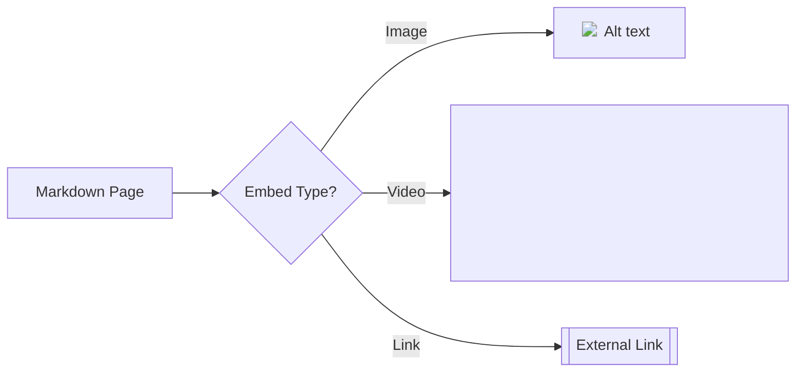

## Overview

MineHub provides essential tools to manage your project documentation efficiently. You collaborate in real-time, track changes with version history, organize content effectively, embed rich media, and export in multiple formats. These features help teams maintain up-to-date docs without complexity.

<Callout kind="info">
MineHub focuses on simplicity. Start with basic pages and scale to advanced workflows as your projects grow.
</Callout>

## Key Features Overview

<Columns cols={3}>
  <Card title="Collaborative Editing" icon="users" href="#collaborative-editing">
    Edit documents together with real-time updates and comments.
  </Card>
  <Card title="Version History" icon="git-branch" href="#version-history">
    Track changes and rollback to previous versions easily.
  </Card>
  <Card title="Search & Organization" icon="search" href="#search-organization">
    Find content quickly and structure your docs logically.
  </Card>
</Columns>

<Columns cols={2}>
  <Card title="Embedding Media" icon="image" href="#embedding-media">
    Add images, videos, and links seamlessly.
  </Card>
  <Card title="Exporting Docs" icon="download" href="#exporting">
    Export to PDF, HTML, or Markdown for sharing.
  </Card>
</Columns>

## Collaborative Editing and Real-Time Updates

Invite team members to edit pages simultaneously. Changes appear instantly, reducing coordination overhead. Use `@mentions` to notify contributors and resolve comments inline.

<Tabs>
  <Tab title="Web Editor" icon="globe">
    Access the full-featured editor in your browser.
  </Tab>
  <Tab title="Mobile App" icon="smartphone">
    Edit on the go with the MineHub mobile app.
  </Tab>
</Tabs>

<CodeGroup tabs="Markdown,Rich Text">
  ```markdown
  # Welcome to MineHub
  Collaborate with your team using `@username` mentions.
  ```
  ```html
  <h1>Welcome to MineHub</h1>
  <p>Collaborate with your team using @username mentions.</p>
  ```
</CodeGroup>

## Version History and Rollback

Every edit creates a new version automatically. View diffs, compare changes, and restore previous states with one click.

<Steps>
  <Step title="View History" icon="clock">
    Click the history icon on any page.
  </Step>
  <Step title="Compare Versions" icon="git-compare">
    Select two versions to see side-by-side diffs.
  </Step>
  <Step title="Rollback" icon="refresh-cw">
    Restore a version and add a note for the team.
  </Step>
</Steps>

<Callout kind="tip">
Always add descriptive commit messages to help your team understand changes.
</Callout>

## Search and Organization Tools

Powerful search indexes all content. Organize with folders, tags, and table of contents. Filter by tags or date for quick access.

| Feature | Description | Use Case |
|---------|-------------|----------|
| Full-Text Search | Searches titles, body, and tags | Finding specific topics |
| Tag Filtering | Apply and filter by custom tags | Categorizing docs |
| Folders | Nested structure for projects | Organizing large spaces |

## Embedding Media and Links

Embed images, videos, and iframes directly in pages. Supported formats include PNG, MP4, YouTube, and external links.

<Expandable title="Advanced Embedding Options" default-open="false">
Use relative paths for internal assets or full URLs for external media. MineHub optimizes images automatically for faster loading.
</Expandable>



## Exporting Documentation

Export entire spaces or single pages to various formats. Share static versions offline or integrate with other tools.

<CodeGroup tabs="PDF,Markdown,HTML">
  ```bash
  # Export via CLI
  minehub export --space=my-docs --format=pdf output.pdf
  ```
  ```bash
  # Export Markdown bundle
  minehub export --space=my-docs --format=md ./exports/
  ```
  ```bash
  # HTML for web hosting
  minehub export --space=my-docs --format=html ./static-site/
  ```
</CodeGroup>

<Columns cols={2}>
  <Card title="Get Started" icon="rocket" href="/quickstart">
    Follow the quickstart guide.
  </Card>
  <Card title="Advanced Workflows" icon="settings" href="/configuration">
    Customize exports and integrations.
  </Card>
</Columns>