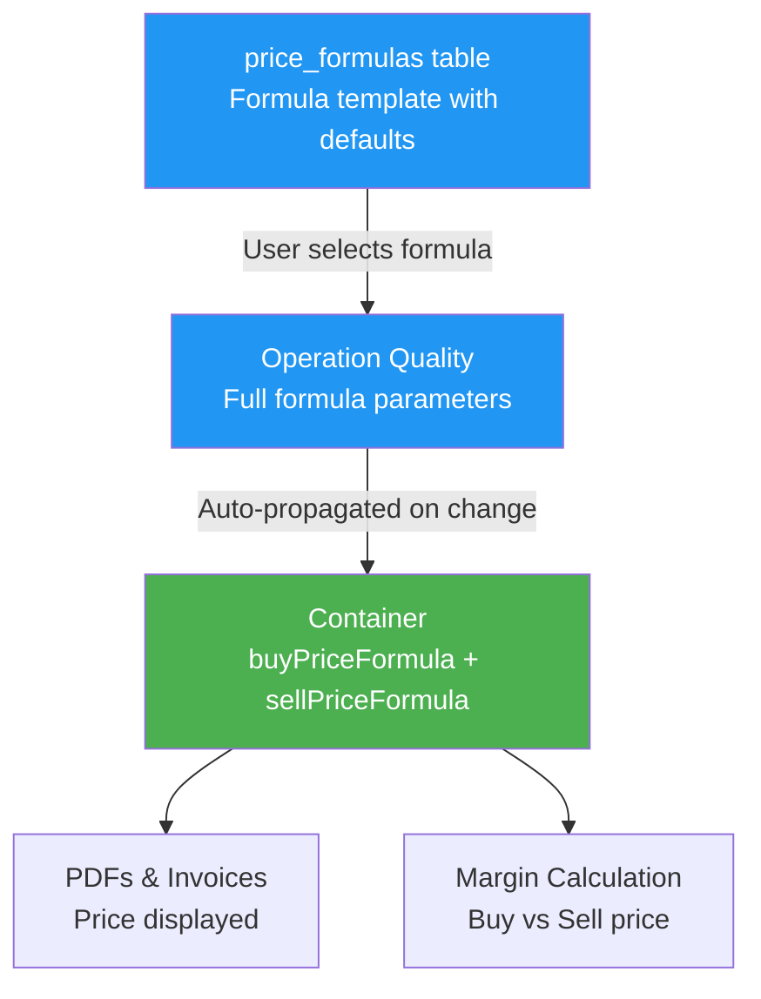
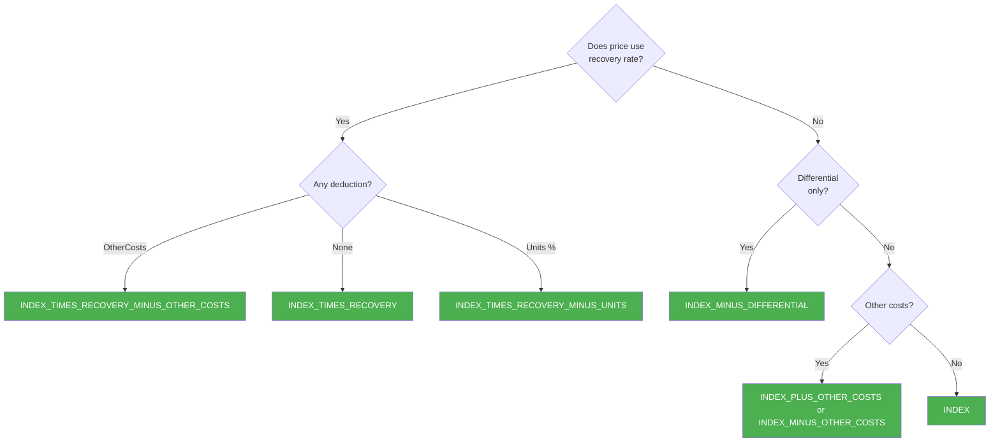
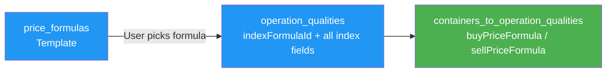

# Formula Prices in Jules

> Product documentation — Complete reference for setting up formula price templates, understanding which fields are prefilled, and how each formula code computes the final price.

---

## Table of Contents

1. [Overview](#overview)
2. [The price_formulas Table — Template Setup](#the-price_formulas-table--template-setup)
3. [The 15 Formula Codes and Their Equations](#the-15-formula-codes-and-their-equations)
4. [All Pricing Fields — Reference](#all-pricing-fields--reference)
5. [Where Formulas Are Applied](#where-formulas-are-applied)
6. [Prefill Logic](#prefill-logic)
7. [Price Fixation](#price-fixation)
8. [Key Business Rules](#key-business-rules)
9. [Glossary](#glossary)

---

## Overview

Jules supports **index-based (formula) pricing** for recyclable commodity trades. Instead of a fixed price, a formula price references a live or published market index and applies mathematical adjustments (differential, recovery, other costs) to compute the final transaction price.

The formula pricing system has three layers:

| Layer | Where | Purpose |
|-------|-------|---------|
| **Formula template** | `price_formulas` table | Defines the equation code and optional default parameters per organization |
| **Operation Quality** | `operation_qualities` table | Stores the specific formula applied to a trade leg |
| **Container** | `containers_to_operation_qualities` table | Stores a buy and a sell formula per container, inherited from the operation quality |

> **Technical note**: Formula templates live in the `price_formulas` table (one per org schema). Full formula parameters live in `operation_qualities` and `containers_to_operation_qualities`.

---

## The price_formulas Table — Template Setup

The `price_formulas` table stores formula templates. Each organization has its own set, seeded with 15 standard entries at database migration time.

### Core columns

| Column | Type | Description | Prefilled? |
|--------|------|-------------|-----------|
| `id` | integer | Auto-generated primary key | ✅ Auto |
| `code` | string | Formula equation code (enum) — **required** | ✅ Seeded |
| `value` | text | Default display label (e.g., "Index - Differential") | ✅ Seeded |
| `name` | text | Optional custom label for your organization | ❌ Manual |

### Prefill default columns

These columns, when set on the template, are **automatically pre-populated** into an operation quality when the user picks this formula:

| Column | Type | Description | Must set? |
|--------|------|-------------|-----------|
| `indexId` | FK → `commodities_to_markets` | Primary market index (Index #1) | Recommended |
| `indexId2` | FK → `commodities_to_markets` | Secondary market index (Index #2) | For dual-index formulas |
| `indexOptionality` | enum | If two index periods apply, use `HIGHEST` or `LOWEST` | Optional |
| `indexOptionality2` | enum | Same, for Index #2 | Optional |
| `index1PriceMode` | enum | How to read Index #1 price | Recommended |
| `index1PriceMode2` | enum | Alternative price mode for Index #1 (used with optionality) | Optional |
| `index2PriceMode` | enum | How to read Index #2 price | For dual-index formulas |
| `index2PriceMode2` | enum | Alternative for Index #2 | Optional |
| `index1Prompt` | FK → `price_index_to_prompts` | Prompt period for Index #1 | Optional |
| `index1Prompt2` | FK → `price_index_to_prompts` | Alternative prompt for Index #1 | Optional |
| `index2Prompt` | FK → `price_index_to_prompts` | Prompt period for Index #2 | Optional |
| `index2Prompt2` | FK → `price_index_to_prompts` | Alternative prompt for Index #2 | Optional |
| `index1PriceType` | enum | Price type for Index #1 | Recommended |
| `index1PriceType2` | enum | Alternative price type for Index #1 | Optional |
| `index2PriceType` | enum | Price type for Index #2 | Optional |
| `index2PriceType2` | enum | Alternative for Index #2 | Optional |

> **Setup tip**: Setting `indexId`, `index1PriceMode`, and `index1PriceType` on the template is enough to pre-populate the most important fields when users create operation qualities.

---

## The 15 Formula Codes and Their Equations

Each formula code defines a specific algebraic equation. The system ships with 15 standard codes; they cannot be deleted, but organizations can create additional custom formulas with the same code (non-unique code is supported).

| Code | Display | Equation |
|------|---------|----------|
| `INDEX` | Index | `Price = Index` |
| `INDEX_MINUS_DIFFERENTIAL` | Index - Differential | `Price = Index − Differential` |
| `INDEX_MINUS_DIFFERENTIAL_MINUS_OTHER_COSTS` | Index - Differential - Other costs | `Price = Index − Differential − OtherCosts` |
| `INDEX_MINUS_DIFFERENTIAL_TIMES_RECOVERY` | (Index - Differential) * Recovery | `Price = (Index − Differential) × Recovery` |
| `INDEX_MINUS_DIFFERENTIAL_TIMES_RECOVERY_MINUS_OTHER_COSTS` | [(Index - Differential) * Recovery] - Other costs | `Price = [(Index − Differential) × Recovery] − OtherCosts` |
| `INDEX_MINUS_BRACKETED_DIFFERENTIAL_TIMES_RECOVERY_MINUS_OTHER_COSTS` | Index - (Differential * Recovery) - Other costs | `Price = Index − (Differential × Recovery) − OtherCosts` |
| `INDEX_MINUS_OTHER_COSTS` | Index - Other costs | `Price = Index − OtherCosts` |
| `INDEX_PLUS_OTHER_COSTS` | Index + Other costs | `Price = Index + OtherCosts` |
| `INDEX_PLUS_OTHER_COST_1_PLUS_OTHER_COST_2` | Index + Other costs #1 + Other costs #2 | `Price = Index + OtherCosts + OtherCosts2` |
| `INDEX_TIMES_RECOVERY` | Index * Recovery | `Price = Index × Recovery` |
| `INDEX_TIMES_RECOVERY_MINUS_OTHER_COSTS` | Index * Recovery - Other costs | `Price = (Index × Recovery) − OtherCosts` |
| `INDEX_TIMES_RECOVERY_MINUS_UNITS` | Index * (Recovery - Units) | `Price = Index × (Recovery − Units%)` |
| `INDEX_PLUS_INDEX_2_PLUS_OTHER_COSTS` | Index + Index #2 + Other costs | `Price = Index + Index2 + OtherCosts` |
| `INDEX_PLUS_INDEX_2_PLUS_OTHER_COSTS_CONTANGO` | Index + Index #2 + Other costs + Contango | `Price = Index + Index2 + OtherCosts + Contango` |
| `INDEX_TIMES_RECOVERY_PLUS_INDEX_2_TIMES_RECOVERY_2_PLUS_OTHER_COSTS` | Index * Recovery + Index #2 * Recovery #2 + Other costs | `Price = (Index × Recovery) + (Index2 × Recovery2) + OtherCosts` |

### Choosing the right formula

---

## All Pricing Fields — Reference

These fields exist both on **operation qualities** and on **containers** (prefixed with `buy` or `sell` on containers).

### Index selection

| Field | Type | Description | Required by formula |
|-------|------|-------------|---------------------|
| `indexFormulaId` | ID | FK to `price_formulas` — the selected formula | Always |
| `indexId` | ID | The primary market index (`commodities_to_markets`) | Always |
| `indexId2` | ID | Second market index | Dual-index formulas |
| `indexCurrency` | CurrencyEnum | Currency of the index value | When converting units |
| `indexPriceVolume` | VolumeEnum | Unit in which the index is quoted (T, MT, lb…) | When converting units |

### Index value and adjustments

| Field | Type | Description | Used in formula |
|-------|------|-------------|----------------|
| `indexValue` | Float | Fixed override for Index #1 value | Optional — overrides live index |
| `indexValue2` | Float | Fixed override for Index #2 value | Optional |
| `indexValuePercentage` | Float | Percentage adjustment on Index #1 | Optional |
| `indexValuePercentage2` | Float | Percentage on Index #2 | Optional |
| `indexDifferential` | Float | Subtracted/added spread vs index | Formulas with `DIFFERENTIAL` |
| `indexRecovery` | Float | Recovery rate % for Index #1 | Formulas with `RECOVERY` |
| `indexRecovery2` | Float | Recovery rate % for Index #2 | Dual-index with recovery |
| `indexOtherCosts` | Float | Other cost deduction/addition | Formulas with `OTHER_COSTS` |
| `indexOtherCosts2` | Float | Second other cost value | `INDEX_PLUS_OTHER_COST_1_PLUS_OTHER_COST_2` |
| `indexUnitsPercentage` | Float | Units percentage deduction | `INDEX_TIMES_RECOVERY_MINUS_UNITS` |
| `contango` | Float | Contango adjustment | `INDEX_PLUS_INDEX_2_PLUS_OTHER_COSTS_CONTANGO` |

### Price mode — how the index value is read

Each index reference has a **price mode** that defines over what time range the index value is read:

| `index1PriceMode` / `index2PriceMode` value | Description |
|---------------------------------------------|-------------|
| `SINGLE_DAY` | Price from a single specific day |
| `AVERAGE_M_1` | Average over the prior calendar month |
| `AVERAGE_W_1` | Average over the prior week |
| `CUSTOM_RANGE` | Custom start/end date range |
| `FIXED` | A hardcoded fixed value (no live index lookup) |

For `CUSTOM_RANGE`, also set:
- `index1PriceModeStartDate` / `index1PriceModeEndDate`
- `index2PriceModeStartDate` / `index2PriceModeEndDate`

Each index also has a **second mode** (`index1PriceMode2`, etc.) used when `indexOptionality` is set — the system takes the `HIGHEST` or `LOWEST` of the two modes.

### Price type — which published value to use

| `index1PriceType` / `index2PriceType` value | Description |
|----------------------------------------------|-------------|
| `CLOSING` | End-of-day closing price |
| `OFFICIAL` | Official published settlement |
| `LIVE` | Live/intraday quote |
| `MARKET_ON_CLOSE` | Market-on-close price |

### Quotational period (QP)

The QP defines the averaging window for the index over the shipment lifecycle.

| Field | Type | Description |
|-------|------|-------------|
| `indexQuotationalPeriodTerm` | String | QP label (e.g., "M+1", "BL month", "arrival month") |
| `indexQuotationalPeriodTermStartDate` | Date | Start of the QP window |
| `indexQuotationalPeriodTermEndDate` | Date | End of the QP window |
| `indexFirstReferenceDateOrPeriod` | Enum | Event that marks the start of the QP (see below) |
| `indexFirstQpDays` | Float | Number of days after the first reference event |
| `indexLastReferenceDateOrPeriod` | Enum | Event that marks the end of the QP |
| `indexLastQpDays` | Float | Number of days after the last reference event |
| `indexPeriod` | String | Free-text period label for Index #1 |
| `indexPeriod2` | String | Free-text period label for Index #2 |
| `indexTiming` | String | Free-text timing note for Index #1 |
| `indexTiming2` | String | Free-text timing note for Index #2 |

**Reference date events** (`IndexReferenceDateOrPeriodEnum`):

`SAILING_DATE`, `BOL_DATE`, `ARRIVAL_DATE`, `DEPARTURE_DATE`, `ORDER_DATE`, `DELIVERY_DATE`, `GATED_IN_DATE`, `LOADING_DATE`, `ETA`, `ETD`, `BL_DATE`, `TELEX_RELEASE_DATE`

### Prompt (for futures-based indices)

Prompts link an index to a specific futures contract month. Set via `index1Prompt` / `index1Prompt2` / `index2Prompt` / `index2Prompt2`, which are FKs to the `price_index_to_prompts` table. Available prompts are loaded per index using the `priceIndexPromptChoices` query.

### Temporary / provisional pricing

| Field | Type | Description |
|-------|------|-------------|
| `isTemporaryPrice` | Boolean | Marks this price as provisional (the index has not yet been published) |
| `isIndexValue2Temporary` | Boolean | Same flag for Index #2 value |

When `isTemporaryPrice = true`, `indexValue` acts as an estimate. Once the actual index is known, update `indexValue` and set `isTemporaryPrice = false`.

### Display overrides

| Field | Type | Description |
|-------|------|-------------|
| `indexFormulaPdfDisplayName` | String | Custom label shown on PDFs instead of the default formula code label |

---

## Where Formulas Are Applied

### 1. Operation Quality (contract/trade level)

When creating or updating an operation quality, set `indexFormulaId` to the chosen formula. This defines the "standard" price for this trade leg. All the index fields above apply directly on `operation_qualities`.

### 2. Containers (per-container level)

Each container linked to an operation quality has its own `buyPriceFormula` and `sellPriceFormula` (on `containers_to_operation_qualities`). These are stored with the same field set as above, prefixed:
- `buyIndex*` fields → the buy side price formula
- `sellIndex*` fields → the sell side price formula

**Auto-propagation rule**: When the price formula on an operation quality changes (and `priceType = INDEX`), Jules automatically updates all containers linked to that operation quality to match the new formula. This is done via the `updateContainerToPriceFormulaByOperationQuality` method, which compares old and new formula fields and only writes if something changed.

---

## Prefill Logic

When a user selects a formula from the `price_formulas` template, the defaults stored on that template are pre-populated into the form fields. The fields that can be pre-populated from the template are:

- `indexId` / `indexId2`
- `indexOptionality` / `indexOptionality2`
- `index1PriceMode` / `index1PriceMode2`
- `index2PriceMode` / `index2PriceMode2`
- `index1Prompt` / `index1Prompt2`
- `index2Prompt` / `index2Prompt2`
- `index1PriceType` / `index1PriceType2`
- `index2PriceType` / `index2PriceType2`

Fields that are **never prefilled** (must always be set manually per trade):

- `indexDifferential` — specific to each deal
- `indexRecovery` / `indexRecovery2` — material-specific
- `indexOtherCosts` / `indexOtherCosts2` — deal-specific deductions
- `indexValue` / `indexValue2` — known only after index publication
- `indexQuotationalPeriodTerm` and date fields — shipment-specific
- `priceFixation*` fields — set only after price fixation event

> **Best practice**: Fill as many defaults as possible on the `price_formulas` template. For a commodity you trade regularly on LME closing with a 1-month average, set those defaults once — users will only need to enter the differential and other costs per trade.

---

## Price Fixation

Some trades allow partial or full price fixation before the QP ends.

| Field | Type | Description |
|-------|------|-------------|
| `priceFixationType` | enum | `PERCENTAGE` (fix a portion) or `ABSOLUTE` (fix a specific value) |
| `priceFixationValue` | Float | The fixed price value (for ABSOLUTE fixation) |
| `priceFixationPercentage` | Int | Percentage of quantity fixed (for PERCENTAGE fixation) |
| `priceFixationDate` | Date | Date the price was fixed |

These fields exist on both operation qualities and containers.

---

## Key Business Rules

### 1. Formula code vs formula ID

The legacy `indexFormula` field (a direct enum code) is deprecated. All current code uses `indexFormulaId` (an FK to the `price_formulas` table). This allows organizations to have multiple formulas with the same code but different defaults (different indices, modes, or custom names).

> **In plain terms**: Two formulas can both be `INDEX_MINUS_DIFFERENTIAL` but one might default to LME Copper and the other to LME Aluminium. They get different IDs.

### 2. Dual index support

Formulas with `INDEX_2` in the code require both `indexId` and `indexId2` to be set. The second index has its own full set of parameters (`index2PriceMode`, `index2PriceType`, `indexRecovery2`, etc.).

### 3. Optionality (HIGHEST / LOWEST)

When `indexOptionality` is set, Jules computes the price using **both** `index1PriceMode` and `index1PriceMode2`, then takes the higher or lower result. This is common for "best-of-two-periods" pricing.

### 4. Auto-propagation scope

Auto-propagation only runs when `priceType = INDEX` on the operation quality. Fixed-price operations are not affected.

### 5. Temporary price workflow

1. At trade creation, if the index is not yet published, set `isTemporaryPrice = true` and enter an estimated `indexValue`
2. When the actual index is published, update `indexValue` with the real figure and set `isTemporaryPrice = false`
3. The final invoice uses the definitive `indexValue`

### 6. Multi-tenant isolation

Each organization has its own `price_formulas` table. Formulas configured for one client are never visible to another.

---

## Glossary

| Term | Definition |
|------|------------|
| **Index** | A published market benchmark price (e.g., TSI, LME, Platts, RISI) |
| **Formula code** | The algebraic equation code that defines how Index, Differential, Recovery, and Other Costs are combined |
| **Formula template** | A row in `price_formulas` — stores the code plus optional defaults that pre-populate new operation qualities |
| **Differential** | A fixed spread added or subtracted from the index (e.g., −15 USD/T) |
| **Recovery** | A percentage representing the usable fraction of the material (e.g., 98% for high-grade scrap) |
| **Other costs** | A fixed cost added or deducted from the formula (e.g., handling, freight, treatment charge) |
| **Contango** | A market structure premium used in some futures-based formulas |
| **QP (Quotational Period)** | The time window over which index values are averaged to compute the final price |
| **Prompt** | A specific futures contract month linked to an index |
| **Price mode** | How the index value is read: single day, weekly average, monthly average, custom range, or fixed |
| **Price type** | Which published quote to use: Closing, Official, Live, or Market-on-Close |
| **Optionality** | A mechanism to compute using two price modes and keep the highest (or lowest) result |
| **Temporary price** | A provisional price set before the index is published; replaced once the actual value is known |
| **Price fixation** | Locking in a price (or a portion of it) before the QP ends |
| **Operation Quality** | A line on an operation representing a specific material with its price, quantity, and terms |
| **ContainerToOperationQuality** | The link between a container and an operation quality; stores the specific buy/sell formula for that container |
