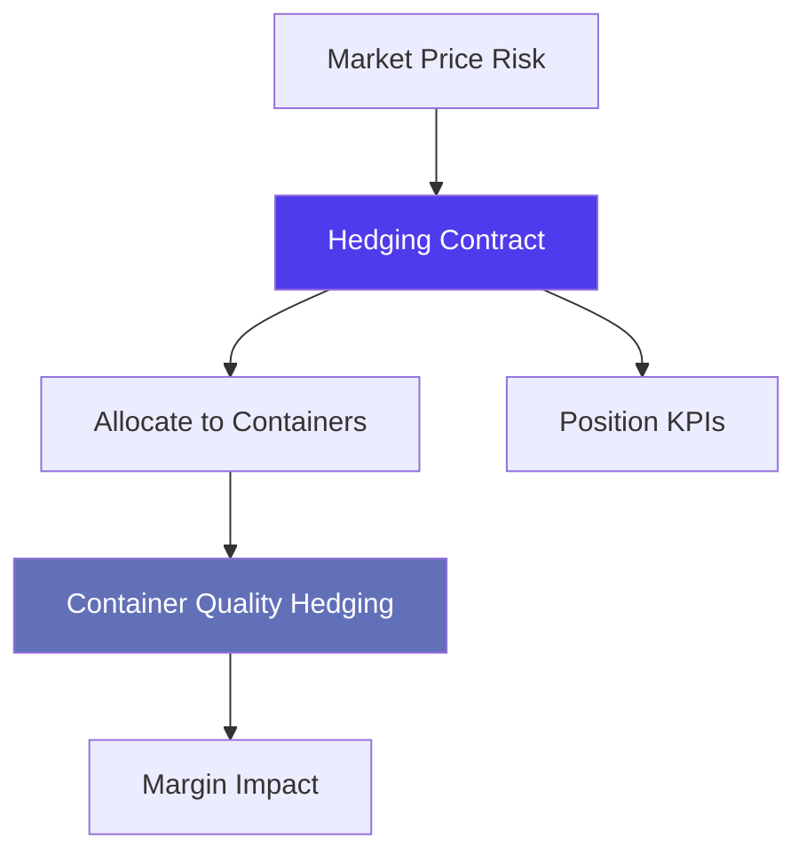
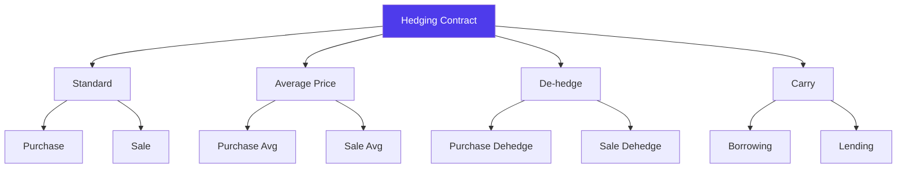
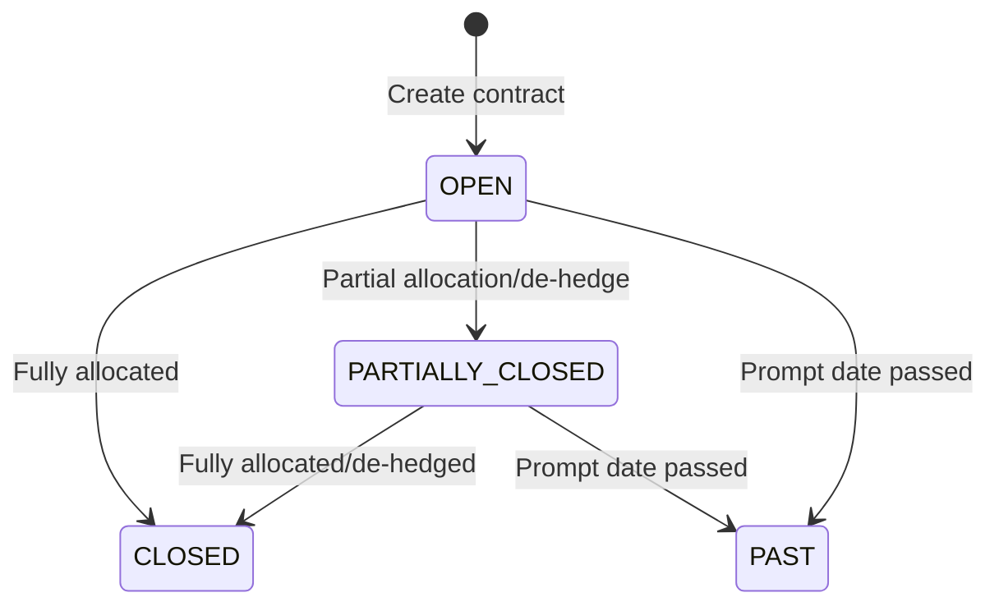
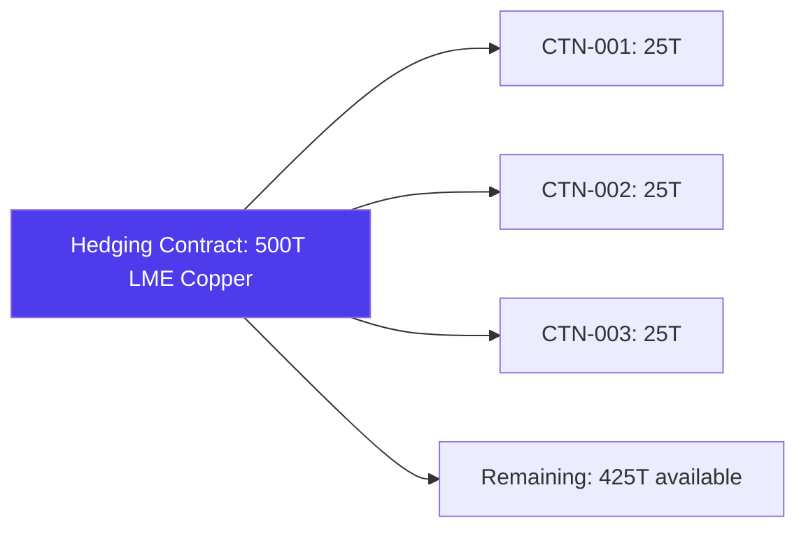

# Hedging & Risk Management in Jules

> Product documentation — How Jules manages commodity price risk through hedging contracts, container-level hedging allocation, and position tracking.

---

## Table of Contents

1. [Overview](#overview)
2. [Hedging Contracts](#hedging-contracts)
3. [Contract Types](#contract-types)
4. [Hedging Markets](#hedging-markets)
5. [Hedging Lifecycle](#hedging-lifecycle)
6. [Container-Level Hedging](#container-level-hedging)
7. [Position Tracking & KPIs](#position-tracking--kpis)
8. [Operation-Level Hedging Status](#operation-level-hedging-status)
9. [Key Business Rules](#key-business-rules)
10. [Glossary](#glossary)

---

## Overview

In recyclable commodity trading, prices fluctuate based on market conditions (metal prices on LME, paper indices, etc.). **Hedging** allows traders to lock in prices and reduce exposure to these fluctuations.

Jules provides a complete hedging workflow:

---

## Hedging Contracts

A **hedging contract** represents a financial instrument used to cover commodity price risk. It is typically a futures or options contract on a commodity exchange.

### Key Fields

| Field | Description |
|-------|-------------|
| **Harold number** | Unique identifier |
| **Type** | Type of hedging action (see [Contract Types](#contract-types)) |
| **Market** | Exchange market (LME, COMEX) |
| **Commodity** | The hedged commodity (e.g., Copper, Aluminum) |
| **Quantity** | Volume covered by the contract |
| **Trade date** | Date the hedging contract was executed |
| **Prompt date** | Settlement/delivery date on the exchange |
| **Buy action price** | Price at which a buy hedge was executed |
| **Sell action price** | Price at which a sell hedge was executed |
| **Average period** | Date range for averaging (for average price contracts) |
| **Commission** | Broker commission |
| **Broker** | The brokerage firm |

---

## Contract Types

Jules supports a rich set of hedging contract types:

### Standard Hedges

| Type | Description |
|------|-------------|
| **PURCHASE** | Buy hedge — locks in a purchase price |
| **SALE** | Sell hedge — locks in a selling price |

### Average Price Hedges

| Type | Description |
|------|-------------|
| **PURCHASE_AVG_PRICE** | Buy hedge using an average price over a period |
| **SALE_AVG_PRICE** | Sell hedge using an average price over a period |

### De-hedging

| Type | Description |
|------|-------------|
| **PURCHASE_DEHEDGE** | Closing out a purchase hedge position |
| **SALE_DEHEDGE** | Closing out a sale hedge position |
| **PURCHASE_AVG_PRICE_DEHEDGE** | Closing out an average price purchase hedge |
| **SALE_AVG_PRICE_DEHEDGE** | Closing out an average price sale hedge |

### Borrowing & Lending (Carry)

| Type | Description |
|------|-------------|
| **BORROWING** | Borrowing metal on the exchange |
| **LENDING** | Lending metal on the exchange |
| **BORROWING_CARRY** | Carry trade — borrowing for a forward period |
| **LENDING_CARRY** | Carry trade — lending for a forward period |

---

## Hedging Markets

| Market | Description |
|--------|-------------|
| **LME** | London Metal Exchange — primary market for base metals |
| **COMEX** | Commodity Exchange — part of CME Group, used for metals like copper and gold |

The market determines which commodities and lot sizes are available. Each market has a standard lot size (`marketCommodityOneLot`) used for quantity calculations.

---

## Hedging Lifecycle

| Status | Meaning |
|--------|---------|
| **OPEN** | Contract is active with available quantity |
| **PARTIALLY_CLOSED** | Some quantity allocated, some remaining |
| **CLOSED** | Fully allocated or de-hedged |
| **PAST** | Prompt date has passed |

### Parent-Child Relationships

Hedging contracts support parent-child relationships:
- A **de-hedge** references its parent hedge via `parentHedgingContract`
- A **carry** trade references its associated contracts via `carryHedgingContract`
- `associatedHedgingContracts` groups related hedges together

---

## Container-Level Hedging

The **Container Quality Hedging** entity (`ContainerQualityHedging`) links hedging contracts to specific containers, ensuring every physical unit of cargo has its price risk covered.

### How it works

### Quantity Types

| Type | Description |
|------|-------------|
| **FIXED_QUANTITY** | A specific tonnage is hedged |
| **LOADED_WEIGHT_BASED_FORMULA** | Hedged quantity derived from loaded weight |

### Weight Formulas

| Formula | Description |
|---------|-------------|
| **LOADED_WEIGHT** | Use the container's loaded weight directly |
| **LOADED_WEIGHT_WITH_RECOVERY** | Loaded weight adjusted by recovery percentage |

### Fields per Container Hedging

| Field | Description |
|-------|-------------|
| **Hedging contract** | The hedge covering this container |
| **Hedged quantity** | Volume of material hedged |
| **Loaded weight** | Actual loaded weight of the container |
| **Recovery percentage** | Percentage of material recovered (for recovery-based formulas) |
| **Is temporary weight** | Whether the loaded weight is provisional |

---

## Position Tracking & KPIs

Jules provides aggregate KPIs across all hedging contracts:

| KPI | Description |
|-----|-------------|
| **Total Purchased** | Sum of all purchase hedge quantities |
| **Total Sold** | Sum of all sale hedge quantities |
| **Total Overall** | Net position (purchased - sold) |

### Quantity Tracking per Contract

| Field | Description |
|-------|-------------|
| **Quantity** | Total contracted hedge volume |
| **Allocated quantity** | Volume already allocated to containers |
| **Available quantity** | Remaining volume available for allocation |
| **De-hedged quantity** | Volume that has been de-hedged |

### Filtering Hedging Positions

Jules supports filtering to identify coverage gaps:

| Filter | Description |
|--------|-------------|
| **PURCHASE_COVERAGE_MISSING** | Purchase operations with no hedge coverage |
| **SALE_COVERAGE_MISSING** | Sale operations with no hedge coverage |
| **PURCHASE_COVERAGE_MISSING_PARTIALLY** | Purchase operations with partial coverage |
| **SALE_COVERAGE_MISSING_PARTIALLY** | Sale operations with partial coverage |

---

## Operation-Level Hedging Status

Each operation tracks its overall hedging status:

| Status | Meaning |
|--------|---------|
| **REQUIRED** | Hedging is required but not yet in place |
| **PARTIALLY_HEDGED** | Some containers are hedged, others are not |
| **HEDGED** | All containers have hedging coverage |

The `isHedgingRequired` flag on operations and operation qualities determines whether hedging is mandatory for the deal.

---

## Key Business Rules

### 1. Hedging is quality-level

Hedging is linked at the **container quality** level, not the container level. This allows different materials within the same container to have different hedging contracts.

### 2. Prompt date determines lifecycle

The **prompt date** is the settlement date on the exchange. Once it passes, open contracts move to PAST status.

### 3. Average price periods

For average price hedges, the **average period** (start and end dates) defines the time window over which exchange prices are averaged to determine the final hedge price.

### 4. Carry trades link contracts

Borrowing/lending carry trades create chains of related hedging contracts. The `carryHedgingContract` field links the carry to its parent contract.

### 5. De-hedging tracks unwinding

When closing out a position, a de-hedge contract is created referencing the original hedge. The `dehedgedQuantity` on the original contract is updated accordingly.

### 6. Department-level hedging

Hedging contracts can be assigned to a **department**, allowing multi-department organizations to track their hedging positions independently.

---

## Glossary

| Term | Definition |
|------|------------|
| **Average price hedge** | A hedge where the price is the average over a defined period |
| **Broker** | The intermediary executing hedging trades on an exchange |
| **Carry trade** | Borrowing or lending metal for a forward period |
| **COMEX** | Commodity Exchange — part of CME Group |
| **Container quality hedging** | The link between a hedging contract and a specific container's material |
| **De-hedge** | Closing out an existing hedge position |
| **Hedging contract** | A financial instrument covering commodity price risk |
| **LME** | London Metal Exchange |
| **Prompt date** | The settlement/delivery date on the exchange |
| **Recovery percentage** | The percentage of material recovered after processing |
| **Trade date** | The date a hedging contract was executed |
