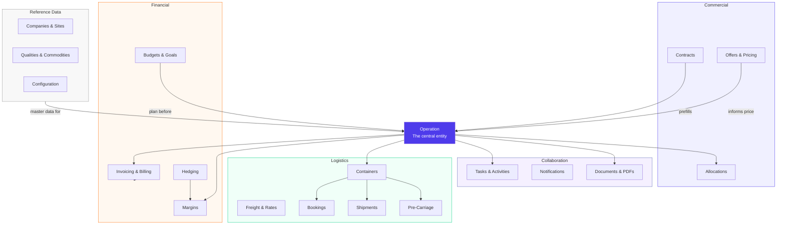
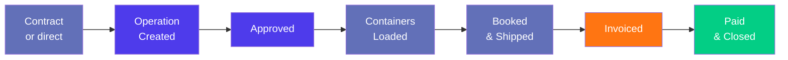

> Product documentation — A concise overview of Jules: what it does, who it serves, and how every functional area fits together.

---

## Table of Contents

1. [What is Jules?](#what-is-jules)

2. [Who Uses Jules?](#who-uses-jules)

3. [Core Value Proposition](#core-value-proposition)

4. [Platform Map](#platform-map)

5. [Key Concepts](#key-concepts)

6. [Documentation Map](#documentation-map)

7. [Technical Stack](#technical-stack)

---

## What is Jules?

**Jules** is a vertical SaaS ERP built for companies that trade recyclable commodities — ferrous and non-ferrous scrap metals, waste paper, plastics, and electronic waste.

It is developed by **MineHub Technologies** (TSX.V: MHUB) and replaces the patchwork of spreadsheets, email threads, and fragmented tools that trading teams typically rely on. Jules connects every step of the trade lifecycle — from the initial commercial agreement to the final cash settlement — inside a single, structured platform.

The platform is multi-tenant: every customer organization runs inside its own isolated environment, with its own data, configuration, and users.

---

## Who Uses Jules?

Jules is designed for **trading companies, brokers, and recyclers** who buy and sell recyclable materials in domestic or international markets. A typical organization using Jules includes:

| Role                      | How they use Jules                                                |
| ------------------------- | ----------------------------------------------------------------- |
| **Trader / Commercial**   | Create operations, manage contracts, track margins, send offers   |
| **Logistics Coordinator** | Plan freight, manage bookings, containers, and shipments          |
| **Accountant / Finance**  | Issue invoices, process payments, track budgets and P\&L          |
| **Operations Manager**    | Monitor the full trade pipeline, approve operations and documents |
| **Back-office / Admin**   | Manage reference data, configuration, users, and permissions      |
| **Counterparty (Portal)** | View shared offers and documents via the external portal          |

---

## Core Value Proposition

Jules handles the **entire journey from contract to cash** — sometimes called "procure-to-pay" on the buy side and "order-to-cash" on the sell side. It eliminates the handoff friction between teams by keeping all trade data in one place:

- A **contract** prefills an **operation**

- An **operation** generates **containers**

- Containers generate **logistics bookings** and **invoicing lines**

- Invoicing lines aggregate into **invoices** and feed the **margin** engine

- Everything is governed by **approvals**, tracked with **tasks**, and documented with **PDFs**

---

## Platform Map

Jules is organized into five functional areas that interact around the central **operation** entity:

---

## Key Concepts

### The Operation

The **operation** is the central entity in Jules. It represents a single commercial transaction — a purchase or a sale — of a specific set of materials with a specific counterparty. Everything else in the platform is either a prerequisite to creating an operation (contracts, qualities, companies) or a consequence of it (containers, invoices, margins, logistics).

See: [Operations & Lifecycle](./operations-lifecycle-en.mdx)

### Multi-Tenancy

Jules is multi-tenant. Each customer organization is a **tenant** identified by an `organizationId`. Every data record — operations, invoices, companies, sites — is scoped to that tenant's own isolated PostgreSQL schema. No data is ever shared between organizations.

### Market Modes

Operations in Jules operate in one of two market modes:

| Mode                       | Description                                                                                                    |
| -------------------------- | -------------------------------------------------------------------------------------------------------------- |
| **Export (International)** | Containerized shipments via maritime freight; involves freight booking, Bill of Lading, port-to-port logistics |
| **Local (Domestic)**       | Bulk or direct shipments without containerization; simpler logistics, often using stockpiles                   |

The market mode of an operation determines which logistics flows, document types, and margin calculations are relevant.

### The Trade Lifecycle

A trade in Jules typically follows this path:

---

## Documentation Map

### Tier 1 — Core Trading

| Article                                                       | What it covers                                                                                      |
| ------------------------------------------------------------- | --------------------------------------------------------------------------------------------------- |
| [Operations & Lifecycle](./operations-lifecycle-en.mdx)       | The central trade entity — types, lifecycle states, pricing, approval workflow, and allocations     |
| [Contracts & Pricing](./contracts-pricing-en.mdx)             | Commercial agreements, quality streams, price formulas, and how contracts prefill operations        |
| [Invoicing & Billing](./invoicing-billing-en.mdx)             | Container invoicing lines, invoice types, payment reconciliation, credit/debit notes, ERP sync      |
| [Logistics & Freight](./logistics-freight-en.mdx)             | Pre-carriage, freight rates, bookings, containers, shipments, and the full logistics chain          |
| [Hedging & Risk Management](./hedging-risk-management-en.mdx) | Hedging contracts, container-level allocation, position tracking, and margin impact                 |
| [Budgets & Goals](./budgets-goals-en.mdx)                     | Commercial planning: purchase/sale targets (goals) and deal-level budgets with cashflow projections |
| [Margin Calculations](./margin-calculations-en.mdx)           | How Jules calculates profitability — container margin, dashboard margin, and bulk margin            |

### Tier 2 — Supporting Modules

| Article                                                              | What it covers                                                                                        |
| -------------------------------------------------------------------- | ----------------------------------------------------------------------------------------------------- |
| [Companies, Sites & Contacts](./companies-sites-contacts-en.mdx)     | The master data foundation: counterparties, physical locations, people, and geography                 |
| [Qualities, Commodities & Materials](./qualities-commodities-en.mdx) | The three-level material classification (family → group → quality) and product catalog                |
| [Pricing Engine, Indices & Offers](./pricing-indices-offers-en.mdx)  | Market price indices, formula-based pricing, commercial offers, price suggestions, and portal sharing |
| [Tasks, Activities & Notifications](./tasks-activities-en.mdx)       | Action items, commercial activity logs, event-driven notifications, watchers, and audit trails        |
| [Documents, PDFs & Integrations](./documents-pdf-en.mdx)             | PDF generation, document templates, AI-assisted verification, Letter of Credit, email, and webhooks   |
| [Users, Roles & Permissions](./users-permissions-en.mdx)             | User identities, role-based access, organizational structure, ABAC authorization, and portal users    |
| [Configuration & Settings](./configuration-settings-en.mdx)          | Per-organization setup: currencies, business rules, trade terms, ERP integration, dashboards          |

