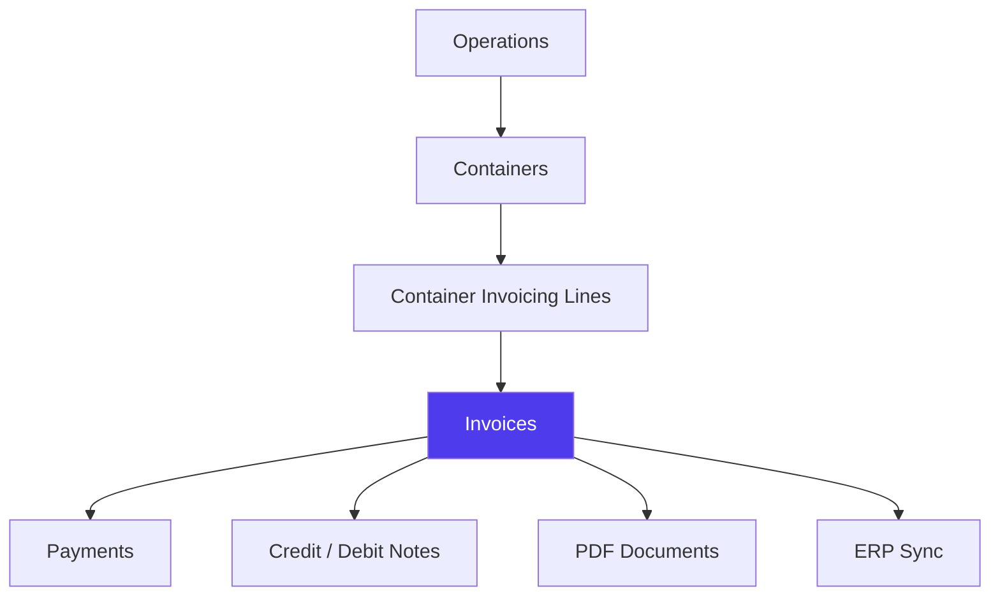
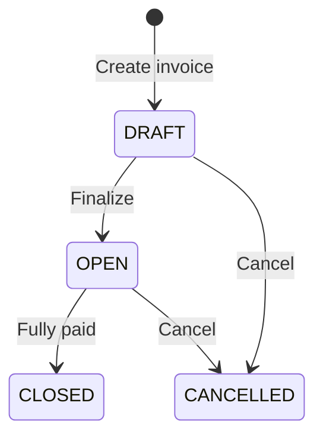
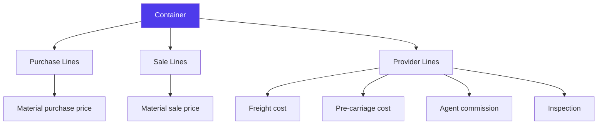
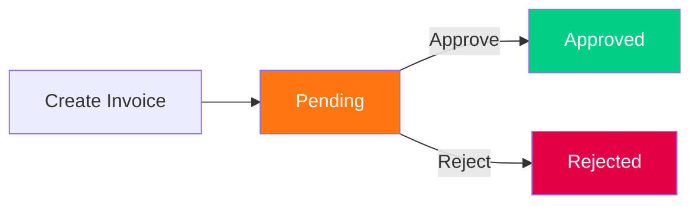

# Invoicing & Billing in Jules

> Product documentation — How Jules manages invoices, credit/debit notes, payments, and the container invoicing matrix.

---

## Table of Contents

1. [Overview](#overview)
2. [Invoice Types](#invoice-types)
3. [Invoice Lifecycle](#invoice-lifecycle)
4. [Container Invoicing Matrix](#container-invoicing-matrix)
5. [Payments & Reconciliation](#payments--reconciliation)
6. [Validation & Approval](#validation--approval)
7. [Credit Notes & Debit Notes](#credit-notes--debit-notes)
8. [PDF Generation](#pdf-generation)
9. [ERP Synchronization](#erp-synchronization)
10. [Key Business Rules](#key-business-rules)
11. [Glossary](#glossary)

---

## Overview

Invoicing in Jules connects the commercial world (operations, containers) to the financial world (accounting, payments). Every traded container generates invoicing lines that are aggregated into invoices.

Jules handles invoicing at two levels:
1. **Container invoicing** — granular cost/revenue lines per container
2. **Invoices** — aggregated financial documents sent to counterparties or received from providers

---

## Invoice Types

### By Object Type

| Object Type | Description |
|-------------|-------------|
| **INVOICE** | Standard commercial invoice (purchase or sale) |
| **CREDIT_NOTE** | Adjustment reducing an existing invoice amount |
| **DEBIT_NOTE** | Adjustment increasing costs or charges |
| **PROVIDER_REPORT** | Invoice from a third-party service provider |
| **PURCHASE_REPORT** | Report-style document for purchase accounting |

### By Direction

| Direction | Description |
|-----------|-------------|
| **BUY** | Purchase invoice — received from a supplier |
| **SELL** | Sale invoice — sent to a customer |

### Proforma vs Final

| Type | Description |
|------|-------------|
| **Proforma** | Preliminary invoice issued before delivery; used for advance payments or letter of credit |
| **Final** | Definitive invoice based on actual delivered quantities and prices |

---

## Invoice Lifecycle

### Status Definitions

| Status | Meaning |
|--------|---------|
| **DRAFT** | Invoice is being prepared, not yet finalized |
| **OPEN** | Invoice is finalized and awaiting payment |
| **CLOSED** | Invoice is fully settled |
| **CANCELLED** | Invoice was voided |

### Computed Filter Statuses

For filtering and reporting, Jules provides additional computed statuses:

| Filter Status | Meaning |
|---------------|---------|
| **PROFORMA** | Invoice flagged as proforma |
| **MATCHED** | Invoice amounts match container invoicing lines |
| **UNMATCHED** | Discrepancy between invoice and container invoicing |
| **PAID** | Payment received (partial or full) |
| **PAID_PROFORMA** | Proforma with payment received |

---

## Container Invoicing Matrix

The **container invoicing matrix** is the core of Jules' invoicing system. It breaks down every cost and revenue element at the container level.

### How it works

Each container generates **invoicing lines** — one for each cost or revenue element:

### Invoicing Line Types

| Type | Code | Description |
|------|------|-------------|
| **Purchase** | `BUY` | Lines related to supplier payments |
| **Sale** | `SELL` | Lines related to customer billing |
| **Provider** | `PROVIDER` | Lines for third-party service costs |

### Cost Elements

Jules tracks a comprehensive set of invoicing elements:

| Category | Elements |
|----------|----------|
| **Logistics** | Freight cost, Cargo bulk cost, Pre-carriage cost, Logistic cost, Transport |
| **Agents** | Agent commission (general), Buy agent, Sell agent |
| **Quality** | Inspector, Sterile, Declassification |
| **Finance** | Interest, Principal, Advance payment |
| **Adjustments** | Credit note, Debit note, Logistic bill-back |
| **Penalties** | Penalty, Transport empty, Transport quality refused/unvalued |
| **Discounts** | Global discount, Element discount |
| **Other** | Unexpected costs |

### Follow-up Status per Line

Each invoicing line tracks when in the container's lifecycle it was incurred:

| Status | When |
|--------|------|
| **PLANNED** | At planning stage |
| **LOADED** | When the container is loaded |
| **DELIVERED** | When the container is delivered |
| **CLOSED** | When invoicing is finalized |

### Invoicing Line Status

| Status | Meaning |
|--------|---------|
| **PENDING** | Line exists but not yet included in an invoice |
| **INVOICED** | Line has been included in a finalized invoice |

---

## Payments & Reconciliation

### Payment Recording

Payments are recorded against invoices with the following data:

| Field | Description |
|-------|-------------|
| **Amount** | Payment amount (currency + value) |
| **Invoice** | The invoice being paid |
| **Container** | Optional — specific container the payment applies to |
| **Payment Info** | Link to payment information record |
| **Note** | Optional link to a credit/debit note used for payment |

### Reconciliation Fields on Invoices

| Field | Description |
|-------|-------------|
| **Gross price** | Total before adjustments |
| **Net price** | Amount after discounts |
| **Already paid** | Sum of payments received |
| **Advance to pay** | Advance payment amount |
| **Amount to pay** | Remaining balance |
| **Total payment** | Aggregate of all payment records |
| **Applied note** | Amount applied from credit/debit notes |
| **Past order credit** | Credits carried from previous orders |
| **Is Paid** | Whether the invoice is fully settled |

### Advance Payment Types

| Type | Description |
|------|-------------|
| **PERCENTAGE** | Advance calculated as a percentage of the invoice |
| **FIXED** | Fixed advance amount |

---

## Validation & Approval

Invoices support a **validation workflow** similar to operations:

Multiple invoices can be validated in batch using the `updateInvoicesValidationStatus` action.

---

## Credit Notes & Debit Notes

### Credit Notes

A **credit note** reduces the amount owed on an existing invoice. It is created by referencing a parent invoice and specifying the adjustment.

### Debit Notes

A **debit note** adds charges. Debit notes are sub-classified:

| Debit Note Type | Description |
|-----------------|-------------|
| **PROVIDER_REPORT** | Additional charges from a provider |
| **PURCHASE_REPORT** | Additional purchase-related charges |
| **INVOICE** | Standard debit note |

Both credit and debit notes reference their **parent invoice(s)** via `parentInvoiceIds`.

---

## PDF Generation

Invoices can be generated as PDFs using configurable templates:

- **Template selection** — Each invoice can use a specific `pdfTemplate`
- **Required documents** — Configurable list of supporting documents
- **Custom terms** — Free-form terms included in the PDF
- **Display options** — Currency and volume unit for display purposes

The PDF includes:
- Invoice header (number, date, parties, billing entity)
- Container details and invoicing lines
- Totals (gross, discounts, net, advance, balance)
- Bank account information
- Shipping details (ETD, ETA, incoterm)

---

## ERP Synchronization

Invoices support bidirectional ERP sync:

| Field | Description |
|-------|-------------|
| **erpId** | External ERP identifier |
| **syncStatus** | PENDING → IN_PROGRESS → SUCCESS / FAILURE |
| **dateOfLastSync** | Timestamp of the last synchronization |
| **syncErrorMessage** | Error details if sync failed |

Container invoicing lines also track their own ERP sync status independently.

---

## Key Business Rules

### 1. Invoice numbering

Every invoice receives a unique **Harold number** automatically generated by the system. Users can also set a **reference number** for their own tracking.

### 2. Posting period

Invoices have a **posting period** — the accounting period the invoice belongs to, which may differ from the creation date.

### 3. Multi-container invoices

A single invoice can cover multiple containers from the same operation. The container invoicing lines are aggregated into the invoice total.

### 4. Exchange rate handling

When the invoice currency differs from container currencies, an **exchange rate** is stored on the invoice for conversion.

### 5. Included total amount incoterms

Invoices can flag which incoterm cost components (FOB, CFR, CIF) are included in the total amount — this affects how the PDF displays the price breakdown.

### 6. Invoicing close per container

Each container has independent flags for closing purchase and sale invoicing:
- `isPurchaseInvoicingClosed` / `isSaleInvoicingClosed`
- `isPurchaseInvoicingReopened` / `isSaleInvoicingReopened`

This allows fine-grained control over which containers still accept invoicing changes.

---

## Glossary

| Term | Definition |
|------|------------|
| **Container invoicing** | The granular cost/revenue breakdown per container per cost element |
| **Credit note** | A document reducing the amount owed on an existing invoice |
| **Debit note** | A document adding charges to an existing invoice |
| **Gross price** | Total invoice amount before adjustments |
| **Harold number** | Unique identifier automatically assigned to each invoice |
| **Invoicing line** | A single cost or revenue element on a container (e.g., freight cost) |
| **Net price** | Invoice amount after discounts and adjustments |
| **Posting period** | The accounting period an invoice belongs to |
| **Proforma** | Preliminary invoice issued before final delivery |
| **Provider report** | An invoice received from a third-party provider |
| **Reconciliation** | The process of matching payments to invoice amounts |
