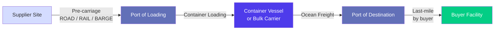
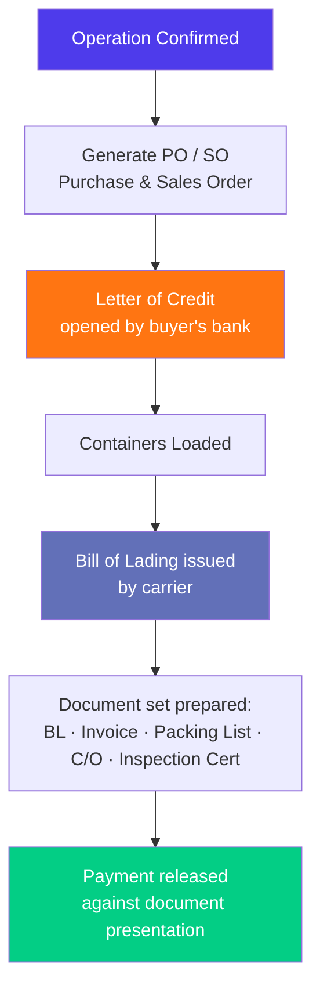
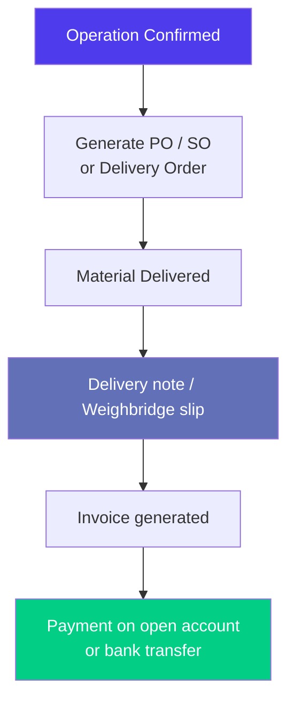
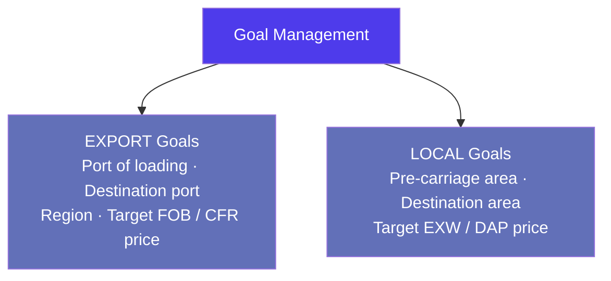
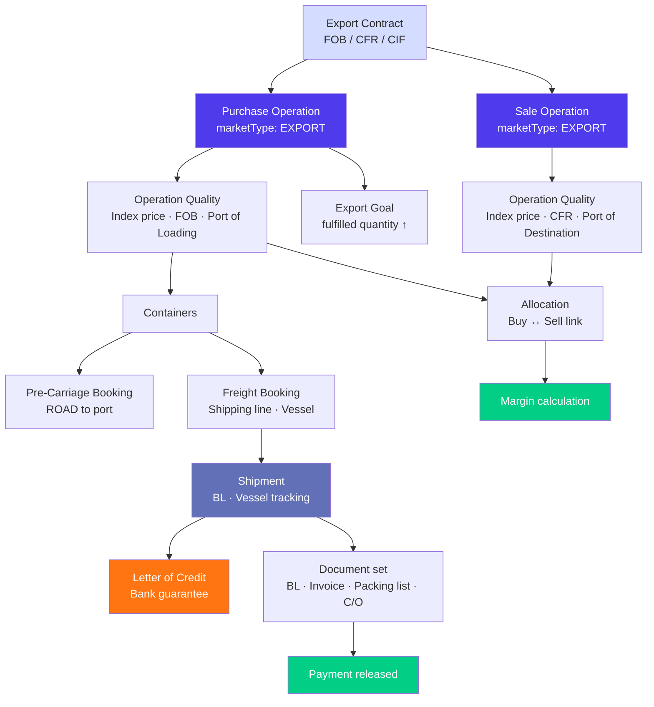
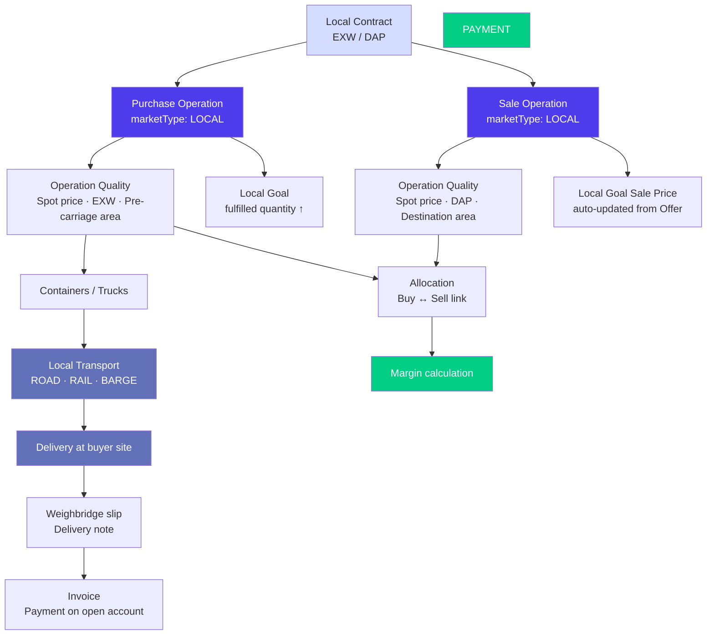
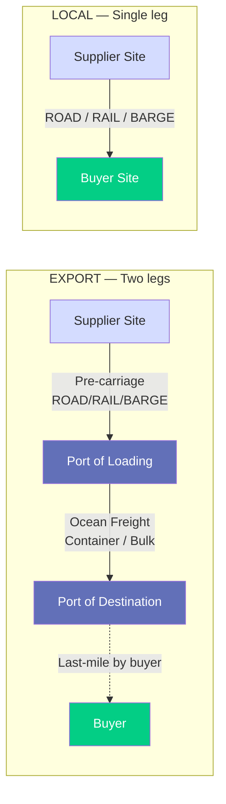

> Product documentation — Why market mode is one of the most consequential settings in Jules, and how the choice between LOCAL and EXPORT cascades through logistics, pricing, documentation, goals, and commercial offers.

---

## Table of Contents

1. [Overview](#overview)

2. [What Defines a Market Mode](#what-defines-a-market-mode)

3. [Where Market Mode Is Set](#where-market-mode-is-set)

4. [Logistics Chain Differences](#logistics-chain-differences)

5. [Pricing Differences](#pricing-differences)

6. [Documentation Differences](#documentation-differences)

7. [Incoterms by Market](#incoterms-by-market)

8. [Goals and Budgets by Market](#goals-and-budgets-by-market)

9. [Offers by Market](#offers-by-market)

10. [Price Suggestions by Market](#price-suggestions-by-market)

11. [Feature Comparison Table](#feature-comparison-table)

12. [Side-by-Side Flow Diagrams](#side-by-side-flow-diagrams)

13. [Key Business Rules](#key-business-rules)

14. [Glossary](#glossary)

---

## Overview

Jules serves recyclable materials traders who operate in two fundamentally different commercial contexts: selling material to overseas customers via container or bulk vessel (export trade), and sourcing or delivering material within the same country by road, rail, or barge (domestic trade).

These are not just logistical differences. The two market modes differ in:

- The transport chain and the parties involved

- How prices are agreed and calculated

- What commercial documents are required

- What financial instruments (letter of credit) apply

- How goals and offers are structured

Jules encodes this distinction in a single enum called `MarketTypeEnum`, with two values:

| Enum value | Meaning                                                       |
| ---------- | ------------------------------------------------------------- |
| `EXPORT`   | International trade — cross-border, typically maritime        |
| `LOCAL`    | Domestic trade — same-country, typically road, rail, or barge |

This setting is not cosmetic. It controls which incoterms are available, which logistic rate tables are queried, whether a letter of credit is relevant, how offer PDFs are formatted, and how goal target prices are stored. Understanding market mode is essential for anyone configuring or using Jules.

---

## What Defines a Market Mode

### EXPORT

An **export** operation involves shipping recyclable material from one country to another. The seller (or buyer) is located in a different country from the counterparty. The goods typically travel:

1. From the supplier site inland to a port of loading (pre-carriage leg)

2. Across an ocean on a container vessel or bulk carrier (main freight leg)

3. From the port of destination to the buyer's facility (last-mile, handled by buyer)

Export trades commonly use:

- **Maritime incoterms**: FOB, CFR, CIF, CIF+, DAP

- **Container or bulk cargo** shipment modes

- **Letter of Credit (LC)** as a payment guarantee

- **Bill of Lading (BL)** as the key transport document

- **Index-based pricing** (LME, TSI, Platts) with quotational periods

### LOCAL

A **local** operation involves buying or selling material within the same country. The goods move entirely overland:

1. From the supplier site to the buyer's facility by truck, train, or barge

Local trades commonly use:

- **Domestic incoterms**: EXW, FCA, DAP, DDP

- **TRUCK\_RAIL\_BARGE** shipment mode

- **No letter of credit** (domestic bank guarantee or open account)

- **Delivery note / weighbridge receipt** rather than BL

- **Spot pricing** or treatment-fee pricing

> **Key insight**: The market mode is set once per operation (and per contract). Jules then uses it to filter every downstream dropdown, rate table, and document type automatically. A user working on a LOCAL operation will never see FOB incoterms or maritime freight rates in their workflow — the system filters them out.

---

## Where Market Mode Is Set

Market mode (`marketType`) is a **required field** on three core entities:

### On operations

Every operation must declare its market type at creation time:

```graphql
createOperation(input: CreateOperationInput): Operation
# marketType: MarketTypeEnum!  (required)
```

It can be updated later via `updateOperation`, but changing the market type mid-operation is uncommon because it invalidates logistic rates and incoterm selections already made.

### On contracts

Contracts also carry a `marketType` field. When a contract is used to prefill an operation (via the contract-prefill mechanism), the market type is automatically copied to the operation.

### On offers

Every offer carries a `marketType` field. This determines how the offer PDF is formatted, which incoterms are available for offered prices, and whether goal sale prices are automatically updated.

### On goals

Goals and target prices each carry a `marketType` field that determines how fulfillment is tracked and how the goal is displayed in goal management views.

### On incoterms (configuration)

The incoterms catalogue itself is filtered by `(marketType, operationType)`. When a user opens the incoterm dropdown on an operation or contract stream, Jules calls `incotermsChoices(input: { marketType, type })` and returns only the incoterms that are valid for that combination. This is enforced at the API level.

---

## Logistics Chain Differences

This is the most visible difference between the two market modes.

### EXPORT logistics chain



An export operation involves **two distinct transport legs**:

1. **Pre-carriage** — inland transport from the supplier site to the port of loading. Jules manages this via `PreCarriageBooking` and `PreCarriage` rate cards (ROAD, RAIL, or BARGE mode).

2. **Main freight** — ocean freight from port of loading to port of destination. Jules manages this via `Booking` (type: FREIGHT or CARGO\_BULK), `FreightRate` cards, and `Shipment` entities with vessel tracking.

**Logistic rate table**: Jules queries the `LogisticOption` table (backed by freight rates + pre-carriage rates) when the market type is EXPORT. For EXW incoterm (buyer arranges freight), Jules queries the freight rate card directly.

**Container follow-up booking statuses** relevant to export:

| Status              | Meaning                 |
| ------------------- | ----------------------- |
| `BOOKING_REQUESTED` | Request sent to carrier |
| `PC_BOOKED`         | Pre-carriage confirmed  |
| `FREIGHT_BOOKED`    | Ocean freight confirmed |
| `ALL_BOOKED`        | Both legs confirmed     |

### LOCAL logistics chain


A local operation involves a **single transport leg** from origin to destination. There is no port, no vessel, no BL.

**Logistic rate table**: Jules queries the `LocalLogisticOption` table when the market type is LOCAL. The local logistic option captures:

- Pre-carriage area (collection zone)

- Destination area (delivery zone)

- Transport mode (ROAD, RAIL, BARGE)

- Transport provider (pre-carriage line)

- Cost per unit

This is a simpler, area-to-area rate rather than a port-to-port route. The `LogisticOption.getFiltered` method branches at the API level: `if (filters?.marketType === 'LOCAL') → LocalLogisticOptionConnector`, otherwise → international rate tables.

### Logistics comparison

| Aspect              | EXPORT                           | LOCAL                              |
| ------------------- | -------------------------------- | ---------------------------------- |
| Transport legs      | 2 (pre-carriage + ocean freight) | 1 (direct delivery)                |
| Main rate table     | FreightRate (port-to-port)       | LocalLogisticOption (area-to-area) |
| Pre-carriage        | Optional (EXW skips it)          | Included in the single rate        |
| Port of loading     | Required                         | Not applicable                     |
| Port of destination | Required                         | Not applicable                     |
| Shipment entity     | Yes (vessel + BL)                | No                                 |
| Container tracking  | Full maritime tracking           | Not applicable                     |
| Booking entity      | FREIGHT or CARGO\_BULK           | No freight booking                 |

---

## Pricing Differences

Both market modes support spot and index pricing, but the typical patterns differ.

### EXPORT pricing patterns

Export operations in recyclable commodities are predominantly **index-priced**. The final price is calculated from a market benchmark (LME Steel Scrap, TSI, Platts, RISI) adjusted by a differential and/or recovery rate, over a quotational period tied to the shipment date.

Common formula patterns for export:

```
Price = (LME Steel Scrap M-1 Official) × 78% Recovery − 12 USD/T Other Costs
Price = TSI HMS 1&2 CFR Turkey − 15 USD/T Differential
Price = (RISI OCC 11 average W-1) + 5 USD/T
```

Index pricing requires:

- A market index stored in Jules (`PriceIndex`)

- A price formula (`PriceFormula`) combining the index with adjustments

- A quotational period (`PriceIndexPrompt`) defining which time window is used

Export operations also commonly carry a **temporary price** (`isTemporaryPrice = true`) before the index settles at the end of the quotational period.

### LOCAL pricing patterns

Local (domestic) operations are predominantly **spot-priced** (fixed price per tonne) or use **treatment pricing** (a fee for processing material). Index pricing is less common for domestic trade, though it is supported.

Spot pricing example:

```
Price = 85 EUR / T EXW
Price = 120 EUR / T DAP (delivery included)
```

Treatment pricing is specific to **Waste Management (WM)** contracts — the "price" is a fee the generator pays for the material to be collected and processed, rather than a commodity value the buyer pays.

### Pricing comparison

| Aspect                 | EXPORT                           | LOCAL                              |
| ---------------------- | -------------------------------- | ---------------------------------- |
| Predominant price type | Index (formula-based)            | Spot (fixed)                       |
| Treatment pricing      | Rare                             | Common (WM contracts)              |
| Temporary price        | Common (pending index fixation)  | Uncommon                           |
| Currency               | USD most common                  | Domestic currency (EUR, GBP, etc.) |
| Quotational period     | Required for index deals         | Not typically used                 |
| Margin structure       | Spread across buy/sell + freight | Simpler buy/sell spread            |

---

## Documentation Differences

The documentation workflow differs significantly between market modes, primarily because international trade requires legally-binding transport documents and financial instruments that domestic trade does not.

### EXPORT documentation



Export operations involve a full documentary chain:

| Document                  | Purpose                             | Jules entity                    |
| ------------------------- | ----------------------------------- | ------------------------------- |
| **Purchase Order (PO)**   | Confirms terms with supplier        | `Operation.po` (PDF)            |
| **Sales Order (SO)**      | Confirms terms with customer        | `Operation.so` (PDF)            |
| **Letter of Credit (LC)** | Bank guarantee securing payment     | `LetterOfCredit` entity         |
| **Bill of Lading (BL)**   | Transport document / title to goods | `Shipment.blNumber`             |
| **Invoice (supplier)**    | Supplier's claim for payment        | `Invoice` (type: purchase)      |
| **Invoice (customer)**    | Your claim against the customer     | `Invoice` (type: sale)          |
| **Annex 7**               | Export compliance document (EU)     | `AllocationFulfillmentStepEnum` |
| **VGM**                   | Verified Gross Mass declaration     | `Container.vgmSubmitted`        |

The **Letter of Credit** is an export-specific instrument. It is opened by the buyer's bank, guarantees payment to the seller upon presentation of the correct document set, and specifies:

- Authorized shipping lines

- Incoterm on document

- LC amount and validity

- Period for document presentation

- Payment clause

Jules tracks LC details at the operation level (`Operation.letterOfCredit`) and monitors the shipment documentation workflow via the `documentationStatus` field on shipments.

### LOCAL documentation



Local operations use a much simpler documentary chain:

| Document                        | Purpose                             | Jules entity                    |
| ------------------------------- | ----------------------------------- | ------------------------------- |
| **Purchase Order (PO)**         | Confirms terms with supplier        | `Operation.po` (PDF)            |
| **Sales Order (SO)**            | Confirms terms with customer        | `Operation.so` (PDF)            |
| **Delivery note / Weight slip** | Proof of delivery and actual weight | `Operation.deliverySlipNumbers` |
| **Invoice**                     | Claim for payment                   | `Invoice`                       |

There is **no Letter of Credit**, no BL, no Annex 7, and no VGM in a local operation. Payment is typically on open account (invoiced with payment terms) rather than through a bank instrument.

### Documentation comparison

| Document                        | EXPORT                         | LOCAL          |
| ------------------------------- | ------------------------------ | -------------- |
| Purchase Order (PO)             | Yes                            | Yes            |
| Sales Order (SO)                | Yes                            | Yes            |
| Letter of Credit                | Common                         | Not used       |
| Bill of Lading                  | Required                       | Not applicable |
| Annex 7 (EU compliance)         | Common                         | Not applicable |
| VGM                             | Required                       | Not applicable |
| Weighbridge / Delivery note     | Sometimes                      | Common         |
| Shipment documentation workflow | Full (draft → approved → sent) | Not applicable |

---

## Incoterms by Market

Jules filters available incoterms per `(marketType, operationType)` combination. This prevents users from accidentally selecting a maritime incoterm on a domestic operation, or vice versa.

### Common EXPORT incoterms (BUY operations)

| Incoterm                         | Meaning for the buyer                                               |
| -------------------------------- | ------------------------------------------------------------------- |
| **FOB** (Free on Board)          | Seller delivers to vessel; buyer arranges & pays freight from port  |
| **CIF** (Cost Insurance Freight) | Seller pays freight and insurance to destination port               |
| **CFR** (Cost and Freight)       | Seller pays freight to destination port; buyer arranges insurance   |
| **DAP** (Delivered at Place)     | Seller delivers to buyer's named place; buyer handles import duties |
| **EXW** (Ex Works)               | Buyer collects from seller's facility; buyer arranges all transport |

### Common LOCAL incoterms (BUY operations)

| Incoterm                      | Meaning for the buyer                                  |
| ----------------------------- | ------------------------------------------------------ |
| **EXW** (Ex Works)            | Buyer collects from supplier; supplier does nothing    |
| **FCA** (Free Carrier)        | Seller loads onto buyer's carrier at named place       |
| **DAP** (Delivered at Place)  | Seller delivers to buyer's facility (freight included) |
| **DDP** (Delivered Duty Paid) | Seller delivers and pays all costs including duties    |

> **System behavior**: The `incotermsChoices` query takes `marketType` and `type` (BUY or SELL) as required inputs and returns only the matching incoterms from the organization's configuration. If a trader changes the market type on an operation, the incoterm selection is invalidated and must be re-chosen from the correct filtered list.

The `isLogisticBilledBackToSupplier` flag on the incoterm record indicates whether, for a given incoterm, the logistic cost is billed back to the supplier — a common arrangement in certain domestic WM contracts.

---

## Goals and Budgets by Market

### Goals segmented by market

Every goal in Jules carries a `marketType` field. Goals are not shared across market modes — a goal for "HMS 1&2 export to Turkey at FOB 320" is entirely separate from "HMS 1&2 domestic supply at EXW 80 EUR/T."

The filtering system enforces this segmentation: when querying goals with `filters.marketType = LOCAL`, only local goals are returned.

**Export goal fields** typically include:

- `portOfLoading` — the origin port

- `portOfDestination` — the destination port

- `region` — geographic market (e.g., "Turkey", "Southeast Asia")

**Local goal fields** typically include:

- `destinationArea` — the delivery zone

- `preCarriageArea` — the collection zone (where material is sourced)

- `destination` (site) — the specific delivery site



### Goal fulfillment by market

When an operation is linked to a goal, the fulfilled quantity accumulates on that goal's `fulfilledQuantity`. Because goals are market-specific, a purchase on a LOCAL operation can only fulfill a LOCAL purchase goal.

### Budget templates by market

Budget templates carry a `shipmentMode` field (`CONTAINER`, `BULK_CARGO`, or `TRUCK_RAIL_BARGE`). Organizations typically create separate templates per market mode:

- **Export container template**: includes freight cost, pre-carriage, BL fees, customs, THC, insurance, agent commission

- **Local template**: includes transport cost, weighbridge fees, sorting/processing, possibly treatment fee

This ensures the cost breakdown is relevant to the trade type being modeled.

---

## Offers by Market

Offers are the commercial proposals sent to counterparties before a deal is confirmed. Market mode shapes how offers are constructed and what effect they have on the system.

### EXPORT offers

Export offers list material qualities with prices, typically expressed in USD/T with maritime incoterms (FOB, CIF, CFR) and specific destination ports.

The offered price line includes:

- Quality (e.g., HMS 1&2, ZORBA)

- Price in USD/T

- Incoterm (maritime)

- Port of destination

- Estimated logistic cost (optional, for internal reference)

- Equipment (container type)

Export offers are grouped in the PDF by **destination port** or **quality**, so the counterparty sees a matrix of quality × port × incoterm.

### LOCAL offers

Local offers list material qualities with domestic pricing (EUR/T or other local currency) using domestic incoterms (EXW, DAP).

The destination is expressed as a **site** (`destinationIds`) rather than a port. The offer PDF is formatted to reflect domestic trade terms.

**Important system behavior**: When a LOCAL offer is created or updated, Jules automatically creates or updates **goal sale prices** (`GoalConnector.createSalePricesIfExists`). This means the act of making a local offer to a buyer feeds directly into the goal management system, keeping target sale prices in sync with current market intelligence.

This automatic goal-price update does **not** happen for EXPORT offers — export pricing is typically negotiated deal by deal and does not auto-update goal targets.

### Offer comparison

| Aspect                       | EXPORT                 | LOCAL                     |
| ---------------------------- | ---------------------- | ------------------------- |
| Price currency               | USD most common        | Domestic (EUR, GBP, etc.) |
| Destination expressed as     | Port of destination    | Site / delivery area      |
| Typical incoterms            | FOB, CIF, CFR          | EXW, DAP                  |
| PDF grouping                 | By port or quality     | By site or quality        |
| Auto-update goal sale prices | No                     | Yes (on create/update)    |
| Shared suggestions target    | Port-based price grids | Area-based price grids    |

---

## Price Suggestions by Market

Jules' price suggestion and price list system produces different views depending on market mode.

### Export suggestions (`ExportSuggestion`)

For export, the suggestion grid is built around **port of destination** as the axis. A trader selecting a supplier site and a quality sees:

- Target purchase price (from export goal with matching port of destination)

- Available incoterms (filtered to EXPORT BUY)

- Port of loading options

- Capacity and fulfillment status

### Local suggestions (`LocalSuggestion`)

For local trade, the suggestion grid is built around **destination area** as the axis. The same grid shows:

- Target purchase price (from local goal with matching destination area)

- Available incoterms (filtered to LOCAL BUY)

- Pre-carriage area

- MQC and capacity

The `marketType` field on each suggestion record explicitly identifies which mode it belongs to. The UI uses this to route to the correct rate cards and goal targets when the trader acts on the suggestion.

---

## Feature Comparison Table

| Feature                      | EXPORT                               | LOCAL                                |
| ---------------------------- | ------------------------------------ | ------------------------------------ |
| **Enum value**               | `EXPORT`                             | `LOCAL`                              |
| **Typical trade context**    | Cross-border, overseas buyer/seller  | Same-country, domestic buyer/seller  |
| **Shipment mode**            | CONTAINER or BULK\_CARGO             | TRUCK\_RAIL\_BARGE                   |
| **Transport legs**           | 2 (pre-carriage + ocean freight)     | 1 (direct)                           |
| **Logistic rate table**      | FreightRate (port-to-port)           | LocalLogisticOption (area-to-area)   |
| **Port of loading**          | Required                             | Not used                             |
| **Port of destination**      | Required                             | Not used                             |
| **Destination axis**         | Port                                 | Site or area                         |
| **Incoterms available**      | Maritime (FOB, CFR, CIF, DAP, EXW)   | Domestic (EXW, FCA, DAP, DDP)        |
| **Predominant pricing**      | Index (formula-based)                | Spot or treatment fee                |
| **Letter of Credit**         | Common                               | Not applicable                       |
| **Bill of Lading**           | Required                             | Not applicable                       |
| **Shipment entity**          | Yes (with vessel tracking)           | No                                   |
| **VGM required**             | Yes                                  | No                                   |
| **Annex 7**                  | Common (EU)                          | Not applicable                       |
| **Goal axis**                | Port of destination / region         | Destination area / pre-carriage area |
| **Offer → goal auto-update** | No                                   | Yes (sale prices updated)            |
| **Price suggestion type**    | ExportSuggestion (port-based grid)   | LocalSuggestion (area-based grid)    |
| **Budget template focus**    | Freight, customs, BL fees, insurance | Transport, sorting, treatment        |
| **Payment instrument**       | Letter of Credit or D/P              | Open account or bank transfer        |

---

## Side-by-Side Flow Diagrams

### Full export trade flow



### Full local trade flow



### Logistics detail contrast



---

## Key Business Rules

### 1. Market mode is enforced at the incoterm API level

The `incotermsChoices` query requires `marketType` and `operationType` as inputs and returns only the valid incoterms for that combination. Jules does not allow saving an operation with a LOCAL market type and a maritime-only incoterm like FOB.

### 2. The logistic rate lookup branches at the model layer

In `LogisticOption.getFiltered`, if `filters.marketType === 'LOCAL'`, the connector calls `LocalLogisticOptionConnector` instead of `FreightConnector`. This means local rate cards and export rate cards are stored in separate tables (`local_logistic_options` vs the freight/pre-carriage tables) and are never accidentally mixed.

### 3. Local offers automatically update goal sale prices

When a LOCAL offer is created or updated with offered prices, Jules calls `GoalConnector.createSalePricesIfExists` with the offered price data. This creates or updates goal-level sale prices (target prices) in the Goals module. Export offers do not trigger this logic — export pricing is too deal-specific for automatic goal updates.

### 4. Letter of Credit is an export-only workflow

The `LetterOfCredit` entity links to an operation via `Operation.letterOfCreditId`. While the schema does not technically block attaching an LC to a LOCAL operation, the workflow and UI make this an export-only feature. LC fields such as authorized shipping lines, ETD, and BL incoterm are meaningless in a domestic context.

### 5. Goals must be matched by market type when linking to operations

When a trader links an operation to a goal (via `goalId` on the operation), the goal's `marketType` should match the operation's `marketType`. Jules tracks `fulfilledQuantity` on goals — linking a LOCAL operation to an EXPORT goal would produce nonsensical fulfillment data.

### 6. Budget templates are indexed by shipment mode, not market type

Budget templates use `shipmentMode` (`CONTAINER`, `BULK_CARGO`, `TRUCK_RAIL_BARGE`) as their organizing dimension rather than `marketType` directly. In practice, CONTAINER and BULK\_CARGO templates are used for export deals, and TRUCK\_RAIL\_BARGE templates are used for local deals. Organizations should configure at least one template per shipment mode.

### 7. Price suggestions deliver different views per market

The `Suggestion` system generates `ExportSuggestion` records (destination axis = port) and `LocalSuggestion` records (destination axis = area). Both carry the `marketType` field on the output, so the calling code can render the correct UI column headers and link to the right rate cards.

### 8. The EXPORT / LOCAL split also appears on contracts

A contract's market type is inherited by the operations created from it via the contract-prefill mechanism. Teams should ensure that their contract portfolio is consistently classified — an export contract should not be used to prefill a domestic purchase, as the incoterms and logistic terms would be incorrect.

---

## Glossary

| Term                          | Definition                                                                                                 |
| ----------------------------- | ---------------------------------------------------------------------------------------------------------- |
| **Bill of Lading (BL)**       | Transport document issued by the carrier; acts as title to goods in export trade                           |
| **Destination area**          | A geographic zone used as the delivery target in local trade (instead of a port)                           |
| **EXW (Ex Works)**            | Incoterm where the buyer collects from the seller's premises; common in local trade                        |
| **ExportSuggestion**          | A price list suggestion record structured around port of destination as the routing axis                   |
| **FOB (Free on Board)**       | Incoterm where the seller delivers to the vessel; the most common export purchase incoterm                 |
| **LocalLogisticOption**       | The Jules rate card entity for domestic transport, storing cost from pre-carriage area to destination area |
| **LocalSuggestion**           | A price list suggestion record structured around destination area as the routing axis                      |
| **Letter of Credit (LC)**     | A bank instrument guaranteeing export payment upon presentation of the correct document set                |
| **MarketTypeEnum**            | The GraphQL enum encoding the two market modes: EXPORT and LOCAL                                           |
| **Ocean freight**             | Maritime transport leg from port of loading to port of destination; the main leg in export trade           |
| **Pre-carriage**              | Inland transport from supplier to port of loading; the first leg in an export chain                        |
| **Pre-carriage area**         | A geographic collection zone used to define the origin side of a local or pre-carriage rate                |
| **Spot price**                | A fixed price agreed at deal time; the predominant pricing model for local trade                           |
| **Treatment price**           | A processing fee paid by the material generator; specific to Waste Management local contracts              |
| **VGM (Verified Gross Mass)** | Mandatory weight declaration for containers shipped by sea; not applicable to local operations             |

