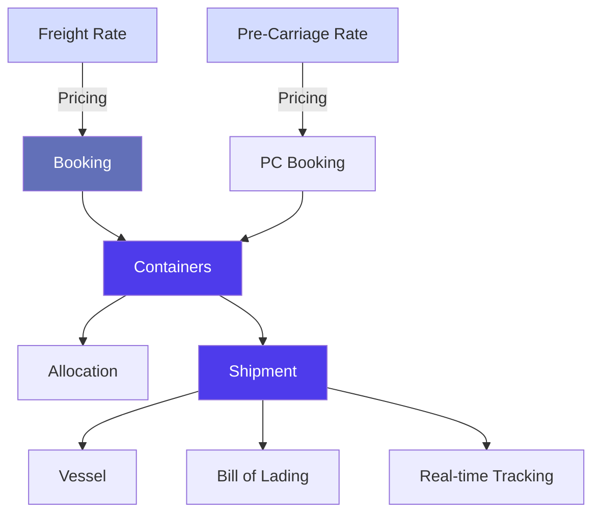
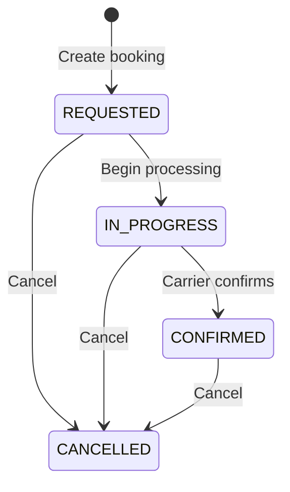
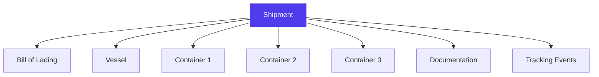

# Logistics & Freight in Jules

> Product documentation — How Jules manages freight rates, bookings, containers, shipments, and the full logistics chain for recyclable commodity trading.

---

## Table of Contents

1. [Overview](#overview)
2. [Logistics Chain](#logistics-chain)
3. [Freight Rates](#freight-rates)
4. [Pre-Carriage Rates](#pre-carriage-rates)
5. [Bookings](#bookings)
6. [Containers](#containers)
7. [Shipments & Tracking](#shipments--tracking)
8. [Allocations](#allocations)
9. [Key Business Rules](#key-business-rules)
10. [Glossary](#glossary)

---

## Overview

Logistics is one of the most complex areas in Jules, reflecting the reality of international recyclable materials trade. It covers everything from local transport to the supplier site, through maritime freight booking, to final delivery at the customer destination.

---

## Logistics Chain

The complete logistics flow in Jules consists of interconnected entities:

---

## Freight Rates

**Freight rates** are the reference prices for maritime transport. They are stored as a rate card that traders and logistics teams use when booking shipments.

### Key Fields

| Field | Description |
|-------|-------------|
| **Shipping line** | The carrier (e.g., MSC, Maersk, CMA CGM) |
| **Port of loading** | Origin port |
| **Port of destination** | Destination port |
| **Cost** | Rate per unit (per container or per tonne) |
| **Logistic material** | Container type (e.g., 20', 40', 40' HC) |
| **Quality group** | Material category the rate applies to |
| **Incoterm** | CIF or CFR |
| **Validity period** | First and last validity dates |
| **Logistic forwarder** | Freight forwarder (if applicable) |

### Additional Costs on Freight

| Cost | Description |
|------|-------------|
| **BL admin cost** | Bill of Lading administrative fees |
| **Customs admin cost** | Customs processing fees |
| **THC admin cost** | Terminal Handling Charges |
| **Volumic customs cost** | Customs cost based on volume |
| **Demurrage** | Fee for container kept at port beyond free time |
| **Detention** | Fee for container kept outside port beyond free time |

### Rate Validation

Freight rates go through a validation process:

| Status | Meaning |
|--------|---------|
| **NOT_VALIDATED** | Rate has not been reviewed |
| **VALIDATED** | Rate has been approved for use |
| **UNCHECKED** | Rate validity not yet determined |

Rates can also be flagged as **spot rates** (one-time) vs regular rates, and as **discounted** rates.

---

## Pre-Carriage Rates

**Pre-carriage** covers the inland transport leg before the main maritime freight — from the supplier site to the port of loading.

### Key Fields

| Field | Description |
|-------|-------------|
| **Pre-carriage line** | The transport provider |
| **Pre-carriage area** | Geographic collection zone |
| **Port of loading** | Destination port for the pre-carriage |
| **Mode** | ROAD, RAIL, or BARGE |
| **Cost** | Rate per unit |
| **Logistic material** | Container/vehicle type |
| **Quality group** | Material category |
| **Validity period** | Active dates for the rate |
| **Allowed shipping lines** | Which shipping lines accept this pre-carriage |
| **Allowed freight forwarders** | Compatible forwarders |

Pre-carriage rates follow the same validation workflow as freight rates (NOT_VALIDATED / VALIDATED / UNCHECKED).

---

## Bookings

A **booking** represents a reservation of shipping space with a carrier. It is the bridge between commercial operations and physical logistics.

### Booking Types

| Type | Description |
|------|-------------|
| **FREIGHT** | Standard container booking on a vessel |
| **CARGO_BULK** | Bulk cargo booking (non-containerized) |

### Booking Lifecycle

| Status | Meaning |
|--------|---------|
| **REQUESTED** | Booking request submitted to carrier |
| **IN_PROGRESS** | Being processed by carrier or forwarder |
| **CONFIRMED** | Space confirmed on the vessel |
| **CANCELLED** | Booking cancelled |

### What's in a booking?

| Field | Description |
|-------|-------------|
| **Reference number** | Booking reference (from the carrier) |
| **Shipping line** | The carrier |
| **Logistic forwarder** | Freight forwarder handling the booking |
| **Vessel** | The ship (with departure dates) |
| **Port of loading / destination** | Route |
| **Number of booked containers** | How many containers reserved |
| **Freight cost** | Cost linked from the freight rate |
| **Demurrage / Detention / Free time** | Container rental terms |
| **Containers** | Physical containers assigned to this booking |

### Cargo Bulk Bookings

For bulk cargo, bookings include additional fields:

| Field | Description |
|-------|-------------|
| **Vessel name / Voyage number** | Specific vessel assignment |
| **Charter party date** | Date of the charter agreement |
| **Ship owner** | Owner of the vessel |
| **Quantity allowance** | MOLOO, CHOPT, or MOLCHOP tolerance type |
| **Request type** | Firm offer or freight indication |

---

## Containers

**Containers** are the physical units of cargo. They sit at the intersection of operations, logistics, and invoicing.

### Container Follow-Up Status

| Status | Meaning |
|--------|---------|
| **UNPLANNED** | Container exists but has no loading date |
| **PLANNED** | Loading date is set |
| **LOADED** | Container has been physically loaded |
| **DELIVERED** | Container has arrived at destination |
| **CLOSED** | All invoicing and documentation complete |

### Booking Status per Container

| Status | Meaning |
|--------|---------|
| **BOOKING_REQUESTED** | Booking has been requested |
| **PC_BOOKED** | Pre-carriage booking confirmed |
| **FREIGHT_BOOKED** | Maritime freight booking confirmed |
| **ALL_BOOKED** | Both pre-carriage and freight confirmed |

### Key Container Data

| Category | Fields |
|----------|--------|
| **Identity** | Harold number, reference number, sealed number, BL number |
| **Weights** | Gross weight, net weight, tare weight, weight slip, maximum gross weight |
| **Dates** | Date of loading, date of delivery, ETA, gated-in date |
| **Logistics** | Port of loading/destination, shipping line, forwarder, pre-carriage line |
| **Margins** | Estimated margin, final margin, total estimated/final margin |
| **Costs** | Estimated freight/logistic/pre-carriage costs |
| **Qualities** | Container-to-operation quality mappings (planned, loaded, delivered quantities) |
| **Tracking** | Location status, timing status, actual/estimated dates |

### Grouping & Reporting

Container follow-ups can be grouped by multiple dimensions for dashboard views:

- Carrier, Shipping line, Forwarder
- Loading date, Delivery date
- Customer site, Supplier site
- Status, Shipment, Material

---

## Shipments & Tracking

A **shipment** groups containers traveling together under a common Bill of Lading (BL). It is the main entity for tracking cargo movement.

### Shipment Structure

### Location Tracking

| Status | Meaning |
|--------|---------|
| **AT_ORIGIN** | Container is at the loading port |
| **LOADED** | Loaded onto the vessel |
| **IN_TRANSIT** | Vessel is sailing |
| **TRANSSHIPMENT** | Container is being transferred between vessels |
| **REACHED_POD** | Arrived at the port of destination |
| **REACHED_DESTINATION_PORT** | At final destination port |
| **COMPLETED** | Delivery complete |

### Timing Status

| Status | Meaning |
|--------|---------|
| **ON_TIME** | Shipment is on schedule |
| **DELAYED** | Shipment is behind schedule |
| **EARLY_ARRIVAL** | Shipment arrived ahead of schedule |

### Tracking Data

Jules supports both **automatic tracking** (via API integration) and **manual tracking** overrides:

| Field | Description |
|-------|-------------|
| **Current ETA** | Latest estimated time of arrival |
| **Original ETA** | Initial ETA at time of sailing |
| **Actual sailing date** | When the vessel departed |
| **Actual arrival at POD** | When the vessel arrived at destination port |
| **Empty container time** | When the container was returned empty |
| **D&D accrued** | Demurrage and detention charges accumulated |
| **Days to ETA** | Countdown to arrival |

### Documentation Status

Shipment documentation follows a workflow:

| Status | Meaning |
|--------|---------|
| **TO_START** | Documentation not yet begun |
| **DRAFT_SHARED** | Draft documents shared for review |
| **APPROVED** | Documents approved |
| **PAYMENT_RECEIVED** | Payment received for document release |
| **SENT_TO_CLIENT** | Final documents sent to the customer |

### Release Types

The Bill of Lading release type determines how cargo is released at destination:

| Release Type | Description |
|-------------|-------------|
| **BILL_OF_LADING** | Original BL required |
| **EXPRESS_RELEASE** | Electronic release, no original BL needed |
| **SEAWAY_BILL** | Non-negotiable transport document |
| **TELEX** | Telex release |
| **OBL** | Original Bill of Lading |
| **RATED_MBL / RATED_HBL** | Rated Master/House BL |
| **TELEXED_MBL / TELEXED_HBL** | Telexed Master/House BL |

---

## Allocations

An **allocation** is the link between a purchase operation and a sale operation at the container level. It represents which purchased material is being sold to which customer.

### Allocation Status

| Status | Meaning |
|--------|---------|
| **DRAFT** | Allocation is provisional |
| **CONFIRMED** | Allocation is finalized |

### Fulfilment Steps

Each allocation tracks its documentation and logistics fulfilment:

| Step | Statuses |
|------|----------|
| **Annex 7** | Pending → Prepared in ERP → Sent to compliance → Sent to supplier → Signed & uploaded |
| **Booking** | Pending → Prepared in ERP → PC booking OK → Freight booking OK → All booking OK |
| **Customs** | Pending → Sent to agent → Sent to carrier |
| **Load Report** | Pending → Prepared → Sent to docs team |
| **VGM** | Submitted or not |
| **Load Details** | Number of details provided |

---

## Key Business Rules

### 1. Freight rate → Booking → Container flow

The typical logistics flow is: negotiate a freight rate → book space → assign containers to the booking → load and ship. Each step references the previous one.

### 2. Estimated vs actual logistics costs

At every level (operation, container, allocation), Jules maintains both **estimated** and **actual** logistics costs. Estimated costs come from freight/pre-carriage rates; actual costs come from invoicing.

### 3. Multi-port bookings

Cargo bulk bookings support multiple loading and destination ports via `BookingToPort`, with quality specifications per port.

### 4. Shipment tracking refresh

Tracking data can be refreshed automatically via `refreshShipmentsTracking`, pulling the latest position and timing data from tracking APIs.

### 5. Free time management

Free time, demurrage, and detention are tracked at both the booking and shipment levels. The `freeTimeLimit` on shipments indicates when demurrage charges begin.

### 6. Container month-to-date KPIs

Jules provides real-time KPIs for containers: planned, to-plan, total, and loaded-today counts, allowing operations teams to monitor daily progress.

---

## Glossary

| Term | Definition |
|------|------------|
| **Allocation** | Link between a purchase and sale operation at the container level |
| **BL (Bill of Lading)** | Transport document issued by the carrier |
| **Booking** | Reservation of shipping space on a vessel |
| **Cargo bulk** | Non-containerized cargo loaded directly on a vessel |
| **Demurrage** | Fee for keeping a container at port beyond free time |
| **Detention** | Fee for keeping a container outside port beyond free time |
| **ETA** | Estimated Time of Arrival |
| **ETD** | Estimated Time of Departure |
| **Free time** | Days a container can stay at port without charges |
| **Freight rate** | Price for maritime transport on a specific route |
| **Fulfilment steps** | Documentation and logistics checklist per allocation |
| **MOLOO** | More or Less Owner's Option — quantity tolerance type |
| **Pre-carriage** | Inland transport from supplier to port of loading |
| **Shipment** | A group of containers traveling under a common BL |
| **THC** | Terminal Handling Charge |
| **VGM** | Verified Gross Mass — mandatory container weight declaration |
