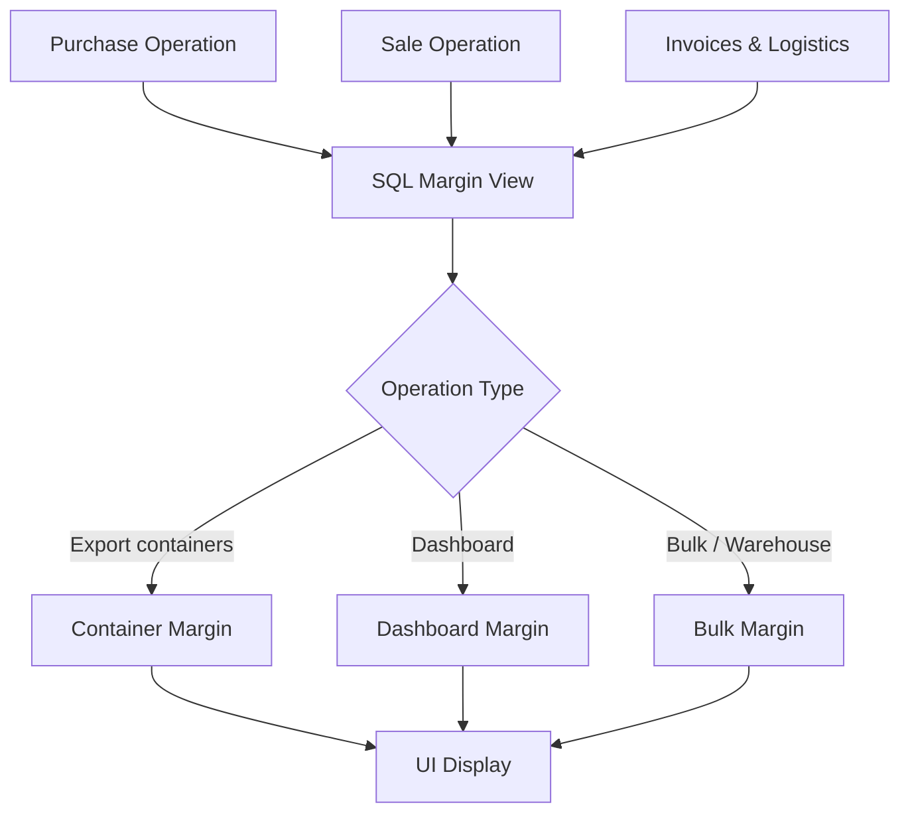
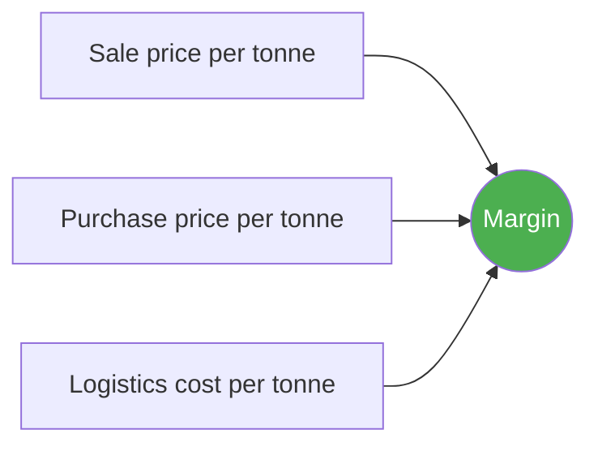
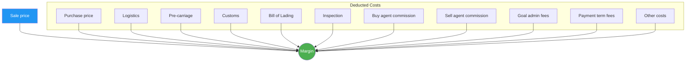
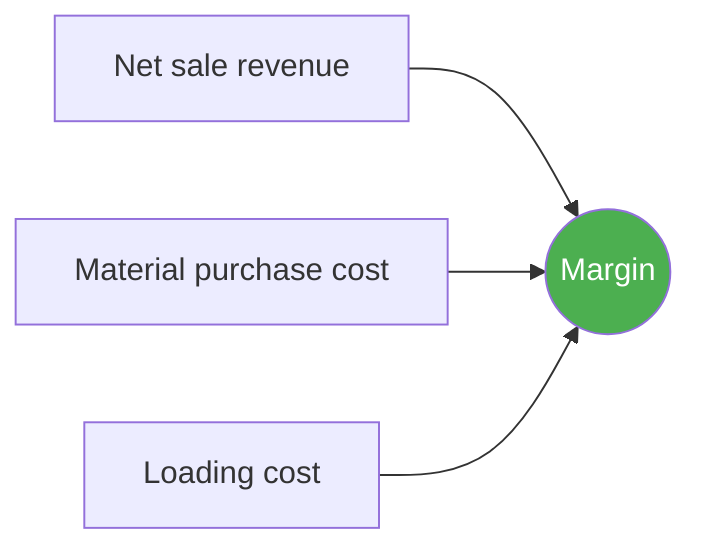

# Margin Calculations in Jules

> Product documentation — How Jules calculates margins on recyclable commodity trading operations.

---

## Table of Contents

1. [Overview](#overview)
2. [Container Margin](#container-margin)
3. [Dashboard Margin](#dashboard-margin)
4. [Bulk Margin](#bulk-margin)
5. [Display in the Interface](#display-in-the-interface)
6. [Key Business Rules](#key-business-rules)
7. [Glossary](#glossary)

---

## Overview

Jules uses **three margin systems** depending on the commercial context:

| System | Usage | Granularity |
|--------|-------|-------------|
| **Container Margin** | Export operations using containers | Per container |
| **Dashboard Margin** | Detailed reporting (dashboards) | Per buy/sell allocation |
| **Bulk Margin** | Bulk or warehouse operations | Per stockpile |

Each system has its own formula, but all share the same objective: measuring the profitability of an operation by comparing the sale price to the total cost (purchase + logistics + fees).

### General Calculation Flow



> **Technical note**: Margins are calculated by **SQL views** (pre-built database queries), not by application code. This ensures consistent calculations throughout the application.

---

## Container Margin

### When is it used?

For **export** operations where goods travel in containers. This is the most common margin type in Jules.

### Formula

```
Margin (per tonne) = Sale price/tonne − Purchase price/tonne − Logistics cost/tonne
```



### Two variants: estimated and final

| | Estimated Margin | Final Margin |
|---|---|---|
| **When** | Before delivery | After invoicing |
| **Based on** | Contractual prices | Actually invoiced prices |
| **Reliability** | Approximate | Definitive |

The **estimated margin** allows profitability to be anticipated from the moment a contract is signed. The **final margin** reflects the actual result once all invoices have been received.

### How margins are aggregated

When multiple containers are grouped together (for example, to view the margin of an entire operation), Jules uses a **quantity-weighted average**:

```
Aggregate margin = Sum(margin × quantity) / Sum(quantity)
```

This means a 25-tonne container carries more weight in the average than a 20-tonne container.

### Grouping dimensions

Container margins are grouped along 5 criteria:

1. **Purchase operation** (buyOperationId)
2. **Sale operation** (sellOperationId)
3. **Purchased quality** (buyOperationQualityId)
4. **Sold quality** (sellOperationQualityId)
5. **Container** (containerId)

### Requirements to calculate the margin

The margin can only be calculated if:
- A **purchase price** and a **sale price** exist
- The **logistics cost** is filled in (when required — see [key business rules](#key-business-rules))

---

## Dashboard Margin

### When is it used?

For **advanced reporting** in dashboards. It breaks down the margin into more than 12 cost items for a comprehensive view of profitability.

### Formula

```
Margin = Sale price
       − Sell agent commission
       − Payment term fees
       − Buy agent commission
       − Inspection
       − Administrative fees
       − Logistics
       − Purchase price
```

### Component breakdown



| Component | Description |
|-----------|-------------|
| **Purchase price** | Purchase price of the commodity |
| **Sale price** | Sale price of the commodity |
| **Logistic** | Main transportation cost (sea freight, etc.) |
| **Pre-carriage** | Pre-carriage cost (local transport before the port) |
| **Customs** | Customs fees |
| **BL (Bill of Lading)** | Fees related to the bill of lading |
| **Inspection** | Quality inspection cost |
| **Buy agent commission** | Commission of the agent on the buy side |
| **Sell agent commission** | Commission of the agent on the sell side |
| **Goal admin** | Administrative fees related to goals |
| **Payment term fees** | Fees related to payment terms (discount, etc.) |
| **Other costs** | All other uncategorized fees |

### Currency conversion

All components are **converted to the sale currency** before the margin is calculated. If the purchase is in USD and the sale is in EUR, the purchase price is converted to EUR at the applicable exchange rate.

### Unit normalization

All prices are reduced to a **per-tonne basis** to ensure comparability, regardless of the original unit (kg, short tonne, etc.).

---

## Bulk Margin

### When is it used?

For **bulk** operations or operations linked to a **warehouse**, where the commodity is stored in **stockpiles** before being resold.

### Formula

```
Margin = Net sale revenue − Material purchase cost − Loading cost
```



### Key feature: the stockpile weighted average cost

Unlike container margins, the purchase price is not that of a specific contract. It is the **weighted average cost** (`mean_purchase_cost`) of the stockpile — that is, the average of all purchases that fed the stockpile, weighted by their respective quantities.

> **Example**: A stockpile receives 100T at 200 USD/T then 50T at 250 USD/T. The weighted average cost = (100×200 + 50×250) / 150 = **216.67 USD/T**.

---

## Display in the Interface

### Where to see margins?

Margins appear in several places in Jules:

| Location | Component | Description |
|----------|-----------|-------------|
| Purchase table | "Margin" column | Estimated and final margin per purchase line |
| Sale table | "Margin" column | Estimated and final margin per sale line |
| Margin popover | Click on the margin value | Detail: sale price, purchase price, logistics cost, other costs |
| Container modal | Margin section | Container margin in the delivery modal |

### Color coding

| Color | Meaning |
|-------|---------|
| **Green** | Positive margin (the operation is profitable) |
| **Orange / Red** | Negative margin (the operation is losing money) |

### Detail shown in the popover

When clicking on a margin value, a popover displays:

1. **Sale price** per tonne
2. **Purchase price** per tonne
3. **Logistics cost** per tonne
4. **Other costs** per tonne
5. **Final margin** = result of the calculation

---

## Key Business Rules

### 1. When is logistics required?

The logistics cost is only required in one specific case:

```
Logistics required if:
  Sale Incoterm ≠ EXW  AND  Purchase Incoterm = EXW
```

> **In plain terms**: If the buyer purchases "ex works" (EXW) but the seller delivers beyond that point (CFR, CIF, FOB, etc.), then the organization bears the transportation cost — it must therefore be included in the margin calculation.

If both Incoterms are EXW, or if the purchase Incoterm already includes transport, logistics is not required.

### 2. Margin field structure

Each monetary value in the margins follows a **3-component pattern**:

| Component | Role | Example |
|-----------|------|---------|
| **Quantity** | The amount | `150.00` |
| **Currency** | The currency | `USD` |
| **Volume** | The unit of measure | `T` (tonne) |

For example, a margin of 150 USD/tonne is stored as: `{ quantity: 150, currency: "USD", volume: "T" }`.

### 3. Multi-tenant

Each organization has its own isolated database. The margins of one organization are never mixed with those of another.

---

## Glossary

| Term | Definition |
|------|------------|
| **Allocation** | Link between a purchase operation and a sale operation |
| **BL (Bill of Lading)** | Maritime bill of lading — transport document |
| **Bulk** | Loose commodity (not containerized) |
| **EXW (Ex Works)** | "Ex works" Incoterm — the buyer assumes all transport costs |
| **CFR / CIF / FOB** | Incoterms that include all or part of sea transport |
| **Incoterm** | International commercial term defining who pays for transport and insurance |
| **Estimated margin** | Margin calculated on contractual prices (before delivery) |
| **Final margin** | Margin calculated on invoiced prices (after delivery) |
| **Mean purchase cost** | Weighted average purchase cost of a stockpile |
| **Stockpile** | A pile of commodity in a warehouse |
| **Tonne** | Base unit for price normalization in Jules |
| **SQL view** | Pre-built database query that automatically calculates margins |
