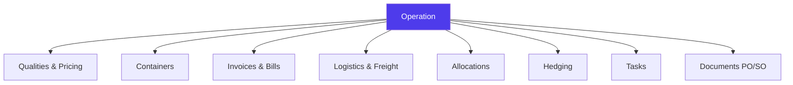
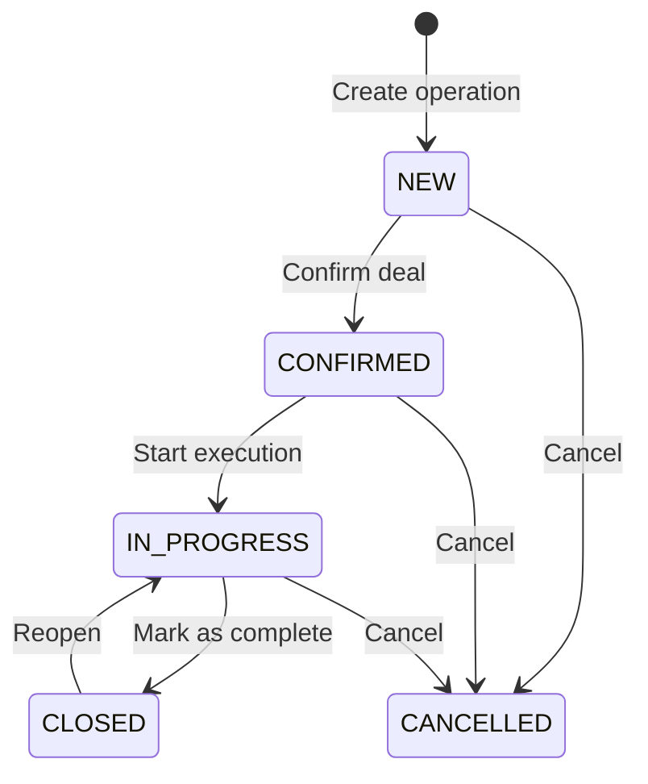
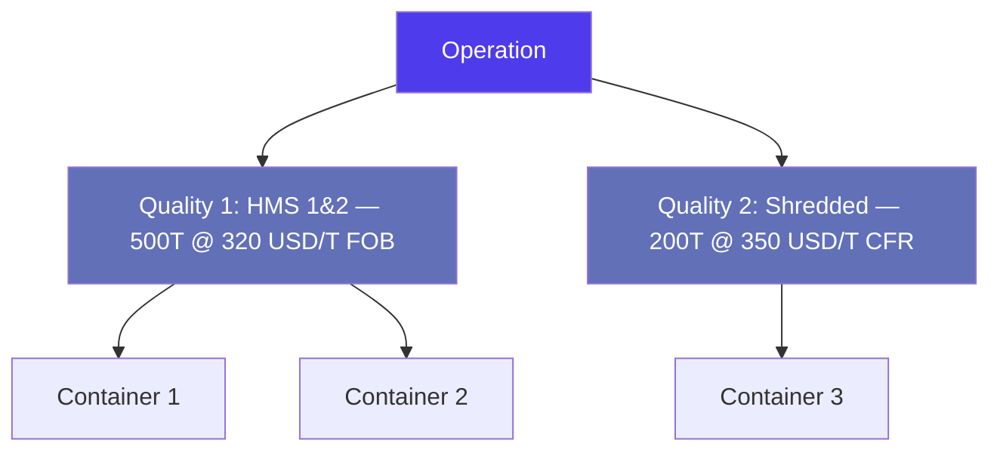
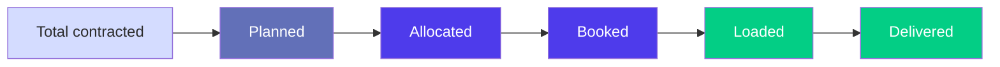
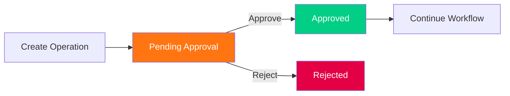
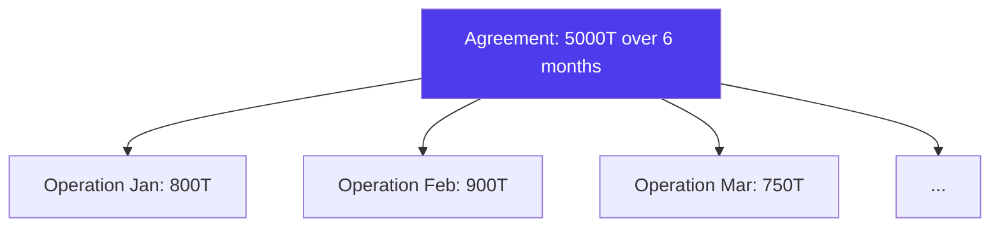
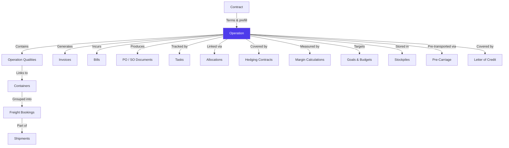

# Operations & Lifecycle in Jules

> Product documentation — How Jules models trade operations, their lifecycle, and the relationships that drive the entire supply chain.

---

## Table of Contents

1. [Overview](#overview)
2. [Operation Types & Market Modes](#operation-types--market-modes)
3. [Operation Lifecycle](#operation-lifecycle)
4. [Operation Qualities](#operation-qualities)
5. [Pricing Models](#pricing-models)
6. [Follow-Up Tracking](#follow-up-tracking)
7. [Approval Workflow](#approval-workflow)
8. [Agreements (Term Contracts)](#agreements-term-contracts)
9. [Relationships with Other Modules](#relationships-with-other-modules)
10. [Key Business Rules](#key-business-rules)
11. [Glossary](#glossary)

---

## Overview

An **operation** is the central entity in Jules. It represents a commercial transaction — either a **purchase** or a **sale** — of recyclable commodities between your organization and a counterparty (supplier or customer).

Everything in Jules revolves around operations: containers are attached to them, invoices are generated from them, margins are calculated across them, and logistics is planned around them.



### What makes an operation?

At its core, an operation captures:

| Dimension | Description |
|-----------|-------------|
| **Direction** | Purchase (BUY) or Sale (SELL) |
| **Counterparty** | The company you're trading with |
| **Site** | The physical location involved |
| **Qualities** | What materials, at what price, in what quantity |
| **Market type** | Export or Local |
| **Shipment mode** | Container, Bulk cargo, or Truck/Rail/Barge |

---

## Operation Types & Market Modes

### Direction: Buy vs Sell

Every operation has a **type** that determines its role in the trade flow:

| Type | Role | Counterparty | Typical actions |
|------|------|--------------|-----------------|
| **BUY** | Purchase from a supplier | Supplier company | Create PO, receive goods, pay supplier |
| **SELL** | Sale to a customer | Customer company | Create SO, ship goods, invoice customer |

A complete trade typically involves one purchase operation and one (or more) sale operations, linked together through **allocations**.

### Market Type

| Market | Description | Typical logistics |
|--------|-------------|-------------------|
| **EXPORT** | International trade, cross-border | Maritime freight (containers or bulk) |
| **LOCAL** | Domestic trade, same country | Truck, rail, or barge |

### Shipment Mode

| Mode | Description | Use case |
|------|-------------|----------|
| **CONTAINER** | Goods loaded in standard shipping containers | Most common for export |
| **BULK_CARGO** | Loose cargo loaded directly onto a vessel | Large volumes (e.g., bulk metals) |
| **TRUCK_RAIL_BARGE** | Land/inland waterway transport | Local operations, pre-carriage |

---

## Operation Lifecycle

Every operation follows a defined lifecycle through **five statuses**:



### Status Definitions

| Status | Meaning | What happens |
|--------|---------|--------------|
| **NEW** | Operation has been created but not yet confirmed | Draft state — terms can still change freely |
| **CONFIRMED** | Deal is confirmed with the counterparty | Commercial terms are locked; PO/SO can be generated |
| **IN_PROGRESS** | Execution has started | Containers are being loaded, shipped, or delivered |
| **CLOSED** | Operation is complete | All goods delivered, invoices settled; operation is archived |
| **CANCELLED** | Operation was abandoned | No further action possible |

### Cancellation Reasons

When an operation is cancelled, a reason must be provided:

| Reason | Description |
|--------|-------------|
| **Documentation / License Problem** | Missing permits, licenses, or documentation |
| **Operational Problems / Delays** | Logistic or operational issues making execution impossible |
| **Over-competitive Quote** | The counterparty found a better deal elsewhere |
| **Payment Due** | Payment issues preventing the deal from proceeding |
| **Other** | Any other reason (free-text comment can be added) |

### Closing & Reopening

- **Closing** (`markAsComplete`) moves an operation from IN_PROGRESS to CLOSED. Multiple operations can be closed in batch.
- **Reopening** (`markAsOpen`) moves a CLOSED operation back to IN_PROGRESS, for example when a late invoice requires adjustments.

---

## Operation Qualities

An operation can contain **one or more qualities** — each representing a distinct material being traded. This is a key concept: the commercial terms (price, incoterm, quantity) are defined **per quality**, not per operation.



### What's in an Operation Quality?

| Field | Description |
|-------|-------------|
| **Quality** | The material grade (e.g., HMS 1&2, OCC, LDPE Film) |
| **Quantity** | How much material (in tonnes, containers, or other units) |
| **Price** | The agreed price per unit |
| **Price type** | SPOT (fixed) or INDEX (formula-based) |
| **Incoterm** | Commercial terms (FOB, CFR, CIF, EXW, etc.) |
| **Port of Loading / Destination** | Logistics routing |
| **MQC** | Minimum Quality Commitment |
| **Equipment** | Container type (e.g., 40' HC, 20' standard) |
| **Tolerance rate** | Allowed quantity deviation (e.g., +/- 5%) |

### Quality Follow-Up

Each quality has its own follow-up tracking (see [Follow-Up Tracking](#follow-up-tracking)) to monitor how much has been allocated, booked, loaded, and delivered against the contracted quantity.

---

## Pricing Models

Jules supports three pricing models at the quality level:

### 1. Spot Price (Fixed)

A fixed price agreed at the time of the deal.

```
Price = 320 USD / T
```

Simple and definitive — the price doesn't change.

### 2. Index Price (Formula-based)

The price is calculated based on a market index, with optional adjustments:

```
Price = Index Value + Differential + Other Costs
```

Index pricing supports complex configurations:

| Parameter | Description |
|-----------|-------------|
| **Index** | The market reference (e.g., Platts, LME, TSI) |
| **Differential** | Premium or discount applied on top of the index |
| **Recovery rate** | Percentage of the index value applied |
| **Quotational Period** | The time window for averaging index values |
| **Contango** | Forward premium for future delivery |
| **Formula** | Mathematical formula combining multiple indices |

Jules can combine **two indices** in a single quality line, each with its own recovery rate, timing, and price mode.

### 3. Temporary Price

When the final price is not yet known (e.g., pending index fixation), Jules supports **temporary prices** that are later replaced by the definitive price. This is flagged at the quality level (`isTemporaryPrice`).

---

## Follow-Up Tracking

The **follow-up** is a real-time progress tracker that shows where an operation stands in its physical execution. It appears as a visual pipeline in the UI.



### Follow-Up Stages

| Stage | Definition | What it means |
|-------|-----------|---------------|
| **Total** | The full contracted quantity | What was agreed in the operation |
| **Planned** | Quantity assigned to containers (not yet allocated to a counterpart) | Containers exist but are not linked to a buy/sell pair |
| **Allocated** | Quantity matched between a purchase and a sale | Buy and sell sides are connected |
| **Booked** | Quantity with a confirmed freight booking | Shipping space has been reserved |
| **Loaded** | Quantity physically loaded onto a vessel | Cargo is on the ship |
| **Delivered** | Quantity received at destination | Goods have arrived |

Follow-up quantities are tracked both in **tonnes** and in **number of containers**, giving traders a dual view of progress.

### Month-to-Date Tracking

Jules also provides **month-to-date** aggregations for both purchases and sales, allowing traders to compare their current execution pace against targets.

---

## Approval Workflow

Operations can be subject to an **approval process** before they become executable. This is controlled by the `isApproved` flag and the dedicated approval/rejection mutations.



### How it works

1. A trader creates an operation
2. The operation is flagged as **pending approval** (validation status = PENDING)
3. Authorized approvers can **approve** or **reject** the operation (with a comment)
4. Approved operations proceed normally; rejected operations require revision

Multiple operations can be approved or rejected in **batch** using the bulk approval action.

> **Note**: The approval system uses a generic entity (`Approval`) that also applies to budgets, contracts, and other entities via the `LinkedEntityEnum`.

---

## Agreements (Term Contracts)

An **agreement** is a special type of operation (`isAgreement = true`) that represents a long-term contract with a counterparty, typically covering a period of several months.



### Key characteristics

| Feature | Description |
|---------|-------------|
| **Parent-child relationship** | Individual operations are created as children of the agreement |
| **Quantity tracking** | Jules tracks how much of the agreement has been fulfilled (`agreementFulfilledQuantity`) |
| **Renewal** | Agreements can be renewed via the `renewOperation` mutation |
| **Discount tiers** | Agreements can define volume-based discounts (percentage or spread) |
| **Allocation instructions** | Agreements carry instructions for how allocations should be handled |

### Fulfillment tracking

Each quality on an agreement tracks:
- **Fulfilled quantity** — how much has been executed through child operations
- **Allocated quantity** — how much has been allocated to buy/sell pairs
- **Loaded quantity** — how much has been physically loaded
- **Delivered quantity** — how much has arrived at destination

---

## Relationships with Other Modules

An operation is the hub that connects most of Jules' modules:



| Related module | Relationship |
|----------------|-------------|
| **Contract** | Provides default terms that prefill operation fields |
| **Containers** | Physical units of cargo attached to operation qualities |
| **Allocations** | Links between purchase and sale operations |
| **Freight Bookings** | Shipping space reservations for the operation's containers |
| **Shipments** | Groups of bookings forming a complete shipment |
| **Invoices** | Purchase and sale invoices generated from the operation |
| **Bills** | Third-party costs (logistics, customs, inspection) |
| **Documents (PO/SO)** | Purchase Orders and Sales Orders generated as PDFs |
| **Tasks** | Action items and checklists tracked per operation |
| **Hedging Contracts** | Financial instruments covering commodity price risk |
| **Goals** | Commercial targets that operations contribute to |
| **Stockpiles** | Warehouse stock that operations feed or deplete |
| **Pre-Carriage** | Local transport legs before the main freight |
| **Letter of Credit** | Financial guarantee instruments attached to operations |
| **Margin** | Profitability calculations derived from buy/sell pairs |

---

## Key Business Rules

### 1. Operation numbering

Every operation receives a unique **Harold number** (`harold_number`) automatically generated by the system. This is the primary reference used across the platform and in communications with counterparties.

### 2. Multi-quality operations

An operation can include multiple qualities, each with its own price, incoterm, quantity, and port routing. This is common when a single commercial deal covers several material grades.

### 3. Document generation workflow

Documents follow a progression tracked by the **PO/SO status**:

| Status | Meaning |
|--------|---------|
| **PENDING** | Document not yet created |
| **CREATED** | Document generated as PDF |
| **SENT** | Document sent to the counterparty |
| **SIGNED_AND_UPLOADED** | Signed document uploaded back to Jules |

### 4. Maturity classification

Operations are classified by **maturity** — a configurable label (e.g., "Spot", "30 days", "60 days") with an associated probability percentage. This allows traders to weight their pipeline by likelihood of closing.

### 5. Warehouse operations

Operations flagged as `isWarehouse = true` follow a different flow: goods are received into a **stockpile** at a warehouse site, and later sold from that stockpile. This changes how margins are calculated (see [Margin Calculations](/docs/margin-calculations)).

### 6. Roles on an operation

| Role | Description |
|------|-------------|
| **Created by** | The user who created the operation |
| **Assigned to** | The trader responsible for the operation |
| **Admin** | The administrative contact |
| **Account rep** | The account representative |
| **Signatory** | The person who signs documents |
| **Watchers** | Users who receive notifications about the operation |

### 7. Agent commissions

An intermediary **agent** can be attached to an operation, with a commission defined either as a **fixed amount per unit** or as a **percentage** of the price.

### 8. ERP synchronization

Operations can be synchronized to an external ERP system via the `synchronizeOperationToErp` action, pushing the operation data to third-party accounting or logistics systems.

### 9. Sharing & portal access

Operations can be **shared** with external counterparties via a portal. Shared operations are visible to the counterparty's portal users, with restricted fields (prices, margins, and internal costs are hidden).

---

## Operation Detail View

The operation detail page in Jules is organized in tabs:

| Tab | Content |
|-----|---------|
| **Qualities** | Material lines with prices, quantities, incoterms |
| **Follow-Up** | Visual progress tracker (planned → delivered) |
| **Price & Cost** | Detailed pricing, costs, and margin overview |
| **Activities** | Audit trail of all changes and communications |
| **Linked Operations** | Related buy/sell operations via allocations |
| **Reception** | Delivery receipts and weight slips |
| **Budgets** | Budget allocations linked to this operation |
| **Purchase Goals** | Goals this operation contributes to |
| **Agreement Operations** | Child operations (for agreements only) |

---

## Glossary

| Term | Definition |
|------|------------|
| **Allocation** | A link connecting a purchase quality to a sale quality, matching buy and sell sides |
| **Agreement** | A long-term contract operation covering multiple shipments over time |
| **BUY / SELL** | The two operation directions — purchase and sale |
| **Container** | A physical shipping container attached to an operation quality |
| **Follow-up** | Real-time tracking of an operation's physical progress |
| **Harold number** | The unique identifier automatically assigned to every operation |
| **Incoterm** | International Commercial Term defining transport and cost responsibilities |
| **Index price** | A price derived from a market reference (LME, Platts, TSI, etc.) |
| **Maturity** | A configurable classification indicating deal probability |
| **MQC** | Minimum Quality Commitment — the minimum weight per container |
| **Operation Quality** | A material line within an operation, carrying its own commercial terms |
| **PO (Purchase Order)** | The document sent to a supplier confirming a purchase |
| **SO (Sales Order)** | The document sent to a customer confirming a sale |
| **Spot price** | A fixed price agreed at the time of the deal |
| **Stockpile** | A physical pile of material stored in a warehouse |
| **Temporary price** | A provisional price used before the final price is determined |
| **Watcher** | A user subscribed to notifications on an operation |
