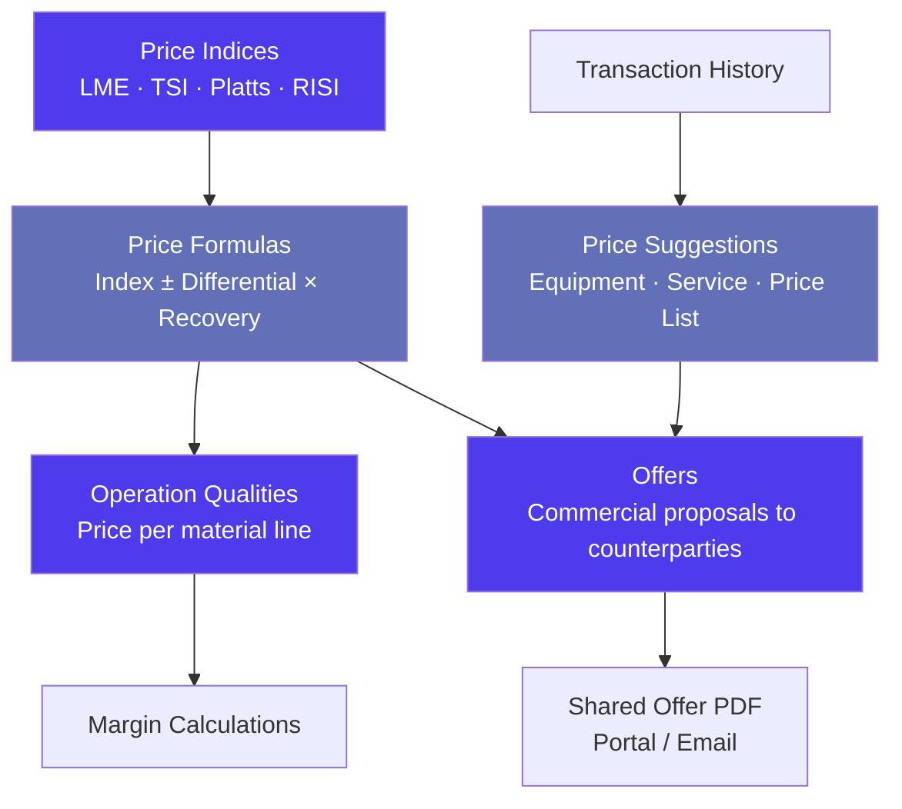
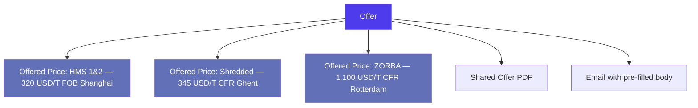
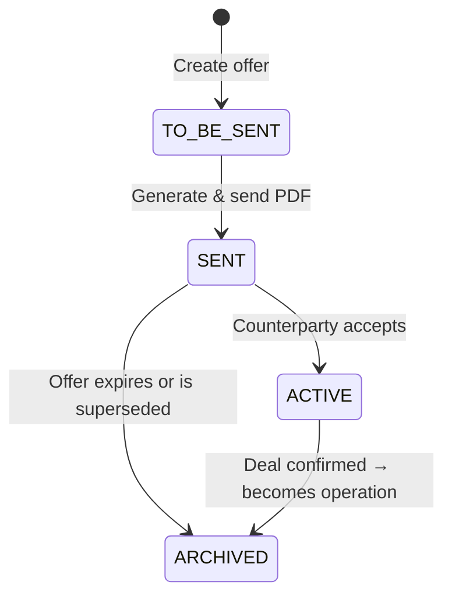
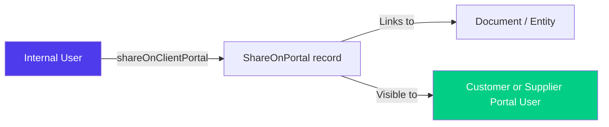
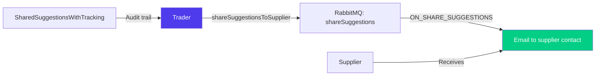

> Product documentation — How Jules models commodity pricing from raw market indices through formula-based contracts to commercial offers, price intelligence, and portal-shared documents.

---

## Table of Contents

1. [Overview](#overview)

2. [Price Indices](#price-indices)

3. [Price Formulas](#price-formulas)

4. [Price Index Prompts](#price-index-prompts)

5. [Offers & Offered Prices](#offers--offered-prices)

6. [Offer Lifecycle](#offer-lifecycle)

7. [Price Suggestions](#price-suggestions)

8. [The Suggestion System (Price Lists)](#the-suggestion-system-price-lists)

9. [Portal Sharing](#portal-sharing)

10. [Shared Suggestions](#shared-suggestions)

11. [Unexpected Costs](#unexpected-costs)

12. [Questions (Form Configuration)](#questions-form-configuration)

13. [Key Business Rules](#key-business-rules)

14. [Glossary](#glossary)

---

## Overview

Recyclable commodity trading is inherently price-volatile. A tonne of HMS 1&2 purchased in Rotterdam may be priced against the LME Steel Scrap index average for the week of shipment, minus a differential, times a recovery rate. A bale of OCC may be priced against the RISI Paper index for the previous month. Jules is built to handle this complexity natively.

The pricing engine in Jules connects four distinct layers:



| Layer                 | What it represents                                                     |
| --------------------- | ---------------------------------------------------------------------- |
| **Price Indices**     | Raw market reference values (LME, TSI, Platts, etc.) stored per period |
| **Price Formulas**    | Reusable formula templates combining indices with adjustments          |
| **Offers**            | Outbound commercial proposals listing prices per material quality      |
| **Price Suggestions** | System-generated pricing intelligence based on historical data         |
| **Unexpected Costs**  | Post-shipment cost adjustments that were not part of the original deal |

---

## Price Indices

A **price index** is a named market reference value used to determine the base price in formula-based deals. Jules stores indices internally, allowing them to be referenced in price formulas and operation qualities.

### What is a price index?

| Field    | Description                                                                         |
| -------- | ----------------------------------------------------------------------------------- |
| `value`  | The name of the index (e.g., "LME Steel Scrap", "TSI 58% CFR China", "RISI OCC 11") |
| `index`  | The numeric value of the index for the given period                                 |
| `period` | The time period this index value applies to (e.g., "2024-W48", "2024-11")           |

Indices are unique per `(value, period)` combination — Jules will silently ignore duplicate entries for the same index in the same period.

### Common market indices in recyclable commodities trading

| Category               | Index examples                          | Common use                            |
| ---------------------- | --------------------------------------- | ------------------------------------- |
| **Ferrous metals**     | LME Steel Scrap, TSI HMS 1&2 CFR Turkey | HMS, shredded, busheling pricing      |
| **Non-ferrous metals** | LME Copper, LME Aluminium, LME Zinc     | Copper, aluminium, mixed metal grades |
| **Paper & Cardboard**  | RISI OCC, RISI ONP, Yellow Sheet        | OCC, ONP, newsprint pricing           |
| **Plastics**           | ICIS LDPE, Platts HDPE                  | PE film, HDPE containers              |

> **Admin note**: Price index values must be entered or imported manually per period. There is no automatic market data feed in the current version. Creating a new index via `createPriceIndex` is idempotent — duplicate (value, period) entries are ignored.

---

## Price Formulas

A **price formula** is a reusable template that defines how to calculate the final price from one or two market indices. Formulas are selected at the operation quality or offer level, replacing the need to re-enter the calculation logic for each deal.

### Formula structure

Every formula follows a mathematical pattern combining:

- **Index 1** — the primary market reference

- **Index 2** (optional) — a secondary index for blended formulas

- **Differential** — a fixed premium or discount applied to the index

- **Recovery rate** — a percentage of the index value applied (e.g., 80% recovery)

- **Other costs** — additional deductions or additions

- **Contango** — forward premium for future delivery

### Supported formula codes

| Formula code                                                          | Expression                                                  |
| --------------------------------------------------------------------- | ----------------------------------------------------------- |
| `INDEX`                                                               | `Index`                                                     |
| `INDEX_MINUS_DIFFERENTIAL`                                            | `Index − Differential`                                      |
| `INDEX_TIMES_RECOVERY`                                                | `Index × Recovery`                                          |
| `INDEX_MINUS_DIFFERENTIAL_TIMES_RECOVERY`                             | `(Index − Differential) × Recovery`                         |
| `INDEX_TIMES_RECOVERY_MINUS_OTHER_COSTS`                              | `(Index × Recovery) − Other Costs`                          |
| `INDEX_MINUS_DIFFERENTIAL_TIMES_RECOVERY_MINUS_OTHER_COSTS`           | `(Index − Differential) × Recovery − Other Costs`           |
| `INDEX_MINUS_BRACKETED_DIFFERENTIAL_TIMES_RECOVERY_MINUS_OTHER_COSTS` | `Index − (Differential × Recovery) − Other Costs`           |
| `INDEX_MINUS_OTHER_COSTS`                                             | `Index − Other Costs`                                       |
| `INDEX_PLUS_OTHER_COSTS`                                              | `Index + Other Costs`                                       |
| `INDEX_PLUS_OTHER_COST_1_PLUS_OTHER_COST_2`                           | `Index + Cost 1 + Cost 2`                                   |
| `INDEX_TIMES_RECOVERY_MINUS_UNITS`                                    | `(Index × Recovery) − Units`                                |
| `INDEX_PLUS_INDEX_2_PLUS_OTHER_COSTS`                                 | `Index + Index 2 + Other Costs`                             |
| `INDEX_PLUS_INDEX_2_PLUS_OTHER_COSTS_CONTANGO`                        | `Index + Index 2 + Other Costs + Contango`                  |
| `INDEX_TIMES_RECOVERY_PLUS_INDEX_2_TIMES_RECOVERY_2_PLUS_OTHER_COSTS` | `(Index × Recovery) + (Index 2 × Recovery 2) + Other Costs` |

### Index configuration options

When a formula references an index, each index slot has additional configuration:

| Option          | Values            | Meaning                                                 |
| --------------- | ----------------- | ------------------------------------------------------- |
| **Price mode**  | `SINGLE_DAY`      | Use the index value for a single specific day           |
|                 | `AVERAGE_M_1`     | Use the average index value for the previous month      |
|                 | `AVERAGE_W_1`     | Use the average index value for the previous week       |
|                 | `CUSTOM_RANGE`    | Use the average over a custom date range                |
|                 | `FIXED`           | Use a fixed numeric value regardless of market movement |
| **Price type**  | `CLOSING`         | End-of-day closing price                                |
|                 | `OFFICIAL`        | Official settlement price (common for LME)              |
|                 | `LIVE`            | Real-time or intraday price                             |
|                 | `MARKET_ON_CLOSE` | Price at market close                                   |
| **Optionality** | `HIGHEST`         | Use the higher of two possible index values             |
|                 | `LOWEST`          | Use the lower of two possible index values              |

### Practical example

A typical ferrous scrap purchase formula might be:

```
Price = (LME Steel Scrap — Average M-1, Official) × 78% Recovery — 15 USD/T Other Costs
```

This formula code would be `INDEX_TIMES_RECOVERY_MINUS_OTHER_COSTS`, configured with:

- Index 1 = LME Steel Scrap

- Price mode = AVERAGE\_M\_1

- Price type = OFFICIAL

- Recovery = 78%

- Other costs = 15 USD/T

---

## Price Index Prompts

A **price index prompt** is a scheduled reference point associated with a specific index. When an operation or offer uses a formula with a `CUSTOM_RANGE` or specific-day price mode, the prompt defines *which exact period or settlement date* is used to fix the price.

Prompts are stored in the `price_index_to_prompts` table, linked to a `PriceIndex` by `indexId`. The `prompt` field contains a human-readable label (e.g., "March 2025 average", "Week 12 settlement") that traders can select from a dropdown when configuring a quality line.

> **Business meaning**: In commodity trading, agreeing on the "quotational period" — the specific window over which index values are averaged to determine the final price — is a critical commercial term. Price index prompts allow your team to pre-configure common quotational periods and reference them consistently across deals, reducing errors and disputes.

---

## Offers & Offered Prices

An **offer** is a formal commercial proposal sent to a potential counterparty (customer or supplier) before a deal is confirmed as an operation. Offers list the materials you are willing to trade, at what prices, with what logistics terms.



### Offer fields

| Field            | Description                                                     |
| ---------------- | --------------------------------------------------------------- |
| `company`        | The counterparty this offer is addressed to                     |
| `contacts`       | The specific contacts at that company who receive the offer     |
| `createdBy`      | The trader or user who created the offer                        |
| `dateOfCreation` | The date of the offer                                           |
| `endDate`        | Optional expiry date — after which the offer is no longer valid |
| `marketType`     | Whether this is an EXPORT or LOCAL offer                        |
| `maturity`       | The commercial status of the offer (see lifecycle below)        |
| `paymentTerms`   | Payment conditions communicated to the counterparty             |
| `comment`        | Free-text notes visible on the offer document                   |
| `docFormat`      | Preferred PDF output format                                     |
| `offeredPrices`  | The list of material price lines (see below)                    |

### Offered price fields

Each material line within an offer is an **offered price**:

| Field                   | Description                                              |
| ----------------------- | -------------------------------------------------------- |
| `quality`               | The material grade being offered (e.g., HMS 1&2, OCC 11) |
| `price`                 | The proposed price per unit                              |
| `quantity`              | The proposed quantity for this material                  |
| `incoterms`             | One or more applicable incoterms (e.g., FOB, CFR, EXW)   |
| `sites`                 | The origin site(s) where material is available           |
| `destinations`          | The destination site(s) this price applies to            |
| `estimatedLogisticCost` | Optional estimated freight/logistics cost                |
| `mqc`                   | Minimum Quality Commitment per container                 |
| `logisticMaterials`     | Logistic equipment types (e.g., container size)          |
| `comment`               | Free-text note on this specific material line            |

> **Note**: A single offered price can span multiple incoterms and multiple destination sites. Jules flattens these combinations into separate rows when generating the PDF document, so the counterparty sees a full price matrix per quality, destination, and incoterm.

---

## Offer Lifecycle

Every offer moves through four **maturity** stages:



| Maturity         | Meaning                                                              |
| ---------------- | -------------------------------------------------------------------- |
| **TO\_BE\_SENT** | Offer is drafted but not yet sent to the counterparty                |
| **SENT**         | The offer PDF has been generated and sent                            |
| **ACTIVE**       | The counterparty has expressed interest; negotiation is ongoing      |
| **ARCHIVED**     | The offer is no longer active (deal confirmed, rejected, or expired) |

### Generating a shared offer PDF

Jules can generate a professional PDF of the offer and produce a pre-filled email body for sending to the counterparty. This is triggered by:

- `generateSharedOffer` — generates the PDF for an existing offer

- `createAndGenerateSharedOffer` — creates the offer and immediately generates the PDF in one step

- `updateAndGenerateSharedOffer` — updates the offer and regenerates the PDF

The generated document:

- Uses a configured PDF template (`SHARED_OFFER` document type)

- Groups offered prices by destination or quality depending on configuration

- Applies rounding rules for quantities and prices

- Triggers any configured outbound webhooks (`ON_SHARE_OFFER` trigger)

- Returns a `url` (downloadable PDF link), `mailTitle`, and `mailBody` for the email

### Renewing offers

The `generateUpdatedOffers` mutation allows bulk renewal of offers — useful at the start of a new trading period when the same price structure needs to be refreshed with updated dates. Offers are cloned with new dates while preserving their material lines and pricing.

---

## Price Suggestions

When creating an offer or configuring an operation, Jules provides **price suggestions** — historically derived reference prices to help traders fill in values quickly and consistently.

There are two types of granular price suggestions:

### Equipment price suggestions

**Equipment price suggestions** (`EquipmentPriceSuggestion`) provide reference prices for specific container equipment types and material grades:

| Field        | Description                                         |
| ------------ | --------------------------------------------------- |
| `equipment`  | The equipment type (e.g., "40' HC", "20' standard") |
| `quality`    | The material quality this price applies to          |
| `price`      | The suggested price per unit                        |
| `priceType`  | Whether this is a SPOT or INDEX price               |
| `modalities` | Additional logistics modalities                     |
| `date`       | The date this suggestion was recorded               |

Filtering supports combinations of equipment type, quality, and modalities. Queries using `null` equipment or quality match all — the system returns suggestions for all equipment types or all grades when no filter is specified.

### Service price suggestions

**Service price suggestions** (`ServicePriceSuggestion`) provide reference prices for specific services (e.g., inspection, pre-carriage, port handling) by equipment type and material grade:

| Field        | Description                                                         |
| ------------ | ------------------------------------------------------------------- |
| `service`    | The service type (e.g., "inspection", "fumigation", "pre-carriage") |
| `equipment`  | The container equipment type                                        |
| `quality`    | The material quality                                                |
| `price`      | The suggested price for this service                                |
| `priceType`  | SPOT or INDEX                                                       |
| `modalities` | Additional logistics modalities                                     |
| `date`       | The date this suggestion was recorded                               |

> **Business meaning**: Service price suggestions help operations teams quickly recall what an inspection costs for a 40' container of HMS at a given port, based on what was actually invoiced in previous deals — reducing the risk of underestimating costs when creating new operations or offers.

---

## The Suggestion System (Price Lists)

Beyond equipment and service-level suggestions, Jules has a broader **Suggestion** system that generates full **price list views** — structured grids of target prices per site, quality, incoterm, and destination.

There are three suggestion types:

| Type                  | Description                                                                                                                                          |
| --------------------- | ---------------------------------------------------------------------------------------------------------------------------------------------------- |
| `PRICE_LIST`          | A sale price list for a specific customer site — prices per quality, incoterm, and destination, enriched with goal-based target prices               |
| `SALES_PRICE_LIST`    | A sales-oriented price list for offers to a specific customer                                                                                        |
| `PURCHASE_PRICE_LIST` | A procurement view showing all supplier sites for a given quality, with their last operation date, last activity date, applicable incoterms, and MQC |

### What a suggestion contains

Each suggestion (whether `LocalSuggestion` or `ExportSuggestion`) carries:

| Field                     | Description                                                                                        |
| ------------------------- | -------------------------------------------------------------------------------------------------- |
| `site`                    | The supplier or customer site                                                                      |
| `quality`                 | The material grade                                                                                 |
| `incoterm`                | The applicable incoterm                                                                            |
| `targetPrice`             | The target price from a Goal (if one exists for this quality + destination + incoterm combination) |
| `defaultMargin`           | The default margin configured for this site-quality combination                                    |
| `capacity`                | The contracted capacity for this site-quality pair                                                 |
| `fulfilledCapacity`       | How much of the capacity has been executed so far                                                  |
| `mqc`                     | Minimum Quality Commitment (site-specific or quality-group default)                                |
| `defaultCurrency`         | The preferred currency for this site-quality pair                                                  |
| `defaultQuantityUnitCode` | The preferred volume unit                                                                          |
| `marketType`              | EXPORT or LOCAL                                                                                    |
| `rating`                  | The trader-assigned rating for this site-quality relationship                                      |
| `logisticOptions`         | Available logistics options                                                                        |

For **export suggestions**, the destination is expressed as a `portOfDestination`. For **local suggestions**, it is expressed as a `destinationArea`.

> **Business meaning**: The price list suggestion view is the trader's starting point before sending an offer or creating a purchase operation. It shows every site they work with, for a given material, with the most up-to-date target prices and capacity context — so they can quickly decide which suppliers to contact, at what price, and how much volume to request.

---

## Portal Sharing

Jules allows internal documents and data to be **shared with external counterparties** through a client portal. The `ShareOnPortal` mechanism handles this.

### How portal sharing works



| Field                       | Description                                                            |
| --------------------------- | ---------------------------------------------------------------------- |
| `linkedEntity`              | Who can see the shared item — `CUSTOMER_COMPANY` or `SUPPLIER_COMPANY` |
| `linkedEntityId`            | The specific company being granted access                              |
| `pdfTemplateId`             | The PDF template used to render the document                           |
| `associatedObjectId`        | The ID of the business object being shared (e.g., shipment, operation) |
| `created_at` / `updated_at` | Timestamps                                                             |

### Input structure

The `shareOnClientPortal` mutation takes:

- `docType` — the type of document being shared (e.g., offer, shipment document)

- `associatedObjectType` — the object category (`LinkedEntityEnum`)

- `associatedObjectId` — the ID of the object being shared

- `linkedEntities` — a list of `{ linkedEntity, linkedEntityId }` objects defining which companies gain visibility

One `shareOnClientPortal` call can share a document with multiple companies simultaneously.

> **Access control note**: Portal users are external users with restricted access. They see only the documents explicitly shared with their company. Prices, margins, and internal costs are hidden from portal views.

---

## Shared Suggestions

**Shared suggestions** are price intelligence packets sent by traders to suppliers via email — a lightweight workflow for sharing buying price targets with a supplier before a formal offer is created.



### What is shared

Each shared suggestion includes:

| Field            | Description                    |
| ---------------- | ------------------------------ |
| `qualityName`    | The material grade name        |
| `suggestedPrice` | The price being proposed       |
| `destination`    | The destination being targeted |
| `portOfLoading`  | The port of loading            |
| `incoterm`       | The incoterm for this price    |

Multiple suggestions can be bundled into a single message, along with a free-text `message` and a contact recipient at the supplier site.

### Tracking shared suggestions

The `filteredSharedSuggestions` query returns `SharedSuggestionsWithTracking` records — a full audit trail of every suggestion bundle sent, showing:

| Field                     | Description                                             |
| ------------------------- | ------------------------------------------------------- |
| `messageId`               | Unique identifier for the outbound message              |
| `supplier`                | The supplier site the suggestions were sent to          |
| `sharedSuggestions`       | The list of quality-price pairs included in the message |
| `status`                  | Delivery/read status of the message                     |
| `createdAt` / `updatedAt` | Timestamps                                              |

> **Business meaning**: Shared suggestions give traders a fast way to "test the market" by sending informal price targets to multiple suppliers simultaneously, track who received what, and then formalize the best responses into actual purchase operations.

---

## Unexpected Costs

**Unexpected costs** are cost items that arise during or after a shipment that were not part of the original deal structure — things like demurrage, port surcharges, contamination penalties, re-sorting fees, or any other unplanned expense.

```mermaid
flowchart TD
    SHIPMENT[Shipment] --> UC[Unexpected Cost]
    UC --> OTP[Other Product\n"what kind of cost"]
    UC --> TPI[Third-Party Impacts\nWho bears the cost]
    UC --> PROV[Provider\nWho charged it]
    UC --> APPR[Approved By\nWho authorized it]
    UC --> RESP[Responsible\nWho is accountable internally]

    style SHIPMENT fill:#4E3BEB,color:white
    style UC fill:#6270B8,color:white
```

### Unexpected cost fields

| Field                 | Description                                                       |
| --------------------- | ----------------------------------------------------------------- |
| `shipment`            | The shipment this cost is attached to                             |
| `otherProduct`        | The cost category (referenced via the OtherProduct catalogue)     |
| `unitCost`            | The cost amount and currency                                      |
| `isExceptionalCost`   | Flag for truly one-off/exceptional costs vs. recurring surcharges |
| `thirdPartyImpacts`   | Which parties are impacted (see below)                            |
| `provider`            | The legal entity that invoiced this cost                          |
| `approvedBy`          | The user who authorized this cost                                 |
| `responsible`         | The internal user accountable for this cost                       |
| `dateOfCreation`      | The date the cost was recognized                                  |
| `comment`             | Free-text explanation                                             |
| `shouldDisableDelete` | System flag — prevents deletion when cost is referenced elsewhere |

### Third-party impact tracking

The `thirdPartyImpacts` field records which parties ultimately bear this unexpected cost:

| Impact value | Meaning                                                        |
| ------------ | -------------------------------------------------------------- |
| `SUPPLIER`   | The cost will be charged back to or deducted from the supplier |
| `CUSTOMER`   | The cost will be passed on to the customer                     |
| `PROVIDER`   | The cost remains with the logistics or service provider        |

A single unexpected cost can have **multiple third-party impacts** — for example, a demurrage charge may be split between the supplier and the logistics provider.

This tracking feeds directly into **margin calculations**, ensuring that the profitability of a deal reflects the true economics including post-shipment surprises.

### Filtering unexpected costs

Unexpected costs can be filtered by:

- `shipmentId` — all unexpected costs on a specific shipment

- `otherProductIds` — filter by cost category

- `dateOfCreation` date range — costs recognized within a time window

---

## Questions (Form Configuration)

The **Questions** module manages configurable question fields that appear on various forms throughout Jules. These are not end-user survey questions — they are **form field metadata** that allows organizations to configure which fields are shown, required, hidden, or reordered on key forms.

### What forms can be configured?

| Form type           | Description                                         |
| ------------------- | --------------------------------------------------- |
| `SaleOperation`     | Fields on the sale operation creation/edit form     |
| `PurchaseOperation` | Fields on the purchase operation creation/edit form |
| `SaleAgreement`     | Fields on the sale agreement form                   |
| `PurchaseAgreement` | Fields on the purchase agreement form               |
| `ContainerLoading`  | Fields on the container loading form                |
| `ContainerDelivery` | Fields on the container delivery form               |
| `Invoice`           | Fields on the invoice form                          |
| `PurchaseReport`    | Fields on the purchase report form                  |
| `ProviderReport`    | Fields on the provider/service report form          |
| `CreditNote`        | Fields on the credit note form                      |
| `DebitNote`         | Fields on the debit note form                       |

### Question field properties

| Field         | Description                                                              |
| ------------- | ------------------------------------------------------------------------ |
| `formId`      | Identifies which specific form instance this question belongs to         |
| `formType`    | The type of form (from the list above)                                   |
| `label`       | The display label for the field                                          |
| `tag`         | An internal machine-readable tag identifying the field                   |
| `section`     | Which section of the form this field belongs to                          |
| `order`       | The display order within the section                                     |
| `isMandatory` | Whether the field must be filled before the form can be submitted        |
| `isHidden`    | Whether the field is hidden from the form entirely                       |
| `isRemoved`   | Whether the field has been removed from the organization's configuration |
| `tooltip`     | Optional help text shown on hover                                        |
| `placeholder` | Optional placeholder text shown inside the input field                   |

> **Business meaning**: The Question module allows operations administrators to tailor Jules forms to their organization's workflows without development work. A company trading only export scrap may hide the domestic-only fields on purchase operations. A company with strict quality inspection requirements may mark certain loading form fields as mandatory that other organizations leave optional.

---

## Key Business Rules

### 1. Price index uniqueness

A price index is unique per `(value, period)` combination. Attempting to create a duplicate index for the same name and period is silently ignored — Jules uses an `ON CONFLICT DO NOTHING` strategy.

### 2. Formula selection is per quality line

Price formulas are not set at the operation level — they are selected on each individual **operation quality** or **offered price** line. This means a single operation can have one quality at a fixed spot price and another quality on an LME-linked formula.

### 3. Dual-index formulas

Jules supports formulas with **two indices** (Index 1 and Index 2), each with its own recovery rate, price mode, price type, and prompt. This is used in trades where the final price blends two market benchmarks — for example, a copper-bearing alloy priced partly against LME Copper and partly against LME Lead.

### 4. Offer PDF generation triggers webhooks

When a shared offer PDF is generated, Jules fires any configured `ON_SHARE_OFFER` webhooks. This allows integrations with CRM systems, messaging platforms, or custom notification flows to be triggered automatically at the point of sharing.

### 5. Local offers update goal sale prices

When an offer with `marketType = LOCAL` is created or updated, Jules automatically creates or updates **goal sale prices** in the Goals module. This keeps commercial targets in sync with market price discoveries made through the offer workflow.

### 6. Unexpected costs feed margin calculations

Unexpected costs attached to a shipment are included in margin calculations for the operations on that shipment. The `thirdPartyImpacts` field determines whether the cost reduces the buy-side margin, the sell-side margin, or is recorded as a provider cost outside the trade margin.

### 7. Offer bulk renewal

The `generateUpdatedOffers` mutation supports bulk renewal of offers by date range — useful at the end of a trading month when all offers need to be refreshed. The system clones existing offers with updated dates, preserving all material lines and pricing terms.

### 8. Shared suggestions are delivered asynchronously

The `shareSuggestionsToSupplier` mutation does not send the email synchronously. It publishes a message to the `shareSuggestions` RabbitMQ queue, and the worker processes it asynchronously. This means the API call returns immediately, and the email is delivered in the background. The delivery status is tracked in `SharedSuggestionsWithTracking`.

### 9. Question configuration is per organization and per form

Each organization can independently configure which questions appear on which forms, what order they appear in, which are mandatory, and which are hidden. This configuration is resolved per `formId` + `formType` combination, giving granular control at the form-instance level.

### 10. Equipment and service suggestions support null-wildcard matching

When querying equipment or service price suggestions without specifying a filter, Jules returns records where the filtered field is null (i.e., applies to all). This means a suggestion with `equipment = null` matches all equipment types, serving as a generic fallback.

---

## Glossary

| Term                           | Definition                                                                                                          |
| ------------------------------ | ------------------------------------------------------------------------------------------------------------------- |
| **Contango**                   | A forward premium applied to an index price to account for future delivery timing                                   |
| **Differential**               | A fixed premium or discount applied on top of a market index to arrive at the contracted price                      |
| **Equipment price suggestion** | A historically derived reference price for a specific container equipment type and material grade                   |
| **Exceptional cost**           | An unexpected cost flagged as a one-off rather than a recurring surcharge                                           |
| **Index price**                | A price derived by applying a formula to one or more market index values                                            |
| **Index prompt**               | A configured quotational period reference that pins a price calculation to a specific time window                   |
| **Incoterm**                   | International Commercial Term defining where delivery responsibility and cost transfer between buyer and seller     |
| **LME**                        | London Metal Exchange — the global exchange providing benchmark prices for base metals                              |
| **Maturity (offer)**           | The lifecycle stage of a commercial offer: TO\_BE\_SENT → SENT → ACTIVE → ARCHIVED                                  |
| **MQC**                        | Minimum Quality Commitment — the minimum weight guaranteed per container or unit                                    |
| **Offered price**              | A single material line within an offer, specifying quality, price, quantity, and logistics terms                    |
| **Other product**              | A cost category in the Jules catalogue used to classify unexpected and ancillary costs                              |
| **Portal sharing**             | The mechanism that grants external counterparties access to specific documents via the client portal                |
| **Price formula**              | A reusable mathematical template defining how to compute price from market indices and adjustments                  |
| **Price index**                | A stored market reference value (e.g., LME Steel Scrap) for a given period                                          |
| **Price list suggestion**      | A structured grid of target prices per site, quality, incoterm, and destination used as a trader reference          |
| **RISI**                       | Resource Information Systems Inc. — provider of benchmark indices for paper and forest products                     |
| **Recovery rate**              | The percentage of the index value applied in a formula, reflecting material yield or grade adjustment               |
| **Service price suggestion**   | A historically derived reference price for a specific service (e.g., inspection, fumigation) by equipment and grade |
| **Shared suggestion**          | A price intelligence message sent asynchronously to a supplier contact, with audit tracking                         |
| **Spot price**                 | A fixed price agreed at deal time, not linked to any market index                                                   |
| **Third-party impact**         | A designation on an unexpected cost indicating which party (supplier, customer, or provider) bears the cost         |
| **TSI**                        | The Steel Index — a provider of benchmark prices for steel and scrap                                                |
| **Unexpected cost**            | An unplanned cost item arising during or after a shipment, attached at the shipment level                           |
| **Webhook (ON\_SHARE\_OFFER)** | An outbound HTTP trigger fired when a shared offer PDF is generated                                                 |

