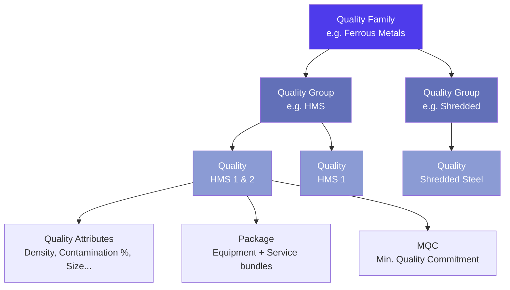
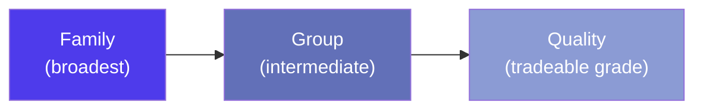
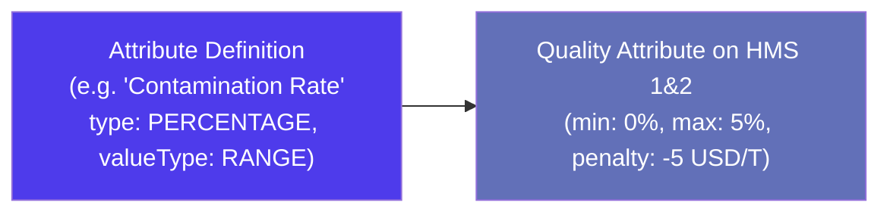
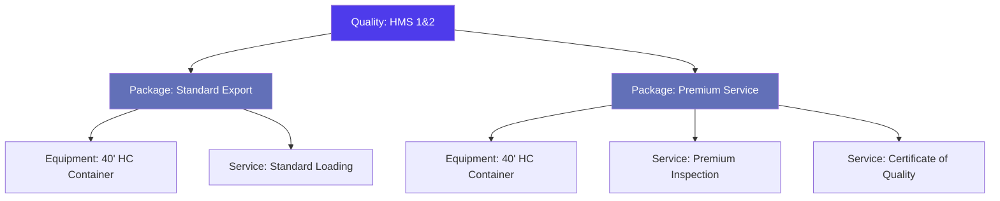
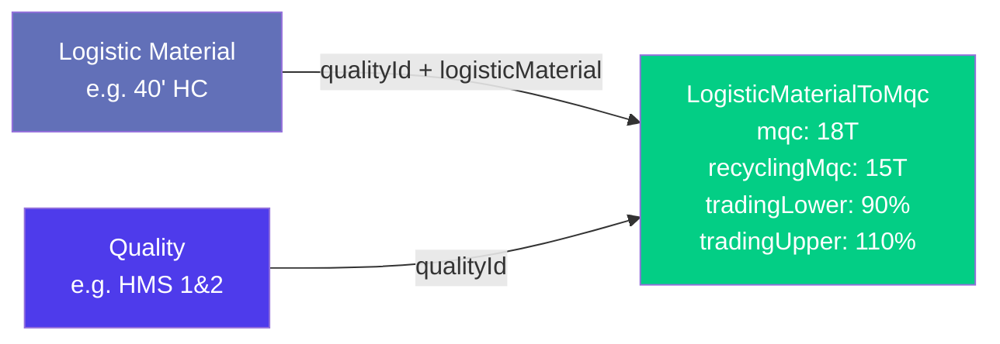
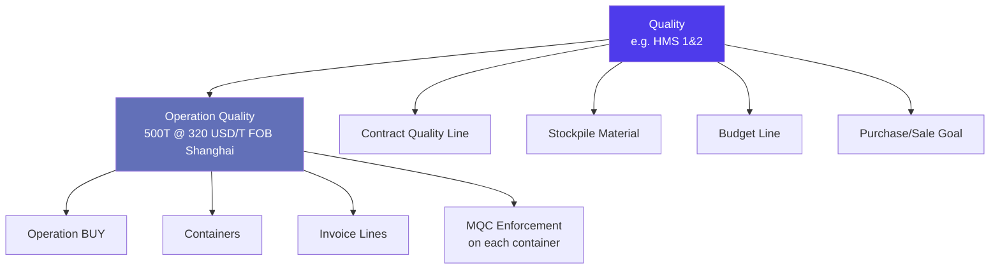

> Product documentation — How Jules organizes the materials your company trades: the three-level quality hierarchy, the product catalog, and every supporting reference table that drives operations, pricing, and compliance.

---

## Table of Contents

1. [Overview](#overview)

2. [The Quality Hierarchy: Family → Group → Quality](#the-quality-hierarchy-family--group--quality)

3. [Quality Families](#quality-families)

4. [Quality Groups](#quality-groups)

5. [Qualities (Material Grades)](#qualities-material-grades)

6. [Quality Attributes](#quality-attributes)

7. [Commodities & Market Indices](#commodities--market-indices)

8. [Conditionning](#conditionning)

9. [Packages (Equipment & Service Bundles)](#packages-equipment--service-bundles)

10. [Equipment](#equipment)

11. [Services](#services)

12. [Other Products & Other Product Groups](#other-products--other-product-groups)

13. [Logistic Materials & MQC Mapping](#logistic-materials--mqc-mapping)

14. [Units of Measure: QuantityUnit, Unit & BaseVolume](#units-of-measure-quantityunit-unit--basevolume)

15. [How Qualities Connect to Operations](#how-qualities-connect-to-operations)

16. [Key Business Rules](#key-business-rules)

17. [Glossary](#glossary)

---

## Overview

In Jules, every trade is about **material** — scrap metal, waste paper, plastics, electronic waste. Before a trader can create an operation, contract, or invoice, the platform needs to know exactly what is being bought or sold, at what specification, and in what unit.

The **quality system** is Jules' answer to that need. It is a structured, three-level classification that lets your organization define, name, and govern every material grade you trade — from broad categories ("Ferrous Metals") down to precise tradeable specifications ("HMS 1&2, max 5% non-ferrous, 80–120 kg/m³").

Beyond qualities, Jules maintains a broader **product catalog** that covers everything that can appear on an operation or invoice:

| Catalog type          | What it covers                                               |
| --------------------- | ------------------------------------------------------------ |
| **Quality**           | Recyclable material grades — the core of trading activity    |
| **Other Product**     | Non-material line items: services, fees, adjustments         |
| **Equipment**         | Container types and specifications                           |
| **Service**           | Logistics and handling services                              |
| **Logistic Material** | Materials associated with freight (packaging, pallets, etc.) |

---

## The Quality Hierarchy: Family → Group → Quality

Jules classifies recyclable materials in three nested levels. Each level adds precision.

| Level           | Entity          | Purpose                                                               | Example                                              |
| --------------- | --------------- | --------------------------------------------------------------------- | ---------------------------------------------------- |
| **1 — Family**  | `QualityFamily` | Broadest classification — the commodity macro-category                | Ferrous Metals, Non-Ferrous, Paper & Board, Plastics |
| **2 — Group**   | `QualityGroup`  | Sub-category within the family — often aligns with market terminology | HMS, Shredded, OCC, HDPE                             |
| **3 — Quality** | `Quality`       | The actual tradeable grade with full specification                    | HMS 1&2, OCC 11, LDPE Film Natural                   |

This hierarchy is used to:

- **Filter and browse** the quality catalog efficiently (e.g., "show me all qualities in the HMS group")

- **Set default MQC values** at the group level, inherited by individual qualities

- **Drive index pricing**: commodities (see [Commodities & Market Indices](#commodities--market-indices)) operate at the macro level and map across families and groups

- **Segment reporting**: margin reports and goals can be sliced by family or group

---

## Quality Families

A **Quality Family** is the top of the hierarchy. It is a free-text label that defines the broadest material category. Families have no configuration of their own — they exist purely as a grouping label.

### Fields

| Field   | Type   | Description                                                              |
| ------- | ------ | ------------------------------------------------------------------------ |
| `id`    | ID     | System-generated identifier                                              |
| `value` | String | The display name of the family (e.g., "Ferrous Metals", "Paper & Board") |

### Notes

- Families are shared across the entire organization.

- A quality's `family` field stores the **string value** of the family (not a foreign key to the `QualityFamily` entity). This means deleting a `QualityFamily` record does not cascade to qualities — it simply removes the label from the dropdown.

- There is no enforced limit to the number of families an organization can create.

---

## Quality Groups

A **Quality Group** sits between the family and individual qualities. It refines the classification and carries important **default values** that pre-populate new qualities created within that group.

### Fields

| Field            | Type   | Description                                                                |
| ---------------- | ------ | -------------------------------------------------------------------------- |
| `id`             | ID     | System-generated identifier                                                |
| `value`          | String | The display name of the group (e.g., "HMS", "OCC", "HDPE")                 |
| `mqc`            | Float  | Default Minimum Quality Commitment (in tonnes) pre-filled on new qualities |
| `recyclingMqc`   | Float  | Default MQC for recycling operations                                       |
| `pricePrecision` | Float  | Default number of decimal places for prices in this group                  |

### How defaults cascade

When a new quality is created and assigned to a group, the group's `mqc`, `recyclingMqc`, and `pricePrecision` values serve as intelligent defaults. Traders can override them at the quality level. This saves time when onboarding a new grade within a familiar product category.

---

## Qualities (Material Grades)

A **Quality** is the core tradeable entity in Jules. It represents a specific material grade with its full commercial, logistical, and regulatory specification. Qualities are what appear on operation lines, contracts, and invoices.

### Fields

| Field                                    | Type                 | Description                                                                             |
| ---------------------------------------- | -------------------- | --------------------------------------------------------------------------------------- |
| `id`                                     | ID                   | System-generated identifier                                                             |
| `name`                                   | String               | Commercial name of the grade (e.g., "HMS 1&2", "OCC 11")                                |
| `code`                                   | String               | Internal short code for the quality                                                     |
| `family`                                 | String               | The Quality Family this grade belongs to                                                |
| `group`                                  | String               | The Quality Group this grade belongs to                                                 |
| `defaultVolume`                          | VolumeEnum           | The default unit of measure for quantities (e.g., T for tonnes)                         |
| `defaultPriceVolume`                     | VolumeEnum           | The default unit of measure for pricing (may differ from quantity unit)                 |
| `defaultConditionning`                   | String               | The default conditioning (loading mode) for this quality                                |
| `defaultStockPickingRule`                | StockPickingRuleEnum | FIFO or LIFO — how warehouse stock is picked for this material                          |
| `mqc`                                    | Quantity             | Minimum Quality Commitment — minimum weight per container for trading                   |
| `recyclingMqc`                           | Quantity             | Minimum weight per container for recycling operations                                   |
| `tradingLowerThresholdRate`              | Float                | Lower tolerance bound for trading weight (%)                                            |
| `tradingUpperThresholdRate`              | Float                | Upper tolerance bound for trading weight (%)                                            |
| `recyclingLowerThresholdRate`            | Float                | Lower tolerance bound for recycling weight (%)                                          |
| `recyclingUpperThresholdRate`            | Float                | Upper tolerance bound for recycling weight (%)                                          |
| `pricePrecision`                         | Float                | Number of decimal places for pricing this quality                                       |
| `isScrap`                                | Boolean              | Marks the quality as a scrap material (affects certain flows)                           |
| `isReverseCharge`                        | Boolean              | Whether VAT reverse charge applies for this material                                    |
| `taxRate`                                | Float                | Default tax rate applied to invoices for this quality                                   |
| `erpId`                                  | String               | External ERP system identifier for synchronization                                      |
| `otherCode1` / `otherCode2`              | String               | Additional custom codes for cross-referencing external systems                          |
| `defaultDescription`                     | String               | Default text description prefilled on operation lines                                   |
| `shouldPrefillLoadingDeliveryAttributes` | Boolean              | Whether attribute values auto-populate loading and delivery records                     |
| `isDeleted`                              | Boolean              | Soft-delete flag — deleted qualities are hidden from dropdowns but preserved in history |
| `attributes`                             | QualityAttribute\[]  | The list of quality attribute specifications (see below)                                |

### Regulatory / Customs Codes

For cross-border trade and Basel Convention compliance, each quality can carry a set of official codes:

| Field          | Description                                                                |
| -------------- | -------------------------------------------------------------------------- |
| `hsCode`       | Harmonized System (HS) tariff code for customs                             |
| `nationalCode` | Country-specific national tariff or waste code                             |
| `ecCode`       | European Community waste catalogue code                                    |
| `baselId`      | Basel Convention notification identifier                                   |
| `rdCode`       | Recovery and Disposal operation code (R/D codes under EU waste regulation) |
| `officialName` | The official regulatory name of the material (used on Annex 7 documents)   |

> These fields are used when generating **Annex 7** trans-frontier waste movement documents, which are required for certain cross-border recyclable material shipments under EU and Basel Convention regulations.

---

## Quality Attributes

**Quality Attributes** are the technical specification fields that define exactly what a quality grade looks like — contamination limits, density ranges, size constraints, moisture content, and so on. They make a quality grade a precise specification sheet.

### Architecture: Two-level system

Attributes work in two layers:

1. **Attribute definition** (`Attribute`) — the template: what is being measured, in what unit type, with what value format

2. **Quality Attribute** (`QualityAttribute`) — the instance: the specific threshold or value for a given quality

### Attribute Definition Fields

| Field            | Type                          | Description                                                     |
| ---------------- | ----------------------------- | --------------------------------------------------------------- |
| `id`             | ID                            | System identifier                                               |
| `name`           | String                        | The attribute name (e.g., "Contamination Rate", "Bulk Density") |
| `type`           | QualityAttributeTypeEnum      | The measurement type (see below)                                |
| `valueType`      | QualityAttributeValueTypeEnum | Whether the attribute takes an EXACT value or a RANGE           |
| `dropdownValues` | String\[]                     | Predefined choices (only for DROPDOWN type)                     |

### Attribute Type Enum

| Value         | Description                               |
| ------------- | ----------------------------------------- |
| `TEXT`        | Free-text specification                   |
| `PERCENTAGE`  | A proportion (e.g., max 5% contamination) |
| `NUMBER`      | A plain number                            |
| `DROPDOWN`    | A predefined list of choices              |
| `LENGTH`      | A measurement in length units             |
| `WEIGHT`      | A measurement in weight units             |
| `VOLUME`      | A measurement in volume units             |
| `AREA`        | A measurement in area units               |
| `ENERGY`      | A measurement in energy units             |
| `DENSITY`     | A bulk or specific density                |
| `TEMPERATURE` | A temperature constraint                  |
| `TIME`        | A time-based specification                |

### Quality Attribute Instance Fields

| Field                           | Type                              | Description                                                                 |
| ------------------------------- | --------------------------------- | --------------------------------------------------------------------------- |
| `attribute`                     | Attribute                         | The attribute definition this instance belongs to                           |
| `thresholdType`                 | QualityAttributeThresholdTypeEnum | PERCENTAGE or ABSOLUTE — whether thresholds are relative or absolute values |
| `minThreshold` / `maxThreshold` | Float                             | The acceptable range boundary                                               |
| `value`                         | String                            | A fixed value (for EXACT valueType)                                         |
| `minValue` / `maxValue`         | Float                             | The acceptable value range (for RANGE valueType)                            |
| `penalty`                       | Price                             | Financial penalty applied when the attribute threshold is breached          |
| `order`                         | Int                               | Display order within the quality's attribute list                           |
| `unit`                          | String                            | The label for the unit (e.g., "kg/m³")                                      |
| `quantityUnit`                  | VolumeEnum                        | The volume unit for weight-based attributes                                 |

### How attributes flow through operations

When `shouldPrefillLoadingDeliveryAttributes` is enabled on a quality, its attribute values are automatically copied into container loading and delivery records. This means inspectors can see the expected specification directly in the field — and discrepancies trigger the configured penalties.

---

## Commodities & Market Indices

A **Commodity** is a market-level reference for a material category, primarily used in **index-based pricing**. While Quality Groups and Families describe your internal product catalog, Commodities map to how the material is referenced on financial markets (e.g., LME Copper, TSI Heavy Melting Scrap).

### Commodity Fields

| Field     | Type               | Description                                         |
| --------- | ------------------ | --------------------------------------------------- |
| `id`      | ID                 | System identifier                                   |
| `name`    | String             | The commodity name as it appears in market pricing  |
| `markets` | CommodityMarket\[] | The market exchanges where this commodity is traded |

### CommodityMarket Fields

| Field         | Type     | Description                                             |
| ------------- | -------- | ------------------------------------------------------- |
| `id`          | ID       | System identifier                                       |
| `market`      | String   | The market exchange name (e.g., "LME", "Platts", "TSI") |
| `commodityId` | ID       | The parent commodity                                    |
| `oneLot`      | Quantity | The standard contract lot size on this market           |

### CommodityMarketIndexChoices

This entity exposes the available market index choices for index pricing configuration on operations. Each index choice specifies which `PriceIndexPriceTypeEnum` values (monthly average, spot, fixing, etc.) are valid for that index.

> Commodities are a reference catalog, not a configuration that end-users create frequently. They are managed by administrators and drive the index pricing dropdowns when traders configure an operation's price as "INDEX" type.

---

## Conditionning

**Conditionning** (note: the French-origin spelling is preserved in the codebase) describes how a material is physically presented or loaded. It answers the question: "Is this material loose bulk, or loaded in a particular way?"

### Fields

| Field         | Type            | Description                                                                        |
| ------------- | --------------- | ---------------------------------------------------------------------------------- |
| `id`          | ID              | System identifier                                                                  |
| `value`       | String          | The conditioning label (e.g., "Loose", "Baled", "Shredded", "In Drum")             |
| `loadingType` | LoadingTypeEnum | Whether the conditioning applies to MATERIAL (bulk goods) or ITEM (discrete items) |

### LoadingTypeEnum

| Value      | Description                                                     |
| ---------- | --------------------------------------------------------------- |
| `MATERIAL` | Bulk material loaded by weight (e.g., scrap metal, paper bales) |
| `ITEM`     | Discrete items counted individually (e.g., electronics, drums)  |

A quality's `defaultConditionning` field points to one of these values, pre-populating the conditioning field when the quality is selected on an operation or container.

---

## Packages (Equipment & Service Bundles)

A **Package** is a named bundle that combines one or more **Equipment** types and **Services** for a specific quality. It represents a standard commercial offer template for how that material will be shipped and handled.

### Package Fields

| Field        | Type                  | Description                                  |
| ------------ | --------------------- | -------------------------------------------- |
| `id`         | ID                    | System identifier                            |
| `name`       | String                | The package name                             |
| `qualityId`  | ID                    | The quality this package belongs to          |
| `equipments` | PackageToEquipment\[] | The equipment types included in this package |
| `services`   | PackageToService\[]   | The services included in this package        |

Packages are filtered by quality (`filteredPackages(qualityId: ID)`), meaning each quality can have multiple named packages tailored to different trade scenarios (e.g., a "local domestic" package vs. an "export FOB" package).

---

## Equipment

**Equipment** defines the physical container or transport unit types available in Jules. It is used when specifying what container type will carry the goods in an operation or booking.

### Fields

| Field        | Type   | Description                                                             |
| ------------ | ------ | ----------------------------------------------------------------------- |
| `id`         | ID     | System identifier                                                       |
| `value`      | String | The equipment label (e.g., "40' High Cube", "20' Standard", "Flatrack") |
| `modalities` | String | Optional notes on usage modalities or restrictions                      |
| `erpId`      | String | External ERP identifier for synchronization                             |

Equipment is referenced:

- On **operation quality lines** to specify the container type for a trade

- In **Packages** as bundled transport options for a quality

- On **freight bookings** to specify what containers are being booked

- In **logistic cost calculations** where rates vary by equipment type

---

## Services

**Services** are logistics and handling service definitions — the non-material line items that can be attached to a quality's package. Examples: loading supervision, certificate of quality, fumigation, survey inspection.

### Fields

| Field        | Type   | Description                                                                  |
| ------------ | ------ | ---------------------------------------------------------------------------- |
| `id`         | ID     | System identifier                                                            |
| `value`      | String | The service name (e.g., "Fumigation", "Survey Inspection", "CQ Certificate") |
| `modalities` | String | Optional notes on service delivery conditions                                |
| `erpId`      | String | External ERP identifier for synchronization                                  |

Services appear in **Packages** alongside Equipment to define the full service offering for a quality grade.

---

## Other Products & Other Product Groups

**Other Products** are the non-material catalog items that can appear on invoices and bills — costs, fees, adjustments, and services that are not recyclable material grades.

### OtherProductGroup

An **OtherProductGroup** is the first-level classification for non-material products, equivalent to the Quality Family in the materials hierarchy. It is a simple label (e.g., "Logistics", "Finance Charges", "Inspection Fees").

| Field   | Type   | Description        |
| ------- | ------ | ------------------ |
| `id`    | ID     | System identifier  |
| `value` | String | Group display name |

### OtherProduct Fields

| Field             | Type                      | Description                                                  |
| ----------------- | ------------------------- | ------------------------------------------------------------ |
| `id`              | ID                        | System identifier                                            |
| `name`            | String                    | The product name (e.g., "Container Detention", "THC Charge") |
| `code`            | String                    | Internal code for this product                               |
| `officialName`    | String                    | Official name used on regulatory documents                   |
| `group`           | String                    | The OtherProductGroup this product belongs to                |
| `groupTag`        | OtherProductGroupTagEnum  | High-level functional tag (see below)                        |
| `tag`             | ContainerInvoicingElement | Specific invoicing element tag for container-level billing   |
| `defaultVolume`   | VolumeEnum                | Default unit of measure (e.g., per container, per tonne)     |
| `defaultCurrency` | CurrencyEnum              | Default currency for this product                            |
| `isReverseCharge` | Boolean                   | Whether VAT reverse charge applies                           |
| `taxRate`         | Float                     | Default tax rate                                             |
| `erpId`           | String                    | External ERP identifier                                      |
| `isDeleted`       | Boolean                   | Soft-delete flag                                             |

### OtherProductGroupTagEnum

| Value       | Description                                                                        |
| ----------- | ---------------------------------------------------------------------------------- |
| `TRANSPORT` | Logistics and freight charges (e.g., THC, container detention, freight surcharges) |
| `DEVIATION` | Price adjustments and penalty charges                                              |
| `OTHER`     | Miscellaneous fees not categorized above                                           |

> The `groupTag` drives how Other Products are routed and displayed in the P\&L and margin calculations — TRANSPORT costs are allocated differently from DEVIATION adjustments.

---

## Logistic Materials & MQC Mapping

### LogisticMaterial

A **Logistic Material** is a reference label for the physical packaging or logistic support material associated with freight (e.g., "Pallet", "Stretch Film", "Steel Band"). These appear in container and shipment records to track ancillary materials.

| Field   | Type   | Description                                    |
| ------- | ------ | ---------------------------------------------- |
| `id`    | ID     | System identifier                              |
| `value` | String | The material label (e.g., "Pallet", "Dunnage") |

### LogisticMaterialToMqc

The **LogisticMaterialToMqc** mapping is a pivotal configuration table: it defines the **MQC (Minimum Quality Commitment)** thresholds and tolerance rates that apply when a **specific logistic material is combined with a specific quality**.

This is the mechanism that allows MQC and tolerance settings to vary by transport mode or packaging method — the same quality may have different minimum weights depending on whether it is shipped in a standard container vs. an open-top vs. on a flatrack.

### LogisticMaterialToMqc Fields

| Field                         | Type   | Description                                             |
| ----------------------------- | ------ | ------------------------------------------------------- |
| `id`                          | ID     | System identifier                                       |
| `logisticMaterial`            | String | The logistic material value                             |
| `qualityId`                   | ID     | The quality this mapping applies to                     |
| `mqc`                         | Float  | Minimum weight commitment for trading (in default unit) |
| `recyclingMqc`                | Float  | Minimum weight commitment for recycling                 |
| `tradingLowerThresholdRate`   | Float  | Lower tolerance rate for trading (e.g., 0.9 = 90%)      |
| `tradingUpperThresholdRate`   | Float  | Upper tolerance rate for trading (e.g., 1.10 = 110%)    |
| `recyclingLowerThresholdRate` | Float  | Lower tolerance rate for recycling                      |
| `recyclingUpperThresholdRate` | Float  | Upper tolerance rate for recycling                      |

This mapping is queried at the time of container creation or operation setup via `logisticMaterialToMqc(input: { logisticMaterial, qualityId })` to prefill the MQC automatically — reducing manual data entry and ensuring consistency.

---

## Units of Measure: QuantityUnit, Unit & BaseVolume

Jules has three distinct but related systems for managing units of measure. Understanding the distinction is important when configuring new qualities or reading API responses.

### QuantityUnit

**QuantityUnit** is the primary units-of-measure catalog for commercial quantities and prices. It ties together a display label with the underlying system code and precision rules.

| Field                    | Type       | Description                                      |
| ------------------------ | ---------- | ------------------------------------------------ |
| `id`                     | ID         | System identifier                                |
| `code`                   | VolumeEnum | The system-level code (see VolumeEnum below)     |
| `value`                  | String     | Full display name (e.g., "Metric Tonne")         |
| `shorthand`              | String     | Abbreviated label (e.g., "MT", "Ctn")            |
| `pricePrecision`         | Int        | Number of decimal places for prices in this unit |
| `quantityPrecision`      | Int        | Number of decimal places for quantities          |
| `roundPricePrecision`    | Int        | Rounding precision for price display             |
| `roundQuantityPrecision` | Int        | Rounding precision for quantity display          |

### VolumeEnum — Available Unit Codes

| Code       | Description                                              |
| ---------- | -------------------------------------------------------- |
| `T`        | Metric Tonne — the most common unit for bulk recyclables |
| `Kg`       | Kilogram                                                 |
| `Lbs`      | Pounds                                                   |
| `ST`       | Short Ton (US)                                           |
| `GT`       | Gross Ton                                                |
| `Ctn`      | Container — counted by unit                              |
| `Ftruck`   | Full truck load                                          |
| `shipment` | Per shipment                                             |
| `M3`       | Cubic metre — used for volume-based materials            |
| `Unit`     | Single item count                                        |
| `Lot`      | Lot (batch pricing)                                      |
| `Hold`     | Ship's hold                                              |

### Unit

**Unit** is a more granular measurement reference catalog used for quality attributes and technical specifications. It supports physical measurement categories and unit systems, enabling quality attributes to specify precise measurement units.

| Field               | Type                | Description                                                                                        |
| ------------------- | ------------------- | -------------------------------------------------------------------------------------------------- |
| `id`                | ID                  | System identifier                                                                                  |
| `code`              | String              | The unit code (e.g., "kg/m3", "°C")                                                                |
| `value`             | String              | Full display name                                                                                  |
| `shorthand`         | String              | Abbreviated label                                                                                  |
| `categories`        | UnitCategoryEnum\[] | Physical measurement categories (LENGTH, WEIGHT, VOLUME, AREA, ENERGY, DENSITY, TEMPERATURE, TIME) |
| `unitSystem`        | UnitSystemEnum      | Metric, Imperial, etc.                                                                             |
| `baseUnit`          | Unit                | The base unit this unit converts to (for unit conversion)                                          |
| `tags`              | UnitTagsEnum\[]     | Size tags (EXTRA\_SMALL to EXTRA\_LARGE) for UI filtering                                          |
| `pricePrecision`    | Int                 | Price decimal precision                                                                            |
| `quantityPrecision` | Int                 | Quantity decimal precision                                                                         |

### BaseVolume

**BaseVolume** is a configuration table that maps system volume codes (`VolumeEnum`) to their role and market context. It determines which units are valid in which commercial context.

| Field        | Type               | Description                                        |
| ------------ | ------------------ | -------------------------------------------------- |
| `id`         | ID                 | System identifier                                  |
| `code`       | VolumeEnum         | The volume code (e.g., `T`, `Ctn`)                 |
| `type`       | BaseVolumeTypeEnum | The trade direction context (see below)            |
| `marketType` | MarketTypeEnum     | Whether this applies to EXPORT or LOCAL operations |
| `unitType`   | UnitTypeEnum       | Whether this is a PRICE unit or a QUANTITY unit    |

### BaseVolumeTypeEnum

| Value           | Description                                          |
| --------------- | ---------------------------------------------------- |
| `BUY`           | Unit valid for purchase operation quantities         |
| `BUY_SHIPMENT`  | Unit valid for purchase operation shipped quantities |
| `SELL`          | Unit valid for sale operation quantities             |
| `LOGISTIC_COST` | Unit valid for logistic cost billing                 |

> BaseVolume is an administrator-level configuration that controls which unit codes appear in which dropdowns. Most users will never interact with it directly — it silently shapes what choices are available when creating operations and bills.

---

## How Qualities Connect to Operations

Qualities are the bridge between the material catalog and commercial activity. Every trade in Jules flows through them.

### Where qualities are used across Jules

| Module                  | How the quality is used                                                                               |
| ----------------------- | ----------------------------------------------------------------------------------------------------- |
| **Operations**          | Each operation line (`OperationQuality`) references a quality with price, quantity, incoterm, and MQC |
| **Containers**          | Each container is linked to an operation quality and carries the material for that grade              |
| **Contracts**           | Contract quality lines define the terms and conditions per quality for a term agreement               |
| **Invoices**            | Invoice line items reference qualities (or Other Products) for billing                                |
| **Stockpiles**          | A stockpile tracks inventory for a specific quality at a specific site                                |
| **Goals**               | Purchase and sale targets are set per quality, family, or group                                       |
| **Budgets**             | Budget lines are denominated by quality                                                               |
| **Margin Calculations** | Buy and sell operation qualities are matched via allocations for P\&L computation                     |
| **Annex 7 / Documents** | The quality's regulatory codes (`hsCode`, `baselId`, etc.) populate compliance documents              |

---

## Key Business Rules

### 1. Hierarchy is advisory, not enforced by foreign keys

A quality's `family` and `group` fields store **string values** — not relational IDs pointing to `QualityFamily` or `QualityGroup` records. This means:

- Renaming a family or group does not cascade to the qualities that reference it

- Deleting a family or group does not break existing qualities

- Quality migration tools must be used if you reorganize the hierarchy after the fact

### 2. Soft deletion preserves history

Qualities and Other Products support **soft deletion** (`isDeleted: true`). Deleted items disappear from picker dropdowns but remain in the database to preserve historical operation and invoice records. This is critical for audit integrity — an operation created two years ago still correctly references its quality.

### 3. MQC has two variants and cascades via logistic material

Every quality defines two MQC values:

- **Trading MQC** (`mqc`) — applies to buy and sell operations

- **Recycling MQC** (`recyclingMqc`) — applies when the operation is classified as recycling

Additionally, the `LogisticMaterialToMqc` mapping can override these values for specific container types. The lookup order is: **logistic material mapping first, quality default as fallback**.

### 4. Threshold rates define tolerance windows

Each quality carries four tolerance rates defining acceptable weight deviation:

| Rate                          | Applied to                                        |
| ----------------------------- | ------------------------------------------------- |
| `tradingLowerThresholdRate`   | Minimum accepted weight as % of MQC for trading   |
| `tradingUpperThresholdRate`   | Maximum accepted weight as % of MQC for trading   |
| `recyclingLowerThresholdRate` | Minimum accepted weight as % of MQC for recycling |
| `recyclingUpperThresholdRate` | Maximum accepted weight as % of MQC for recycling |

Containers outside these thresholds are flagged for commercial review.

### 5. Attribute penalties are quality-level defaults

When a quality attribute defines a `penalty` (e.g., "-5 USD/T for each 1% over the max contamination threshold"), that penalty is the **default** applied when the attribute is checked at container loading or delivery. Traders can override the penalty amount on a specific container record.

### 6. The `defaultConditionning` drives loading mode

A quality's `defaultConditionning` maps to a `Conditionning` record that carries a `loadingType` (`MATERIAL` or `ITEM`). This drives the container loading form: material mode shows weight entry fields, while item mode shows quantity counting fields.

### 7. StockPickingRule affects warehouse operations

For warehouse operations (where goods are received into a stockpile before being sold), the quality's `defaultStockPickingRule` (`FIFO` or `LIFO`) determines which inventory batch is consumed first when allocating stock to sale operations.

### 8. ERP ID synchronization

Qualities, Other Products, Equipment, and Services all carry an `erpId` field. This is the identifier in your organization's external ERP system. It is used when Jules synchronizes operation and invoice data to the ERP — ensuring that material master records are correctly matched across systems.

### 9. Regulatory codes are mandatory for Annex 7

For organizations trading recyclable waste across international borders, the quality fields `hsCode`, `baselId`, `ecCode`, `nationalCode`, `rdCode`, and `officialName` are required to generate valid Annex 7 trans-frontier shipment notification documents. Missing codes will cause document generation to fail or produce incomplete outputs.

### 10. Commodities are global; qualities are per-organization

`Commodity` and `CommodityMarketIndexChoices` records are global reference data shared across the platform. `Quality`, `QualityFamily`, `QualityGroup`, `OtherProduct`, and all other catalog entities are **per-organization** — each tenant maintains its own product catalog independently.

---

## Glossary

| Term                                 | Definition                                                                                                                            |
| ------------------------------------ | ------------------------------------------------------------------------------------------------------------------------------------- |
| **Annex 7**                          | A trans-frontier waste movement notification document required under the Basel Convention and EU waste shipment regulations           |
| **Attribute**                        | A named technical specification dimension (e.g., "Contamination Rate", "Bulk Density") that can be applied to a quality               |
| **BaseVolume**                       | A configuration record that maps a VolumeEnum code to a trade context (buy, sell, logistic cost) and market type                      |
| **Commodity**                        | A market-level reference for a material category, used to map qualities to financial market indices                                   |
| **Conditionning**                    | The physical presentation or loading mode of a material (e.g., Loose, Baled, Shredded)                                                |
| **Equipment**                        | A container or transport unit type (e.g., 40' High Cube, 20' Standard)                                                                |
| **FIFO / LIFO**                      | First-In-First-Out / Last-In-First-Out — stock picking order rules for warehouse operations                                           |
| **HS Code**                          | Harmonized System code — the international customs tariff classification for a material                                               |
| **Logistic Material**                | A reference label for ancillary packaging or transport support material (e.g., Pallet, Dunnage)                                       |
| **LogisticMaterialToMqc**            | A mapping table that defines quality-specific MQC and tolerance rates per logistic material/container type                            |
| **MQC (Minimum Quality Commitment)** | The minimum weight of material required per container, below which the cargo is flagged or penalized                                  |
| **Other Product**                    | A non-material catalog item used on invoices and bills (fees, services, adjustments)                                                  |
| **OtherProductGroup**                | The top-level grouping for Other Products (equivalent to Quality Family for non-material items)                                       |
| **Package**                          | A named bundle of Equipment and Services for a specific quality, representing a standard commercial offering                          |
| **Quality**                          | A specific tradeable material grade with full commercial, logistical, and regulatory specification                                    |
| **Quality Attribute**                | A technical specification instance on a quality (e.g., max 5% contamination, 80–120 kg/m³ bulk density)                               |
| **Quality Family**                   | The broadest level of the material hierarchy (e.g., Ferrous Metals, Plastics)                                                         |
| **Quality Group**                    | The intermediate level of the material hierarchy, below Family (e.g., HMS, OCC, HDPE)                                                 |
| **QuantityUnit**                     | A quantity/price unit with display label, shorthand, and decimal precision rules                                                      |
| **Recycling MQC**                    | A separate MQC threshold that applies specifically to recycling operations                                                            |
| **Reverse Charge**                   | A VAT accounting mechanism where the buyer, not the seller, accounts for VAT — commonly applicable to certain recyclable materials    |
| **Service**                          | A logistics or handling service definition that can be bundled into a quality Package                                                 |
| **Soft delete**                      | A deletion mechanism that sets `isDeleted: true` rather than removing the record, preserving referential integrity in historical data |
| **Stock Picking Rule**               | The order in which warehouse inventory batches are consumed — FIFO (oldest first) or LIFO (newest first)                              |
| **Unit**                             | A granular measurement unit used for quality attribute specifications (supports physical measurement systems)                         |
| **VolumeEnum**                       | The system-level enumeration of valid quantity and price units (T, Kg, Ctn, M3, etc.)                                                 |

