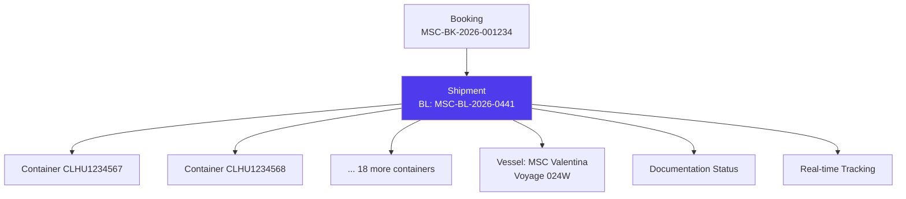
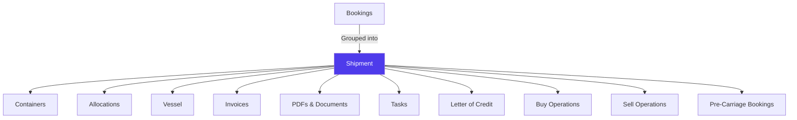

# Shipments in Jules

> Product documentation — A shipment groups containers traveling under the same Bill of Lading. It is the primary entity for cargo tracking, documentation management, and delivery monitoring.

---

## Table of Contents

1. [Overview](#overview)
2. [Shipment Structure](#shipment-structure)
3. [Creating a Shipment](#creating-a-shipment)
4. [Tracking: Location & Timing](#tracking-location--timing)
5. [Manual vs Automatic Tracking](#manual-vs-automatic-tracking)
6. [Container-Level Tracking](#container-level-tracking)
7. [Documentation Workflow](#documentation-workflow)
8. [Letter of Credit Integration](#letter-of-credit-integration)
9. [Demurrage & Detention Monitoring](#demurrage--detention-monitoring)
10. [Shipment Owners & Watchers](#shipment-owners--watchers)
11. [Filtering & Sorting](#filtering--sorting)
12. [Relationships with Other Modules](#relationships-with-other-modules)
13. [Key Business Rules](#key-business-rules)
14. [Glossary](#glossary)

---

## Overview

A **shipment** in Jules represents a group of containers traveling together under a common **Bill of Lading (BL)**. While bookings reserve space and containers carry physical cargo, the shipment is the entity that tracks the journey from departure to arrival.

Shipments are the primary workspace for the logistics and documentation teams. They provide real-time visibility into where cargo is, when it will arrive, and what documentation status it has.

---

## Shipment Structure

### Core fields

| Field | Description | Example |
|-------|-------------|---------|
| **Harold number** | System-generated unique ID | SHIP-2026-0441 |
| **BL number** | Bill of Lading number | MSC-BL-2026-0441 |
| **Reference number** | External reference | REF-2026-0042 |
| **Vessel** | Ship and voyage information | MSC Valentina — 024W |
| **Shipping line** | Carrier | MSC |
| **Logistic forwarder** | Freight forwarder | Geodis |
| **Pre-carriage line** | Inland transport provider | XPO Logistics |
| **Port(s) of loading** | Departure port(s) | New York |
| **Port(s) of destination** | Arrival port(s) | Iskenderun |
| **Number of containers** | Container count | 20 |

### BL types and related fields

| Field | Description |
|-------|-------------|
| **BL type** | Classification of the Bill of Lading |
| **HBL number** | House Bill of Lading number (when using forwarder) |
| **MBL number** | Master Bill of Lading number |
| **Telex** | Telex release reference |
| **Release type** | How cargo is released at destination |

### Release types

| Type | Description |
|------|-------------|
| **BILL_OF_LADING** | Original BL required for cargo release |
| **EXPRESS_RELEASE** | Electronic release, no original needed |
| **SEAWAY_BILL** | Non-negotiable transport document |
| **TELEX** | Telex release instruction |
| **OBL** | Original Bill of Lading |
| **RATED_MBL / RATED_HBL** | Rated Master/House BL |
| **TELEXED_MBL / TELEXED_HBL** | Telexed Master/House BL |
| **OBL_PRINT_AT_POD** | Original BL to be printed at port of destination |
| **SWB_TELEX** | Seaway Bill with telex |

---

## Creating a Shipment

Shipments can be created in two ways:

### 1. Manual creation (upsert)

Create a shipment by selecting containers and specifying the BL number:

| Field | Required |
|-------|----------|
| **BL number** | Yes |
| **Container IDs** | Yes |
| **Shipping line** | Optional |
| **Port of loading / destination** | Optional |
| **D&D terms** | Optional |

### 2. Automatic grouping

When containers are loaded and a BL is issued, Jules can automatically group containers with the same BL number into a shipment via `upsertShipmentsByBLNumber`.

---

## Tracking: Location & Timing

Jules provides real-time cargo tracking through two status dimensions:

### Location status

| Status | Meaning |
|--------|---------|
| **AT_ORIGIN** | Containers are at the loading port |
| **LOADED** | Loaded onto the vessel |
| **IN_TRANSIT** | Vessel is sailing |
| **TRANSSHIPMENT** | Container being transferred between vessels |
| **REACHED_POD** | Arrived at port of destination |
| **REACHED_DESTINATION_PORT** | At final destination port |
| **COMPLETED** | Delivery fully complete |

### Timing status

| Status | Meaning |
|--------|---------|
| **ON_TIME** | Shipment is on schedule |
| **DELAYED** | Shipment is behind schedule |
| **EARLY_ARRIVAL** | Shipment arrived ahead of schedule |

### Key tracking dates

| Field | Description |
|-------|-------------|
| **Estimated sailing date** | Planned departure |
| **Actual sailing date** | When the vessel actually departed |
| **Original ETA** | First estimated arrival date |
| **Current ETA** | Latest estimated arrival (updated during transit) |
| **Final ETA** | Final confirmed arrival date |
| **Actual arrival at POD** | When the vessel actually arrived |
| **Empty container time** | When containers were returned empty |
| **Days to ETA** | Countdown to arrival |
| **Expected transit days** | Expected duration of the voyage |

### Tracking events (transshipments)

Jules records transshipment events via `ContainerToTranshipment`, tracking intermediate port calls with vessel transfers.

---

## Manual vs Automatic Tracking

Jules supports both tracking modes:

### Automatic tracking

- Tracking data is pulled from **tracking APIs** (carrier/port integrations)
- `refreshShipmentsTracking` triggers an update from external sources
- `trackingApiUpdatedAt` records the last API refresh timestamp
- A `trackedContainer` is designated as the reference container for tracking the shipment

### Manual tracking overrides

When automatic tracking is unavailable or incorrect, users can set manual values:

| Manual field | Overrides |
|-------------|-----------|
| `manualLocationStatus` | Location status |
| `manualTimingStatus` | Timing status |
| `manualCurrentEta` | Current ETA |
| `manualTrackingEvent` | Latest tracking event |
| `manualActualSailingDate` | Sailing date |
| `manualActualArrivalPod` | Arrival date at POD |
| `manualEmptyContainerTime` | Empty return date |

`trackingManualUpdatedAt` records when the last manual update was made.

---

## Container-Level Tracking

Beyond shipment-level tracking, Jules tracks each container individually via `ShipmentContainer`:

| Field | Description |
|-------|-------------|
| **Container reference** | Physical container number |
| **D&D accrued** | Demurrage and detention charges for this container |
| **Empty container time** | When this specific container was returned |
| **Timing status** | ON_TIME, DELAYED, or EARLY_ARRIVAL |
| **Tracking event** | Latest event for this container |
| **Empty pickup at origin** | When empty was collected at origin |
| **Gated in at POL** | When container entered the loading port |
| **Gated out at POD** | When container left the destination port |

Container-level tracking is updated via `updateShipmentContainersTracking`.

---

## Documentation Workflow

Shipment documentation follows a tracked workflow:

| Status | Meaning | Typical action |
|--------|---------|----------------|
| **TO_START** | Documentation not yet begun | BL draft not requested |
| **DRAFT_SHARED** | Draft BL sent for review | Customer reviews BL details |
| **APPROVED** | BL terms approved | Customer confirms BL |
| **PAYMENT_RECEIVED** | Payment received (for LC trades) | Payment confirmed before doc release |
| **SENT_TO_CLIENT** | Final documents sent | Original BL / telex sent to customer |

### Documentation dates

| Field | Description |
|-------|-------------|
| **Bill of Lading date** | Date of BL issuance |
| **Doc release date** | When documents were released |
| **BTC date** | Bill to carrier date |
| **Last shipment date** | Latest date for this shipment |
| **Date of receipt** | When documents were received |

### Shipping info and VGM flags

| Flag | Description |
|------|-------------|
| **isShippingInfoSent** | Whether shipping instructions have been sent to the carrier |
| **isVGMSent** | Whether Verified Gross Mass declarations have been submitted |

---

## Letter of Credit Integration

Shipments can be linked to a **Letter of Credit** for trade finance:

| Field | Description |
|-------|-------------|
| **Letter of Credit** | Link to the LC entity in Jules |
| **LC number** | Reference number |
| **LC bank of issue** | Issuing bank |
| **LC bank of advising** | Advising bank |
| **LC bank of confirming** | Confirming bank |
| **LC date of issue** | When the LC was issued |
| **LC ETD** | Required departure date per LC terms |
| **LC payment clause** | Payment terms |
| **LC period presentation** | Days to present documents |
| **LC status** | Current status of the LC |
| **LC type** | Type of LC (irrevocable, confirmed, etc.) |
| **Ref number of issuing bank** | Bank's internal reference |
| **Insured amount** | Insurance coverage amount |

---

## Demurrage & Detention Monitoring

| Field | Description |
|-------|-------------|
| **Demurrage** | Daily charge at port (days) |
| **Detention** | Daily charge outside port (days) |
| **Free time** | Days before charges begin |
| **Free time limit** | Date when charges start |
| **D&D accrued** | Total demurrage and detention accumulated (days) |

Jules provides filters to quickly identify shipments where free time has expired (`isFreeTimePassed`) and sort by `freeTimeLimit` to prioritize urgent container returns.

---

## Shipment Owners & Watchers

| Role | Description |
|------|-------------|
| **Owners** | Users responsible for this shipment (can be multiple) |
| **Watchers** | Users subscribed to notifications about this shipment |
| **Doc created by** | User who generated the documentation |

---

## Filtering & Sorting

Jules provides extensive filtering for shipment management:

### Key filters

| Filter | Description |
|--------|-------------|
| **Location status** | Where the cargo is (AT_ORIGIN, IN_TRANSIT, etc.) |
| **Timing status** | ON_TIME, DELAYED, EARLY_ARRIVAL |
| **Doc status** | Documentation workflow stage |
| **Current ETA** | Date range for expected arrival |
| **Free time limit** | Date range for D&D deadline |
| **Days to ETA** | Numeric filter (e.g., < 5 days) |
| **Shipping lines** | Filter by carrier |
| **Port of loading / destination** | Filter by route |
| **Has pending tasks** | Shipments with outstanding action items |
| **Is tracked automatically** | Whether tracking is from API or manual |

### Sort options

| Sort | Direction |
|------|-----------|
| Current ETA | ASC / DESC |
| D&D accrued | ASC / DESC |
| Created at | ASC / DESC |
| Loading date | ASC / DESC |
| Days to ETA | ASC / DESC |
| Free time limit | ASC / DESC |

---

## Relationships with Other Modules

| Module | Relationship |
|--------|-------------|
| **Bookings** | Freight bookings whose containers form this shipment |
| **Containers** | Physical units in the shipment |
| **Allocations** | Commercial pairings represented in this shipment |
| **Vessel** | The ship carrying the cargo |
| **Invoices** | Sale and purchase invoices linked to this shipment |
| **PDFs** | Generated documents (BL, packing list, etc.) |
| **Tasks** | Action items tracked per shipment |
| **Letter of Credit** | Trade finance instrument covering this shipment |
| **Operations** | Buy and sell operations whose cargo is on this shipment |
| **Pre-Carriage** | Inland transport legs feeding this shipment |

---

## Key Business Rules

### 1. BL as primary identifier

The **BL number** is the primary external identifier for a shipment. Multiple containers sharing the same BL are grouped into one shipment.

### 2. Harold numbering

Every shipment receives a unique Harold number from the system.

### 3. Multi-port support

A shipment can have multiple ports of loading and multiple ports of destination, reflecting complex routing with transshipments.

### 4. Tracked container

Each shipment designates one **tracked container** as the reference for shipment-level tracking. This container's position represents the shipment's position.

### 5. Stepper configuration

Like allocations, shipments use a configurable **stepper** system for workflow customization per organization.

### 6. Daily quantities

Jules tracks daily loading and delivery quantities for operational planning via `loadingsDailyQuantities` and `deliveriesDailyQuantities`.

### 7. Portal visibility

Shipment data is selectively visible to external portal users:
- Supplier companies can see port of loading
- Customer companies can see port of destination
- Internal fields (costs, margins) are hidden from portal users

---

## Glossary

| Term | Definition |
|------|------------|
| **BL (Bill of Lading)** | The main transport document issued by the carrier, serving as receipt of cargo and title document |
| **D&D** | Demurrage and Detention — charges for keeping containers beyond free time |
| **Doc status** | The documentation workflow stage (TO_START → SENT_TO_CLIENT) |
| **ETA** | Estimated Time of Arrival |
| **ETD** | Estimated Time of Departure |
| **Free time** | Days a container can stay at port/outside port without incurring D&D charges |
| **Free time limit** | The date when D&D charges begin |
| **HBL** | House Bill of Lading — issued by a freight forwarder |
| **LC (Letter of Credit)** | Trade finance instrument guaranteeing payment upon presentation of documents |
| **Location status** | Where the cargo is in its journey (AT_ORIGIN → COMPLETED) |
| **MBL** | Master Bill of Lading — issued by the carrier |
| **NOR** | Notice of Readiness — notification that the vessel is ready to load or discharge |
| **Release type** | How cargo is released at destination (original BL, telex, express, etc.) |
| **Shipment** | A group of containers traveling under the same BL |
| **Timing status** | Whether the shipment is ON_TIME, DELAYED, or EARLY_ARRIVAL |
| **Tracked container** | The reference container used for shipment-level tracking |
| **Transshipment** | Transfer of containers from one vessel to another at an intermediate port |
| **VGM** | Verified Gross Mass — mandatory weight declaration for each container |
