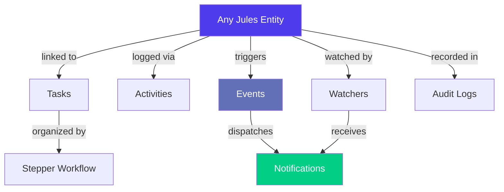
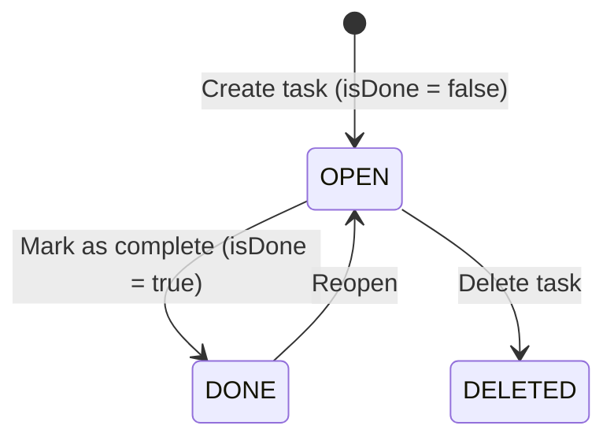
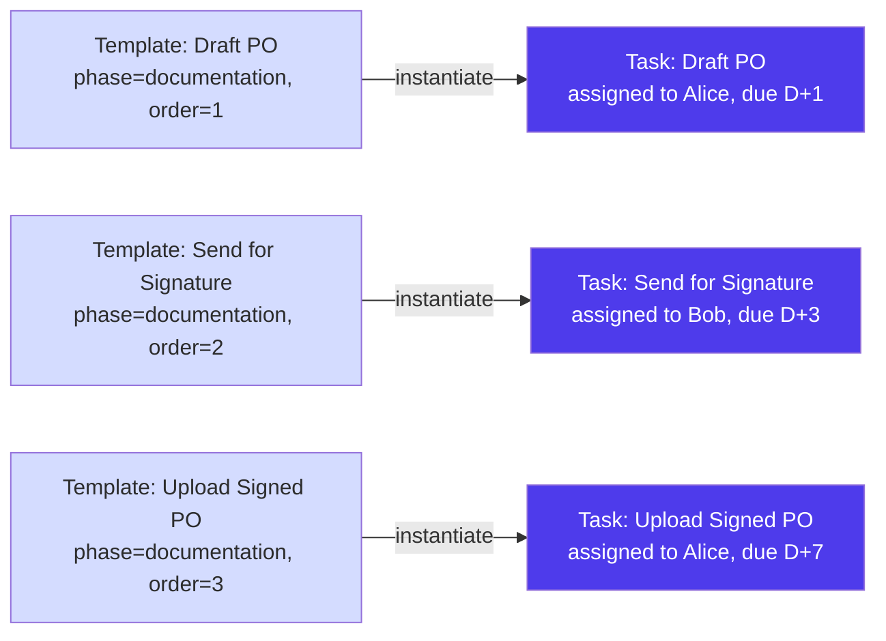
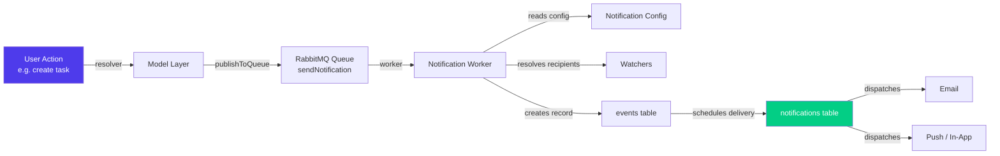
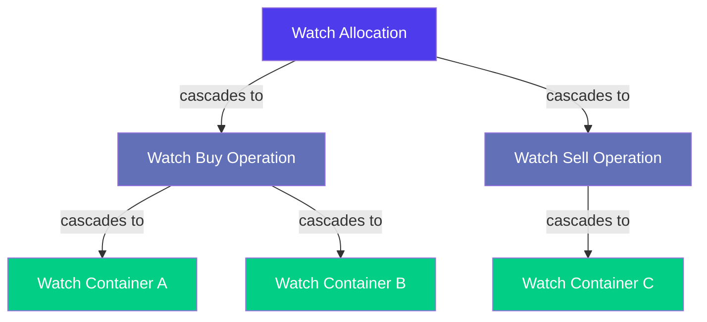
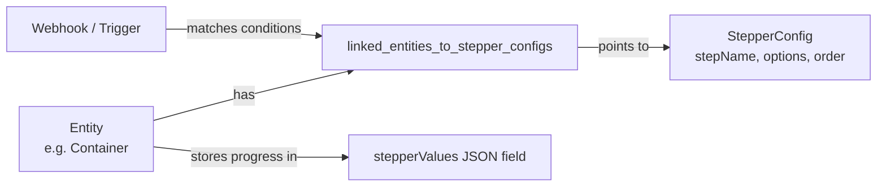
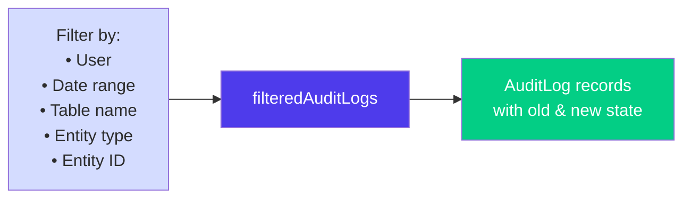
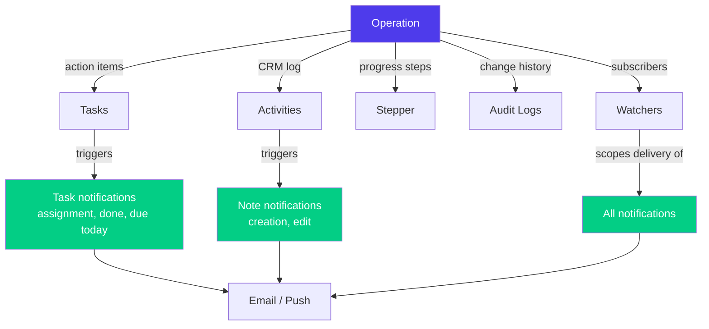

> Product documentation — How Jules keeps your team aligned: action items that get done, a full record of everything that happened, and the right people notified at the right time.

---

## Table of Contents

1. [Overview](#overview)

2. [Task System](#task-system)

3. [Task Types & Templates](#task-types--templates)

4. [Activity Feed](#activity-feed)

5. [Activity Sources](#activity-sources)

6. [Activity Summary (Site Dashboard)](#activity-summary-site-dashboard)

7. [Notification System](#notification-system)

8. [Watchers](#watchers)

9. [Stepper Workflow](#stepper-workflow)

10. [Audit Logs](#audit-logs)

11. [How It All Connects](#how-it-all-connects)

12. [Key Business Rules](#key-business-rules)

13. [Glossary](#glossary)

---

## Overview

Jules provides three complementary layers of operational tracking:

- **Tasks** — discrete, assignable action items with due dates, tied to any entity in Jules (operations, containers, invoices, sites, shipments, allocations).

- **Activities** — a structured, searchable log of commercial interactions: calls, visits, emails, meetings, and internal notes.

- **Notifications** — a configurable event-driven system that pushes alerts to users when things change across the platform.

Together these modules form the operational backbone for collaboration across trading, logistics, finance, and back-office teams.

---

## Task System

A **task** is an action item assigned to a user, optionally linked to a specific Jules entity. Tasks help teams track work that must happen around an operation, container, invoice, shipment, allocation, or site.

### Task Fields

| Field           | Description                                                |
| --------------- | ---------------------------------------------------------- |
| **name**        | Short label for the task                                   |
| **description** | Free-text detail explaining what needs to be done          |
| **assignedTo**  | The user responsible for completing the task               |
| **createdBy**   | The user who created the task                              |
| **dueDate**     | When the task must be completed                            |
| **isDone**      | Boolean flag — true once the task is marked complete       |
| **type**        | The task category (maps to a `TaskType`)                   |
| **phase**       | A grouping label to organize tasks within a workflow phase |
| **step**        | A sub-grouping within a phase                              |
| **order**       | Display order within a phase/step                          |
| **isExternal**  | Whether the task is visible to external portal users       |
| **filesUid**    | Reference to attached files via the Weavy integration      |

### Linked Entities

A task can be attached to **exactly one** Jules entity at creation time:

| Linked entity  | Use case                                              |
| -------------- | ----------------------------------------------------- |
| **operation**  | Action required on a purchase or sale                 |
| **allocation** | Work item on a buy-sell pair                          |
| **shipment**   | Step to complete for a shipment                       |
| **container**  | Action on a specific container                        |
| **invoice**    | Follow-up on a purchase or sale invoice               |
| **site**       | Work item associated with a supplier or customer site |

The `TaskLinkedEntityEnum` enumerates all valid entity types, including purchase agreements, sale agreements, credit notes, debit notes, and provider/purchase reports.

### Task Lifecycle

There is no intermediate status — a task is either open or done. Deletion is permanent and triggers a notification to the previously assigned user.

### Task Filtering & Sorting

Tasks support rich filtering to power inbox and dashboard views:

| Filter                                                                         | Description                             |
| ------------------------------------------------------------------------------ | --------------------------------------- |
| **assignedToId**                                                               | Tasks assigned to a specific user       |
| **createdById**                                                                | Tasks created by a specific user        |
| **operationId / siteId / shipmentId / containerId / invoiceId / allocationId** | Tasks linked to a specific entity       |
| **isDone**                                                                     | Open or completed tasks                 |
| **dueDate** (range)                                                            | Tasks due within a date range           |
| **taskType**                                                                   | Filter by task type category            |
| **isExternal**                                                                 | Show only tasks visible to portal users |

Sorting options (`TaskSortByEnum`): creation date ascending/descending, update date ascending/descending, due date ascending/descending.

### Due Date Urgency Classification

Tasks can be classified by urgency relative to today:

| Classification              | Meaning                 |
| --------------------------- | ----------------------- |
| **OVER\_DUE**               | Due date has passed     |
| **TODAY**                   | Due today               |
| **THREE\_DAYS**             | Due within 3 days       |
| **SEVEN\_DAYS**             | Due within 7 days       |
| **MORE\_THAN\_SEVEN\_DAYS** | Due in more than a week |

> **Note**: The `dueDateFilter` enum is deprecated in favor of the `dueDate` date range filter.

### External Task Access

Tasks created with `isExternal = true` are accessible to **portal users** (counterparties using the Jules client portal). This enables collaborative task management across organizational boundaries without exposing internal data.

---

## Task Types & Templates

### Task Types (TaskType)

A **task type** is a configurable label that categorizes tasks across the platform. Task types make it easy to filter, group, and report on tasks by function (e.g., "Documentation", "Payment Follow-Up", "Inspection", "Customs").

| Field                  | Description                                                             |
| ---------------------- | ----------------------------------------------------------------------- |
| **id**                 | Unique identifier (string key)                                          |
| **value**              | Display name shown in the UI                                            |
| **defaultDescription** | Pre-filled description auto-populated when this type is selected        |
| **groups**             | Which entity types this task type applies to (`TaskLinkedEntityEnum[]`) |
| **isActive**           | Whether this type is available for selection                            |

Task types can be filtered by `linkedEntity` to show only relevant types for a given context (e.g., only container-related types when creating a task on a container), and an `excludeOtherType` flag suppresses the generic fallback option.

### Task Templates (TaskTemplate)

A **task template** defines a reusable task blueprint at the organization level. Templates allow teams to standardize recurring workflows — for example, a checklist that should be completed for every export operation.

| Field                 | Description                                                                         |
| --------------------- | ----------------------------------------------------------------------------------- |
| **description**       | The template task's description                                                     |
| **assignedTo**        | The default user who should be assigned this task                                   |
| **daysFromReference** | How many days after a reference date the task is due (used for relative scheduling) |
| **phase**             | The workflow phase this template belongs to                                         |
| **step**              | The step within the phase                                                           |
| **order**             | Display order within the phase/step                                                 |

Templates are defined at the organization level and queried in bulk. They are used to **batch-create** tasks (`createMany` mutation) when a workflow is initialized, pre-populating the task list with all the standard steps.

---

## Activity Feed

An **activity** (internally called a "note") is a structured log entry capturing a commercial or operational interaction. Activities are the primary audit trail for relationship management in Jules.

Typical uses include:

- Logging a phone call with a supplier about pricing

- Recording a site visit to a customer

- Noting a negotiation outcome on an operation

- Tracking a follow-up meeting scheduled with a counterparty

### Activity Fields

| Field               | Description                                                                             |
| ------------------- | --------------------------------------------------------------------------------------- |
| **date**            | The date of the interaction (can differ from creation date)                             |
| **description**     | Free-text content of the note                                                           |
| **source**          | How the interaction took place (e.g., "Phone", "Email", "Visit") — see Activity Sources |
| **operation**       | The operation this activity relates to (optional)                                       |
| **site**            | The site (supplier or customer) this activity relates to (optional)                     |
| **linkedTo**        | A polymorphic reference to any Jules entity (`typename` + `id` + display `value`)       |
| **contacts**        | One or more contacts from the counterparty who were involved                            |
| **watchers**        | Users who will receive notifications when this activity is updated                      |
| **nextMeetingDate** | If a follow-up meeting is scheduled, its date                                           |
| **photos**          | Attached photo URLs (e.g., site visit photos)                                           |
| **createdBy**       | The user who created the record                                                         |

### Activity Filtering

Activities can be filtered extensively for CRM-style views:

| Filter                   | Description                              |
| ------------------------ | ---------------------------------------- |
| **operationId / siteId** | Activities tied to a specific entity     |
| **dateOfCreation**       | When the record was created (date range) |
| **dateOfNextMeeting**    | Follow-up meetings within a period       |
| **operationType**        | BUY or SELL operations only              |
| **operationStatuses**    | Filter by operation lifecycle state      |
| **siteType**             | SUPPLIER or CUSTOMER sites only          |
| **typename**             | Filter by linked entity type             |
| **createdById**          | Notes created by a specific user         |

A free-text `searchText` parameter enables full-text search across activity content.

### Pull Sync for Mobile

Activities support a **pull sync** query (`pullSyncActivities`) designed for the mobile application. This query uses cursor-based pagination (`lastId` + `minUpdatedAt`) to efficiently fetch only activities that have changed since the last sync — critical for offline-first mobile workflows.

### Activity Notifications

When an activity is created, Jules automatically publishes an `ON_NOTE_CREATION` event to the notification queue. When updated, an `ON_NOTE_EDIT` event is published. Watchers on the activity receive these notifications.

---

## Activity Sources

An **activity source** captures the channel through which a commercial interaction took place. Sources are a simple, org-configurable lookup list.

| Examples |            |
| -------- | ---------- |
| Phone    | Email      |
| Visit    | Video call |
| WhatsApp | Trade show |

Sources are created on demand — if you type a new source value when logging an activity, Jules automatically creates it in the organization's source list (`createIfNotExists` logic). This makes the list self-curating without requiring upfront configuration.

---

## Activity Summary (Site Dashboard)

The **ActivitySummary** module provides aggregated KPI counts displayed on site overview cards. For each site, Jules computes:

| Metric                 | Description                                                        |
| ---------------------- | ------------------------------------------------------------------ |
| **numberOfOperations** | Count of CONFIRMED or CLOSED operations linked to this site        |
| **numberOfContracts**  | Count of contracts associated with this site                       |
| **numberOfNotes**      | Count of activity log entries for this site                        |
| **numberOfTasks**      | Count of tasks linked to this site                                 |
| **numberOfOffers**     | Count of offered prices where this site is a source or destination |

These counts are computed via SQL subqueries and joined against the sites table, giving a fast aggregated view without loading individual records. This powers the site list view where each row shows a summary of activity at a glance.

---

## Notification System

Jules uses an **event-driven notification pipeline** that decouples the action that triggers a notification from its delivery.

### Notification Workflows

A **notification workflow** (`NotificationWorkflowEnum`) is a named event that the platform can trigger. Users and administrators configure which workflows they are subscribed to. There are over 80 workflows covering every major platform action:

**Task workflows:**

| Workflow                     | Trigger                                  |
| ---------------------------- | ---------------------------------------- |
| `ON_TASK_ASSIGNMENT`         | A task is assigned to a user             |
| `ON_TASK_DONE`               | A task is marked as complete             |
| `ON_TASK_EDIT`               | A task's details are changed             |
| `ON_TASK_DELETION`           | A task is deleted                        |
| `TASK_ASSIGNED_BY_DUE_TODAY` | A task assigned by the user is due today |
| `TASK_ASSIGNED_TO_DUE_TODAY` | A task assigned to the user is due today |

**Operation workflows:**

| Workflow                  | Trigger                            |
| ------------------------- | ---------------------------------- |
| `ON_PURCHASE_CREATION`    | A purchase operation is created    |
| `ON_PURCHASE_EDIT`        | A purchase operation is modified   |
| `ON_PURCHASE_CANCEL`      | A purchase operation is cancelled  |
| `ON_PURCHASE_OPPORTUNITY` | A new purchase opportunity appears |
| `ON_SALE_CREATION`        | A sale operation is created        |
| `ON_SALE_EDIT`            | A sale operation is modified       |
| `ON_SALE_CANCEL`          | A sale operation is cancelled      |
| `ON_SALE_OPPORTUNITY`     | A new sale opportunity appears     |
| `ON_REQUEST_APPROVAL`     | An operation is sent for approval  |
| `ON_REVIEW_APPROVAL`      | An approval decision is made       |

**Logistics workflows:**

| Workflow                   | Trigger                              |
| -------------------------- | ------------------------------------ |
| `ON_CONTAINER_PLANNING`    | A container is planned               |
| `ON_CONTAINER_LOADING`     | A container is loaded                |
| `ON_CONTAINER_DELIVERY`    | A container is delivered             |
| `ON_BOOKING_CREATION`      | A freight booking is created         |
| `ON_BOOKING_EDIT`          | A freight booking is modified        |
| `ON_SHIPMENT_CREATION`     | A shipment is created                |
| `ON_SHIPMENT_EDIT`         | A shipment is modified               |
| `ON_SHIPMENT_ETA_CHANGE`   | A shipment's ETA is updated          |
| `CONTAINERS_ARRIVING_SOON` | Containers are approaching their ETA |
| `SHIPMENTS_ARRIVING_SOON`  | Shipments are approaching their ETA  |

**Finance workflows:**

| Workflow                    | Trigger                      |
| --------------------------- | ---------------------------- |
| `ON_INVOICE_CREATION`       | An invoice is created        |
| `ON_INVOICE_APPROVED`       | An invoice is approved       |
| `ON_INVOICE_EDIT`           | An invoice is modified       |
| `ON_INVOICE_MARKED_AS_PAID` | An invoice is marked as paid |
| `ON_PAYMENT_CREATION`       | A payment is recorded        |
| `ON_CREDIT_NOTE_CREATION`   | A credit note is issued      |

**Document & compliance workflows:**

| Workflow                              | Trigger                                     |
| ------------------------------------- | ------------------------------------------- |
| `ON_DOCUMENT_UPLOAD`                  | A document is uploaded                      |
| `ON_DOCUMENT_REVIEWED`                | A document is reviewed                      |
| `ON_DOCUMENT_SHARED_TO_CLIENT_PORTAL` | A document is shared with a counterparty    |
| `ON_REQUEST_FOR_DOCUMENT_APPROVAL`    | Document approval is requested              |
| `VGM_STATUS`                          | VGM status changes                          |
| `CUSTOMS_STATUS`                      | Customs clearance status changes            |
| `SHIPPING_INSTRUCTIONS_STATUS`        | Shipping instructions status changes        |
| `BOL_ETD`                             | Bill of lading ETD reminder                 |
| `DOCUMENTS_RELEASE_ETA`               | Documents release approaching               |
| `FREE_TIME_LIMIT`                     | Free time for container at port is expiring |
| `RELEASE_PAYMENT`                     | Payment release reminder                    |

**CRM & master data workflows:**

| Workflow                 | Trigger                      |
| ------------------------ | ---------------------------- |
| `ON_COMPANY_CREATION`    | A new company is created     |
| `ON_UPDATE_COMPANY`      | Company details are updated  |
| `ON_PROVIDER_CREATION`   | A new provider is created    |
| `ON_NOTE_CREATION`       | An activity note is logged   |
| `ON_NOTE_EDIT`           | An activity note is updated  |
| `ON_ALLOCATION_CREATION` | An allocation is created     |
| `ON_USER_REGISTRATION`   | A new user registers         |
| `ON_PASSWORD_CHANGE`     | A user's password is changed |

### The Event–Notification Pattern

Jules uses a two-table pattern to manage notification delivery:

1. **Event** (`events` table): A deduplicated record of what happened. If multiple rapid changes happen to the same object before the notification is sent, Jules **upserts** the event (merging changes) rather than creating duplicates — preventing notification storms.

2. **Notification** (`notifications` table): The actual delivery records, one per recipient per channel. Each notification carries:

   - `recipientId` — who receives it

   - `channelType` — email, push, in-app

   - `templateId` — which message template to use

   - `schedule` — when to send it (supports delayed/scheduled delivery)

   - `isSent` — delivery status flag

   - `cc` — carbon copy recipients

The notification worker queries scheduled notifications within the current hour (`getSchedulledEventNotifications`) and dispatches them via the appropriate channel.

### Notification Config

`NotificationConfig` is the per-user preference layer: each user's subscriptions to `NotificationWorkflowEnum` values are stored and queried via `userNotificationWorkflows`. This allows users to opt in or out of specific notification types from their profile settings.

---

## Watchers

**Watchers** provide a subscription mechanism that links users to specific Jules entities. A watcher on an entity will receive notifications when that entity changes, regardless of their organization-wide notification config.

### Watchable Entity Types

| Entity type    | Notes                                                                                      |
| -------------- | ------------------------------------------------------------------------------------------ |
| **OPERATION**  | Watching an operation automatically watches all its containers                             |
| **ALLOCATION** | Watching an allocation automatically watches both linked operations (and their containers) |
| **SHIPMENT**   | Watching a shipment automatically watches all its containers                               |
| **CONTAINER**  | Watching a container directly                                                              |
| **ACTIVITY**   | Watching a specific activity note                                                          |

### Cascading Watch Logic

The watcher system implements intelligent **cascading subscription** and **cascading unsubscription**:

**Unsubscription is parent-aware**: when a user tries to unwatch a container, Jules first checks whether they are still watching a parent entity (an operation or shipment) that includes that container. If they are, the container watch is preserved. This prevents accidental gaps in coverage.

### Watcher Identifiers

Watchers are stored using a composite `objectUid` string: `{ENTITY_TYPE}_{entityId}` (e.g., `OPERATION_4521`, `CONTAINER_892`). This makes the watcher table entity-agnostic — a single table covers all watchable types.

### Updating Watchers

- **Single watcher**: `updateWatcher(type: SUBSCRIBE | UNSUBSCRIBE, watchedObjectId, watchedObjectType, watcherId)` — subscribe or unsubscribe one user.

- **Batch watchers**: `updateWatchers(watchedObjectId, watchedObjectType, watcherIds[])` — replace the full list of watchers on an entity. Jules diffs the current list against the new list and applies only the necessary adds and removes.

---

## Stepper Workflow

The **Stepper** is a configurable workflow engine that attaches structured progress tracking to Jules entities. It tracks which steps in a predefined checklist have been completed for a given entity.

### How the Stepper Works

Stepper configs are organization-level templates (`stepper_configs` table) that define:

- **stepName**: The name of the step

- **options**: The set of valid values for this step

- **order**: Display order

- **linkedEntity**: Which entity type this config applies to

- **conditions**: An optional JavaScript expression evaluated against the entity's data — if the condition is false, this stepper config is skipped for that entity

When a relevant event occurs (e.g., a booking is confirmed), Jules evaluates all stepper configs against the entity's current data and links the matching ones via `linked_entities_to_stepper_configs`. This ensures each entity only shows the steps that are relevant to its current state.

### Supported Entity Types

The Stepper currently writes values to:

| Entity type    | Table                                         |
| -------------- | --------------------------------------------- |
| **ALLOCATION** | `allocations.stepperValues`                   |
| **CONTAINER**  | `containers.stepperValues`                    |
| **TRUCK**      | `containers.stepperValues` (truck containers) |
| **SHIPMENT**   | `shipments.stepperValues`                     |

Progress is stored as a **JSON field** (`stepperValues`) directly on the entity row. This means step state is available alongside other entity data in a single query — no join required.

### Updating Stepper Values

The `updateStepperValues(linkedEntityId, linkedEntity, values: JSON)` mutation **merges** the new values with the existing JSON object (spread operator semantics). This allows partial updates — updating one step does not reset others.

> **Note**: The older `StepperConfig` GraphQL type is deprecated. The current implementation uses a database-driven configuration approach, not a GraphQL-exposed config query.

---

## Audit Logs

The **Audit Log** is a comprehensive, tamper-evident record of every write operation performed on the platform. Every INSERT, UPDATE, and DELETE on tracked tables is captured automatically via a PostgreSQL trigger and written to the `logs` table.

### What Gets Logged

| Table                  | Entity type                      |
| ---------------------- | -------------------------------- |
| `activities`           | Activity notes                   |
| `companies`            | Companies                        |
| `container_invoicings` | Container invoicing records      |
| `containers`           | Containers                       |
| `deliveries`           | Delivery records                 |
| `exchange_rates`       | Exchange rate entries            |
| `invoices`             | Invoices                         |
| `loadings`             | Loading records                  |
| `operation_qualities`  | Operation quality lines          |
| `operations`           | Operations (purchases and sales) |
| `other_products`       | Other product records            |
| `payments`             | Payment records                  |
| `qualities`            | Material quality definitions     |
| `shipments`            | Shipments                        |
| `sites`                | Sites                            |
| `tasks`                | Tasks                            |

### Audit Log Fields

| Field           | Description                                                      |
| --------------- | ---------------------------------------------------------------- |
| **operation**   | `INSERT`, `UPDATE`, or `DELETE`                                  |
| **tableName**   | Which table was affected                                         |
| **object**      | The semantic entity type (e.g., `PURCHASE`, `SALE`, `CONTAINER`) |
| **oldObject**   | The full record state **before** the change                      |
| **newObject**   | The full record state **after** the change                       |
| **updatedKeys** | Which specific fields changed (for UPDATE operations)            |
| **user**        | The user who performed the action                                |
| **ipAddress**   | The IP address of the client                                     |
| **platform**    | `WEB`, `MOBILE`, or `INTEGRATION`                                |
| **created\_at** | Timestamp of the change                                          |

### Log Groups (logUid)

Every mutation in Jules generates a `logUid` — a unique identifier that groups all the database writes that happened within a single logical operation. For example, creating an operation with two quality lines will generate one `logUid` that covers the operation insert, both quality line inserts, and any related records created in the same transaction. This makes it possible to replay or investigate a complete user action as a single atomic unit.

### Querying Audit Logs

Audit logs support powerful filtering:

When filtering by a specific operation (`objectId` with `PURCHASE` or `SALE` type), the audit log query **automatically includes child records**: it returns not just the operation's own log entries, but also logs for its quality lines, containers, loadings, and deliveries. This gives a complete picture of everything that happened on an operation without requiring multiple queries.

### Platform Classification

Each log entry is tagged with the platform that initiated the change:

| Platform        | Description                                          |
| --------------- | ---------------------------------------------------- |
| **WEB**         | Change made via the Jules web application            |
| **MOBILE**      | Change made via the Jules mobile app                 |
| **INTEGRATION** | Change made via the API or a third-party integration |

### Access Control

Audit log access is gated by the `AUDIT_LOGS` / `VIEW` permission via Permit.io. This is typically restricted to administrators and compliance roles.

---

## How It All Connects

Tasks, activities, notifications, the stepper, and audit logs are not independent silos — they form an interconnected operational fabric:

| Module                  | Purpose                                             | Typical users                    |
| ----------------------- | --------------------------------------------------- | -------------------------------- |
| **Tasks**               | Action tracking, checklists, external collaboration | Traders, ops, logistics, finance |
| **Task Templates**      | Standardized workflow checklists                    | Admin, ops managers              |
| **Task Types**          | Categorization and filtering                        | All users                        |
| **Activities**          | CRM-style interaction log                           | Traders, sales, account managers |
| **Activity Sources**    | Channel classification                              | All users                        |
| **Activity Summary**    | Site-level KPI dashboard                            | Traders, management              |
| **Notifications**       | Push alerts on platform events                      | All users                        |
| **Notification Config** | Personal notification preferences                   | All users                        |
| **Watchers**            | Entity-level subscriptions                          | Traders, ops                     |
| **Stepper**             | Structured step-by-step workflows                   | Ops, logistics                   |
| **Audit Logs**          | Compliance, debugging, change history               | Admins, compliance, support      |

---

## Key Business Rules

### 1. Task notification sequence

When a task is **created**, a notification of type `ON_TASK_ASSIGNMENT` is sent to the assignee. When a task is **updated**, the system evaluates three mutually exclusive cases:

- If the task just became done → `ON_TASK_DONE`

- If the assignee changed → `ON_TASK_DELETION` to the previous assignee + `ON_TASK_ASSIGNMENT` to the new assignee

- Otherwise → `ON_TASK_EDIT`

### 2. Event deduplication

Before creating a new event record, Jules checks whether there is already an **unsent event** for the same object. If one exists, it **merges** the new data into the existing event rather than creating a duplicate. This prevents notification floods when an entity is updated multiple times in quick succession (e.g., a trader updates an operation five times in a minute — the recipient gets one notification, not five).

### 3. Watcher cascade integrity

When a parent entity (operation, allocation, shipment) is unwatched, Jules checks whether any other watched parent still covers the child before removing the child watch. This prevents a user from accidentally losing notifications on a container when they unsubscribe from one of its operations while still watching the other.

### 4. Activity source auto-creation

Activity sources are created on first use with `createIfNotExists` logic. Users never need to pre-configure source values — typing a new source name when logging an activity is sufficient to register it permanently in the organization's list.

### 5. Audit log operation grouping

Every GraphQL mutation generates a `logUid` that groups all related database writes into a logical unit. This is critical for understanding compound mutations (e.g., "create operation + create two quality lines + create PO document") as a single event rather than scattered individual rows.

### 6. Stepper condition evaluation

Stepper configs can include a `conditions` JavaScript expression evaluated at runtime against the entity's data. This allows one stepper config catalog to serve many different entity configurations — a container in an export operation gets different steps than a container in a local truck operation — without requiring multiple separate configs.

### 7. External task visibility

The `isExternal` flag on tasks controls what portal users can see. Internal tasks (documentation reviews, margin approvals, pricing notes) are not visible to counterparties. Only tasks explicitly marked as external are surfaced in the portal, enabling selective collaboration without leaking internal process detail.

### 8. Manager-aware task filtering

When an authenticated user queries tasks, Jules checks whether they have any direct reports (`ManagerToManagee` relationship). If they do, the task filter applies **ACL-based expansion** — managers can see tasks assigned to their direct reports in addition to their own tasks.

---

## Glossary

| Term                         | Definition                                                                                                    |
| ---------------------------- | ------------------------------------------------------------------------------------------------------------- |
| **Activity**                 | A structured log entry for a commercial or operational interaction (call, visit, email, note)                 |
| **Activity Source**          | The channel through which an activity took place (phone, email, visit, etc.)                                  |
| **Activity Summary**         | Aggregated KPI counts (operations, contracts, notes, tasks, offers) computed per site                         |
| **Audit Log**                | An immutable record of every INSERT, UPDATE, and DELETE on tracked database tables                            |
| **Event**                    | An internal record of a platform action that triggers one or more notifications; deduplicated before dispatch |
| **isExternal**               | A flag on tasks indicating they are visible to portal/counterparty users                                      |
| **isDone**                   | A boolean on tasks indicating completion status                                                               |
| **logUid**                   | A UUID grouping all database writes from a single logical mutation for audit and replay purposes              |
| **Notification**             | A delivery record targeted at a specific user via a specific channel (email, push, in-app)                    |
| **NotificationConfig**       | A user's subscription preferences across notification workflow types                                          |
| **NotificationWorkflowEnum** | The enumeration of all platform events that can trigger notifications (80+ values)                            |
| **objectUid**                | A composite string key (`{ENTITY_TYPE}_{entityId}`) used to identify watchable objects                        |
| **Phase**                    | A grouping label on tasks and task templates to organize work into stages                                     |
| **Pull Sync**                | A cursor-based query pattern for mobile apps to fetch only changed activity records since the last sync       |
| **Stepper**                  | A configurable workflow engine that tracks step-by-step progress on containers, allocations, and shipments    |
| **StepperConfig**            | An organization-level template defining the steps, options, and conditions for a stepper workflow             |
| **stepperValues**            | A JSON field on entity records storing the current completion state of each stepper step                      |
| **Task**                     | A discrete, assignable action item with a due date, linked to a Jules entity                                  |
| **TaskTemplate**             | A reusable task blueprint used to batch-create standardized task checklists                                   |
| **TaskType**                 | A configurable category label for tasks, controlling which entity types it applies to                         |
| **Watcher**                  | A user subscribed to receive notifications when a specific entity changes                                     |
| **WatchedObjectType**        | The entity type being watched: ACTIVITY, ALLOCATION, CONTAINER, OPERATION, or SHIPMENT                        |

