> This is the onboarding article for Jules. It walks through every stage of a complete trade using a single concrete example, and points you to the detailed documentation for each module. Read this first before diving into individual topic articles.

---

## Table of Contents

1. [The Big Picture](#the-big-picture)

2. [Our Example Trade](#our-example-trade)

3. [Step 1 — Setting Up Counterparties](#step-1--setting-up-counterparties)

4. [Step 2 — Creating a Purchase Contract](#step-2--creating-a-purchase-contract)

5. [Step 3 — Creating a Sale Contract](#step-3--creating-a-sale-contract)

6. [Step 4 — Creating Buy and Sell Operations](#step-4--creating-buy-and-sell-operations)

7. [Step 5 — Allocating Buy Containers to the Sell Operation](#step-5--allocating-buy-containers-to-the-sell-operation)

8. [Step 6 — Booking Freight and Managing Logistics](#step-6--booking-freight-and-managing-logistics)

9. [Step 7 — Container Lifecycle: Loading, Shipping, Delivery](#step-7--container-lifecycle-loading-shipping-delivery)

10. [Step 8 — Hedging the Price Risk](#step-8--hedging-the-price-risk)

11. [Step 9 — Invoicing: Proforma to Final](#step-9--invoicing-proforma-to-final)

12. [Step 10 — Margin Calculation: Estimated to Final](#step-10--margin-calculation-estimated-to-final)

13. [Step 11 — Budget Tracking and Goal Monitoring](#step-11--budget-tracking-and-goal-monitoring)

14. [How Every Step Connects](#how-every-step-connects)

15. [Glossary](#glossary)

---

## The Big Picture

Jules manages the full commercial and operational lifecycle of a recyclable commodity trade. Every trade in Jules is built from the same set of interconnected modules. Before reading anything else, understand this map:

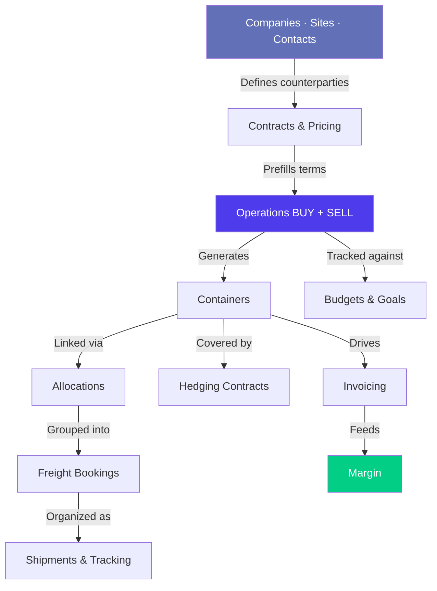

Every element you see in Jules connects back to an **operation** — a commercial transaction. An operation is either a purchase (BUY) from a supplier or a sale (SELL) to a customer. The operation is Jules' center of gravity. Everything else orbits it.

---

## Our Example Trade

We will follow a single trade from start to finish:

> **The deal**: Buy 500 tonnes of HMS 1&2 scrap from **Garfield Metals** (a US supplier, site: New Jersey yard) and sell it to **Demirdöküm Steel** (a Turkish mill, site: Iskenderun mill), shipped in 20 x 40' HC containers from the Port of New York to the Port of Iskenderun.
>
> **Buy price**: TSI HMS 1&2 CFR Turkey index (average previous month) − USD 15/T (the differential), at EXW terms from the supplier yard.
>
> **Sell price**: TSI HMS 1&2 CFR Turkey index (average previous month) + USD 5/T, at CFR Iskenderun terms.
>
> **Margin objective**: approximately USD 20/T before logistics costs.

This is a classic containerized ferrous scrap export trade — one of the most common trade types in Jules.

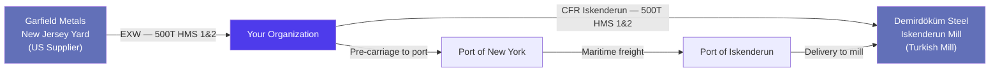

---

## Step 1 — Setting Up Counterparties

**Before any trade can happen**, the master data must exist in Jules. This means creating the company, its site, and the key contacts for each trading partner.

See [Companies, Sites & Contacts](./companies-sites-contacts-en.mdx) for complete reference documentation.

### What you need to create

For our example trade, you need three sets of master data:

| Entity                                 | Object  | Type              |
| -------------------------------------- | ------- | ----------------- |
| **Garfield Metals**                    | Company | SUPPLIER          |
| **Garfield Metals — New Jersey Yard**  | Site    | SUPPLIER          |
| **Mike Garfield** (commercial contact) | Contact | BUSINESS\_MANAGER |
| **Demirdöküm Steel**                   | Company | CUSTOMER          |
| **Demirdöküm Steel — Iskenderun Mill** | Site    | CUSTOMER          |
| **Ayşe Kaya** (logistics contact)      | Contact | LOGISTICIAN       |

### Company vs Site — the critical distinction

In Jules, you always trade **against a site**, not directly against a company. When you create a purchase operation, you select **Garfield Metals — New Jersey Yard** (the site). Jules resolves the parent company (Garfield Metals) automatically for document generation, credit management, and invoicing.

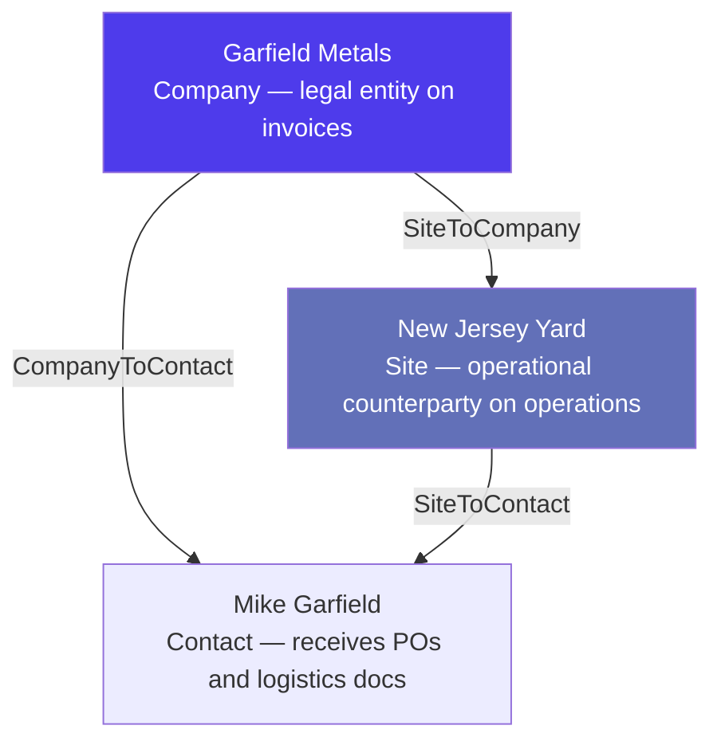

### Site quality configuration

Before the New Jersey Yard can be used on a purchase operation for HMS 1&2, the site must have a **SiteToQuality BUY** record for the HMS 1&2 quality. This record carries:

- The default currency (USD)

- The default MQC (e.g., 18 T per container)

- The default margin target (e.g., USD 20/T)

- The port of loading (Port of New York)

If this configuration is missing, HMS 1&2 will not appear as an available material when creating a purchase operation for this site.

### Contact receivables

Configure Mike Garfield's `receivables` so he automatically receives:

- `OPERATION` — he gets the Purchase Order PDF when you confirm the deal

- `SHIPMENT` — he gets shipping notifications and Bill of Lading documents

Configure Ayşe Kaya at the Turkish mill to receive `SHIPMENT` and `INVOICE` documents.

---

## Step 2 — Creating a Purchase Contract

With counterparties configured, create a **purchase contract** with Garfield Metals to record the agreed terms and enable fast operation creation.

See [Contracts & Pricing](./contracts-pricing-en.mdx) for complete reference documentation.

### What the purchase contract captures

| Field             | Value in our example           |
| ----------------- | ------------------------------ |
| **Direction**     | BUY                            |
| **Company**       | Garfield Metals                |
| **Site**          | New Jersey Yard                |
| **Market type**   | EXPORT                         |
| **Contract type** | TRADING                        |
| **Period**        | Q1 2026 (01 Jan – 31 Mar 2026) |

### Quality stream on the purchase contract

The contract contains one quality stream defining the commercial terms for HMS 1&2:

| Field             | Value                                                          |
| ----------------- | -------------------------------------------------------------- |
| **Quality**       | HMS 1&2                                                        |
| **Quantity**      | 500 T                                                          |
| **Price type**    | INDEX                                                          |
| **Formula**       | TSI HMS 1&2 CFR Turkey — Average M-1 − USD 15/T (differential) |
| **Incoterm**      | EXW                                                            |
| **MQC**           | 18 T per container                                             |
| **Equipment**     | 40' HC                                                         |
| **Tolerance**     | ± 5%                                                           |
| **Payment terms** | 30 days from B/L date                                          |

The INDEX pricing configuration uses the formula code `INDEX_MINUS_DIFFERENTIAL`:

```
Price = TSI HMS 1&2 CFR Turkey (Average previous month, Official) − 15 USD/T
```

See [Pricing Engine, Market Indices & Offers](./pricing-indices-offers-en.mdx) for details on index formula configuration.

### Contract lifecycle

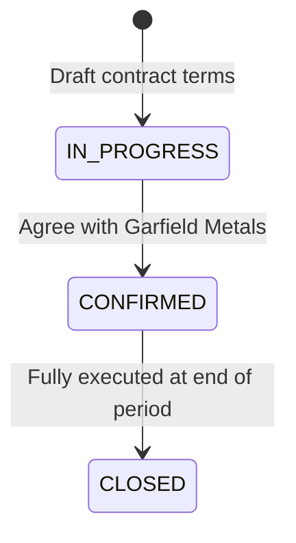

Confirm the contract once terms are agreed. From this point, every operation you create against Garfield Metals / New Jersey Yard can be **prefilled** from this contract — saving time and ensuring consistency.

---

## Step 3 — Creating a Sale Contract

Repeat the same process for the customer side. Create a **sale contract** with Demirdöküm Steel.

See [Contracts & Pricing](./contracts-pricing-en.mdx) for complete reference documentation.

### Quality stream on the sale contract

| Field             | Value                                          |
| ----------------- | ---------------------------------------------- |
| **Direction**     | SELL                                           |
| **Company**       | Demirdöküm Steel                               |
| **Site**          | Iskenderun Mill                                |
| **Quality**       | HMS 1&2                                        |
| **Quantity**      | 500 T                                          |
| **Price type**    | INDEX                                          |
| **Formula**       | TSI HMS 1&2 CFR Turkey — Average M-1 + USD 5/T |
| **Incoterm**      | CFR Iskenderun                                 |
| **MQC**           | 18 T per container                             |
| **Payment terms** | 7 days from B/L date (Letter of Credit)        |

### The two contracts side by side

At this point, you have locked in the commercial spread:

|                | Buy side                    | Sell side                   |
| -------------- | --------------------------- | --------------------------- |
| **Reference**  | TSI HMS CFR Turkey, avg M-1 | TSI HMS CFR Turkey, avg M-1 |
| **Adjustment** | − USD 15/T                  | + USD 5/T                   |
| **Incoterm**   | EXW                         | CFR                         |
| **Net spread** |                             | +USD 20/T (before freight)  |

The freight cost (the CFR leg from New York to Iskenderun) will determine whether this trade is profitable. This is exactly what the budget tool helps you validate before committing.

---

## Step 4 — Creating Buy and Sell Operations

Contracts record intentions. **Operations** record commitments. When a deal is agreed, you create an operation from the contract.

See [Operations & Lifecycle](./operations-lifecycle-en.mdx) for complete reference documentation.

### Creating the purchase operation

Create a **BUY** operation from the purchase contract:

1. Navigate to the Purchase Operations module

2. Select the Garfield Metals contract — Jules prefills all terms automatically

3. Review and confirm:

   - Site: Garfield Metals — New Jersey Yard

   - Quality: HMS 1&2, 500 T @ INDEX (TSI − 15), EXW

   - Equipment: 40' HC containers

4. Set the operation status to **CONFIRMED**

Jules assigns a unique **Harold number** (e.g., `BUY-2026-0042`) automatically. This number is the primary reference for all downstream activity.

### Creating the sale operation

Create a **SELL** operation from the sale contract in the same way:

- Site: Demirdöküm Steel — Iskenderun Mill

- Quality: HMS 1&2, 500 T @ INDEX (TSI + 5), CFR Iskenderun

- Harold number: `SELL-2026-0031`

### Operation lifecycle

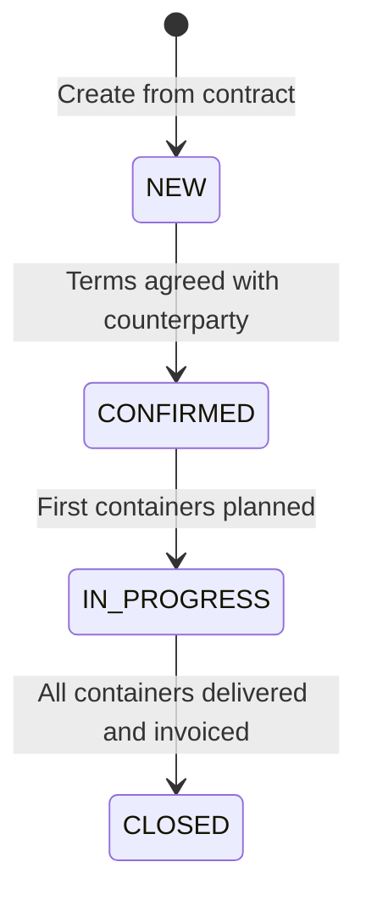

Both operations should be **CONFIRMED** before logistics begins. Confirming locks the commercial terms and enables Purchase Order / Sales Order document generation.

### Approval workflow (if required)

Depending on your organization's settings, operations above a certain value may require management approval before they can proceed to IN\_PROGRESS. Jules supports an approval workflow at the operation level.

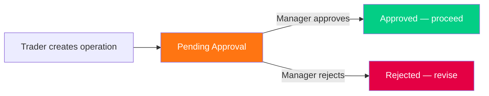

### The follow-up tracker

Once confirmed, each operation shows a **follow-up pipeline** that tracks physical progress:


All 500 T start as **Total** (contracted). As containers are created, allocated, booked, loaded, and delivered, the numbers flow across this pipeline in real time.

---

## Step 5 — Allocating Buy Containers to the Sell Operation

An **allocation** is the link between a purchase operation and a sale operation. It is how Jules knows which purchased material is being sold to which customer.

See [Logistics & Freight](./logistics-freight-en.mdx) for complete reference on allocations.

### Creating containers

First, containers are created under the buy operation — one per physical shipping container. In our example: 20 containers, each planned for approximately 25 T of HMS 1&2. Each container receives its own Harold number.

### Creating the allocation

The allocation links:

- **Buy side**: BUY-2026-0042, Quality HMS 1&2, New Jersey Yard

- **Sell side**: SELL-2026-0031, Quality HMS 1&2, Iskenderun Mill

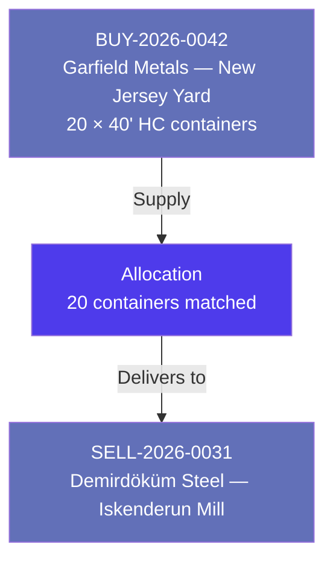

Once created, the allocation moves containers from **Planned** to **Allocated** in both the buy and sell follow-up pipelines. The buy and sell operations are now commercially linked: Jules can calculate an estimated margin across this pair.

### Blacklist check

Before confirming the allocation, Jules automatically checks whether the New Jersey Yard (buy site) is blacklisted by the Iskenderun Mill (sell site). If the Turkish mill has configured "no material from Yard X", Jules will warn or block the allocation at this point.

See [Companies, Sites & Contacts](./companies-sites-contacts-en.mdx) for details on site blacklists and whitelists.

---

## Step 6 — Booking Freight and Managing Logistics

With containers allocated, it is time to book shipping space. The logistics flow in Jules follows a strict hierarchy: **freight rate → booking → containers → shipment**.

See [Logistics & Freight](./logistics-freight-en.mdx) for complete reference documentation.

### Freight rate selection

Before booking, verify that a valid **freight rate** exists in Jules for this lane:

- Shipping line: e.g., MSC

- Port of loading: New York

- Port of destination: Iskenderun

- Equipment: 40' HC

- Incoterm: CFR

The freight rate gives you the cost per container. In our example, assume USD 1,800 / container (roughly USD 72/T for 25 T containers). This is the main logistics cost that will determine whether the USD 20/T spread generates a positive margin.

### Creating the booking

Create a **FREIGHT** booking:

| Field                   | Value                      |
| ----------------------- | -------------------------- |
| **Type**                | FREIGHT                    |
| **Shipping line**       | MSC                        |
| **Port of loading**     | New York                   |
| **Port of destination** | Iskenderun                 |
| **Vessel**              | MSC Valentina, voyage 024W |
| **ETD**                 | 15 February 2026           |
| **Booked containers**   | 20                         |
| **Freight cost**        | USD 1,800 / container      |

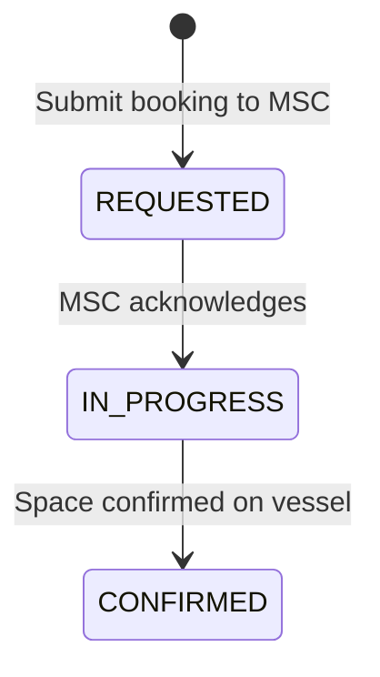

Once confirmed, the booking is assigned to the 20 containers. Their status moves from **Allocated** to **Booked** in the follow-up tracker.

### Pre-carriage

For EXW purchases, you also need to organize the **pre-carriage** — the inland transport from the New Jersey Yard to the Port of New York. Create a pre-carriage booking linked to the containers, selecting the appropriate road transport provider and pre-carriage rate.

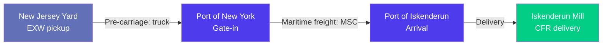

---

## Step 7 — Container Lifecycle: Loading, Shipping, Delivery

Each physical container moves through its own status lifecycle. Jules tracks every step.

See [Logistics & Freight](./logistics-freight-en.mdx) for complete reference on container statuses and shipments.

### Container status progression

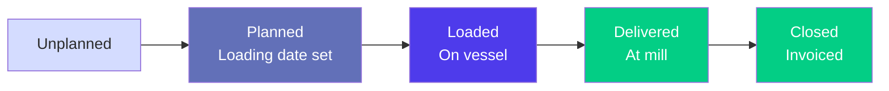

### Loading

When MSC issues the booking confirmation (CRO — Container Release Order), containers are gated into the port. When loaded onto the vessel, each container is updated to **LOADED** status in Jules with:

- Actual gross weight (from the weight certificate)

- Net weight (commodity only)

- Date of loading

- BL number (once issued)

This is the point at which the **VGM** (Verified Gross Mass) must be submitted to the carrier.

### Shipment creation

Jules groups all 20 containers traveling under a single Bill of Lading into a **Shipment** entity:

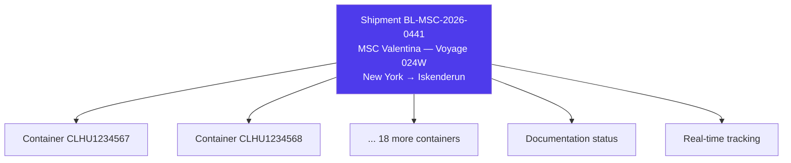

### Shipment tracking

Jules provides real-time tracking:

| Status           | When                                   |
| ---------------- | -------------------------------------- |
| **AT\_ORIGIN**   | Containers are at the Port of New York |
| **LOADED**       | On board MSC Valentina                 |
| **IN\_TRANSIT**  | Vessel is at sea                       |
| **REACHED\_POD** | Vessel arrives at Iskenderun           |
| **COMPLETED**    | Containers discharged and delivered    |

### Documentation workflow

The Bill of Lading documentation also follows a tracked workflow:

| Status                | Action                                       |
| --------------------- | -------------------------------------------- |
| **TO\_START**         | BL draft not yet requested                   |
| **DRAFT\_SHARED**     | Draft BL sent to Demirdöküm for approval     |
| **APPROVED**          | BL terms approved by customer                |
| **PAYMENT\_RECEIVED** | Customer payment received (for LC trades)    |
| **SENT\_TO\_CLIENT**  | Original BL / telex release sent to customer |

### Delivery

When the containers arrive at the Iskenderun Mill and are discharged, each container is updated to **DELIVERED** status with:

- Actual delivery date

- Final delivery weight (from the mill's weight slip)

The follow-up tracker now shows 500 T / 20 Ctn **Delivered** on both the buy and sell operations.

---

## Step 8 — Hedging the Price Risk

Our trade uses an index price (TSI HMS 1&2 CFR Turkey average M-1). This means the final price is not known at deal time — it will be fixed based on the index average for the month prior to shipment. Between deal date and the price fixation month, the market can move against you.

**Hedging** lets you lock in the economics of the deal on a commodity exchange (LME), neutralizing this market risk.

See [Hedging & Risk Management](./hedging-risk-management-en.mdx) for complete reference documentation.

### The risk in our example

- You bought HMS at **TSI − USD 15** (index-linked)

- You sold HMS at **TSI + USD 5** (index-linked)

- Your spread is locked at USD 20/T regardless of where TSI moves — **but only if you are hedged on the same index**

If the index falls significantly between deal date and fixing month, both your buy and sell prices fall together. Your USD 20 spread remains intact. However, if only one side is index-linked (a common situation), or if the fixing months differ between buy and sell, you have an unhedged period exposure.

### Creating a hedging contract

In Jules, create a **hedging contract** to cover the tonnage:

| Field                 | Value                                                         |
| --------------------- | ------------------------------------------------------------- |
| **Type**              | SALE (sell hedge — to offset your physical purchase exposure) |
| **Market**            | LME                                                           |
| **Commodity**         | Steel Scrap                                                   |
| **Quantity**          | 500 T                                                         |
| **Trade date**        | 20 January 2026                                               |
| **Prompt date**       | February 2026                                                 |
| **Sell action price** | LME price at time of hedge execution                          |

### Container-level hedging allocation

Once the hedging contract exists, allocate it at the container level. Each container is linked to a portion of the hedge:

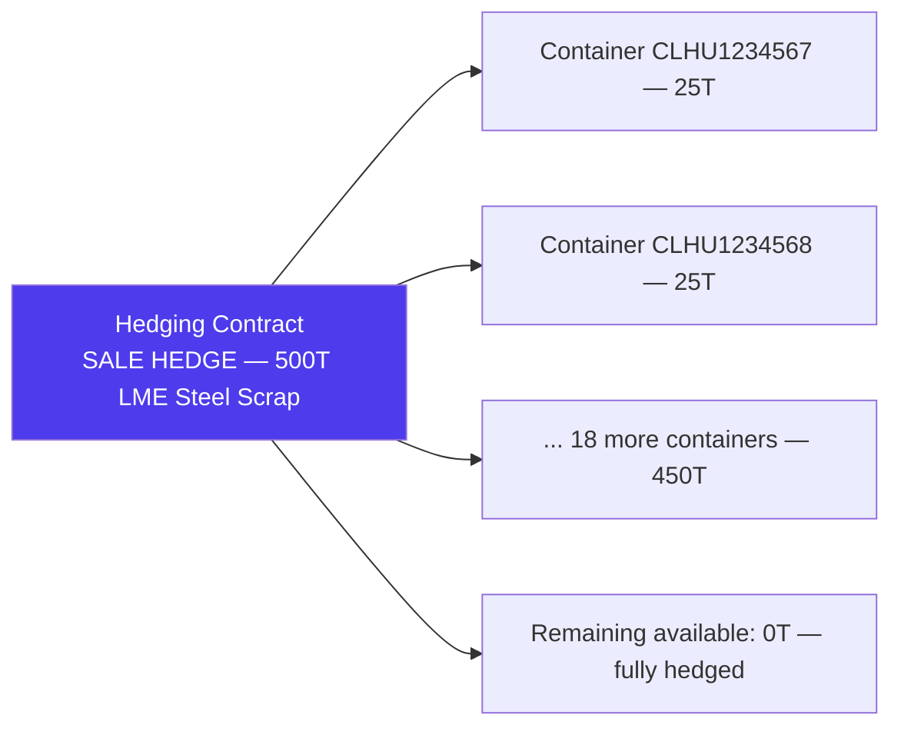

Jules tracks the hedging status per operation:

| Status                | Meaning                             |
| --------------------- | ----------------------------------- |
| **REQUIRED**          | Hedging needed but not yet placed   |
| **PARTIALLY\_HEDGED** | Some containers covered, others not |
| **HEDGED**            | All containers fully covered        |

---

## Step 9 — Invoicing: Proforma to Final

Invoicing in Jules follows a standard progression from preliminary to final, on both the buy and sell sides.

See [Invoicing & Billing](./invoicing-billing-en.mdx) for complete reference documentation.

### The invoicing flow

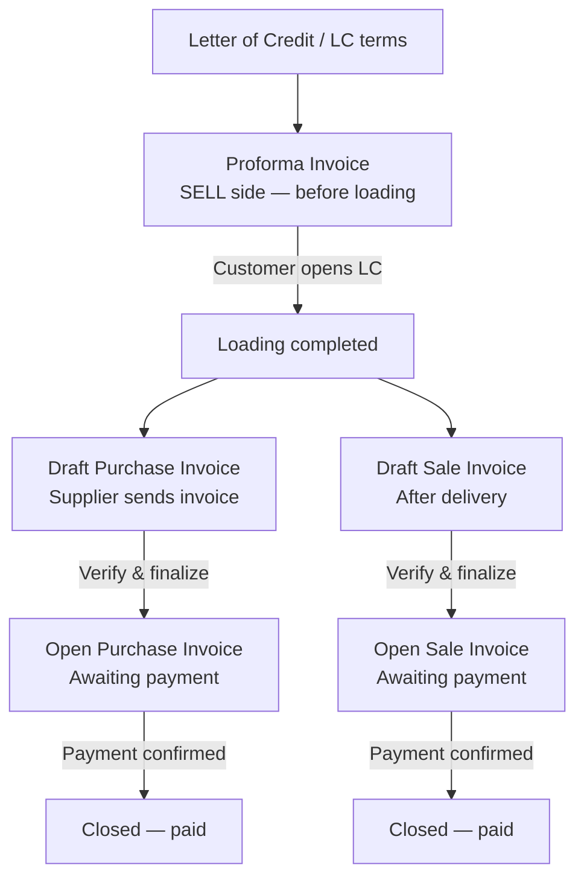

### Sell side: proforma invoice

Because Demirdöküm pays by Letter of Credit, generate a **proforma sale invoice** before loading. This document:

- Shows the estimated value based on the contracted price formula (using the index estimate for the fixing month)

- Is used by the customer to open the LC with their bank

- Is flagged as `isProforma = true` in Jules

### Buy side: purchase invoice

After the containers are loaded, Garfield Metals sends their invoice. Create a **BUY invoice** in Jules:

- Attach the 20 containers

- Enter the provisional index-based price (may still be temporary if the fixing month has not ended)

- Set status to OPEN

If the price is still provisional (`isTemporaryPrice = true`), the invoice is updated with the definitive price once the index average for the fixing month is published.

### Final sale invoice

Once the containers are delivered and the weight at destination is confirmed, generate the **final SELL invoice** to Demirdöküm:

- Based on delivered weights (from the weight slip)

- Uses the final TSI average for the fixing month

- Replaces the proforma

### Container invoicing matrix

Behind every invoice, Jules maintains a **per-container cost breakdown**. For our 20 containers, the matrix tracks:

| Container   | Buy price      | Sell price    | Freight   | Pre-carriage | Margin   |
| ----------- | -------------- | ------------- | --------- | ------------ | -------- |
| CLHU1234567 | TSI − 15 × 25T | TSI + 5 × 25T | USD 1,800 | USD 250      | Computed |
| CLHU1234568 | ...            | ...           | ...       | ...          | ...      |
| (×18 more)  |                |               |           |              |          |

This granularity allows complete reconciliation of every dollar in or out, per container.

### Credit notes and debit notes

If the final delivery weight differs from the loaded weight (a common occurrence when buyers weigh on arrival), a **credit note** or **debit note** adjusts the invoice accordingly.

---

## Step 10 — Margin Calculation: Estimated to Final

Margin is the ultimate measure of deal profitability. Jules maintains two margin states throughout the trade lifecycle.

See [Margin Calculations](./margin-calculations-en.mdx) for complete reference documentation.

### Estimated margin (from allocation onwards)

As soon as the allocation is created (Step 5), Jules can calculate an **estimated margin** using contractual prices and estimated logistics costs:

```
Estimated margin/T = Sell price/T − Buy price/T − Estimated logistics cost/T
```

For our example, with TSI at USD 330/T at time of allocation:

- Sell price: USD 330 + 5 = **USD 335/T CFR**

- Buy price: USD 330 − 15 = **USD 315/T EXW**

- Freight: USD 1,800 / 25 T = **USD 72/T**

- Pre-carriage: USD 250 / 25 T = **USD 10/T**

- Estimated margin: 335 − 315 − 72 − 10 = **USD −62/T ← not profitable!**

Wait — the incoterm logic matters here. Because you buy EXW and sell CFR, you bear the logistics cost. The margin formula accounts for this:

```
Margin = Sell price (CFR) − Buy price (EXW) − Freight − Pre-carriage
       = 335 − 315 − 72 − 10 = −62 USD/T
```

This estimated margin tells you immediately that the freight cost of USD 82/T (freight + pre-carriage) exceeds the USD 20/T commercial spread. The trade is loss-making at these logistics rates — exactly the insight a budget should have surfaced before committing (see Step 11).

### Final margin (after invoicing)

Once all invoices are settled, Jules replaces the estimated margin with the **final margin** — calculated from actually invoiced amounts rather than contractual prices:

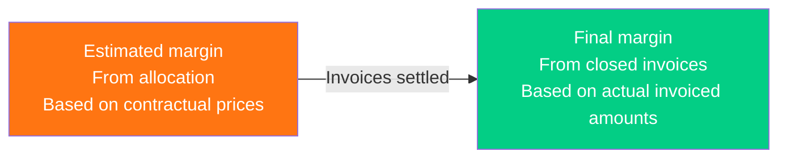

### Where margin appears in Jules

| Location            | Description                                                       |
| ------------------- | ----------------------------------------------------------------- |
| **Operations list** | Estimated margin column per buy/sell operation                    |
| **Margin popover**  | Click any margin value to see the full cost breakdown             |
| **Container modal** | Container-level margin in the delivery view                       |
| **Dashboard**       | Aggregate margin view across all operations, filterable by period |

### Dashboard margin — the full breakdown

The dashboard margin breaks the profitability down into more than 12 components:

| Component               | Our example         |
| ----------------------- | ------------------- |
| Sale price              | TSI + USD 5/T       |
| − Purchase price        | TSI − USD 15/T      |
| − Freight (logistics)   | USD 72/T            |
| − Pre-carriage          | USD 10/T            |
| − Inspection            | USD 2/T             |
| − BL admin fees         | USD 1/T             |
| − Sell agent commission | USD 0 (direct deal) |
| − Buy agent commission  | USD 0 (direct deal) |
| = **Net margin**        | **USD −65/T**       |

This analysis confirms the trade is unprofitable at these freight rates. In practice, traders would either renegotiate the commercial spread (buy lower, sell higher) or find cheaper freight to make this trade work.

---

## Step 11 — Budget Tracking and Goal Monitoring

Ideally, the economic analysis in Step 10 happens **before** the trade is committed, not after. This is the purpose of **Budgets** and **Goals**.

See [Budgets & Goals](./budgets-goals-en.mdx) for complete reference documentation.

### Budgets — model the deal before executing

A **budget** models the full economics of the deal:

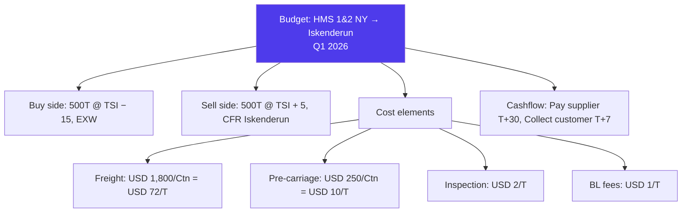

The budget immediately shows a negative net margin at the current freight rate (USD 82/T of logistics vs. USD 20/T of commercial spread). The budget approval workflow can block this trade from proceeding until the economics are corrected.

### Budget approval workflow

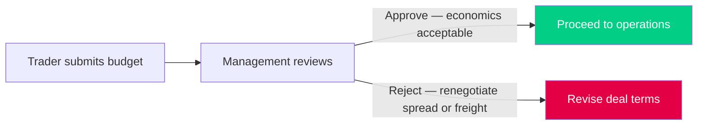

### Cashflow projection

The budget also models **when** cash flows in and out, exposing working capital requirements:

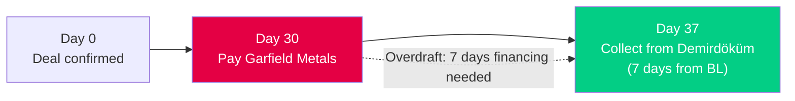

In this example, you pay the supplier 30 days after the BL, and collect from the customer 7 days after the BL — resulting in a net positive cashflow position (you collect before you pay). This is favorable working capital behavior.

### Goals — volume and price targets

**Goals** set the strategic context for purchasing. Before this trade was even negotiated, your procurement team may have set a goal:

> **Goal**: Buy 5,000 T of HMS 1&2, CFR Turkey destinations, by 31 March 2026, at a target price of TSI − USD 12/T.

This goal is set in Jules with:

- Quality: HMS 1&2

- Quantity: 5,000 T

- Target price: TSI − USD 12/T

- Direction: BUY

- Due date: 31 March 2026

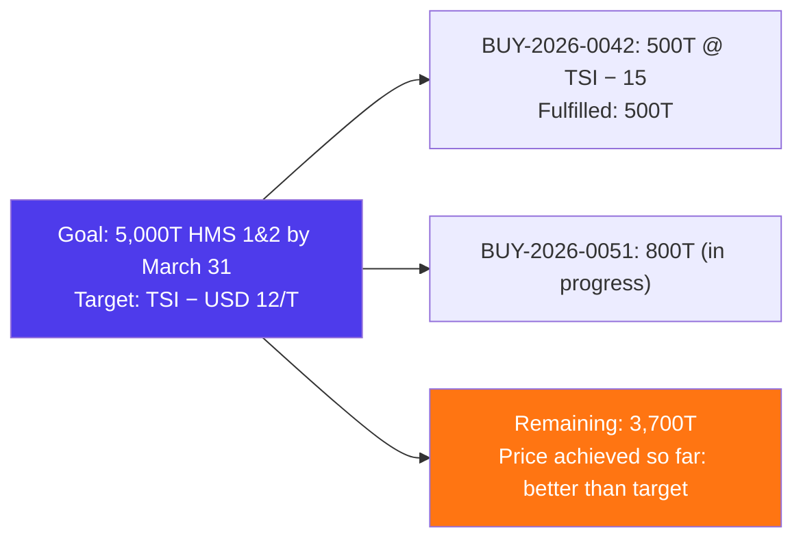

Our BUY-2026-0042 operation contributes 500 T to this goal (even though we bought at TSI − 15, which is better than the TSI − 12 target). Jules tracks **fulfilled quantity** in real time — so the team knows how much of the Q1 target is covered at any given point.

---

## How Every Step Connects

Looking back across the 11 steps, here is the complete lifecycle flow for our HMS 1&2 example trade:

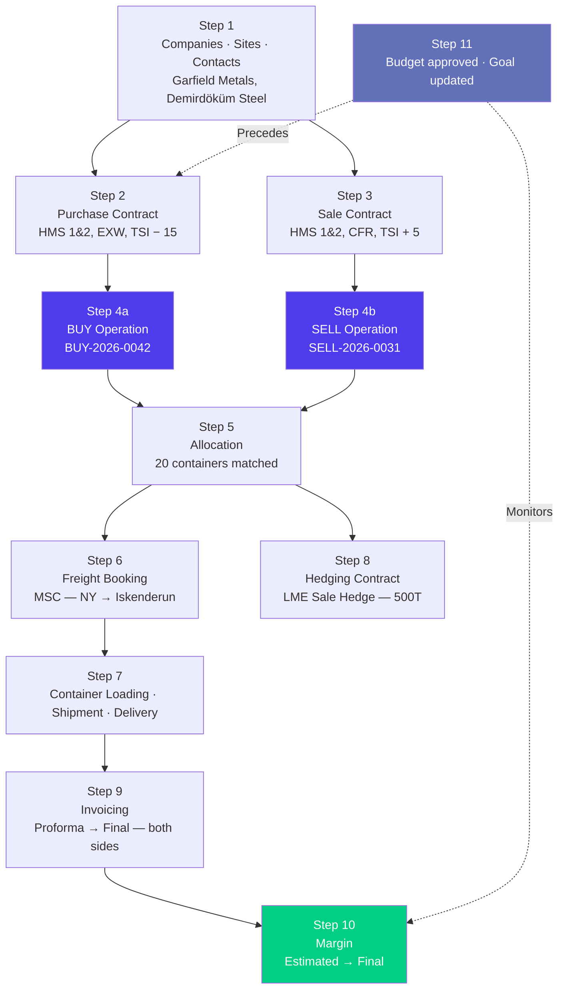

### Module reference map

| Step                       | Primary module             | Detailed article                                                     |
| -------------------------- | -------------------------- | -------------------------------------------------------------------- |
| 1 — Counterparties         | Companies, Sites, Contacts | [companies-sites-contacts-en.mdx](./companies-sites-contacts-en.mdx) |
| 2 & 3 — Contracts          | Contracts & Pricing        | [contracts-pricing-en.mdx](./contracts-pricing-en.mdx)               |
| 2 & 3 — Index pricing      | Pricing Engine & Offers    | [pricing-indices-offers-en.mdx](./pricing-indices-offers-en.mdx)     |
| 2 & 3 — Material grades    | Qualities & Commodities    | [qualities-commodities-en.mdx](./qualities-commodities-en.mdx)       |
| 4 — Operations             | Operations & Lifecycle     | [operations-lifecycle-en.mdx](./operations-lifecycle-en.mdx)         |
| 5 — Allocations            | Logistics & Freight        | [logistics-freight-en.mdx](./logistics-freight-en.mdx)               |
| 6 — Bookings               | Logistics & Freight        | [logistics-freight-en.mdx](./logistics-freight-en.mdx)               |
| 7 — Containers & Shipments | Logistics & Freight        | [logistics-freight-en.mdx](./logistics-freight-en.mdx)               |
| 8 — Hedging                | Hedging & Risk Management  | [hedging-risk-management-en.mdx](./hedging-risk-management-en.mdx)   |
| 9 — Invoicing              | Invoicing & Billing        | [invoicing-billing-en.mdx](./invoicing-billing-en.mdx)               |
| 10 — Margin                | Margin Calculations        | [margin-calculations-en.mdx](./margin-calculations-en.mdx)           |
| 11 — Budgets & Goals       | Budgets & Goals            | [budgets-goals-en.mdx](./budgets-goals-en.mdx)                       |

---

## Glossary

| Term                                 | Definition                                                                                                       |
| ------------------------------------ | ---------------------------------------------------------------------------------------------------------------- |
| **Allocation**                       | The link connecting a purchase operation to a sale operation at the container level                              |
| **Bill of Lading (BL)**              | Transport document issued by the carrier; the key document triggering payment in most trade finance arrangements |
| **Budget**                           | A detailed financial model of a deal's costs and revenues, created before committing to operations               |
| **CFR (Cost & Freight)**             | Incoterm where the seller pays freight to the destination port; the buyer bears risk from loading                |
| **Container invoicing matrix**       | The per-container cost/revenue breakdown maintained by Jules for every traded container                          |
| **Contract**                         | A commercial agreement with a counterparty defining quality, price, incoterm, and period; prefills operations    |
| **EXW (Ex Works)**                   | Incoterm where the buyer bears all logistics costs from the seller's premises                                    |
| **Final margin**                     | Margin calculated from actually invoiced amounts once all invoices are settled                                   |
| **Estimated margin**                 | Margin calculated from contractual prices as soon as buy and sell are allocated; serves as a forward indicator   |
| **Follow-up**                        | The real-time progress tracker on an operation (Planned → Allocated → Booked → Loaded → Delivered)               |
| **Freight booking**                  | A reservation of shipping space on a vessel, linked to containers                                                |
| **Goal**                             | A volume and price purchasing or selling target that operations contribute to                                    |
| **Harold number**                    | The unique identifier automatically assigned to every operation, invoice, and container in Jules                 |
| **Hedging contract**                 | A financial instrument on a commodity exchange (e.g., LME) used to neutralize commodity price risk               |
| **Index price**                      | A price derived from a market reference index (e.g., TSI, LME) with a formula applied                            |
| **Incoterm**                         | International Commercial Term defining the boundary of cost and risk transfer between buyer and seller           |
| **MQC (Minimum Quality Commitment)** | The minimum weight per container agreed in the contract                                                          |
| **Operation**                        | The central entity in Jules — a confirmed purchase or sale of recyclable commodity                               |
| **Pre-carriage**                     | The inland transport leg from the supplier site to the port of loading                                           |
| **Proforma invoice**                 | A preliminary invoice issued before final delivery; used to open a Letter of Credit                              |
| **Shipment**                         | A group of containers traveling together under a single Bill of Lading                                           |
| **Site**                             | The physical location used as operational counterparty on operations (yard, mill, warehouse)                     |
| **Spot price**                       | A fixed price agreed at deal time, not linked to any market index                                                |
| **TSI**                              | The Steel Index — provider of benchmark reference prices for steel and scrap                                     |
| **VGM**                              | Verified Gross Mass — mandatory container weight declaration submitted to the carrier before loading             |

