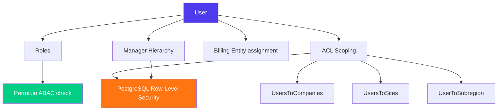
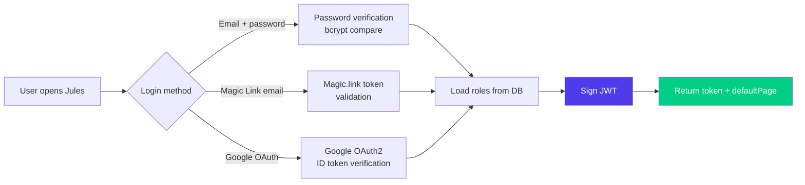
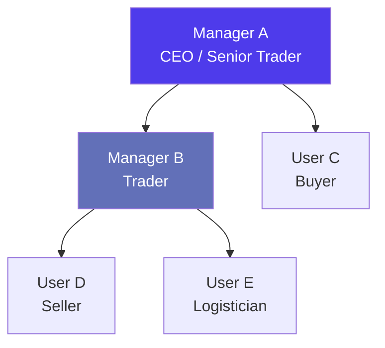
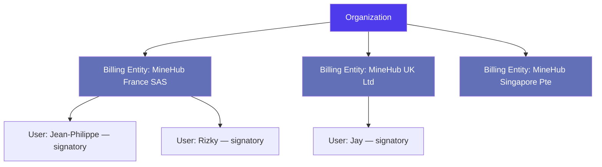
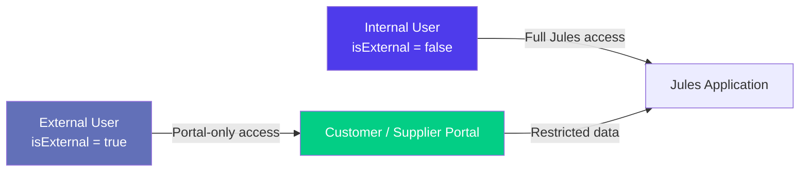
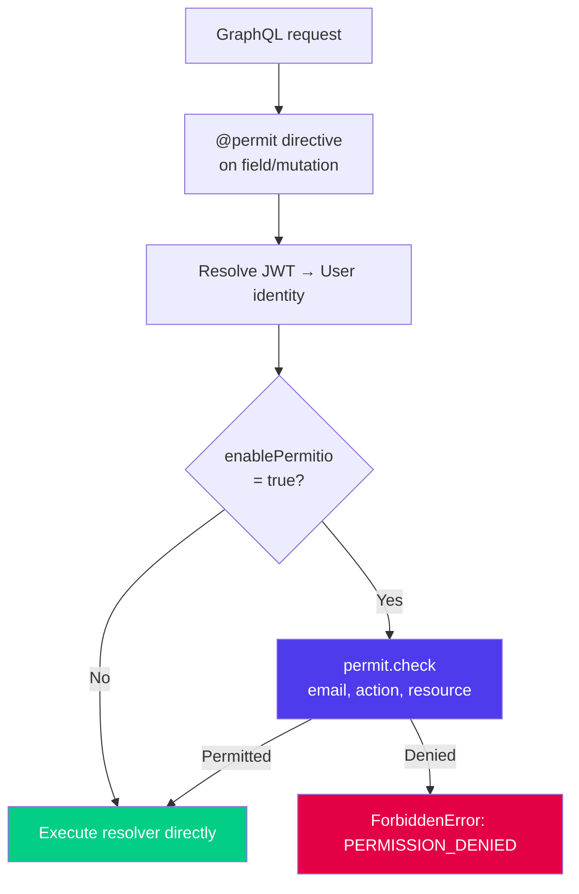
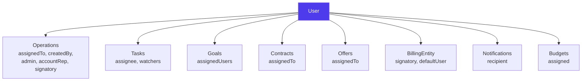

> Product documentation — How Jules models user identities, assigns roles, structures organizations, and enforces fine-grained access control across every action in the platform.

---

## Table of Contents

1. [Overview](#overview)

2. [User Model](#user-model)

3. [Authentication](#authentication)

4. [Roles](#roles)

5. [Organizational Structure — Departments & Divisions](#organizational-structure--departments--divisions)

6. [Manager Hierarchy](#manager-hierarchy)

7. [User ACL Scoping — Companies & Sites](#user-acl-scoping--companies--sites)

8. [Geographic Scoping — Subregions](#geographic-scoping--subregions)

9. [Billing Entities & Legal Entities](#billing-entities--legal-entities)

10. [Billing Entity ↔ User Assignment](#billing-entity--user-assignment)

11. [External Users & Portal Access](#external-users--portal-access)

12. [Licenses](#licenses)

13. [Permit.io ABAC — Fine-Grained Authorization](#permitio-abac--fine-grained-authorization)

14. [Relationships with Other Modules](#relationships-with-other-modules)

15. [Key Business Rules](#key-business-rules)

16. [Glossary](#glossary)

---

## Overview

Jules uses a layered access model. At the innermost layer, a **User** has an identity and a set of **Roles** that determine what pages and actions they can access. Surrounding that, a set of **ACL scoping tables** (companies, sites, subregions) narrows *which records* a user can see. At the outermost layer, **Permit.io ABAC** enforces fine-grained permission checks on every GraphQL query and mutation.



Everything in Jules operates inside a **tenant** (called an `organizationId`). The public PostgreSQL schema holds user identity records; every other table lives in a per-tenant schema and is always scoped with `withSchema(organizationId)`.

---

## User Model

The `User` type is the central identity object in Jules. User records live in the `public.users` table, shared across all tenants.

### Core fields

| Field                             | Type      | Description                                                                                          |
| --------------------------------- | --------- | ---------------------------------------------------------------------------------------------------- |
| `id`                              | ID        | Internal auto-increment primary key                                                                  |
| `uid`                             | String    | External identifier (used in JWT, integrations)                                                      |
| `email`                           | String    | Primary login credential and Permit.io identity key                                                  |
| `erpEmail`                        | String    | Alternative email used for ERP synchronization                                                       |
| `firstName` / `lastName`          | String    | Display name                                                                                         |
| `language`                        | String    | UI language preference (e.g., `en`, `fr`)                                                            |
| `timezone`                        | String    | User's local timezone for notifications                                                              |
| `organizationId`                  | String    | The tenant this user belongs to                                                                      |
| `roles`                           | \[String] | Array of role keys assigned to the user                                                              |
| `phoneNumber`                     | String    | Optional contact number                                                                              |
| `signatureUrl`                    | String    | URL of the user's scanned signature image (used on PO/SO PDFs)                                       |
| `emailSignature`                  | String    | HTML email signature block                                                                           |
| `shouldReceiveKnockNotifications` | Boolean   | Opt-in for in-app push notifications                                                                 |
| `notificationProperties`          | JSON      | Granular notification preferences per trigger type                                                   |
| `isExternal`                      | Boolean   | Marks a portal user (supplier/customer-facing); see [External Users](#external-users--portal-access) |
| `company`                         | Company   | The company linked to this user (relevant for external users)                                        |

### System-level fields (not exposed via GraphQL)

These fields exist in the database and affect runtime behavior:

| Field                                                            | Description                                                                        |
| ---------------------------------------------------------------- | ---------------------------------------------------------------------------------- |
| `password`                                                       | Bcrypt-hashed password (legacy login path)                                         |
| `isBlocked`                                                      | Prevents login when `true` — used by admins to suspend accounts                    |
| `enablePermitio`                                                 | Per-user feature flag that activates Permit.io ABAC checks                         |
| `viewGroup`                                                      | Optional grouping key included in the JWT, used for view-level access segmentation |
| `dailyEmailSchedule`                                             | Time-of-day for scheduled digest emails                                            |
| `shouldDisconnectOnceFromWeb` / `shouldDisconnectOnceFromMobile` | Admin-triggered forced logout flags                                                |
| `apiUrl`                                                         | Override API endpoint returned on login (used for multi-region routing)            |
| `erpId`                                                          | Reference to the matching record in an external ERP system                         |

---

## Authentication

Jules supports three login methods, all converging on a **JWT** issued by the API.



### Login flow

1. The client calls `login` (email/password) or `loginWithToken` (Magic Link or Google)

2. The API locates the user record — it checks both internal users and external (portal) users

3. If `isBlocked = true`, the login is rejected immediately

4. The user's roles are loaded from the per-tenant `roles` table

5. A JWT is signed containing: `id`, `email`, `organizationId`, `roles`, `uid`, `language`, `viewGroup`, `enablePermitio`, `isExternal`, and (for portal users) `companyId` and `entity`

6. The response also includes `defaultPage` — the landing page the frontend should route to based on the user's roles — and `shouldUseAwsServer`

### Default page by role

| Role               | Default landing page                                         |
| ------------------ | ------------------------------------------------------------ |
| `FIELD_MANAGER`    | Warehouse Inbounds                                           |
| `SHIPMENT_TRACKER` | Shipment Tracker                                             |
| All others         | Configured default page for the organization (from `Config`) |

### Session management

- JWTs are stateless — no server-side session is stored

- Forced logout is implemented via `shouldDisconnectOnceFromWeb` / `shouldDisconnectOnceFromMobile` flags in `users_administration`, combined with a Redis key (`shouldDisconnect:{userId}`)

- On successful login, these flags are cleared and the Redis key is deleted

---

## Roles

Every user has one or more **roles** stored in the per-tenant `roles` table. Roles are additive — a user can hold multiple roles simultaneously.

### Available roles

| Role                | Description                                                                                   |
| ------------------- | --------------------------------------------------------------------------------------------- |
| `ADMIN`             | Full administrative access to the organization's configuration, user management, and all data |
| `MANAGER`           | Manages a team of users (managees); sees only data scoped to their managees                   |
| `BUYER`             | Creates and manages purchase operations                                                       |
| `SELLER`            | Creates and manages sale operations                                                           |
| `TRADER_BUY`        | Purchase-focused trader variant                                                               |
| `ALLOCATOR`         | Creates and manages allocations between buy and sell operations                               |
| `LOGISTICIAN`       | Manages freight bookings, containers, and shipments                                           |
| `LOGISTICS_MANAGER` | Extended logistician with managerial oversight                                                |
| `ACCOUNTANT`        | Access to invoices, bills, and financial reports                                              |
| `VALIDATOR`         | Authorized to approve or reject operations in the approval workflow                           |
| `VIEWER`            | Read-only access across the platform                                                          |
| `FIELD_MANAGER`     | Manages warehouse inbound operations on-site; defaults to the Warehouse Inbounds page         |
| `SHIPMENT_TRACKER`  | Focused on tracking shipments; defaults to the Shipment Tracker page                          |
| `WM_BUY`            | Warehouse management buy variant                                                              |

### How roles are stored

Roles are stored in a per-tenant junction table `{organizationId}.roles` with a composite of `(userId, role)`. The `getByUserId` method aggregates all roles for a user into an array:

```sql
SELECT ARRAY_AGG(role) as roles FROM {organizationId}.roles WHERE userId = {id}
```

This array is embedded in the JWT and re-evaluated on every authenticated request.

### Role-based page access

The `PagesEnum` in the GraphQL schema enumerates all navigable pages in Jules (e.g., `PURCHASES`, `SALES`, `INVOICES`, `LOGISTICS_EXPLORER`, `WAREHOUSE_INBOUNDS`). The Permit.io configuration maps roles to allowed pages and actions.

---

## Organizational Structure — Departments & Divisions

Jules provides two lightweight organizational classification dimensions for users and operations: **Departments** and **Divisions**.

### Department

A **Department** is a named grouping within the organization (e.g., "Trading", "Logistics", "Finance"). Departments are simple name-value pairs used to categorize users and associate them with operations.

| Field  | Type   | Description                    |
| ------ | ------ | ------------------------------ |
| `id`   | ID     | Unique identifier              |
| `name` | String | Display name of the department |

### Division

A **Division** is a higher-level organizational unit, typically representing a business line or geographic division (e.g., "Ferrous", "Non-Ferrous", "APAC").

| Field   | Type   | Description                  |
| ------- | ------ | ---------------------------- |
| `id`    | ID     | Unique identifier            |
| `value` | String | Display name of the division |

Both entities are read via the `@permit(resource: "DEPARTMENTS", action: "VIEW")` and `@permit(resource: "DIVISIONS", action: "VIEW")` directives respectively, meaning only users with the appropriate Permit.io permission can list them.

---

## Manager Hierarchy

Jules implements a **manager-to-managee** relationship that drives both organizational visibility and data access scoping.



### How it works

The `managers_to_managees` table stores directed pairs of `(managerId, manageeId)` — both referencing `public.users`. One manager can have many managees.

A user with **no managees** is treated as having global visibility — they can see all users and all data.

A user with **at least one managee** has their data access restricted to records where the `assigneeId` or `creatorId` of an operation matches one of their managees. This is enforced through a PostgreSQL Row-Level Security (RLS) policy function `CHECK_TABLE_USERS_POLICY` and `CHECK_TABLE_OPERATIONS_POLICY`.

### RLS policy logic (simplified)

```
IF user has no managees → full access
IF user has managees:
  - Can only see users who are in their managee list
  - Can only see operations assigned to or created by their managees
  - Combined with company ACL check (see below)
```

The system explicitly excludes the edge case where a user is listed as their own manager (`whereNot({ managerId: manageeId })`).

---

## User ACL Scoping — Companies & Sites

Beyond roles and manager hierarchy, Jules provides two **ACL scoping tables** that restrict which counterparties and physical locations a user can interact with.

### UsersToCompanies

The `users_to_companies` table assigns specific trading companies to a user. When a user has entries in this table, they can **only see operations, contracts, and related records** associated with those companies.

| Column      | Description                                   |
| ----------- | --------------------------------------------- |
| `userId`    | Reference to `public.users.id`                |
| `companyId` | Reference to `{org}.companies.id`             |
| `society`   | Optional sub-classification of the assignment |

**Empty = global:** If a user has no rows in `users_to_companies`, they have access to all companies within their organization. This mirrors the manager-to-managee pattern — absence of restriction means full access.

### UsersToSites

The `users_to_sites` table restricts a user to specific physical sites (warehouses, collection points, etc.).

| Column   | Description                    |
| -------- | ------------------------------ |
| `userId` | Reference to `public.users.id` |
| `siteId` | Reference to `{org}.sites.id`  |

As with companies: no rows = access to all sites within the organization.

### Combined ACL policy

Both restrictions are evaluated together in the `CHECK_TABLE_OPERATIONS_POLICY` PostgreSQL function:

```
RETURN (manager_to_managee_permission AND company_permission)
```

This means a user must satisfy **both** the manager hierarchy check and the company scope check to access a given operation record.

---

## Geographic Scoping — Subregions

The `users_to_subregions` table assigns users to one or more geographic **subregions** (e.g., "West Africa", "Southeast Asia"). This is used for notification routing and intelligent user suggestions — for example, when Jules needs to suggest which trader to assign to an operation based on its origin subregion.

| Column      | Description                           |
| ----------- | ------------------------------------- |
| `userId`    | Reference to `public.users.id`        |
| `subregion` | Reference to `{org}.subregions.value` |

Subregions combine with other user attributes (see **User Attributes** below) to enable the smart notification system.

### User Attributes

The `user_attributes` table stores additional routing dimensions for a user. These are used exclusively for notification filtering and user-matching queries — not for RLS access control.

| Attribute              | Description                                                                            |
| ---------------------- | -------------------------------------------------------------------------------------- |
| `qualityId`            | Specific material quality the user specializes in                                      |
| `qualityFamily`        | Broader material family (e.g., "Ferrous", "Plastics")                                  |
| `countryOfOrigin`      | Country from which the user handles material sourcing                                  |
| `countryOfDestination` | Country the user handles for deliveries                                                |
| `regionOfOrigin`       | Broader geographic region for origin                                                   |
| `subregionOfOrigin`    | Narrower subregion for origin                                                          |
| `shipmentMode`         | Preferred or specialized shipment mode (`CONTAINER`, `BULK_CARGO`, `TRUCK_RAIL_BARGE`) |

---

## Billing Entities & Legal Entities

### LegalEntity interface

`LegalEntity` is a GraphQL interface implemented by all legal party types in Jules. It represents any registered legal entity — whether it is your own company, a trading counterparty, a shipping line, or a customs agent.

### LegalEntityTypeEnum

| Type                 | Description                                                           |
| -------------------- | --------------------------------------------------------------------- |
| `BILLING_ENTITY`     | Your organization's own legal entity (for issuing/receiving invoices) |
| `COMPANY`            | A trading counterparty (supplier or customer)                         |
| `AGENT`              | A trade agent or broker                                               |
| `LOGISTIC_FORWARDER` | A freight forwarding company                                          |
| `SHIPPING_LINE`      | A maritime carrier                                                    |
| `SHIP_OWNER`         | Owner of a vessel                                                     |
| `CUSTOMS_AGENCY`     | A customs clearance service provider                                  |
| `PRE_CARRIAGE_LINE`  | A local transport provider for pre-carriage legs                      |
| `INSPECTOR`          | A third-party quality/quantity inspection company                     |
| `BROKER`             | A commodities broker                                                  |
| `FINANCIER`          | A bank or financial institution                                       |

### BillingEntity

A **Billing Entity** is the legal entity that your organization uses to issue or receive commercial documents (POs, SOs, invoices). In a multi-entity organization, you may have several billing entities — for example, one per country of incorporation.



### BillingEntity fields

| Category        | Key fields                                                                                                       |
| --------------- | ---------------------------------------------------------------------------------------------------------------- |
| **Identity**    | `value` (display name), `legalName`, `legalForm`, `identificationCode`, `registrationCode`, `taxCode`, `taxRate` |
| **Address**     | `address`, `city`, `country`, `region`, `state`, `zipCode`, `isEU`                                               |
| **Contact**     | `email`, `phoneNumber`, `fax`, `logisticsEmail`, `accountingEmail`, `contact`, `contacts`                        |
| **Banking**     | `bankAccounts` (structured), `taxCode`, `creditCoverage`, `creditCoverageProvider`                               |
| **Documents**   | `logoUrl` (used in PDF headers), `signatureUrl` (used on PO/SO documents)                                        |
| **ERP**         | `erpId` (reference to external ERP)                                                                              |
| **Other codes** | `licenseNumber`, `industryCode`, `locationIdentificationCode`, `otherCode1/2/3`                                  |

### Soft deletion

Billing entities are never hard-deleted. The `delete` operation sets `isDeleted = true` and appends `(id) (deleted)` to the name, preserving referential integrity for historical documents.

---

## Billing Entity ↔ User Assignment

The `billing_entities_to_users` junction table links users to billing entities. This relationship has two purposes:

1. **Signatories** — users who are authorized to sign documents issued by a billing entity. The `filteredSignatories` query returns all users linked to a specific billing entity, and this list populates the signatory selector on PO/SO documents.

2. **Default user** — one user can be marked as `isDefault = true` for a billing entity, making them the default contact for that entity's documents.

| Column          | Description                                                   |
| --------------- | ------------------------------------------------------------- |
| `billingEntity` | References `{org}.billing_entities.value`                     |
| `userId`        | References `public.users.id`                                  |
| `isDefault`     | Boolean — marks the default signatory for this billing entity |

---

## External Users & Portal Access

Jules supports **external users** — contacts at supplier or customer companies who are granted limited access to a portal view of Jules. External users are identified by `isExternal = true` on their user record.



### How external users work

- External users are linked to a **specific company** via the `external_users_to_companies` table (columns: `userId`, `organizationId`, `companyId`)

- Their JWT includes `companyId` and `entity` (an enum indicating whether they represent a supplier, customer, or other portal entity)

- The `@isAuthenticated({ isExternalAllowed: true })` decorator on model methods explicitly permits external users to call those methods

- The `@portalPermit` GraphQL directive further restricts **which fields** are visible to external users (e.g., prices, margins, and internal costs can be hidden per field based on Redis-cached portal configuration)

- External users queried via `externalUsers` are returned with their `companyId` enriched from the join

### Portal permission configuration

A per-organization `portal:permit:{organizationId}` Redis key stores a JSON map of field-level visibility rules in the form `"TypeName.fieldName": true/false`. This allows operations teams to configure exactly which fields of which types are exposed to portal users without a code deployment.

---

## Licenses

A **License** in Jules represents a regulatory permit associated with the import or export of specific materials. Licenses are used at the site level to authorize the handling of particular material qualities.

| Field            | Description                                              |
| ---------------- | -------------------------------------------------------- |
| `id`             | Unique identifier                                        |
| `name`           | License reference number or name                         |
| `type`           | `CUSTOMER` (import permit) or `SUPPLIER` (export permit) |
| `quality`        | The specific material quality this license covers        |
| `country`        | The country in which the license is valid                |
| `quotaFrequency` | How often the license quota resets                       |
| `comment`        | Free-text notes                                          |

Licenses can be filtered by `isNotUsedBySiteId` to find licenses not yet assigned to a given site, supporting the license assignment workflow.

---

## Permit.io ABAC — Fine-Grained Authorization

Jules uses **Permit.io** (Attribute-Based Access Control) as a centralized policy decision point layered on top of role-based logic.

### How it works



### The `@permit` directive

Every sensitive GraphQL query and mutation is annotated with `@permit(resource: "RESOURCE_NAME", action: "ACTION")`. For example:

| Directive                                               | Meaning                                         |
| ------------------------------------------------------- | ----------------------------------------------- |
| `@permit(resource: "USERS", action: "VIEW")`            | Must have VIEW permission on the USERS resource |
| `@permit(resource: "BILLING_ENTITIES", action: "VIEW")` | Must have VIEW on BILLING\_ENTITIES             |
| `@permit(resource: "LICENSES", action: "CREATE")`       | Must have CREATE on LICENSES                    |
| `@permit(resource: "DEPARTMENTS", action: "VIEW")`      | Must have VIEW on DEPARTMENTS                   |

### Variant permissions

Some directives use `variant: true` with either `inputPath` or `returnPath` to check permissions against a **specific instance** rather than the resource type. For example, a user might have CREATE permission on operations in general, but only VIEW permission on operations belonging to a specific billing entity. The path parameters allow the directive to pass a dynamic resource key (e.g., `"OPERATIONS-{billingEntityId}"`) to Permit.io.

### Per-user activation

The `enablePermitio` flag on the user record is a **migration escape hatch** — it allows Permit.io checks to be rolled out incrementally, user by user, without forcing an all-or-nothing cutover. Users without this flag bypass Permit.io and rely solely on the `@isAuthenticated` decorator.

### Resource synchronization

The `syncPermitResources` utility automatically keeps the Permit.io resource/action catalog in sync with the local GraphQL schema by diffing local resources against the remote Permit.io API and creating or updating as needed.

---

## Relationships with Other Modules

Users are referenced throughout Jules. The diagram below shows key cross-module relationships:



| Related module       | Relationship                                                                                               |
| -------------------- | ---------------------------------------------------------------------------------------------------------- |
| **Operations**       | Users are assigned as trader, admin, account rep, signatory, and watchers on every operation               |
| **Contracts**        | Users are assigned as the responsible trader                                                               |
| **Goals**            | Users are listed as contributors/owners of commercial goals                                                |
| **Tasks**            | Users are assigned as task owners and can be added as watchers                                             |
| **Offers**           | Users own and manage offer records                                                                         |
| **Billing Entities** | Users are assigned as authorized signatories                                                               |
| **Notifications**    | Users receive in-app and email notifications based on their `notificationProperties` and `user_attributes` |
| **Budgets**          | Users are associated with budget planning cycles                                                           |
| **Approvals**        | Users with the `VALIDATOR` role act as approvers in the approval workflow                                  |

---

## Key Business Rules

### 1. Single-tenant isolation

All per-tenant data (roles, ACLs, billing entities, departments, divisions) lives in a PostgreSQL schema named after the `organizationId`. User identity is global (`public.users`), but authorization context is always tenant-scoped.

### 2. Roles are additive

A user can hold multiple roles simultaneously. Permissions from all roles are unioned — there is no role priority or conflict resolution. Assign the minimum set of roles needed.

### 3. ACL scoping is opt-in by restriction

For both `users_to_companies` and `users_to_sites`: having **no rows** grants access to all companies/sites. Access is only restricted when you explicitly add scope entries. This means new users automatically have broad access until an admin narrows it.

### 4. Manager hierarchy drives data visibility

Managers see only records assigned to or created by their direct managees. If you need a user to have global visibility, ensure they have no entries in `managers_to_managees` as a manager. The hierarchy is flat (one level) — there is no recursive manager lookup.

### 5. Blocking a user

Setting `isBlocked = true` on a user record prevents all future logins. Existing JWTs remain valid until they expire; forced logout requires also setting the `shouldDisconnectOnce*` flags, which trigger a Redis check on the next API call.

### 6. External users are scoped to a company

Every external (portal) user must be linked to exactly one company via `external_users_to_companies`. Their `companyId` is embedded in the JWT and enforced by the `isExternalAllowed` decorator — they can only see records related to their company.

### 7. Billing entity signatories

The `filteredSignatories` query is the designated way to populate signatory dropdowns on POs and SOs. It accepts an optional `billingEntity` filter to return only users authorized to sign for that specific entity. The `isDefault` flag on `billing_entities_to_users` surfaces the recommended signatory.

### 8. ERP identity bridge

Users can carry both a Jules `id` and an `erpId`. When Jules pushes data to an external ERP, the `erpId` and `erpEmail` fields allow the ERP to match Jules user records to its own user table.

### 9. Permit.io is per-user opt-in

The `enablePermitio` flag allows a staged rollout of ABAC policies. Production organizations can enable Permit.io enforcement selectively, user by user, before enforcing it organization-wide.

### 10. Soft delete for billing entities

Billing entities cannot be hard-deleted because they are referenced by historical invoices, operations, and PDF documents. The soft-delete mechanism preserves the record while visually marking it as deleted by appending `(deleted)` to the name.

---

## Glossary

| Term                    | Definition                                                                                                                          |
| ----------------------- | ----------------------------------------------------------------------------------------------------------------------------------- |
| **ABAC**                | Attribute-Based Access Control — authorization model that evaluates user attributes, resource attributes, and environmental context |
| **ACL**                 | Access Control List — a set of permissions attached to a resource specifying which users can access it                              |
| **Billing Entity**      | A legal entity belonging to your organization used to issue and receive invoices and commercial documents                           |
| **Department**          | An organizational subdivision (e.g., Trading, Finance) used to classify users within a tenant                                       |
| **Division**            | A higher-level business unit (e.g., Ferrous, Non-Ferrous) grouping departments and operations                                       |
| **enablePermitio**      | Per-user flag that activates Permit.io ABAC enforcement for that user                                                               |
| **External User**       | A portal user representing a supplier or customer; `isExternal = true`; scoped to a single company                                  |
| **isBlocked**           | Flag that prevents a user from logging in                                                                                           |
| **JWT**                 | JSON Web Token — a signed, self-contained authentication token carrying user identity and roles                                     |
| **Legal Entity**        | The GraphQL interface implemented by all registered parties: billing entities, companies, shipping lines, agents, etc.              |
| **LegalEntityTypeEnum** | Enumeration of all recognized legal party types (BILLING\_ENTITY, COMPANY, AGENT, etc.)                                             |
| **License**             | A regulatory import/export permit associated with a material quality and country                                                    |
| **Magic Link**          | Passwordless authentication via a one-time email link (Magic.link SDK)                                                              |
| **managee**             | A user supervised by a manager in the `managers_to_managees` hierarchy                                                              |
| **Manager**             | A user who has one or more managees; their data visibility is restricted to their managees' records                                 |
| **organizationId**      | The tenant identifier; also the PostgreSQL schema name for all per-tenant tables                                                    |
| **Permit.io**           | Third-party ABAC policy service used for fine-grained permission checks                                                             |
| **@permit directive**   | GraphQL schema directive that triggers a Permit.io check before resolving a field                                                   |
| **Portal**              | The external-facing interface for supplier/customer users with restricted data visibility                                           |
| **Role**                | A named permission level assigned to a user (e.g., ADMIN, BUYER, VALIDATOR)                                                         |
| **RLS**                 | Row-Level Security — PostgreSQL feature enforcing per-row access control at the database level                                      |
| **Signatory**           | A user authorized to sign documents on behalf of a billing entity                                                                   |
| **Subregion**           | A geographic sub-classification used for notification routing and user matching                                                     |
| **user\_attributes**    | Per-user routing metadata (quality, country, region, shipment mode) used for notification targeting                                 |
| **UsersToCompanies**    | ACL junction table restricting which trading companies a user can access                                                            |
| **UsersToSites**        | ACL junction table restricting which physical sites a user can access                                                               |
| **VALIDATOR**           | A role that grants authorization to approve or reject operations in the approval workflow                                           |
| **viewGroup**           | An optional JWT claim used for view-level access segmentation within a tenant                                                       |

