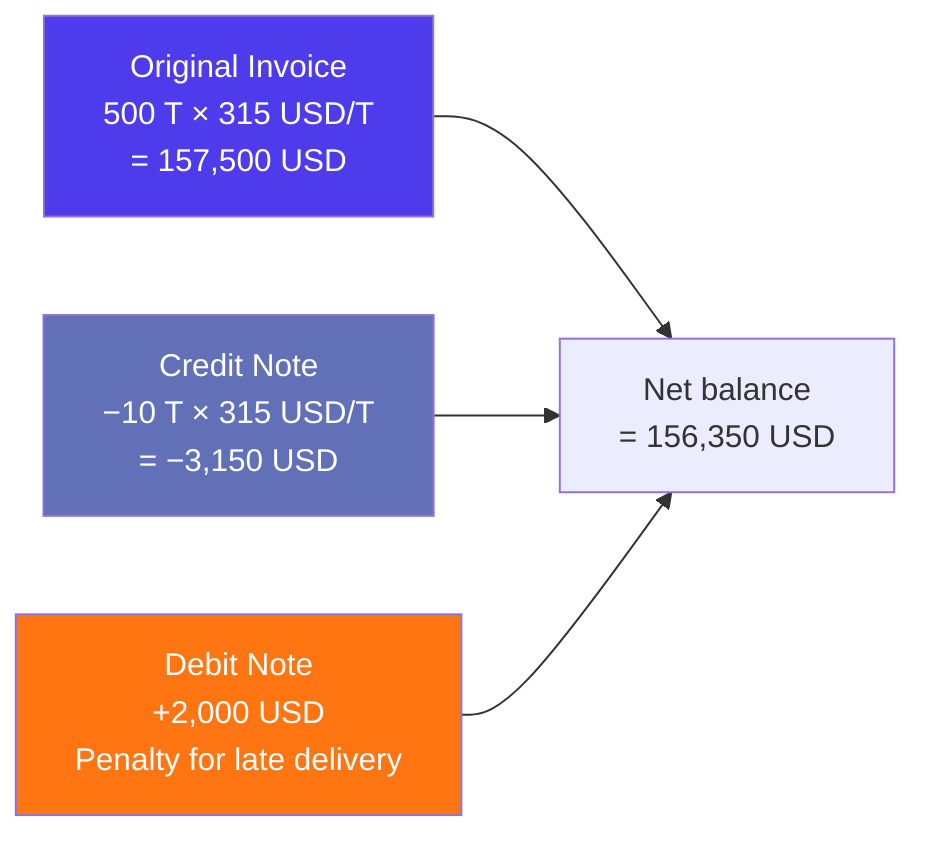
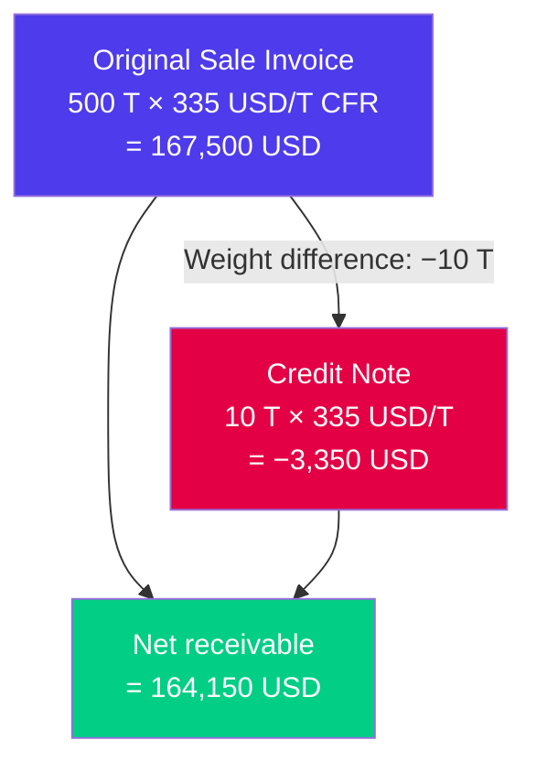

# Workflow: Processing a Debit/Credit Note

> Step-by-step guide — How to process credit notes and debit notes in Jules when delivery weights, prices, or costs differ from the original invoice.

---

## When to use this workflow

Credit and debit notes are adjustments to existing invoices. Use this workflow when:

- **Delivery weight differs from loaded weight** — the most common scenario in recyclable commodity trading
- **Price correction** — the index price is updated after the original invoice was issued
- **Quality downgrade** — material received does not match the contracted quality grade
- **Freight or logistics cost adjustment** — actual costs differ from the amounts originally invoiced
- **Commercial agreement** — negotiated discount, penalty, or other post-invoice adjustment

---

## Credit Note vs Debit Note

| Document | Effect | When to use |
|----------|--------|-------------|
| **Credit note** | **Reduces** the amount owed | Delivery weight is less than invoiced, or you owe the counterparty a refund |
| **Debit note** | **Increases** the amount owed | Additional charges, weight surplus, or cost corrections upward |



---

## Scenario 1: Weight Difference at Delivery

This is the most common scenario. The supplier loads 500 T (measured at origin), but the customer's scale shows 490 T at delivery.

### Step-by-Step

#### 1. Record the delivery weight

Update each container's **weight slip** with the weight measured at destination:

| Container | Loaded weight | Weight slip | Difference |
|-----------|--------------|-------------|------------|
| CLHU1234567 | 25.2 T | 24.8 T | −0.4 T |
| CLHU1234568 | 24.9 T | 24.5 T | −0.4 T |
| ... (×20) | Total: 500 T | Total: 490 T | **−10 T** |

#### 2. Determine the adjustment direction

| Your role | Weight at delivery < loaded | Weight at delivery > loaded |
|-----------|---------------------------|---------------------------|
| **You are the buyer** | You overpaid → issue credit note to reduce your payable | You underpaid → expect debit note from supplier |
| **You are the seller** | Customer received less → issue credit note to customer | Customer received more → issue debit note to customer |

#### 3. Create the credit/debit note

Navigate to **Invoices** → Create:

| Field | Value |
|-------|-------|
| **Object type** | CREDIT_NOTE (or DEBIT_NOTE) |
| **Direction** | BUY or SELL (matches the original invoice) |
| **Parent invoice** | Select the original invoice being adjusted |
| **Containers** | Select the affected containers |
| **Amount** | Weight difference × unit price |



#### 4. Update container invoicing lines

The credit/debit note generates new invoicing lines at the container level:

| Container | Line type | Element | Amount |
|-----------|-----------|---------|--------|
| CLHU1234567 | SELL | Credit note | −134 USD |
| CLHU1234568 | SELL | Credit note | −134 USD |
| ... | ... | ... | ... |

These lines are included in the margin calculation, ensuring the final margin reflects the actual amount collected.

---

## Scenario 2: Price Correction (Index Update)

The original invoice used a temporary index estimate (e.g., TSI = 330 USD/T). The final published average is 325 USD/T.

### Step-by-Step

#### 1. Identify affected invoices

Filter invoices by the quotational period and look for those flagged with `isTemporaryPrice`.

#### 2. Calculate the price difference

| | Original | Corrected | Difference |
|--|---------|-----------|------------|
| Index value | 330 USD/T | 325 USD/T | −5 USD/T |
| With differential (−15) | 315 USD/T | 310 USD/T | −5 USD/T |
| On 500 T | 157,500 USD | 155,000 USD | **−2,500 USD** |

#### 3. Create the adjustment note

| If you are... | Price went down | Price went up |
|---------------|-----------------|---------------|
| **Buyer** | Credit note from supplier (you pay less) | Debit note from supplier (you pay more) |
| **Seller** | Credit note to customer (they pay less) | Debit note to customer (they pay more) |

#### 4. Update the operation quality

After issuing the note, update the operation quality:
- Set the **definitive price** based on the final index
- Remove the `isTemporaryPrice` flag
- The margin recalculates automatically

---

## Scenario 3: Quality Downgrade

The customer rejects part of the delivery due to contamination or quality issues. A price adjustment is negotiated.

### Step-by-Step

1. **Document the quality issue** — Record the inspection results or customer claim
2. **Negotiate the adjustment** — Agree on a per-tonne discount or lump sum
3. **Create a credit note** (SELL direction) to the customer for the agreed amount
4. **Optionally create a debit note** (BUY direction) to the supplier if they bear responsibility
5. **Update container invoicing** — Add the quality adjustment lines

---

## Scenario 4: Logistics Cost Adjustment

Actual freight or pre-carriage costs differ from estimates.

### Step-by-Step

1. **Record the actual bill** from the logistics provider
2. Compare to the estimated cost on the containers
3. If the actual cost exceeds the estimate:
   - The margin absorbs the difference automatically when the bill is recorded
   - A debit note to the logistics provider is only needed if they overcharged vs. the agreed rate
4. If the actual cost is less:
   - Record the credit note or reduced bill from the provider

---

## Debit Note Sub-Types

Jules classifies debit notes by their source:

| Type | Description |
|------|-------------|
| **INVOICE** | Standard debit note adjusting a commercial invoice |
| **PROVIDER_REPORT** | Additional charges from a service provider (freight, inspection) |
| **PURCHASE_REPORT** | Additional purchase-related charges |

---

## Application to Payments

Credit and debit notes can be **applied** against outstanding invoices:

| Field | Description |
|-------|-------------|
| **Applied note** | The amount from a credit/debit note applied to reduce/increase an invoice balance |
| **Past order credit** | Credits carried over from previous orders |

This reduces the net amount to pay or collect without requiring a separate payment transaction.

---

## Impact on Margin

Credit and debit notes directly affect the **final margin** calculation:

```
Final margin = Sale invoice − Purchase invoice − Bills − Credit notes + Debit notes
```

| Adjustment | Margin impact |
|------------|---------------|
| Credit note to customer (SELL) | Reduces margin (less revenue) |
| Credit note from supplier (BUY) | Improves margin (lower cost) |
| Debit note to customer (SELL) | Improves margin (more revenue) |
| Debit note from supplier (BUY) | Reduces margin (higher cost) |

---

## Verification Checklist

| Check | Status |
|-------|--------|
| Parent invoice correctly referenced | |
| Correct containers selected | |
| Amount matches the agreed adjustment | |
| Direction (BUY/SELL) matches the original invoice | |
| Container invoicing lines updated | |
| Note status set to OPEN (finalized) | |
| Margin recalculated and reflects the adjustment | |
| ERP sync triggered (if applicable) | |

---

## Related Documentation

- [Invoicing & Billing](./invoicing-billing-en.mdx) — full invoicing reference
- [Containers](./containers-en.mdx) — weight fields and invoicing lines
- [Margin Calculations](./margin-calculations-en.mdx) — how adjustments affect margin
- [Workflow: Month-End Margin Close](./workflow-month-end-margin-close-en.mdx) — processing notes as part of month-end
