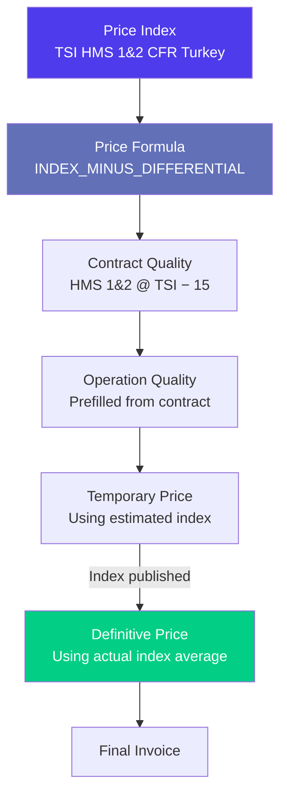
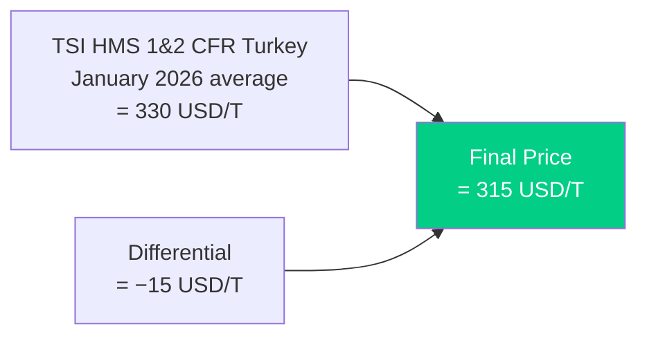
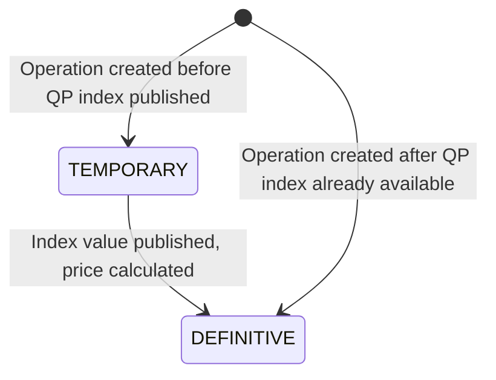

# Workflow: Setting Up Index-Based Pricing

> Step-by-step guide — How to configure market-index-linked pricing in Jules, from raw indices to price formulas on contracts and operations.

---

## When to use this workflow

Use this workflow when you are setting up pricing that references a **market index** (such as TSI, LME, Platts, or RISI) rather than a fixed spot price. Index pricing is the standard for most international recyclable commodity trades.

---

## How Index Pricing Works in Jules

---

## Step-by-Step

### Step 1 — Verify or Create the Price Index

A **price index** is the raw market reference value. Jules stores indices by name and period.

1. Navigate to **Configuration** → **Price Indices**
2. Check if the index you need already exists (e.g., "TSI HMS 1&2 CFR Turkey")
3. If it does not exist, create it:

| Field | Description | Example |
|-------|-------------|---------|
| **Name (value)** | The index identifier | TSI HMS 1&2 CFR Turkey |
| **Period** | Time period for this value | 2026-01 (January 2026) |
| **Index value** | The numeric value | 330.00 |

> **Important**: Index values are unique per `(name, period)` pair. Jules will not create duplicates — if you enter the same index for the same period twice, the second entry is ignored.

### Step 2 — Understand the Formula Types

Jules supports several formula patterns for combining indices with adjustments:

| Formula code | Logic | Example |
|--------------|-------|---------|
| **INDEX_MINUS_DIFFERENTIAL** | Index − fixed discount | TSI − USD 15/T |
| **INDEX_PLUS_DIFFERENTIAL** | Index + fixed premium | TSI + USD 5/T |
| **INDEX_TIMES_RECOVERY** | Index × recovery percentage | LME × 85% |
| **INDEX_TIMES_RECOVERY_MINUS_DIFFERENTIAL** | (Index × recovery%) − fixed | (LME × 85%) − USD 10 |
| **TWO_INDEX_BLEND** | Weighted average of two indices | 60% TSI + 40% LME |
| **CUSTOM** | Free-form formula | Complex multi-variable formulas |

### Step 3 — Configure Index Pricing on a Contract Quality

When creating or editing a contract, configure the quality stream's pricing:

1. Open the contract and navigate to a quality stream
2. Set **Price type** to **INDEX**
3. Configure the formula:

| Field | Description | Example |
|-------|-------------|---------|
| **Index** | Primary market reference | TSI HMS 1&2 CFR Turkey |
| **Formula** | How to apply the index | INDEX_MINUS_DIFFERENTIAL |
| **Differential** | Premium or discount | −15 USD/T |
| **Recovery rate** | Percentage of index applied | 100% (or 85% for LME-based) |
| **Quotational Period (QP)** | When to measure the index | M-1 (average of previous month) |
| **Price mode** | OFFICIAL, BID, ASK, etc. | OFFICIAL |

### Step 4 — Configure Advanced Index Options (if needed)

For more complex pricing, Jules supports additional parameters:

#### Quotational Period Configuration

| QP option | Meaning |
|-----------|---------|
| **M-1** | Average of the month before shipment |
| **M** | Average of the shipment month |
| **M+1** | Average of the month after shipment |
| **Custom range** | Specific date range for averaging |

#### Two-Index Pricing

Jules can combine **two indices** on a single quality line:

| Field | Index 1 | Index 2 |
|-------|---------|---------|
| **Index** | TSI HMS 1&2 CFR Turkey | LME Steel Scrap |
| **Weight** | 60% | 40% |
| **Recovery rate** | 100% | 85% |
| **QP** | M-1 | M-1 |

#### Contango

For futures-based pricing, add a **contango** value — the forward premium for deferred delivery:

| Field | Description |
|-------|-------------|
| **Contango value** | Premium per tonne for forward delivery |
| **Contango period** | How many months forward |

### Step 5 — Apply to Operations

When an operation is created from the contract, the index pricing configuration is **prefilled automatically**. Verify:

1. Operation quality shows `priceType = INDEX`
2. The formula, differential, and QP are correctly transferred
3. The price displays as **temporary** if the index for the QP hasn't been published yet

### Step 6 — Understand Temporary vs Definitive Pricing

| State | Description | Margin impact |
|-------|-------------|---------------|
| **Temporary** | Index value not yet published; price is an estimate | Margin is estimated only |
| **Definitive** | Index published; price is calculated and final | Margin can be finalized |

The `isTemporaryPrice` flag on the operation quality tracks this state.

### Step 7 — Fix the Price at Month-End

When the quotational period ends and the index provider publishes the final value:

1. Enter the final index value in **Price Indices** (if not already present)
2. Navigate to operations with temporary prices for this QP
3. Update the operation quality to use the definitive price
4. Remove the `isTemporaryPrice` flag
5. Regenerate invoices if needed with the final price

---

## Example: Complete Index Pricing Setup

> **Deal**: Buy 500 T HMS 1&2 from Garfield Metals at TSI HMS 1&2 CFR Turkey, average M-1, minus USD 15/T

| Step | Action | Result |
|------|--------|--------|
| Index exists | TSI HMS 1&2 CFR Turkey is already in the system | Ready |
| Contract quality | HMS 1&2 @ INDEX, formula = INDEX_MINUS_DIFFERENTIAL, diff = −15, QP = M-1 | Terms configured |
| Operation created Jan 15 | Prefilled from contract, shipping planned for February | Price = temporary (Jan average not yet published) |
| Jan 31 — index published | TSI Jan average = 330 USD/T | Enter in Price Indices |
| Price fixed | 330 − 15 = **315 USD/T** | Definitive price, margin recalculates |

---

## Common Mistakes

| Mistake | Consequence | Fix |
|---------|-------------|-----|
| Index value not entered for the QP | Prices remain temporary; margins are estimates | Enter the index value as soon as published |
| Wrong QP configured (M instead of M-1) | Price fixed against wrong period | Correct the QP on the contract/operation quality |
| Differential sign error (−15 instead of +15) | Price is 30 USD/T off | Double-check formula direction |
| Missing recovery rate for LME-based pricing | Full index value used instead of partial | Set the recovery rate (e.g., 85% for steel scrap) |

---

## Related Documentation

- [Pricing Engine, Market Indices & Offers](./pricing-indices-offers-en.mdx) — full pricing reference
- [Contracts & Pricing](./contracts-pricing-en.mdx) — contract quality configuration
- [Operations & Lifecycle](./operations-lifecycle-en.mdx) — operation quality pricing
- [Workflow: Month-End Margin Close](./workflow-month-end-margin-close-en.mdx) — price fixation in the close process
