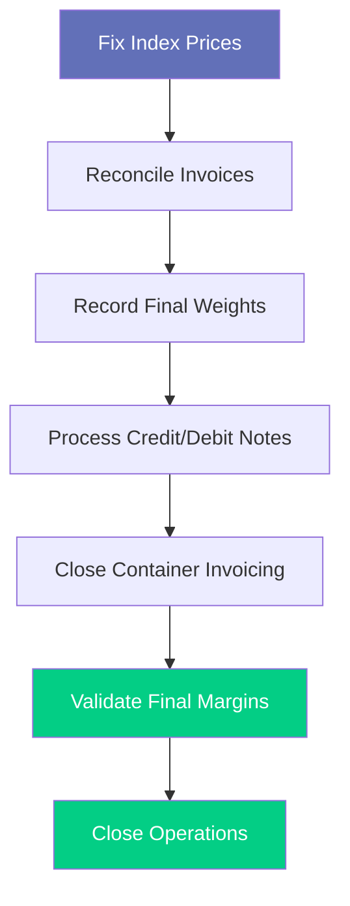
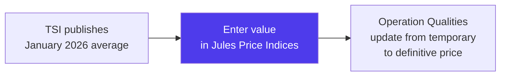
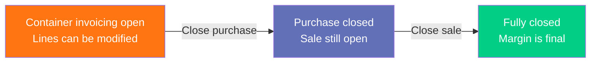
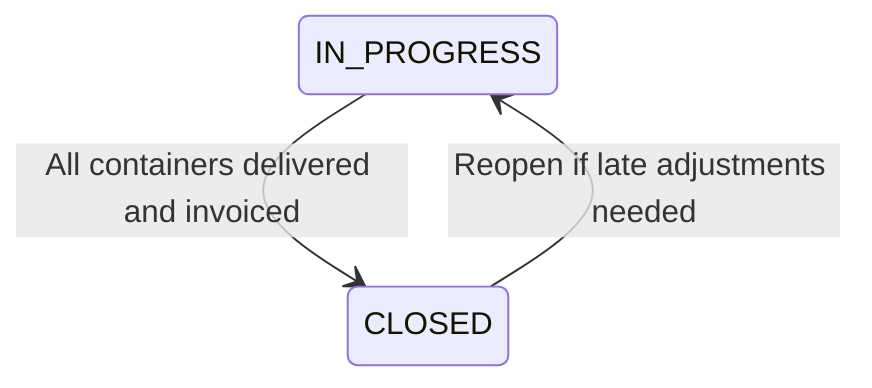

# Workflow: Month-End Margin Close

> Step-by-step guide — How to close a trading month in Jules by finalizing prices, reconciling invoices, and locking margins.

---

## When to use this workflow

Run this workflow at the **end of each calendar month** (or your company's accounting period) to transition margins from estimated to final, ensure all invoices are recorded, and close containers that have completed their lifecycle.

---

## Overview of the Close Process

---

## Step-by-Step

### Step 1 — Fix Index Prices for the Period

For all index-priced operations whose **quotational period** falls in the closing month, verify that the final index values have been published and recorded in Jules.

1. Navigate to **Price Indices**
2. Confirm that all relevant indices have values for the closing period (e.g., TSI HMS 1&2 CFR Turkey — January 2026 average)
3. If any index values are missing, enter them manually from the index provider's publication

> **Critical**: Until the index is entered, operations using that index will show **temporary prices** (`isTemporaryPrice = true`). Margins calculated from temporary prices are estimates only.

See [Pricing Engine & Indices](./pricing-indices-offers-en.mdx) for index management details.

### Step 2 — Update Temporary Prices to Definitive

Once index values are confirmed:

1. Navigate to **Operations** → filter by month and status IN_PROGRESS
2. Identify operations with temporary prices (flagged in the UI)
3. For each operation quality, confirm the price is now definitive
4. Remove the `isTemporaryPrice` flag

The margin calculation will automatically recalculate using the definitive price.

### Step 3 — Reconcile Purchase Invoices

For all containers loaded/delivered during the month:

1. Navigate to **Invoices** → filter by BUY direction and the closing period
2. Verify that every delivered container has a purchase invoice
3. For each invoice:
   - Confirm the price matches the final index value (or spot price)
   - Confirm the weight matches the loaded weight
   - Ensure the invoice status is OPEN (finalized)

| Check | What to look for |
|-------|-----------------|
| Missing invoices | Containers delivered without a corresponding purchase invoice |
| Price mismatches | Invoice price differs from operation quality price |
| Weight discrepancies | Invoice weight differs from container loaded weight |
| Status issues | Invoices still in DRAFT that should be OPEN |

### Step 4 — Reconcile Sale Invoices

Repeat the same process for the sell side:

1. Navigate to **Invoices** → filter by SELL direction and the closing period
2. Verify that every delivered container has a sale invoice
3. Confirm prices match the final index values
4. Confirm weights match the **weight slip** (delivery weight)

### Step 5 — Record Final Delivery Weights

For containers delivered during the month, ensure the **weight slip** (weight at destination) is recorded:

1. Navigate to **Containers** → filter by DELIVERED status and delivery date in the closing month
2. For each container, verify:
   - **Weight slip** is entered (from the customer's scale certificate)
   - **Net weight** (loaded) is confirmed

If the weight slip differs significantly from the loaded weight, a credit or debit note will be needed (see Step 6).

### Step 6 — Process Credit Notes and Debit Notes

Weight differences and price corrections generate credit/debit notes:

| Scenario | Action |
|----------|--------|
| Delivery weight **less than** loaded weight | Credit note to supplier OR debit note to customer |
| Delivery weight **more than** loaded weight | Debit note to supplier OR credit note to customer |
| Price correction (index updated) | Credit or debit note adjusting the price difference |

See [Workflow: Processing a Debit/Credit Note](./workflow-debit-credit-note-en.mdx) for the detailed procedure.

### Step 7 — Record Provider Bills

Ensure all third-party costs for the period are recorded:

1. Navigate to **Bills**
2. Verify that freight bills from shipping lines are recorded
3. Verify that pre-carriage bills from transport providers are recorded
4. Verify inspection, customs, and other service bills are recorded
5. Match each bill to the appropriate containers

Unrecorded bills will cause the final margin to understate costs.

### Step 8 — Close Container Invoicing

Once all invoices and bills are reconciled:

1. Navigate to each container and close invoicing:
   - Set **isPurchaseInvoicingClosed = true** (buy side finalized)
   - Set **isSaleInvoicingClosed = true** (sell side finalized)
2. This locks the container's invoicing lines — no further changes without reopening

### Step 9 — Validate Final Margins

With all invoicing closed, review the final margins:

1. Navigate to the **Margin Dashboard**
2. Filter by the closing period
3. Review the margin breakdown per operation:

| Component | Expected |
|-----------|----------|
| Sale price | Matches final sale invoice |
| Purchase price | Matches final purchase invoice |
| Freight | Matches recorded freight bill |
| Pre-carriage | Matches recorded pre-carriage bill |
| Agent commissions | Correctly calculated |
| Other costs | All unexpected costs and adjustments recorded |
| **Net margin** | Reflects true profitability |

4. Compare **estimated margin** (from allocation) vs **final margin** (from invoices) — significant deviations should be investigated

### Step 10 — Close Operations

Operations where all containers are delivered, invoiced, and closed can be moved to **CLOSED** status:

1. Navigate to **Operations** → filter by IN_PROGRESS and the closing period
2. For each operation, verify all containers are in CLOSED status
3. Use the **Mark as Complete** action (supports batch closing)

---

## Month-End Close Checklist

| # | Step | Status |
|---|------|--------|
| 1 | Index prices entered for the period | |
| 2 | Temporary prices updated to definitive | |
| 3 | All purchase invoices recorded and OPEN | |
| 4 | All sale invoices recorded and OPEN | |
| 5 | Delivery weights (weight slips) entered | |
| 6 | Credit/debit notes processed for weight and price differences | |
| 7 | All provider bills recorded | |
| 8 | Container invoicing closed (purchase + sale) | |
| 9 | Final margins reviewed and validated | |
| 10 | Completed operations closed | |

---

## Common Issues

| Issue | Cause | Resolution |
|-------|-------|------------|
| Margin shows as estimated, not final | Container invoicing not closed | Close both purchase and sale invoicing |
| Large margin deviation from estimate | Index moved between estimate and fixation | Expected — review if within tolerance |
| Missing freight cost in margin | Freight bill not recorded against containers | Record the bill and link to containers |
| Container cannot be closed | Outstanding invoicing lines in PENDING | Invoice all pending lines first |

---

## Related Documentation

- [Margin Calculations](./margin-calculations-en.mdx) — margin computation methodology
- [Invoicing & Billing](./invoicing-billing-en.mdx) — invoice lifecycle
- [Pricing Engine & Indices](./pricing-indices-offers-en.mdx) — index management
- [Containers](./containers-en.mdx) — container lifecycle and invoicing close
- [Workflow: Processing a Debit/Credit Note](./workflow-debit-credit-note-en.mdx) — adjustment procedures
