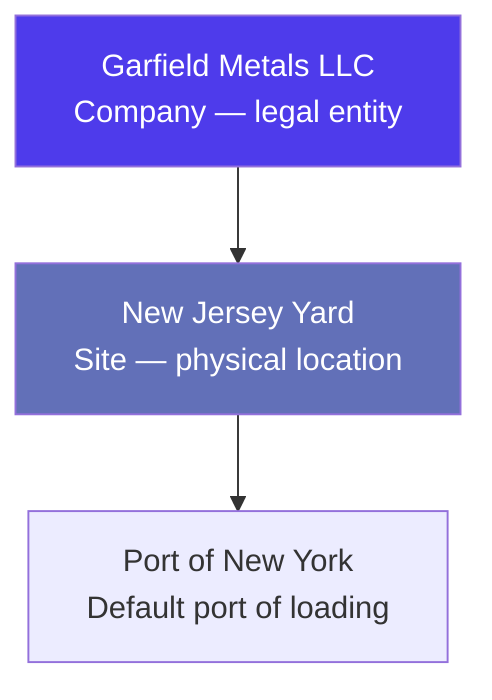

# Workflow: Onboarding a New Supplier

> Step-by-step guide — How to set up a new supplier in Jules so your traders can start purchasing from them.

---

## When to use this workflow

Use this workflow when your organization begins a new trading relationship with a supplier — a recycling yard, collector, processor, or broker — and needs to register them in Jules before creating purchase operations.

---

## Prerequisites

Before starting, you need:
- The supplier's legal name, address, and tax ID
- At least one physical site address (yard, warehouse, or facility)
- A commercial contact name and email
- The material qualities the supplier can provide
- Default pricing terms (currency, incoterm, payment terms)

---

## Step-by-Step

### Step 1 — Create the Company

Navigate to **Companies** and create a new company:

| Field | Description | Example |
|-------|-------------|---------|
| **Name** | Legal entity name | Garfield Metals LLC |
| **Type** | SUPPLIER | SUPPLIER |
| **Country** | Country of incorporation | United States |
| **Address** | Registered address | 123 Industrial Blvd, Newark, NJ |
| **Tax ID / VAT** | Tax identification number | US-12-3456789 |
| **Sector** | Business sector | Ferrous Recycling |

> **Tip**: A company can be both SUPPLIER and CUSTOMER if you trade in both directions with them.

See [Companies, Sites & Contacts](./companies-sites-contacts-en.mdx) for field reference.

### Step 2 — Create the Site

A **site** is the physical location where goods will be collected. Create at least one site under the company:

| Field | Description | Example |
|-------|-------------|---------|
| **Name** | Site name | New Jersey Yard |
| **Type** | SUPPLIER | SUPPLIER |
| **Company** | Parent company | Garfield Metals LLC |
| **Address** | Physical address | 456 Scrap Yard Road, Newark, NJ |
| **Port of Loading** | Default port for shipments from this site | Port of New York |

### Step 3 — Configure Site Qualities

This is the **critical step** that most users miss. Before a site can be used on a purchase operation, you must configure which materials the site can supply.

Navigate to the site's **Qualities** tab and add a **SiteToQuality BUY** record for each material:

| Field | Description | Example |
|-------|-------------|---------|
| **Quality** | Material grade | HMS 1&2 |
| **Direction** | BUY (purchase) | BUY |
| **Currency** | Default pricing currency | USD |
| **MQC** | Minimum Quality Commitment per container | 18 T |
| **Default margin target** | Expected profit per tonne | 20 USD/T |
| **Port of loading** | Departure port for this material | Port of New York |
| **Incoterm** | Default trade terms | EXW |

> **If this step is skipped**, the material will not appear as an option when creating a purchase operation for this site.

Repeat for every quality the supplier provides (e.g., HMS 1&2, Shredded, OCC).

### Step 4 — Add Site Licenses (if applicable)

For international trade, suppliers may need export licenses. Configure them in the site's **Licenses** tab:

| Field | Description |
|-------|-------------|
| **License type** | Export permit, Basel Convention notification, etc. |
| **Materials covered** | Which qualities the license applies to |
| **Validity period** | Start and expiry dates |
| **Reference number** | License document number |

Jules will warn users if they attempt to create an operation against a site with expired or missing licenses for the material.

### Step 5 — Create Contacts

Add the key people at the supplier under **Contacts**:

| Contact | Role | Receivables |
|---------|------|-------------|
| **Mike Garfield** (commercial) | BUSINESS_MANAGER | OPERATION — receives PO documents |
| **Sarah Jones** (logistics) | LOGISTICIAN | SHIPMENT — receives shipping docs |
| **Finance dept** | ACCOUNTANT | INVOICE — receives invoices |

The **receivables** configuration determines which documents are automatically sent to each contact when generated.

### Step 6 — Set Up Contract Prefill Defaults (optional)

If you have standard terms with this supplier, configure **Contract Prefill** defaults at the site level. These will auto-populate when a trader creates a contract or operation against this site:

- Default payment terms
- Default incoterm
- Default equipment type
- Default tolerance rate

### Step 7 — Create a Purchase Contract

With master data in place, create the first **purchase contract** to formalize the trading terms:

1. Navigate to **Contracts** → Create
2. Select the supplier company and site
3. Add quality streams with pricing terms
4. Set the contract period
5. Confirm the contract

See [Contracts & Pricing](./contracts-pricing-en.mdx) for contract configuration details.

### Step 8 — Verify with a Test Operation

Create a test purchase operation from the contract to verify everything is correctly configured:

1. Create a **BUY** operation from the contract
2. Confirm that qualities, prices, and logistics defaults are correctly prefilled
3. Check that the PO document generates correctly
4. Verify that the correct contacts receive the document

---

## Verification Checklist

After completing the onboarding, verify:

| Check | Status |
|-------|--------|
| Company exists with correct legal details | |
| Site created with correct port of loading | |
| SiteToQuality BUY records for all materials | |
| MQC and margin targets configured per quality | |
| Licenses added (if international trade) | |
| Contacts created with correct receivables | |
| Contract prefill defaults set (optional) | |
| Test operation creates and prefills correctly | |

---

## Common Mistakes

| Mistake | Consequence | Fix |
|---------|-------------|-----|
| Missing SiteToQuality BUY record | Material not available for purchase operations | Add the quality configuration at the site level |
| Wrong port of loading on site | Freight rate lookup fails | Update the site's default port |
| Missing contact receivables | Documents not sent automatically | Configure receivables on the contact |
| Creating operations before contracts | Terms not standardized, no prefill | Always create the contract first |

---

## Related Documentation

- [Companies, Sites & Contacts](./companies-sites-contacts-en.mdx) — full master data reference
- [Contracts & Pricing](./contracts-pricing-en.mdx) — contract configuration
- [Operations & Lifecycle](./operations-lifecycle-en.mdx) — creating operations
- [Qualities & Commodities](./qualities-commodities-en.mdx) — material grade setup
