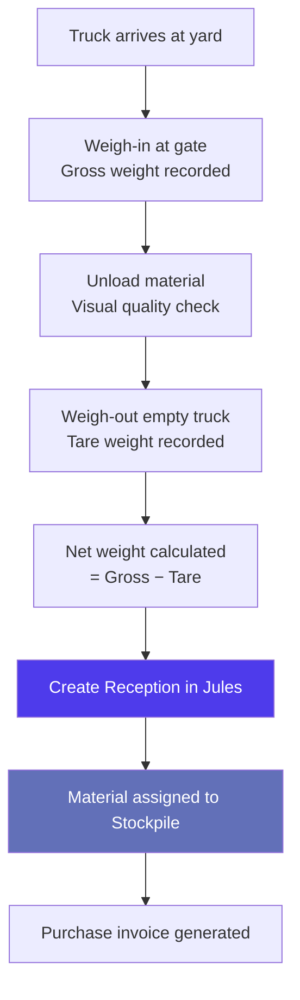
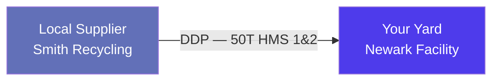
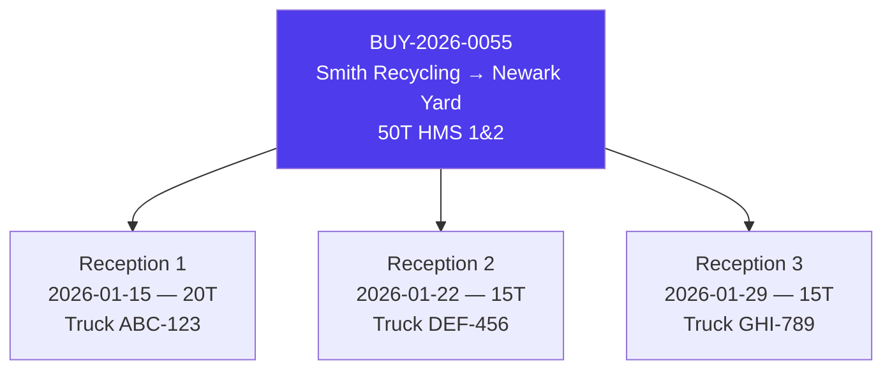
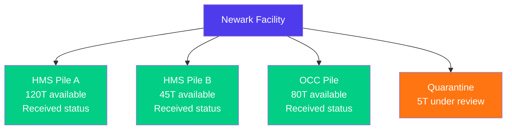

# Workflow: Yard Reception (Local Market)

> Step-by-step guide — How to receive material at a yard or warehouse for local market operations in Jules.

---

## When to use this workflow

Use this workflow when your organization operates a **recycling yard or warehouse** and receives material deliveries from local suppliers. This is the **local market** flow — domestic trade without maritime freight, where goods arrive by truck, rail, or barge directly to your facility.

Local market operations differ from export operations in several key ways:

| Aspect | Export | Local |
|--------|--------|-------|
| **Logistics** | Maritime containers | Truck / Rail / Barge |
| **Shipment mode** | CONTAINER or BULK_CARGO | TRUCK_RAIL_BARGE |
| **Delivery point** | Customer port/mill | Your yard or warehouse |
| **Storage** | Containers in transit | Stockpiles at your yard |
| **Weight measurement** | Port scale + customer scale | Yard weighbridge |

---

## Overview of the Reception Flow



---

## Prerequisites

Before receiving material at a yard:

1. **Supplier onboarded** — Company, site, and contacts exist in Jules (see [Onboarding a New Supplier](./workflow-onboarding-supplier-en.mdx))
2. **Purchase operation created** — A LOCAL market BUY operation exists for this supplier
3. **Warehouse/yard site configured** — Your receiving site is set up with stockpiles
4. **Stockpiles created** — At least one stockpile exists for the material quality at your yard

---

## Step-by-Step

### Step 1 — Create the Local Purchase Operation

If not already done, create a **BUY** operation for the local supplier:

| Field | Value |
|-------|-------|
| **Direction** | BUY |
| **Market type** | LOCAL |
| **Shipment mode** | TRUCK_RAIL_BARGE |
| **Counterparty site** | Supplier's yard/facility |
| **Quality** | Material grade (e.g., HMS 1&2) |
| **Price** | SPOT or INDEX |
| **Incoterm** | Typically DDP or EXW |
| **isWarehouse** | `true` — flags this as a warehouse/yard operation |



> **Key**: Setting `isWarehouse = true` changes how Jules handles this operation. Goods are received into a **stockpile** rather than shipped to a customer. Margin is calculated differently — as bulk margin from the stockpile, not per-container margin.

### Step 2 — Truck Arrival and Weighing

When the truck arrives at your yard:

1. **Weigh-in**: Record the **gross weight** (truck + material) at the weighbridge
2. **Unload**: Direct the truck to the appropriate area for unloading
3. **Quality inspection**: Perform a visual check of the material
4. **Weigh-out**: Record the **tare weight** (empty truck)
5. **Calculate net weight**: Gross weight − Tare weight = Net weight of delivered material

| Measurement | Value | Source |
|-------------|-------|--------|
| Gross weight | 32.5 T | Yard weighbridge (truck + material) |
| Tare weight | 12.5 T | Yard weighbridge (empty truck) |
| **Net weight** | **20.0 T** | Calculated |

### Step 3 — Create the Reception in Jules

Navigate to the operation's **Receptions** tab and create a new reception:

| Field | Description | Example |
|-------|-------------|---------|
| **Operation** | The local purchase operation | BUY-2026-0055 |
| **Date of reception** | When the material was received | 2026-01-15 |
| **Date type** | LAST_ARRIVAL_DATE or LAST_DEPARTURE_DATE | LAST_ARRIVAL_DATE |
| **Number of containers** | Number of deliveries/trucks in this reception | 1 |
| **Status** | ALLOCATED or CONFIRMED | CONFIRMED |
| **Allocation** | Optional — link to a sale allocation | (if pre-sold) |



### Reception statuses

| Status | Meaning |
|--------|---------|
| **ALLOCATED** | Reception is planned and linked to a sale allocation |
| **CONFIRMED** | Material has been physically received |
| **CANCELLED** | Reception was cancelled (truck rejected, quality issue) |

### Step 4 — Assign Material to a Stockpile

After reception, the material is assigned to a **stockpile** — a named pile of material at your yard:

| Stockpile field | Description | Example |
|----------------|-------------|---------|
| **Name** | Stockpile identifier | HMS Pile A — Newark |
| **Warehouse** | Your receiving site | Newark Facility |
| **Quality** | Material grade | HMS 1&2 |
| **Status** | RECEIVED, QUARANTINE, or LOST | RECEIVED |
| **Warehouse type** | INTERNAL or EXTERNAL | INTERNAL |



### Stockpile statuses

| Status | Meaning |
|--------|---------|
| **RECEIVED** | Material is available for sale or further processing |
| **QUARANTINE** | Material is held pending quality review or dispute |
| **LOST** | Material has been written off (contamination, theft, decay) |

### Stockpile KPIs

Jules tracks aggregated stockpile metrics:

| KPI | Description |
|-----|-------------|
| **Available** | Total material in RECEIVED status |
| **Quarantine** | Material under hold |
| **Lost** | Written-off material |
| **Total** | All material across all statuses |

### Step 5 — Selling from the Stockpile

When material is sold from the yard to a customer:

1. Create a **SELL** operation (LOCAL or EXPORT market)
2. Link the sell operation to the stockpile as the source
3. If export: containers are loaded from the stockpile and follow the standard export flow
4. If local: the customer sends trucks to collect material

The stockpile's **outbound** quantity tracks how much has been sold/shipped out.

### Step 6 — Purchase Invoice

Generate the purchase invoice for the received material:

1. Create a **BUY** invoice referencing the operation
2. Use the **net weight from the reception** as the invoiced quantity
3. Apply the contracted price (spot or index-based)
4. Finalize the invoice (DRAFT → OPEN)

If the supplier delivers across multiple receptions, you can:
- Invoice each reception separately
- Or accumulate deliveries and invoice periodically (e.g., weekly or monthly)

---

## Margin for Yard/Warehouse Operations

Warehouse operations use **bulk margin** rather than container margin:

```
Bulk margin = Sale revenue from stockpile − Total purchase cost into stockpile − Operating costs
```

Jules tracks:
- **Average purchase cost** per tonne in the stockpile
- **Target purchase cost** configured on the stockpile
- **Inbound shipments** and operations feeding the stockpile

The margin is calculated at the stockpile level, not per container, because material from different suppliers and receptions is commingled in the pile.

See [Margin Calculations](./margin-calculations-en.mdx) for details on bulk margin.

---

## Reception vs Container: Key Differences

| Concept | Export (Container) | Local (Reception) |
|---------|-------------------|-------------------|
| **Unit of execution** | Container | Reception (truck/delivery) |
| **Tracking** | Container follow-up (Unplanned → Closed) | Reception status (Allocated → Confirmed) |
| **Weight** | Container net weight + weight slip | Weighbridge gross − tare |
| **Storage** | Container stays sealed in transit | Material goes into stockpile |
| **Margin** | Per-container margin | Bulk stockpile margin |
| **Invoicing** | Container invoicing matrix | Invoice against reception quantity |

---

## Verification Checklist

| Check | Status |
|-------|--------|
| Local purchase operation created with `isWarehouse = true` | |
| Supplier site configured with correct qualities | |
| Receiving site has stockpiles for the material | |
| Weighbridge weights recorded (gross, tare, net) | |
| Reception created in Jules with correct weight and date | |
| Material assigned to correct stockpile | |
| Purchase invoice generated for the reception | |

---

## Common Issues

| Issue | Cause | Resolution |
|-------|-------|------------|
| Cannot create reception | Operation is not LOCAL or not flagged as warehouse | Set market type to LOCAL and `isWarehouse = true` |
| Stockpile quantities don't match | Missing receptions or incorrect weights | Reconcile reception records with weighbridge tickets |
| Material in quarantine | Quality issue detected during inspection | Resolve the quality dispute, then update stockpile status |
| Cannot sell from stockpile | No available (RECEIVED) material | Check stockpile status and quantities |

---

## Related Documentation

- [Operations & Lifecycle](./operations-lifecycle-en.mdx) — warehouse operation flag and local market
- [Companies, Sites & Contacts](./companies-sites-contacts-en.mdx) — site and warehouse setup
- [Margin Calculations](./margin-calculations-en.mdx) — bulk margin methodology
- [Workflow: Onboarding a New Supplier](./workflow-onboarding-supplier-en.mdx) — supplier setup
- [Invoicing & Billing](./invoicing-billing-en.mdx) — purchase invoicing
